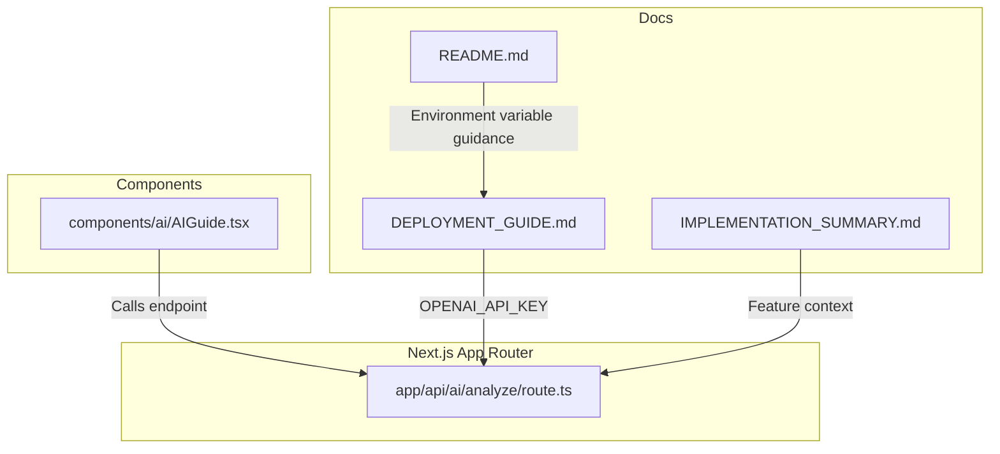
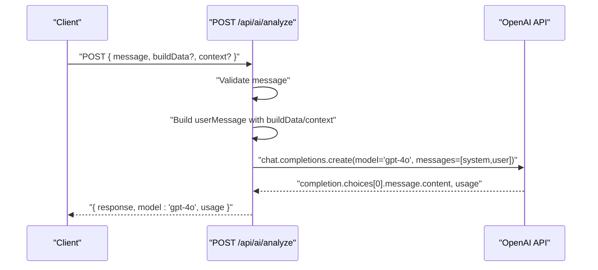
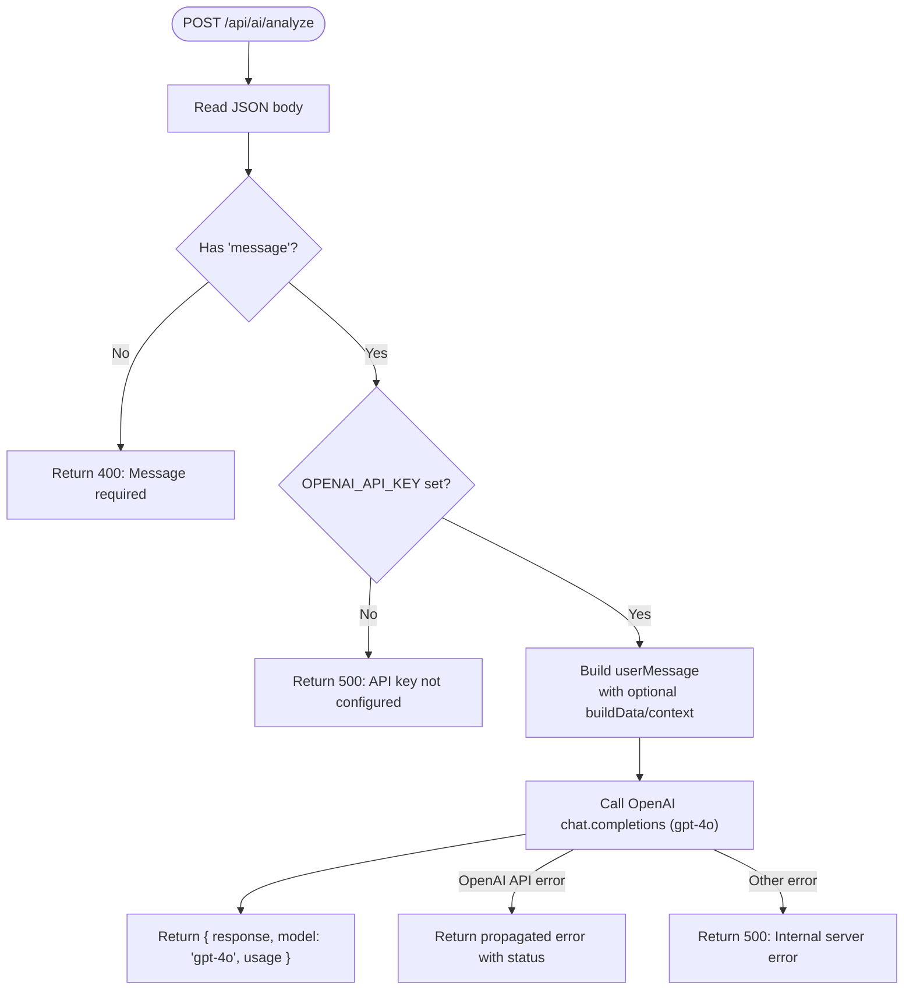
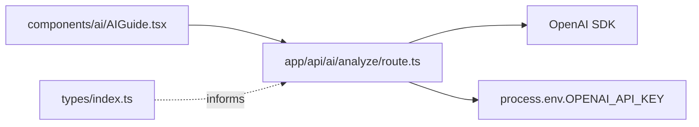

# AI Build Analysis Endpoint

<cite>
**Referenced Files in This Document**
- [route.ts](file://app/api/ai/analyze/route.ts)
- [AIGuide.tsx](file://components/ai/AIGuide.tsx)
- [README.md](file://README.md)
- [DEPLOYMENT_GUIDE.md](file://DEPLOYMENT_GUIDE.md)
- [IMPLEMENTATION_SUMMARY.md](file://IMPLEMENTATION_SUMMARY.md)
- [types/index.ts](file://types/index.ts)
</cite>

## Table of Contents
1. [Introduction](#introduction)
2. [Project Structure](#project-structure)
3. [Core Components](#core-components)
4. [Architecture Overview](#architecture-overview)
5. [Detailed Component Analysis](#detailed-component-analysis)
6. [Dependency Analysis](#dependency-analysis)
7. [Performance Considerations](#performance-considerations)
8. [Troubleshooting Guide](#troubleshooting-guide)
9. [Conclusion](#conclusion)
10. [Appendices](#appendices)

## Introduction
This document provides comprehensive API documentation for the POST /api/ai/analyze endpoint in Prometheus-Planner V2. It covers the HTTP method, URL pattern, request and response schemas, authentication, error handling, security considerations, performance characteristics, and operational guidance. It also explains how the system prompt defines the AI’s behavior as an ARPG expert for Path of Exile 2 and Diablo IV.

## Project Structure
The AI analysis endpoint is implemented as a Next.js App Router API route under app/api/ai/analyze/route.ts. The frontend component that interacts with this endpoint is located at components/ai/AIGuide.tsx. The README and deployment guides describe environment variable configuration and deployment requirements.

**Diagram sources**
- [route.ts](file://app/api/ai/analyze/route.ts#L1-L92)
- [AIGuide.tsx](file://components/ai/AIGuide.tsx#L1-L131)
- [README.md](file://README.md#L42-L46)
- [DEPLOYMENT_GUIDE.md](file://DEPLOYMENT_GUIDE.md#L17-L31)
- [IMPLEMENTATION_SUMMARY.md](file://IMPLEMENTATION_SUMMARY.md#L207-L222)

**Section sources**
- [route.ts](file://app/api/ai/analyze/route.ts#L1-L92)
- [AIGuide.tsx](file://components/ai/AIGuide.tsx#L1-L131)
- [README.md](file://README.md#L42-L46)
- [DEPLOYMENT_GUIDE.md](file://DEPLOYMENT_GUIDE.md#L17-L31)
- [IMPLEMENTATION_SUMMARY.md](file://IMPLEMENTATION_SUMMARY.md#L207-L222)

## Core Components
- Endpoint: POST /api/ai/analyze
- Purpose: Accepts a user message and optional build context, queries OpenAI GPT-4o, and returns AI-generated advice along with model and usage metrics.
- Authentication: Server-side OpenAI API key via OPENAI_API_KEY environment variable. The key is never exposed to clients.
- Request schema:
  - message (required): string
  - buildData (optional): object (serialized into the prompt)
  - context (optional): string (prepended to the prompt)
- Response schema:
  - response (string): AI-generated advice
  - model (string): "gpt-4o"
  - usage (object): token statistics from OpenAI
- Error handling:
  - 400: Missing message
  - 500: Missing API key or internal server errors
  - Propagated OpenAI API errors with appropriate status codes

**Section sources**
- [route.ts](file://app/api/ai/analyze/route.ts#L28-L91)

## Architecture Overview
The endpoint integrates with OpenAI’s chat completions API. It validates the request, constructs a user message enriched with optional buildData and context, and sends a system prompt plus user message to GPT-4o. The response includes the AI’s advice and token usage.

**Diagram sources**
- [route.ts](file://app/api/ai/analyze/route.ts#L28-L91)

## Detailed Component Analysis

### Endpoint: POST /api/ai/analyze
- HTTP method: POST
- URL pattern: /api/ai/analyze
- Request body:
  - message (required): string
  - buildData (optional): object (serialized into the prompt)
  - context (optional): string (prepended to the prompt)
- Response body:
  - response (string): AI-generated advice
  - model (string): "gpt-4o"
  - usage (object): token statistics
- Behavior:
  - Validates presence of message; returns 400 if missing
  - Checks OPENAI_API_KEY; returns 500 if missing
  - Constructs userMessage by combining optional buildData and context
  - Calls OpenAI chat.completions with system prompt and user message
  - Returns AI response and usage; propagates OpenAI API errors with status codes

**Diagram sources**
- [route.ts](file://app/api/ai/analyze/route.ts#L28-L91)

**Section sources**
- [route.ts](file://app/api/ai/analyze/route.ts#L28-L91)

### Frontend Integration Example
While the AIGuide component currently simulates AI responses, the documented endpoint can be called using fetch with a JSON payload containing message, optional buildData, and optional context. The example below references the code path for how to structure the call.

- Example call path: [AIGuide.tsx](file://components/ai/AIGuide.tsx#L15-L34)
- Payload structure:
  - message: string
  - buildData: object (optional)
  - context: string (optional)
- Response handling:
  - response: string
  - model: string
  - usage: object

Note: Replace the simulated response logic with a real fetch call to /api/ai/analyze and update state accordingly.

**Section sources**
- [AIGuide.tsx](file://components/ai/AIGuide.tsx#L15-L34)

### Authentication Mechanism
- The OpenAI API key is loaded from the OPENAI_API_KEY environment variable and used to initialize the OpenAI client server-side.
- The key is never exposed to clients; it resides solely on the server.
- Deployment guidance and environment variable setup are documented in the deployment guide.

**Section sources**
- [route.ts](file://app/api/ai/analyze/route.ts#L5-L7)
- [DEPLOYMENT_GUIDE.md](file://DEPLOYMENT_GUIDE.md#L17-L31)
- [README.md](file://README.md#L42-L46)

### Error Handling
- 400 Bad Request: Returned when message is missing.
- 500 Internal Server Error: Returned when OPENAI_API_KEY is not configured or on unexpected server errors.
- OpenAI API errors: Propagated with their HTTP status codes when available.

**Section sources**
- [route.ts](file://app/api/ai/analyze/route.ts#L31-L46)
- [route.ts](file://app/api/ai/analyze/route.ts#L75-L91)

### Security Considerations
- Environment variable protection: OPENAI_API_KEY is read from process.env and used server-side; it is not exposed to clients.
- Input validation: The endpoint requires message; additional validation can be considered (e.g., length limits, sanitization) depending on deployment needs.
- Prompt injection prevention: The endpoint concatenates user input with optional buildData and context. To reduce risk:
  - Sanitize or escape buildData before inclusion.
  - Limit buildData size and enforce strict schemas.
  - Consider using structured prompts and delimiters to separate contexts.
- Rate limiting and cost control: Implement rate limiting and quotas at the ingress or within the route to protect API costs.

[No sources needed since this section provides general guidance]

### System Prompt and Expert Behavior
The system prompt defines the AI’s role as an ARPG build advisor specialized in Path of Exile 2 and Diablo IV. It instructs the model to analyze builds, provide optimization suggestions, identify weaknesses, recommend gear priorities, and tailor advice to different activities (leveling, bossing, mapping). The prompt emphasizes specific, actionable advice and references to current meta and patch notes.

**Section sources**
- [route.ts](file://app/api/ai/analyze/route.ts#L9-L27)

## Dependency Analysis
- External dependency: OpenAI SDK
- Environment dependency: OPENAI_API_KEY
- Internal dependencies:
  - route.ts depends on Next.js server runtime types and OpenAI SDK
  - AIGuide.tsx demonstrates UI integration (simulated in current code)
- Data types: The buildData object is an arbitrary object; the types/index.ts file defines build-related types that can inform how to structure buildData payloads.

**Diagram sources**
- [route.ts](file://app/api/ai/analyze/route.ts#L1-L92)
- [AIGuide.tsx](file://components/ai/AIGuide.tsx#L1-L131)
- [types/index.ts](file://types/index.ts#L1-L136)

**Section sources**
- [route.ts](file://app/api/ai/analyze/route.ts#L1-L92)
- [AIGuide.tsx](file://components/ai/AIGuide.tsx#L1-L131)
- [types/index.ts](file://types/index.ts#L1-L136)

## Performance Considerations
- Model choice: gpt-4o is used for balanced performance and quality.
- Latency expectations: Typical serverless function cold start on Vercel may add initial latency; subsequent requests benefit from warm-up.
- Token usage: The response includes usage statistics to monitor cost and optimize prompt sizes.
- Optimization strategies:
  - Response caching: Cache frequent queries for identical messages/buildData/context combinations.
  - Rate limiting: Enforce per-user or per-IP limits to control API usage.
  - Prompt minimization: Trim buildData and context to essential information.
  - Streaming: Consider streaming responses for long answers to improve perceived latency.

[No sources needed since this section provides general guidance]

## Troubleshooting Guide
- Missing API key:
  - Symptom: 500 Internal Server Error indicating the key is not configured.
  - Action: Set OPENAI_API_KEY in environment variables as documented.
- Missing message:
  - Symptom: 400 Bad Request.
  - Action: Ensure the request includes message.
- OpenAI API errors:
  - Symptom: Propagated error with status code.
  - Action: Check OpenAI account status, credits, and rate limits.
- Deployment issues:
  - Symptom: Build or runtime errors.
  - Action: Confirm Vercel output directory and environment variables as per deployment guide.

**Section sources**
- [route.ts](file://app/api/ai/analyze/route.ts#L31-L46)
- [route.ts](file://app/api/ai/analyze/route.ts#L75-L91)
- [DEPLOYMENT_GUIDE.md](file://DEPLOYMENT_GUIDE.md#L17-L31)
- [DEPLOYMENT_GUIDE.md](file://DEPLOYMENT_GUIDE.md#L135-L151)

## Conclusion
The POST /api/ai/analyze endpoint provides a secure, server-side integration with OpenAI GPT-4o for ARPG build analysis. It enforces required inputs, enriches prompts with optional buildData and context, and returns AI advice with usage metrics. Proper environment configuration, input validation, and security measures are essential for reliable operation. Performance can be optimized through caching, rate limiting, and prompt engineering.

[No sources needed since this section summarizes without analyzing specific files]

## Appendices

### API Definition
- Method: POST
- URL: /api/ai/analyze
- Request body:
  - message (required): string
  - buildData (optional): object
  - context (optional): string
- Response body:
  - response (string)
  - model (string)
  - usage (object)
- Status codes:
  - 200 OK: Successful response
  - 400 Bad Request: Missing message
  - 500 Internal Server Error: Missing API key or internal error
  - Propagated OpenAI error status codes

**Section sources**
- [route.ts](file://app/api/ai/analyze/route.ts#L28-L91)

### Environment Variables
- OPENAI_API_KEY: Required for OpenAI integration
- NEXT_PUBLIC_APP_URL: Optional, used for frontend URL configuration

**Section sources**
- [README.md](file://README.md#L42-L46)
- [DEPLOYMENT_GUIDE.md](file://DEPLOYMENT_GUIDE.md#L17-L31)
- [IMPLEMENTATION_SUMMARY.md](file://IMPLEMENTATION_SUMMARY.md#L207-L222)

### Build Data Schema Guidance
- The buildData object is serialized into the prompt. Consider structuring it with keys that clearly separate sections (e.g., skill tree, gear, gem links) to aid AI parsing.
- The types/index.ts file defines build-related structures that can inspire how to shape buildData for clarity and consistency.

**Section sources**
- [route.ts](file://app/api/ai/analyze/route.ts#L48-L55)
- [types/index.ts](file://types/index.ts#L1-L136)