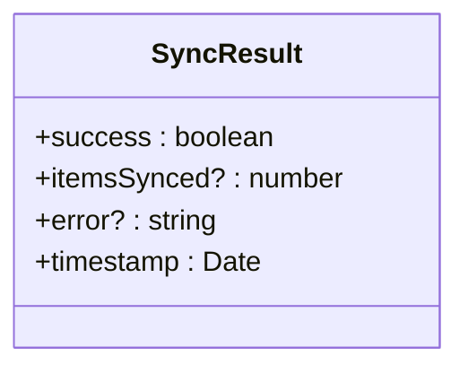
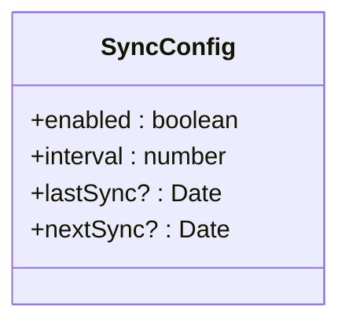
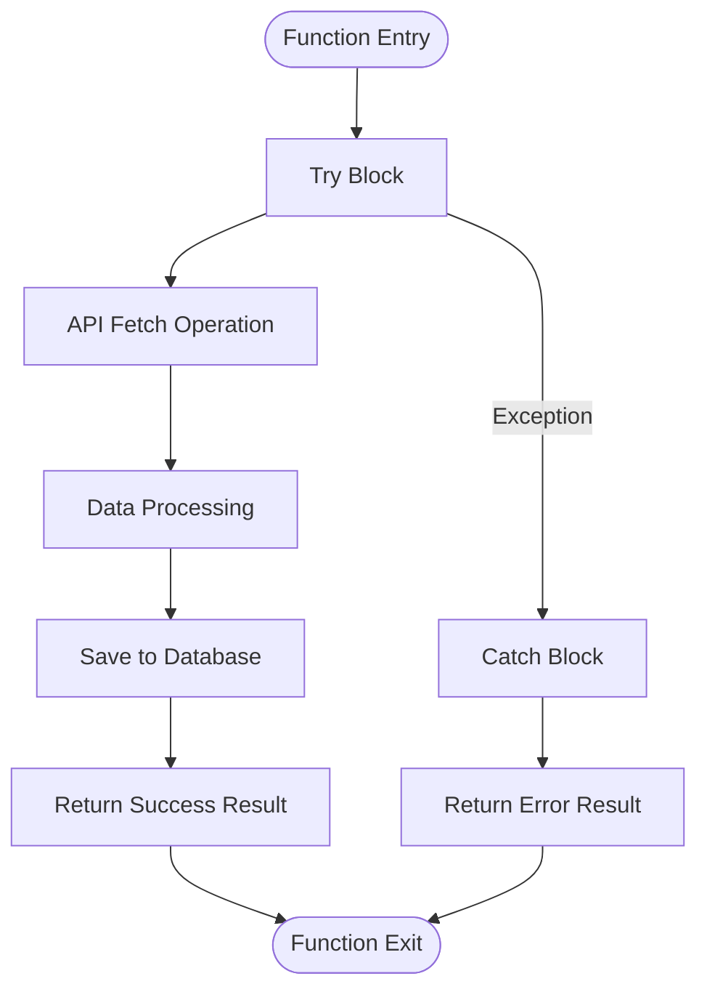
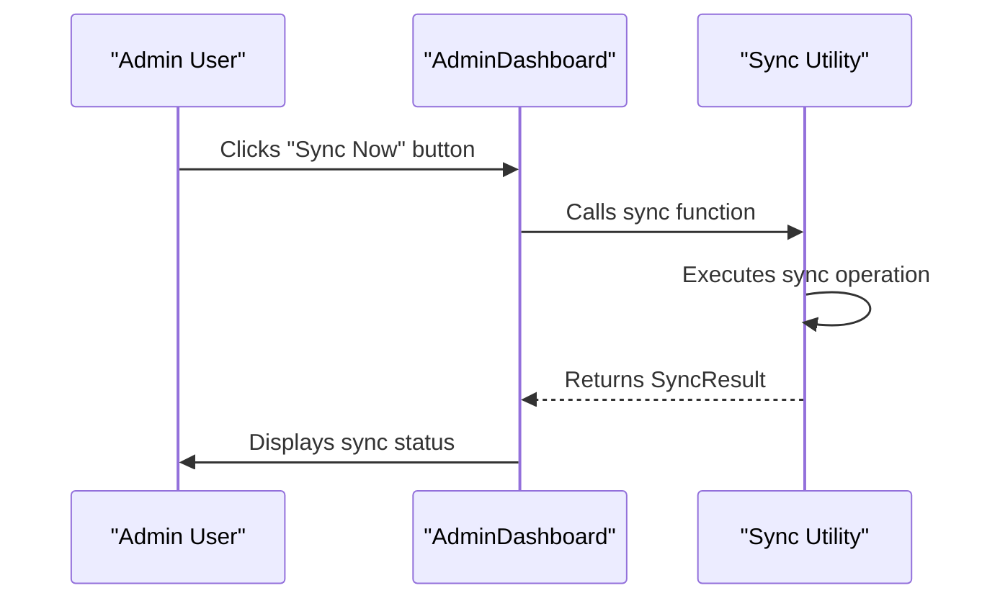
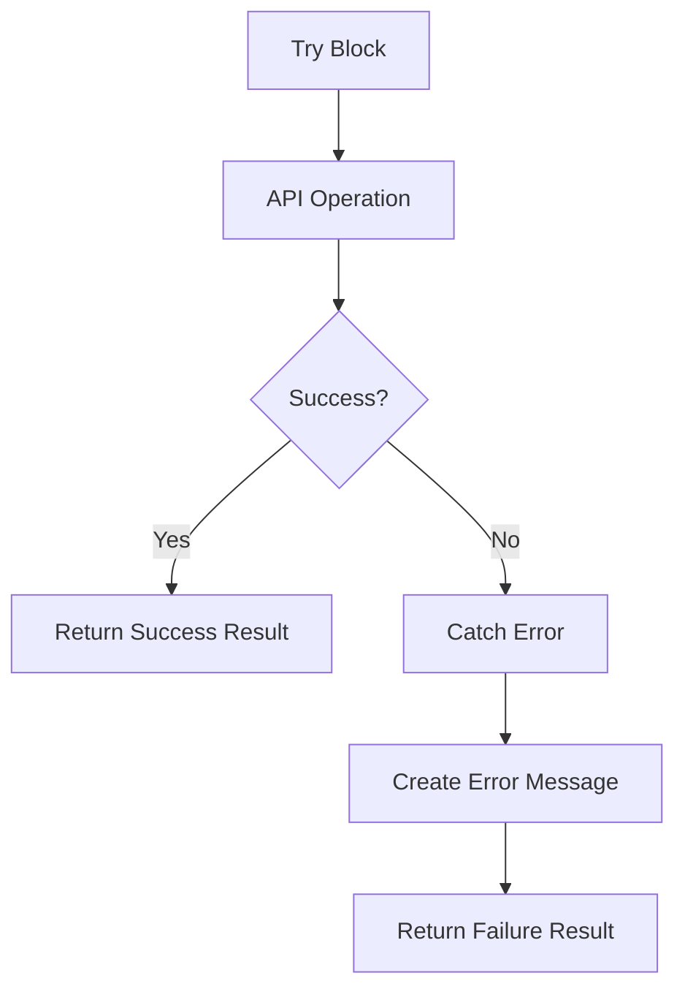
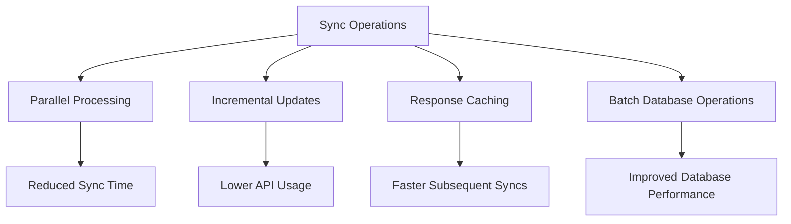
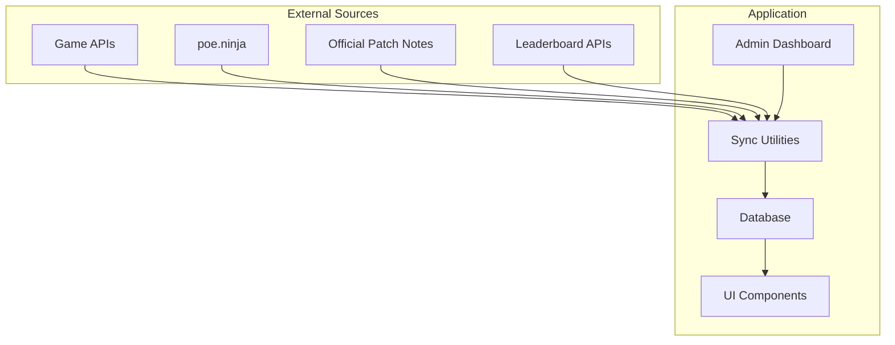

# Data Synchronization Utilities

<cite>
**Referenced Files in This Document**   
- [sync.ts](file://lib/api/sync.ts)
- [AdminDashboard.tsx](file://components/admin/AdminDashboard.tsx)
- [index.ts](file://types/index.ts)
- [ItemDatabase.tsx](file://components/database/ItemDatabase.tsx)
- [EconomyTracker.tsx](file://components/economy/EconomyTracker.tsx)
</cite>

## Table of Contents
1. [Introduction](#introduction)
2. [Core Synchronization Functions](#core-synchronization-functions)
3. [SyncResult Interface](#syncresult-interface)
4. [SyncConfig Interface](#syncconfig-interface)
5. [Implementation Details](#implementation-details)
6. [Usage Examples](#usage-examples)
7. [Error Handling Pattern](#error-handling-pattern)
8. [Design Considerations](#design-considerations)
9. [Performance Optimization Opportunities](#performance-optimization-opportunities)
10. [Security Requirements](#security-requirements)
11. [Integration Points](#integration-points)

## Introduction
The data synchronization utilities in the Prometheus Planner application provide a structured framework for maintaining up-to-date game data from external sources. These utilities are designed to periodically or manually sync critical information including game items, economy data, patch notes, and leaderboards. The system is built with extensibility in mind, supporting both Path of Exile 2 and Diablo IV game data. Currently, these functions serve as placeholders awaiting integration with actual external APIs, but they establish the proper interface contracts and error handling patterns for future implementation.

## Core Synchronization Functions

The synchronization system consists of four primary functions, each responsible for a specific data domain:

- **syncItemDatabase**: Updates the comprehensive item database with the latest game item data
- **syncEconomyData**: Fetches current currency values from poe.ninja
- **syncPatchNotes**: Retrieves official game updates and patch notes
- **syncLeaderboards**: Imports top player builds and rankings

These functions are designed to be invoked either manually through the admin interface or automatically based on scheduled configurations.

**Section sources**
- [sync.ts](file://lib/api/sync.ts#L17-L98)
- [AdminDashboard.tsx](file://components/admin/AdminDashboard.tsx#L145-L190)

## SyncResult Interface

The `SyncResult` interface provides a standardized response format for all synchronization operations, ensuring consistent handling of results across the application:

**Diagram sources**
- [sync.ts](file://lib/api/sync.ts#L10-L15)

**Section sources**
- [sync.ts](file://lib/api/sync.ts#L10-L15)

## SyncConfig Interface

The `SyncConfig` interface defines the configuration parameters for automated synchronization operations, allowing control over sync frequency and scheduling:

**Diagram sources**
- [sync.ts](file://lib/api/sync.ts#L3-L8)

**Section sources**
- [sync.ts](file://lib/api/sync.ts#L3-L8)

## Implementation Details

The synchronization functions follow a consistent implementation pattern with try-catch error handling and structured result returns. Each function is currently implemented as a placeholder with commented code indicating the intended API integration points. The functions are designed to be asynchronous, returning Promises that resolve to SyncResult objects.

The item database sync function accepts a game parameter to support both PoE 2 and Diablo IV, while the economy data sync specifically targets poe.ninja as the data source. The patch notes and leaderboards functions also accept a game parameter to determine which game's data to sync.

**Diagram sources**
- [sync.ts](file://lib/api/sync.ts#L17-L98)

**Section sources**
- [sync.ts](file://lib/api/sync.ts#L17-L98)

## Usage Examples

The synchronization functions are designed to be invoked from the admin dashboard interface. The AdminDashboard component provides UI controls for manual synchronization of each data type. When a user clicks the "Sync Now" button for any data category, the corresponding sync function would be called.

**Diagram sources**
- [AdminDashboard.tsx](file://components/admin/AdminDashboard.tsx#L145-L190)
- [sync.ts](file://lib/api/sync.ts#L17-L98)

**Section sources**
- [AdminDashboard.tsx](file://components/admin/AdminDashboard.tsx#L145-L190)

## Error Handling Pattern

All synchronization functions implement a consistent error handling pattern using try-catch blocks to capture exceptions and return structured failure results. The pattern ensures that any errors during the sync process are properly reported without crashing the application.

The error handling specifically checks if the caught object is an instance of Error to properly extract the message, providing a fallback message for unknown error types.

**Diagram sources**
- [sync.ts](file://lib/api/sync.ts#L21-L37)

**Section sources**
- [sync.ts](file://lib/api/sync.ts#L21-L37)

## Design Considerations

The synchronization utilities are designed with several key considerations for future implementation:

1. **Authentication Headers**: External APIs will likely require authentication, necessitating secure storage and transmission of API keys
2. **Response Parsing**: API responses will need to be parsed and transformed to match the application's data models
3. **Database Persistence**: Synced data must be properly stored in the application database with appropriate relationships
4. **Data Validation**: Incoming data should be validated against expected schemas before storage
5. **Rate Limiting**: API usage should respect rate limits to avoid being blocked

The current implementation includes commented code showing the intended fetch operations, providing clear guidance for future development.

**Section sources**
- [sync.ts](file://lib/api/sync.ts#L17-L98)
- [index.ts](file://types/index.ts#L97-L113)

## Performance Optimization Opportunities

Several performance optimization strategies can be implemented when the sync functions are fully developed:

1. **Incremental Updates**: Rather than full data refreshes, implement delta syncs to only update changed records
2. **Parallel Processing**: Run independent sync operations concurrently to reduce total sync time
3. **Caching**: Implement response caching to reduce API calls for unchanged data
4. **Batch Processing**: Process and store data in batches to optimize database operations
5. **Background Workers**: Offload sync operations to background processes to avoid blocking the main application

**Diagram sources**
- [sync.ts](file://lib/api/sync.ts#L17-L98)

**Section sources**
- [sync.ts](file://lib/api/sync.ts#L17-L98)

## Security Requirements

When connecting to external services, the following security requirements must be addressed:

1. **API Credential Management**: Store API keys securely using environment variables or secret management services
2. **Secure Transmission**: Ensure all API communications use HTTPS with proper certificate validation
3. **Input Validation**: Validate all incoming data to prevent injection attacks
4. **Rate Limiting Protection**: Implement proper rate limiting to prevent abuse
5. **Error Information Handling**: Avoid exposing sensitive information in error messages

The current placeholder implementation does not include authentication, but the structure is designed to accommodate secure credential handling when implemented.

**Section sources**
- [sync.ts](file://lib/api/sync.ts#L17-L98)

## Integration Points

The synchronization utilities integrate with several key components of the application:

1. **Admin Dashboard**: Provides the user interface for manual sync operations
2. **Item Database**: Receives updated item data from syncItemDatabase
3. **Economy Tracker**: Will display economy data from syncEconomyData
4. **Database Layer**: Stores all synced data (currently placeholder)
5. **External APIs**: Will connect to game APIs, poe.ninja, and official patch note sources

The integration between the admin dashboard and sync utilities is already established in the UI, with visual indicators for sync status and timing.

**Diagram sources**
- [sync.ts](file://lib/api/sync.ts#L17-L98)
- [AdminDashboard.tsx](file://components/admin/AdminDashboard.tsx#L145-L190)
- [ItemDatabase.tsx](file://components/database/ItemDatabase.tsx#L1-L112)
- [EconomyTracker.tsx](file://components/economy/EconomyTracker.tsx#L1-L56)

**Section sources**
- [sync.ts](file://lib/api/sync.ts#L17-L98)
- [AdminDashboard.tsx](file://components/admin/AdminDashboard.tsx#L145-L190)
- [ItemDatabase.tsx](file://components/database/ItemDatabase.tsx#L1-L112)
- [EconomyTracker.tsx](file://components/economy/EconomyTracker.tsx#L1-L56)