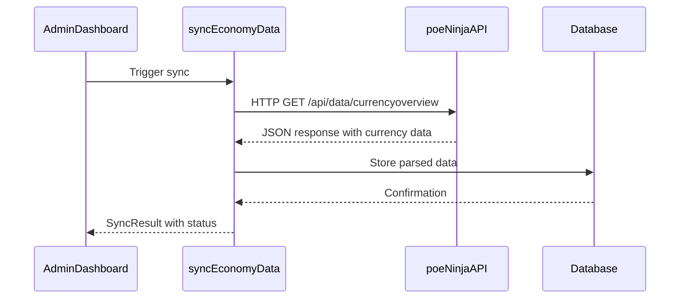
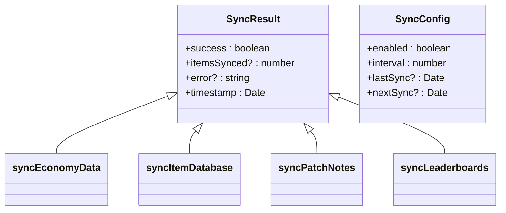
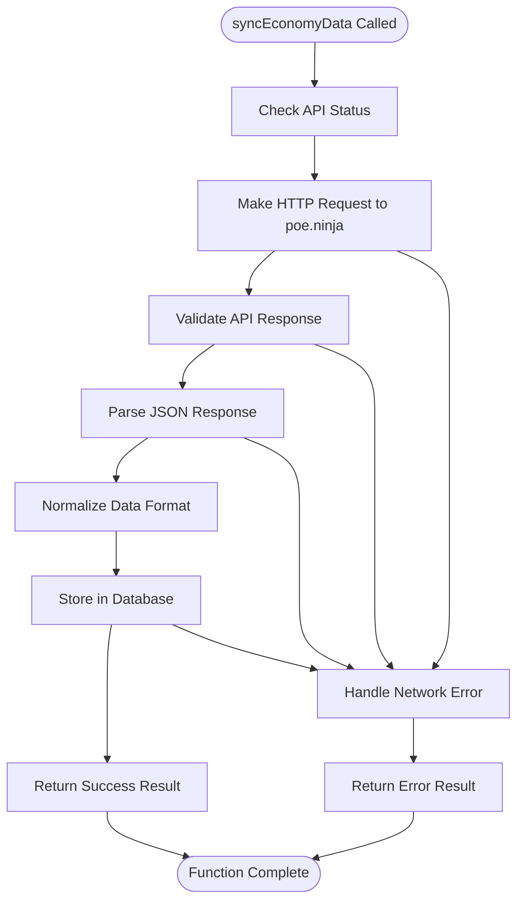
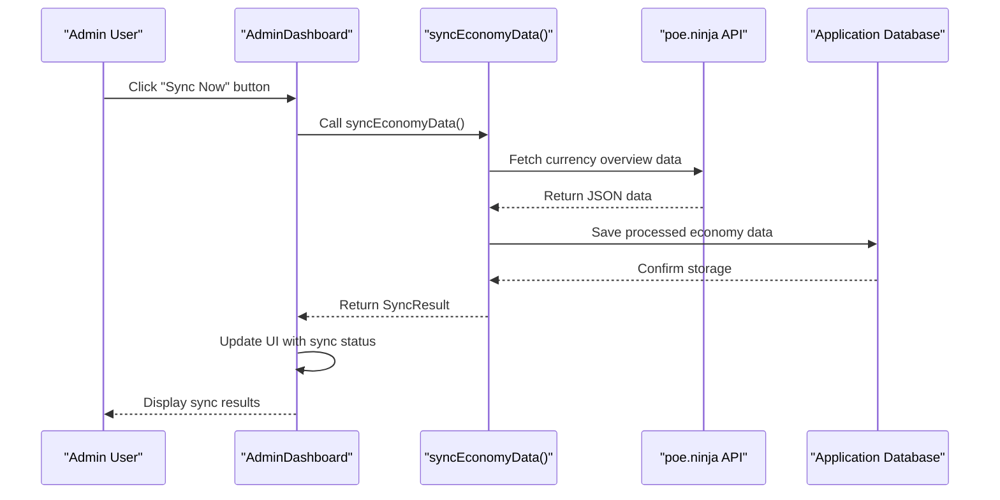
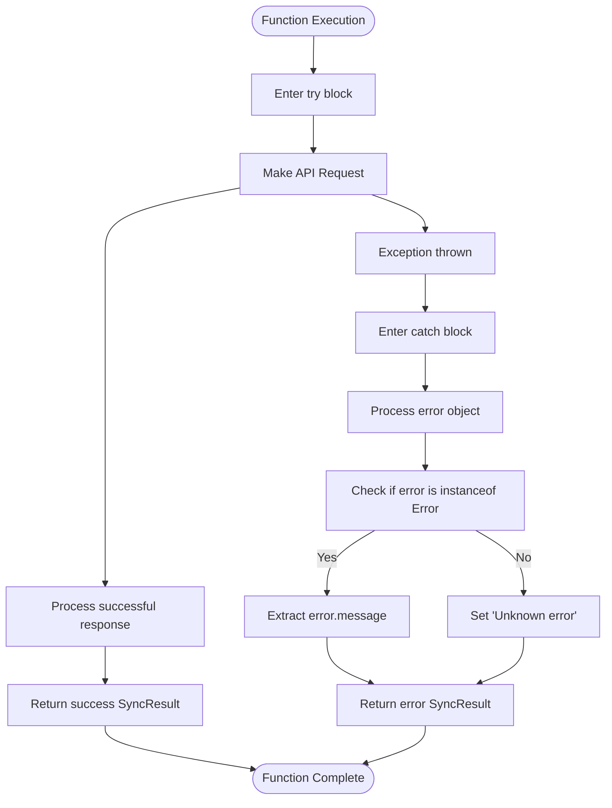
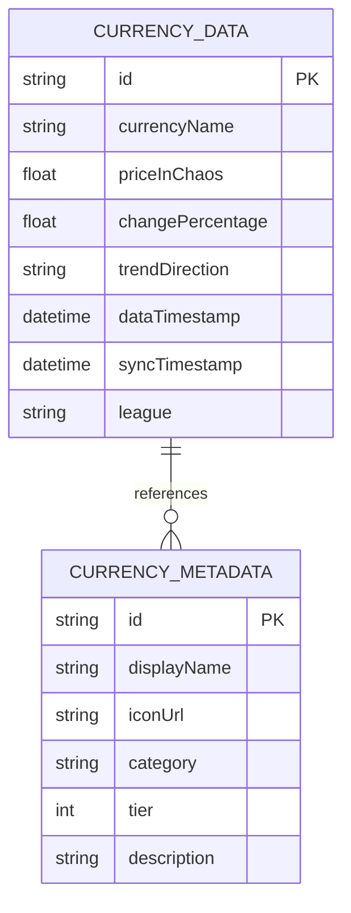
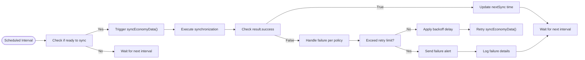

# Economy Data Synchronization

<cite>
**Referenced Files in This Document**   
- [sync.ts](file://lib/api/sync.ts)
- [EconomyTracker.tsx](file://components/economy/EconomyTracker.tsx)
- [AdminDashboard.tsx](file://components/admin/AdminDashboard.tsx)
- [index.ts](file://types/index.ts)
- [README.md](file://README.md)
- [IMPLEMENTATION_SUMMARY.md](file://IMPLEMENTATION_SUMMARY.md)
</cite>

## Table of Contents
1. [Introduction](#introduction)
2. [Function Overview](#function-overview)
3. [SyncResult Interface](#syncresult-interface)
4. [Workflow and Implementation Status](#workflow-and-implementation-status)
5. [Usage Example](#usage-example)
6. [Error Handling](#error-handling)
7. [Integration Requirements](#integration-requirements)
8. [Performance and Scheduling](#performance-and-scheduling)
9. [Security and Monitoring](#security-and-monitoring)
10. [Conclusion](#conclusion)

## Introduction

The `syncEconomyData` function is a critical component of the Prometheus ARPG Build Planner, designed to power the real-time economy tracking feature for Path of Exile 2. This function is responsible for synchronizing current market data from the poe.ninja API, which provides authoritative pricing information for in-game currencies and items. The synchronized data enables users to make informed decisions about crafting, trading, and build optimization based on current market conditions.

The economy tracker feature is currently in development, with the frontend components already implemented to display economic data, while the backend synchronization functionality remains as a placeholder awaiting full integration with the poe.ninja API.

**Section sources**
- [sync.ts](file://lib/api/sync.ts#L40-L58)
- [EconomyTracker.tsx](file://components/economy/EconomyTracker.tsx#L1-L56)
- [README.md](file://README.md#L16)

## Function Overview

The `syncEconomyData` function is an asynchronous function that returns a Promise of type `SyncResult`. It is designed to fetch real-time economy data from the poe.ninja API to power the economy tracker feature in the application.



**Diagram sources**
- [sync.ts](file://lib/api/sync.ts#L40-L58)
- [AdminDashboard.tsx](file://components/admin/AdminDashboard.tsx#L177-L190)

The function signature is defined as:
```typescript
export async function syncEconomyData(): Promise<SyncResult>
```

This function is part of a suite of data synchronization utilities in the `lib/api/sync.ts` file, which also includes functions for syncing item databases, patch notes, and leaderboards. The economy data sync specifically targets the poe.ninja API's currency overview endpoint to retrieve current market values for Path of Exile currencies.

**Section sources**
- [sync.ts](file://lib/api/sync.ts#L40-L58)

## SyncResult Interface

The `SyncResult` interface defines the standardized response structure for all data synchronization operations in the application, including the `syncEconomyData` function. This interface ensures consistent handling of synchronization outcomes across different data types.



**Diagram sources**
- [sync.ts](file://lib/api/sync.ts#L10-L15)

The interface properties are:
- **success**: A boolean indicating whether the synchronization operation completed successfully
- **itemsSynced**: An optional number indicating how many items were processed (not used in economy sync)
- **error**: An optional string containing error details if the operation failed
- **timestamp**: A Date object indicating when the operation was completed

For the `syncEconomyData` function, the response currently returns a success status with a timestamp, but does not include item counts since the actual data retrieval and processing is not yet implemented.

**Section sources**
- [sync.ts](file://lib/api/sync.ts#L10-L15)

## Workflow and Implementation Status

The intended workflow for the `syncEconomyData` function involves several key steps that are currently implemented as commented placeholders:

1. Making an HTTP request to the poe.ninja API endpoint for currency overview data
2. Parsing the JSON response containing currency values and market trends
3. Normalizing and transforming the data to match the application's data model
4. Storing the processed data in the application database
5. Returning a `SyncResult` indicating the outcome of the operation

Currently, the implementation is a placeholder that simulates a successful synchronization without actually communicating with the poe.ninja API. The code contains commented instructions indicating where the actual implementation should occur:

```typescript
// const response = await fetch('https://poe.ninja/api/data/currencyoverview');
// const data = await response.json();
// await saveEconomyData(data);
```

The frontend component `EconomyTracker.tsx` displays a message indicating that real-time economy data integration is forthcoming, confirming that the feature is not yet fully operational.



**Diagram sources**
- [sync.ts](file://lib/api/sync.ts#L40-L58)
- [EconomyTracker.tsx](file://components/economy/EconomyTracker.tsx#L45-L52)

**Section sources**
- [sync.ts](file://lib/api/sync.ts#L40-L58)
- [EconomyTracker.tsx](file://components/economy/EconomyTracker.tsx#L45-L52)

## Usage Example

The `syncEconomyData` function is designed to be triggered from the admin dashboard interface, where administrators can manually initiate data synchronization or monitor automated sync processes.

In the `AdminDashboard.tsx` component, there is a dedicated "Data Sync" tab that includes a section for "Economy Data Sync" with a "Sync Now" button. When this button is clicked, it should invoke the `syncEconomyData` function and display the results.



**Diagram sources**
- [AdminDashboard.tsx](file://components/admin/AdminDashboard.tsx#L177-L190)
- [sync.ts](file://lib/api/sync.ts#L40-L58)

The admin interface currently displays placeholder information about the last sync occurring 30 minutes ago with the next sync scheduled in 30 minutes, suggesting a planned 30-minute synchronization interval for economy data.

**Section sources**
- [AdminDashboard.tsx](file://components/admin/AdminDashboard.tsx#L177-L190)

## Error Handling

The `syncEconomyData` function implements structured error handling to capture and report issues that may occur during the synchronization process. The error handling follows a try-catch pattern that ensures the function always returns a valid `SyncResult` object, even when errors occur.



**Diagram sources**
- [sync.ts](file://lib/api/sync.ts#L42-L57)

When an error occurs, the function captures the error message if the error object is an instance of the Error class, or returns a generic "Unknown error" message for other types of thrown values. This approach prevents the function from throwing unhandled exceptions and ensures that calling components receive a predictable response format regardless of the outcome.

The error handling is designed to accommodate various failure scenarios, including network connectivity issues, API endpoint changes, response format changes, and database storage failures.

**Section sources**
- [sync.ts](file://lib/api/sync.ts#L42-L57)

## Integration Requirements

To fully implement the `syncEconomyData` function, several integration requirements must be addressed:

### API Endpoint Configuration
The function requires access to the poe.ninja API endpoint for currency overview data. Based on the commented code, the endpoint is:
```
https://poe.ninja/api/data/currencyoverview
```

Environment variables should be configured to store the API base URL, allowing for easy configuration between development, staging, and production environments.

### Request Headers and Authentication
While the poe.ninja API is generally public, the implementation should be prepared to handle potential rate limiting or authentication requirements. Request headers should include appropriate user-agent information and potentially API keys if required in the future.

### Response Schema Parsing
The function must parse the JSON response from the poe.ninja API, which typically includes:
- Currency names and types
- Current prices in Chaos Orbs
- Market trends and change percentages
- Timestamps for data freshness
- Additional metadata about currency availability and sources

### Data Normalization
Before storage, the retrieved data must be normalized to match the application's data model. This includes:
- Converting data types to match the application's expectations
- Standardizing currency names and categories
- Calculating derived values such as percentage changes
- Ensuring data consistency across sync operations

### Database Storage
The application requires a mechanism to store the synchronized economy data. While the `saveEconomyData` function is referenced in comments, the actual implementation is pending. The database schema should support:
- Historical price tracking
- Currency metadata
- Data versioning
- Efficient querying for frontend display



**Diagram sources**
- [sync.ts](file://lib/api/sync.ts#L44)
- [IMPLEMENTATION_SUMMARY.md](file://IMPLEMENTATION_SUMMARY.md#L219)

**Section sources**
- [sync.ts](file://lib/api/sync.ts#L40-L58)
- [IMPLEMENTATION_SUMMARY.md](file://IMPLEMENTATION_SUMMARY.md#L219)

## Performance and Scheduling

The economy data synchronization should be optimized for both performance and user experience. Several considerations are important for effective implementation:

### Rate Limiting and Throttling
The implementation must respect the poe.ninja API's rate limits to avoid IP blocking or service disruption. Best practices include:
- Implementing request throttling to stay within API limits
- Using exponential backoff for retry logic
- Caching responses to minimize redundant requests
- Monitoring API usage patterns

### Retry Logic
For transient failures such as network issues or temporary API outages, the function should implement retry logic with the following characteristics:
- Configurable number of retry attempts
- Exponential backoff between retries
- Circuit breaker pattern to prevent cascading failures
- Logging of retry attempts for monitoring

### Scheduling
The synchronization should occur on a regular schedule to ensure data freshness while minimizing API load. Based on the admin dashboard display, a 30-minute interval appears to be the intended schedule. The scheduling system should support:
- Configurable sync intervals
- Manual override for immediate updates
- Health checks to verify sync success
- Notifications for sync failures



**Diagram sources**
- [AdminDashboard.tsx](file://components/admin/AdminDashboard.tsx#L188-L189)
- [sync.ts](file://lib/api/sync.ts#L40-L58)

**Section sources**
- [AdminDashboard.tsx](file://components/admin/AdminDashboard.tsx#L188-L189)

## Security and Monitoring

The implementation of the `syncEconomyData` function requires careful consideration of security and monitoring aspects:

### API Monitoring
The application should implement comprehensive monitoring of the synchronization process, including:
- Success/failure rates
- Response times
- Data volume statistics
- Error type distribution
- Availability metrics

### Request Throttling
To prevent overwhelming the poe.ninja API or triggering anti-abuse mechanisms, the implementation should include request throttling that:
- Limits the number of concurrent requests
- Enforces minimum intervals between requests
- Implements queueing for high-frequency requests
- Provides configuration options for different environments

### Security Considerations
Security measures should include:
- Secure storage of any API credentials
- Input validation for API responses
- Protection against injection attacks
- Proper error handling that doesn't expose sensitive information
- Regular security audits of the synchronization code

### Logging and Alerting
The system should implement comprehensive logging and alerting for:
- Successful synchronization events
- Failed synchronization attempts
- Performance degradation
- Data anomalies
- Security incidents

**Section sources**
- [sync.ts](file://lib/api/sync.ts#L40-L58)
- [AdminDashboard.tsx](file://components/admin/AdminDashboard.tsx#L177-L190)

## Conclusion

The `syncEconomyData` function represents a critical component for the Prometheus ARPG Build Planner's economy tracking feature. While currently implemented as a placeholder, the function has a clear design and integration path for connecting with the poe.ninja API to provide real-time market data.

Key next steps for implementation include:
1. Establishing the database schema for storing economy data
2. Implementing the HTTP client for communicating with the poe.ninja API
3. Developing the data parsing and normalization logic
4. Creating the database storage functionality
5. Implementing comprehensive error handling and retry mechanisms
6. Setting up monitoring and alerting for the synchronization process

Once fully implemented, this function will enable users to access current market information for Path of Exile 2, enhancing their ability to make informed decisions about crafting, trading, and build optimization based on real-time economic conditions.

**Section sources**
- [sync.ts](file://lib/api/sync.ts#L40-L58)
- [EconomyTracker.tsx](file://components/economy/EconomyTracker.tsx#L45-L52)
- [AdminDashboard.tsx](file://components/admin/AdminDashboard.tsx#L177-L190)