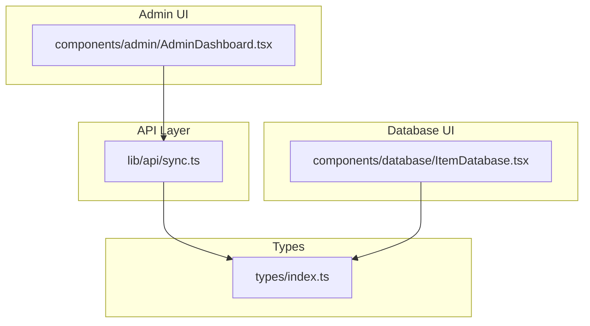
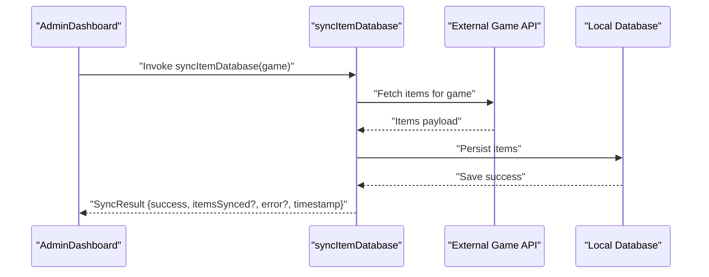
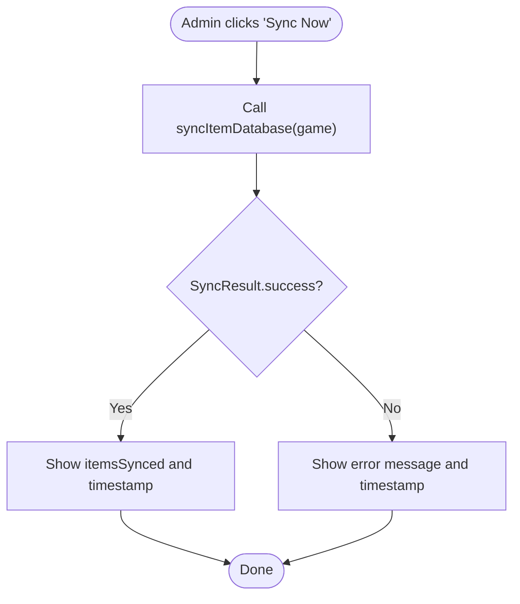
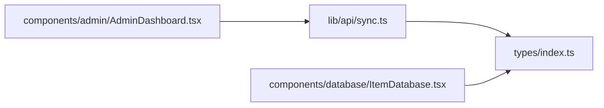

# Item Database Synchronization

<cite>
**Referenced Files in This Document**
- [sync.ts](file://lib/api/sync.ts)
- [index.ts](file://types/index.ts)
- [AdminDashboard.tsx](file://components/admin/AdminDashboard.tsx)
- [ItemDatabase.tsx](file://components/database/ItemDatabase.tsx)
- [README.md](file://README.md)
</cite>

## Table of Contents
1. [Introduction](#introduction)
2. [Project Structure](#project-structure)
3. [Core Components](#core-components)
4. [Architecture Overview](#architecture-overview)
5. [Detailed Component Analysis](#detailed-component-analysis)
6. [Dependency Analysis](#dependency-analysis)
7. [Performance Considerations](#performance-considerations)
8. [Troubleshooting Guide](#troubleshooting-guide)
9. [Conclusion](#conclusion)

## Introduction
This document provides comprehensive documentation for the syncItemDatabase function located in lib/api/sync.ts. The function is designed to synchronize game item data for Path of Exile 2 and Diablo IV from external APIs into the application’s database. It accepts a game parameter and returns a structured SyncResult, enabling administrators to trigger synchronization and monitor outcomes.

The current implementation is a placeholder with TODO comments indicating where actual API calls and persistence logic should be integrated. This document explains the intended workflow, the SyncResult contract, integration considerations, and practical guidance for building out the implementation.

## Project Structure
The synchronization logic resides in a dedicated API utility module and is consumed by admin UI components. The item data model is defined in shared types.

**Diagram sources**
- [sync.ts](file://lib/api/sync.ts#L1-L38)
- [index.ts](file://types/index.ts#L97-L114)
- [AdminDashboard.tsx](file://components/admin/AdminDashboard.tsx#L143-L160)
- [ItemDatabase.tsx](file://components/database/ItemDatabase.tsx#L1-L33)

**Section sources**
- [sync.ts](file://lib/api/sync.ts#L1-L38)
- [index.ts](file://types/index.ts#L97-L114)
- [AdminDashboard.tsx](file://components/admin/AdminDashboard.tsx#L143-L160)
- [ItemDatabase.tsx](file://components/database/ItemDatabase.tsx#L1-L33)

## Core Components
- syncItemDatabase(game): Asynchronous function that performs item synchronization for the specified game and returns a SyncResult.
- SyncResult: Standardized result structure containing success status, optional item count, optional error message, and a timestamp.
- Game type: Union type for supported games used by the function signature.
- Item type: Shared item model used across the application.

Key responsibilities:
- Accept a game parameter constrained to 'PoE 2' or 'Diablo IV'.
- Return a SyncResult with success flag, itemsSynced count, optional error, and timestamp.
- Placeholder logic currently returns a success result with zero items synced.

**Section sources**
- [sync.ts](file://lib/api/sync.ts#L10-L15)
- [sync.ts](file://lib/api/sync.ts#L18-L38)
- [index.ts](file://types/index.ts#L1-L1)
- [index.ts](file://types/index.ts#L97-L114)

## Architecture Overview
The synchronization process follows a predictable flow: the admin UI triggers the sync function, which executes API calls and persists data, then returns a structured result. The UI can display the outcome and schedule future runs.

**Diagram sources**
- [sync.ts](file://lib/api/sync.ts#L18-L38)
- [AdminDashboard.tsx](file://components/admin/AdminDashboard.tsx#L143-L160)

## Detailed Component Analysis

### syncItemDatabase Function
Purpose:
- Synchronize item data for the specified game by fetching from external APIs and persisting to the local database.

Signature:
- syncItemDatabase(game: 'PoE 2' | 'Diablo IV'): Promise<SyncResult>

Behavior:
- Placeholder implementation returns a success result with itemsSynced set to zero and a timestamp.
- Error handling wraps the operation and returns a failure result with an error message and timestamp.

Expected workflow (placeholder indicates where to add):
- Make an API request to the game’s item endpoint.
- Parse the response into the internal item model.
- Persist items to the local database.
- Return a SyncResult with itemsSynced reflecting the number of items saved.

Error handling strategy:
- Catches exceptions and returns a structured failure result with success=false, error message, and timestamp.

Integration considerations:
- API rate limits: Implement throttling or retries with exponential backoff.
- Response schema variations: Normalize item payloads to the shared Item type.
- Authentication: Include required headers or tokens if APIs require them.
- Data transformation: Convert external fields to the internal Item model and handle missing or optional fields.

Performance considerations:
- Incremental updates: Track last-modified timestamps and only fetch changed items.
- Caching: Cache recent responses to reduce redundant network calls.
- Background processing: Offload long-running syncs to background jobs or scheduled tasks.

Admin invocation example:
- The admin dashboard includes a “Data Sync” section with an “Item Database Sync” card and a “Sync Now” button. An admin component can wire this button to call syncItemDatabase and render the returned SyncResult.

**Section sources**
- [sync.ts](file://lib/api/sync.ts#L18-L38)
- [AdminDashboard.tsx](file://components/admin/AdminDashboard.tsx#L143-L160)

### SyncResult Interface
Structure:
- success: boolean
- itemsSynced?: number
- error?: string
- timestamp: Date

Usage:
- On success: itemsSynced indicates the number of items persisted.
- On failure: error contains a human-readable message; itemsSynced is omitted.

**Section sources**
- [sync.ts](file://lib/api/sync.ts#L10-L15)

### Types Used by syncItemDatabase
- Game: 'PoE 2' | 'Diablo IV'
- Item: Defines the internal item model used during persistence.

These types inform how the fetched data should be normalized and stored.

**Section sources**
- [index.ts](file://types/index.ts#L1-L1)
- [index.ts](file://types/index.ts#L97-L114)

### Admin Component Integration
The admin dashboard provides a UI surface for triggering synchronization. The “Item Database Sync” card contains a “Sync Now” action that can be wired to call syncItemDatabase. The component can display the last sync time and next scheduled sync based on SyncConfig.

**Diagram sources**
- [AdminDashboard.tsx](file://components/admin/AdminDashboard.tsx#L143-L160)
- [sync.ts](file://lib/api/sync.ts#L18-L38)

**Section sources**
- [AdminDashboard.tsx](file://components/admin/AdminDashboard.tsx#L143-L160)

## Dependency Analysis
The sync module defines the SyncResult and SyncConfig contracts and exposes the syncItemDatabase function. The ItemDatabase component consumes the Item type from shared types. The AdminDashboard component orchestrates the UI for invoking synchronization.

**Diagram sources**
- [sync.ts](file://lib/api/sync.ts#L1-L38)
- [index.ts](file://types/index.ts#L97-L114)
- [AdminDashboard.tsx](file://components/admin/AdminDashboard.tsx#L143-L160)
- [ItemDatabase.tsx](file://components/database/ItemDatabase.tsx#L1-L33)

**Section sources**
- [sync.ts](file://lib/api/sync.ts#L1-L38)
- [index.ts](file://types/index.ts#L97-L114)
- [AdminDashboard.tsx](file://components/admin/AdminDashboard.tsx#L143-L160)
- [ItemDatabase.tsx](file://components/database/ItemDatabase.tsx#L1-L33)

## Performance Considerations
- Incremental updates: Track last-modified timestamps and only fetch changed items to minimize bandwidth and processing time.
- Caching: Cache recent API responses to reduce repeated network calls, especially for frequently accessed endpoints.
- Background processing: Offload long-running syncs to background jobs or scheduled tasks to avoid blocking the UI thread.
- Batch writes: Persist items in batches to improve database write throughput.
- Concurrency control: Limit concurrent syncs to prevent resource contention.

[No sources needed since this section provides general guidance]

## Troubleshooting Guide
Common issues and resolutions:
- API rate limiting: Implement retry logic with exponential backoff and respect rate limits.
- Schema mismatches: Normalize external payloads to the internal Item model; handle missing or optional fields gracefully.
- Authentication failures: Ensure required headers or tokens are present; validate credentials.
- Network errors: Wrap fetch calls in robust error handling and return structured SyncResult failures.
- Data conflicts: Implement deduplication and conflict resolution strategies when merging external data with existing records.

**Section sources**
- [sync.ts](file://lib/api/sync.ts#L18-L38)

## Conclusion
The syncItemDatabase function establishes a standardized contract for synchronizing item data from external game APIs into the application’s database. While the current implementation is a placeholder, the SyncResult interface and type definitions provide a clear foundation for integrating real API calls, transforming payloads, and persisting data. By addressing integration considerations—rate limits, schema differences, authentication, and data transformation—and applying performance optimizations, the function can become a reliable backbone for maintaining up-to-date item catalogs for Path of Exile 2 and Diablo IV.