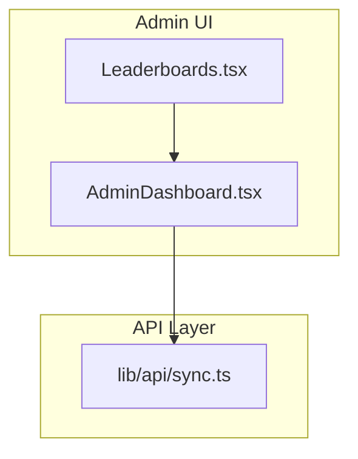
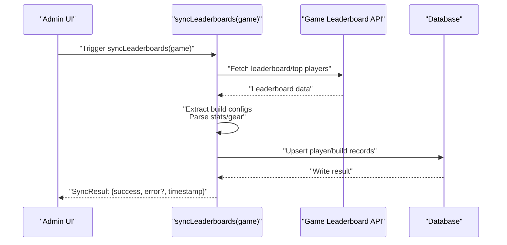
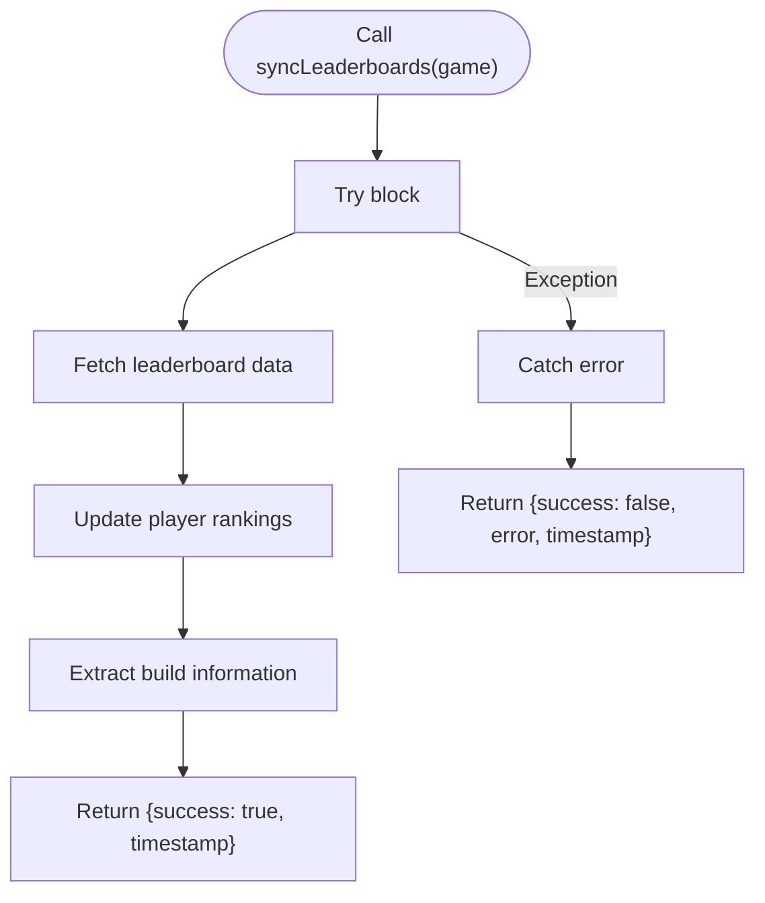
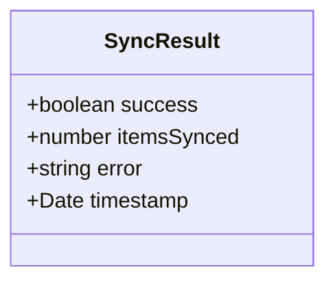
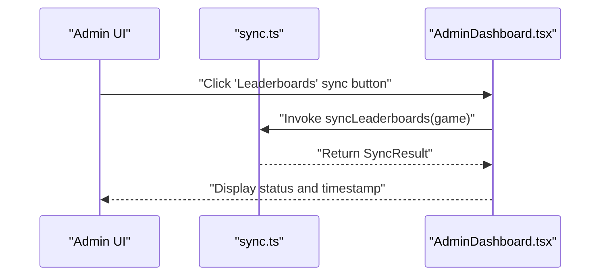
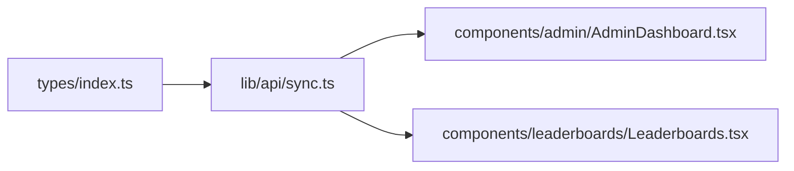

# Leaderboard Synchronization

<cite>
**Referenced Files in This Document**
- [sync.ts](file://lib/api/sync.ts)
- [index.ts](file://types/index.ts)
- [AdminDashboard.tsx](file://components/admin/AdminDashboard.tsx)
- [Leaderboards.tsx](file://components/leaderboards/Leaderboards.tsx)
- [README.md](file://README.md)
- [IMPLEMENTATION_SUMMARY.md](file://IMPLEMENTATION_SUMMARY.md)
</cite>

## Table of Contents
1. [Introduction](#introduction)
2. [Project Structure](#project-structure)
3. [Core Components](#core-components)
4. [Architecture Overview](#architecture-overview)
5. [Detailed Component Analysis](#detailed-component-analysis)
6. [Dependency Analysis](#dependency-analysis)
7. [Performance Considerations](#performance-considerations)
8. [Troubleshooting Guide](#troubleshooting-guide)
9. [Conclusion](#conclusion)
10. [Appendices](#appendices)

## Introduction
This document explains the purpose, design, and current state of the syncLeaderboards function located in lib/api/sync.ts. The function is intended to import top player build data from game leaderboards to power the community leaderboards feature and meta analysis. It accepts a game parameter (either 'PoE 2' or 'Diablo IV') and returns a Promise of SyncResult. The current implementation is a placeholder that outlines the intended workflow and error handling structure, while awaiting integration with actual data sources.

The broader context shows that the community leaderboards feature is present in the UI (components/leaderboards/Leaderboards.tsx) and the admin dashboard (components/admin/AdminDashboard.tsx) exposes a “Data Sync” section that includes a “Leaderboards” entry. The README and IMPLEMENTATION_SUMMARY confirm that leaderboard API integration is part of the roadmap.

**Section sources**
- [README.md](file://README.md#L1-L144)
- [IMPLEMENTATION_SUMMARY.md](file://IMPLEMENTATION_SUMMARY.md#L1-L242)

## Project Structure
The leaderboard synchronization logic resides in lib/api/sync.ts alongside other data sync functions. The admin dashboard UI includes a “Data Sync” tab with controls for various sync tasks, including a “Leaderboards” entry. The leaderboard page displays a mock leaderboard table, indicating that live data is not yet integrated.

**Diagram sources**
- [AdminDashboard.tsx](file://components/admin/AdminDashboard.tsx#L143-L193)
- [Leaderboards.tsx](file://components/leaderboards/Leaderboards.tsx#L1-L41)
- [sync.ts](file://lib/api/sync.ts#L80-L98)

**Section sources**
- [AdminDashboard.tsx](file://components/admin/AdminDashboard.tsx#L143-L193)
- [Leaderboards.tsx](file://components/leaderboards/Leaderboards.tsx#L1-L41)
- [sync.ts](file://lib/api/sync.ts#L80-L98)

## Core Components
- syncLeaderboards(game): Promise<SyncResult>
  - Purpose: Import top player build data from game leaderboards to power community leaderboards and meta analysis.
  - Parameter: game, constrained to 'PoE 2' | 'Diablo IV'.
  - Return: Promise resolving to SyncResult with success flag, optional error message, and timestamp.
- SyncResult: Standardized result shape used across sync functions.
  - Fields: success (boolean), itemsSynced (optional number), error (optional string), timestamp (Date).
- Related types:
  - Game: 'PoE 2' | 'Diablo IV'
  - Build: Comprehensive build model used across the application.

Key characteristics:
- The function is declared but not implemented; it currently returns a successful SyncResult with a timestamp and logs placeholder comments indicating the intended workflow.
- Error handling follows a consistent pattern: catch errors and return a SyncResult with success=false and error set to the caught error’s message or a fallback string.

**Section sources**
- [sync.ts](file://lib/api/sync.ts#L80-L98)
- [index.ts](file://types/index.ts#L1-L10)

## Architecture Overview
The intended architecture for leaderboard synchronization involves:
- An admin-triggered endpoint or UI action invoking syncLeaderboards(game).
- The function performing the following high-level steps:
  - Access game API endpoints or scrape public leaderboard data.
  - Extract build configurations from top performers.
  - Parse character stats and gear setups.
  - Store this information in the database.
- The SyncResult communicates whether the operation succeeded, how many items were processed, and any error encountered.

**Diagram sources**
- [sync.ts](file://lib/api/sync.ts#L80-L98)
- [AdminDashboard.tsx](file://components/admin/AdminDashboard.tsx#L143-L193)

## Detailed Component Analysis

### syncLeaderboards Function
- Signature: syncLeaderboards(game: 'PoE 2' | 'Diablo IV'): Promise<SyncResult>
- Behavior:
  - Placeholder implementation returns a successful SyncResult with timestamp.
  - Intended workflow comments indicate fetching leaderboard data, updating rankings, and extracting build information.
- Error handling:
  - Catches exceptions and returns a SyncResult with success=false and error populated.

**Diagram sources**
- [sync.ts](file://lib/api/sync.ts#L80-L98)

**Section sources**
- [sync.ts](file://lib/api/sync.ts#L80-L98)

### SyncResult Structure
- Fields:
  - success: boolean
  - itemsSynced: number (optional)
  - error: string (optional)
  - timestamp: Date
- Usage:
  - Consistently returned by syncItemDatabase, syncEconomyData, syncPatchNotes, and syncLeaderboards.
  - Enables uniform reporting of sync status across the application.

**Diagram sources**
- [sync.ts](file://lib/api/sync.ts#L10-L15)

**Section sources**
- [sync.ts](file://lib/api/sync.ts#L10-L15)

### Admin-Triggered Synchronization
- The admin dashboard includes a “Data Sync” tab with entries for:
  - Item Database Sync
  - Patch Notes Sync
  - Economy Data Sync
  - Leaderboards
- These entries are placeholders for future integration with the corresponding sync functions.

**Diagram sources**
- [AdminDashboard.tsx](file://components/admin/AdminDashboard.tsx#L143-L193)
- [sync.ts](file://lib/api/sync.ts#L80-L98)

**Section sources**
- [AdminDashboard.tsx](file://components/admin/AdminDashboard.tsx#L143-L193)
- [sync.ts](file://lib/api/sync.ts#L80-L98)

### Data Extraction Challenges
- API limitations:
  - Public leaderboard endpoints may restrict rate limits, pagination, or expose only partial build details.
- Pagination handling:
  - Leaderboards often require iterating through pages; missing pagination can lead to incomplete datasets.
- Build reconstruction from limited data:
  - Public leaderboard data may not include full gear setups or character stats; reconstruction may require additional API calls or heuristics.
- Data enrichment opportunities:
  - Combine leaderboard data with item database information to enrich gear stats and descriptions.
  - Cross-reference with existing builds to avoid duplication and improve categorization.

[No sources needed since this section provides general guidance]

### Recommendations for Implementation
- Data source integration:
  - Identify official game APIs or community APIs that expose leaderboard data.
  - Respect rate limits and implement exponential backoff.
- Parallel requests:
  - Fetch multiple leaderboard pages concurrently to reduce total latency.
- Incremental updates:
  - Track last sync timestamps and only process new or updated entries.
- Sampling strategies:
  - Sample top N players per region/class to balance freshness and resource usage.
- Data enrichment:
  - Enrich builds with item database details and cross-reference with known builds.

[No sources needed since this section provides general guidance]

### Ethical Considerations
- Attribution:
  - Clearly attribute builds to their original authors when displaying community leaderboards.
- Consent:
  - Ensure that public leaderboard data usage complies with terms of service and respects player privacy.
- Transparency:
  - Provide a notice explaining how leaderboard data is collected, processed, and displayed.

[No sources needed since this section provides general guidance]

## Dependency Analysis
- syncLeaderboards depends on:
  - Game parameter type 'PoE 2' | 'Diablo IV' (from types/index.ts).
  - SyncResult type (from lib/api/sync.ts).
- UI dependencies:
  - AdminDashboard.tsx provides the trigger for syncLeaderboards.
  - Leaderboards.tsx displays leaderboard data (currently mock data; will be replaced by live data after integration).

**Diagram sources**
- [index.ts](file://types/index.ts#L1-L10)
- [sync.ts](file://lib/api/sync.ts#L80-L98)
- [AdminDashboard.tsx](file://components/admin/AdminDashboard.tsx#L143-L193)
- [Leaderboards.tsx](file://components/leaderboards/Leaderboards.tsx#L1-L41)

**Section sources**
- [index.ts](file://types/index.ts#L1-L10)
- [sync.ts](file://lib/api/sync.ts#L80-L98)
- [AdminDashboard.tsx](file://components/admin/AdminDashboard.tsx#L143-L193)
- [Leaderboards.tsx](file://components/leaderboards/Leaderboards.tsx#L1-L41)

## Performance Considerations
- Parallelization:
  - Use concurrent requests for paginated leaderboard data to minimize total sync time.
- Incremental sync:
  - Track last updated timestamps and only fetch newer entries to reduce load.
- Sampling:
  - Limit the number of top players processed per sync cycle to balance freshness and performance.
- Caching:
  - Cache frequently accessed item and build metadata to reduce repeated lookups.

[No sources needed since this section provides general guidance]

## Troubleshooting Guide
- Symptom: syncLeaderboards returns success=true but itemsSynced is undefined.
  - Cause: Placeholder implementation does not populate itemsSynced.
  - Resolution: Implement data extraction and set itemsSynced to the number of builds processed.
- Symptom: syncLeaderboards returns success=false with an error message.
  - Cause: Network failure, API rate limit, or invalid game parameter.
  - Resolution: Log the error, implement retry with backoff, and validate the game parameter.
- Symptom: Leaderboards page shows mock data.
  - Cause: Live data not yet integrated.
  - Resolution: Implement syncLeaderboards and connect the UI to the database-backed leaderboard data.

**Section sources**
- [sync.ts](file://lib/api/sync.ts#L80-L98)
- [Leaderboards.tsx](file://components/leaderboards/Leaderboards.tsx#L1-L41)

## Conclusion
The syncLeaderboards function is a placeholder designed to integrate game leaderboard data into the community leaderboards feature. Its current implementation demonstrates the intended workflow and error handling pattern. Future work should focus on integrating with official or community APIs, implementing robust pagination and data enrichment, and connecting the UI to live data. Admin dashboards already provide the trigger points for initiating synchronization, aligning with the project’s roadmap.

[No sources needed since this section summarizes without analyzing specific files]

## Appendices

### Admin Trigger Example (Conceptual)
- Trigger: Click the “Leaderboards” sync button in the admin dashboard.
- Expected outcome: syncLeaderboards(game) executes, returns a SyncResult, and updates the UI with status and timestamp.

**Section sources**
- [AdminDashboard.tsx](file://components/admin/AdminDashboard.tsx#L143-L193)
- [sync.ts](file://lib/api/sync.ts#L80-L98)