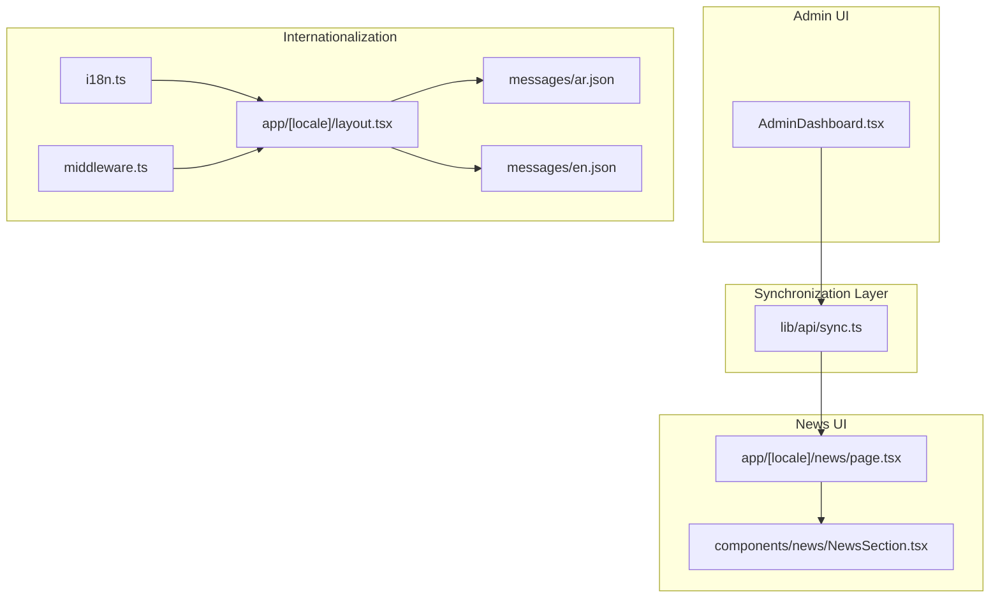
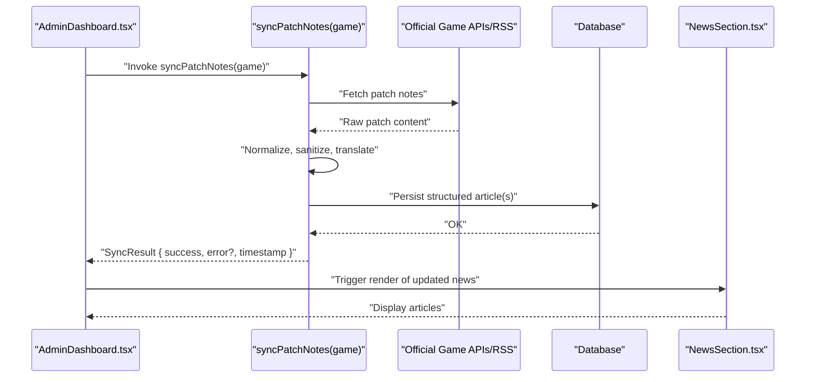
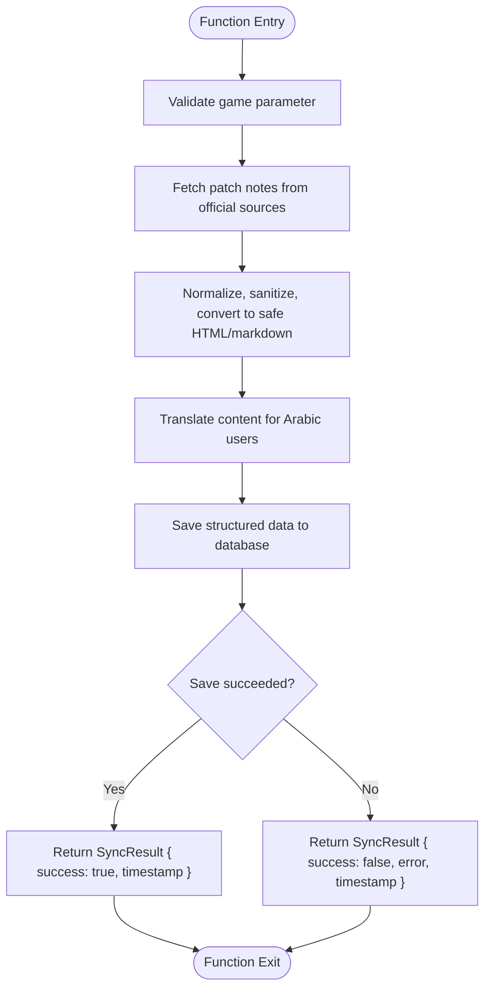
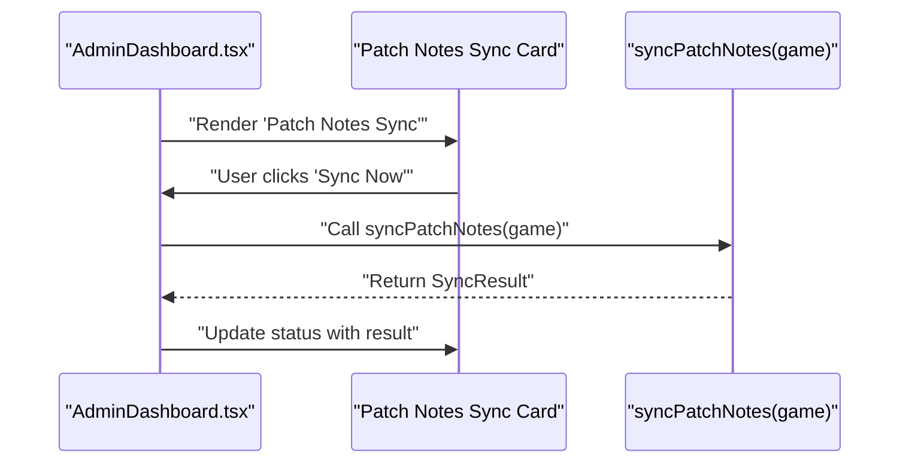
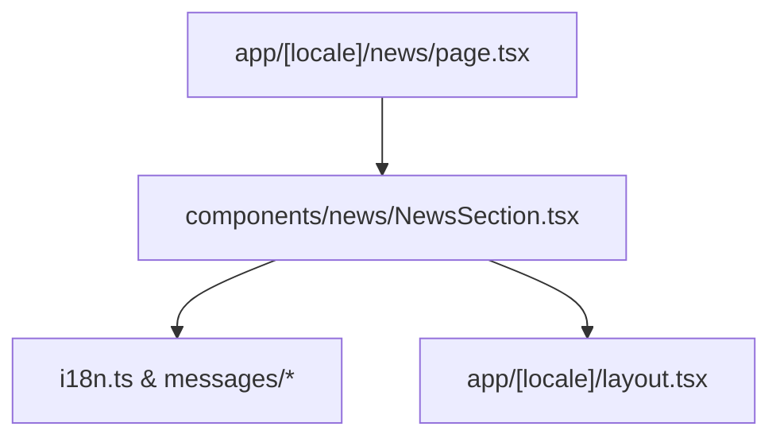
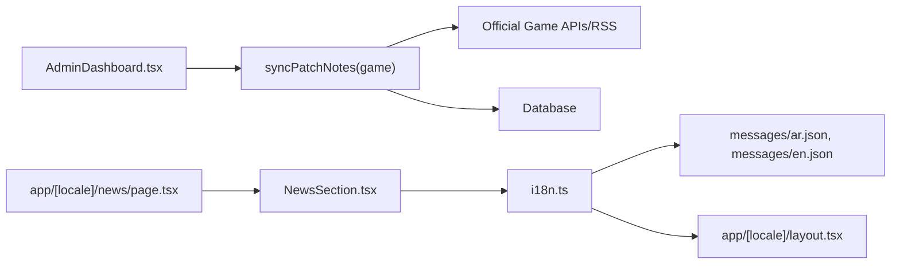
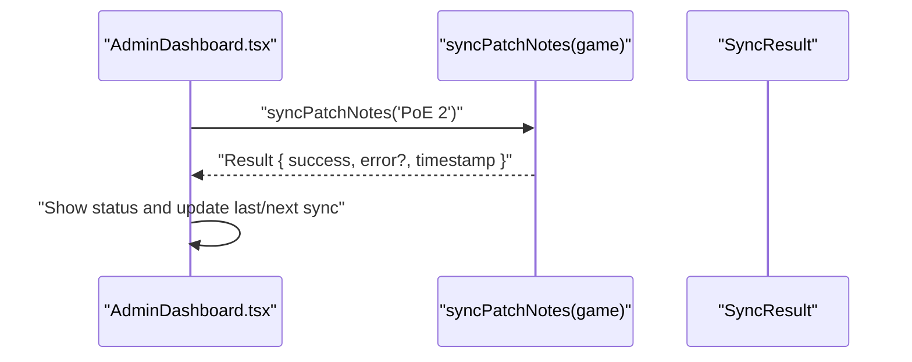

# Patch Notes Synchronization

<cite>
**Referenced Files in This Document**
- [lib/api/sync.ts](file://lib/api/sync.ts)
- [types/index.ts](file://types/index.ts)
- [components/admin/AdminDashboard.tsx](file://components/admin/AdminDashboard.tsx)
- [components/news/NewsSection.tsx](file://components/news/NewsSection.tsx)
- [app/[locale]/news/page.tsx](file://app/[locale]/news/page.tsx)
- [i18n.ts](file://i18n.ts)
- [middleware.ts](file://middleware.ts)
- [messages/ar.json](file://messages/ar.json)
- [messages/en.json](file://messages/en.json)
- [app/[locale]/layout.tsx](file://app/[locale]/layout.tsx)
</cite>

## Table of Contents
1. [Introduction](#introduction)
2. [Project Structure](#project-structure)
3. [Core Components](#core-components)
4. [Architecture Overview](#architecture-overview)
5. [Detailed Component Analysis](#detailed-component-analysis)
6. [Dependency Analysis](#dependency-analysis)
7. [Performance Considerations](#performance-considerations)
8. [Troubleshooting Guide](#troubleshooting-guide)
9. [Conclusion](#conclusion)
10. [Appendices](#appendices)

## Introduction
This document describes the patch notes synchronization feature for Path of Exile 2 and Diablo IV. It focuses on the syncPatchNotes function in lib/api/sync.ts, which is designed to retrieve official game patch notes, process them (including translation for Arabic users), and store structured data for display in the news section. The document explains the intended workflow, the SyncResult contract, and how the admin dashboard can trigger synchronization with robust error handling. It also outlines current placeholder implementation details, content processing requirements, and recommendations for automation, change detection, and notifications.

## Project Structure
The patch notes synchronization sits within the data synchronization layer and integrates with the admin dashboard and news UI. The relevant parts of the project structure include:
- Synchronization logic: lib/api/sync.ts
- Types used across the app: types/index.ts
- Admin UI for triggering sync: components/admin/AdminDashboard.tsx
- News UI for displaying articles: components/news/NewsSection.tsx and app/[locale]/news/page.tsx
- Internationalization setup: i18n.ts, middleware.ts, messages/ar.json, messages/en.json, app/[locale]/layout.tsx

**Diagram sources**
- [lib/api/sync.ts](file://lib/api/sync.ts#L60-L78)
- [components/admin/AdminDashboard.tsx](file://components/admin/AdminDashboard.tsx#L143-L193)
- [components/news/NewsSection.tsx](file://components/news/NewsSection.tsx#L1-L58)
- [app/[locale]/news/page.tsx](file://app/[locale]/news/page.tsx#L1-L19)
- [i18n.ts](file://i18n.ts#L1-L16)
- [middleware.ts](file://middleware.ts#L1-L15)
- [app/[locale]/layout.tsx](file://app/[locale]/layout.tsx#L1-L48)
- [messages/ar.json](file://messages/ar.json#L1-L121)
- [messages/en.json](file://messages/en.json#L1-L121)

**Section sources**
- [lib/api/sync.ts](file://lib/api/sync.ts#L60-L78)
- [components/admin/AdminDashboard.tsx](file://components/admin/AdminDashboard.tsx#L143-L193)
- [components/news/NewsSection.tsx](file://components/news/NewsSection.tsx#L1-L58)
- [app/[locale]/news/page.tsx](file://app/[locale]/news/page.tsx#L1-L19)
- [i18n.ts](file://i18n.ts#L1-L16)
- [middleware.ts](file://middleware.ts#L1-L15)
- [app/[locale]/layout.tsx](file://app/[locale]/layout.tsx#L1-L48)
- [messages/ar.json](file://messages/ar.json#L1-L121)
- [messages/en.json](file://messages/en.json#L1-L121)

## Core Components
- syncPatchNotes(game): Asynchronous function that accepts a game parameter ('PoE 2' or 'Diablo IV') and returns a Promise<SyncResult>. It currently contains placeholder logic and TODO comments indicating integration points for fetching, translating, and saving patch notes.
- SyncResult: Standardized result interface used across sync functions, carrying success state, optional error message, and timestamp. Some functions also include itemsSynced for item counts.

Key responsibilities:
- Fetch patch notes from official game APIs or RSS feeds
- Normalize and process content (HTML sanitization, markdown conversion)
- Translate content for Arabic users
- Store structured data in the database for display
- Report success/failure and timestamps

**Section sources**
- [lib/api/sync.ts](file://lib/api/sync.ts#L10-L15)
- [lib/api/sync.ts](file://lib/api/sync.ts#L60-L78)

## Architecture Overview
The patch notes synchronization follows a layered architecture:
- Admin UI triggers synchronization
- Synchronization layer performs data fetching, processing, and persistence
- News UI renders stored articles

**Diagram sources**
- [components/admin/AdminDashboard.tsx](file://components/admin/AdminDashboard.tsx#L162-L175)
- [lib/api/sync.ts](file://lib/api/sync.ts#L60-L78)
- [components/news/NewsSection.tsx](file://components/news/NewsSection.tsx#L1-L58)

## Detailed Component Analysis

### syncPatchNotes Function
Purpose:
- Retrieve official game patch notes for 'PoE 2' or 'Diablo IV'
- Process content for display and multilingual support
- Persist structured data for the news section
- Return a standardized SyncResult

Current implementation highlights:
- Placeholder logic with TODO comments indicating integration points
- Returns SyncResult with success and timestamp
- Error handling returns SyncResult with error message

**Diagram sources**
- [lib/api/sync.ts](file://lib/api/sync.ts#L60-L78)

**Section sources**
- [lib/api/sync.ts](file://lib/api/sync.ts#L60-L78)

### SyncResult Contract
The SyncResult interface ensures consistent reporting across all synchronization functions:
- success: boolean
- itemsSynced?: number (present in some sync functions)
- error?: string
- timestamp: Date

This contract enables uniform error handling and logging in the admin dashboard and monitoring systems.

**Section sources**
- [lib/api/sync.ts](file://lib/api/sync.ts#L10-L15)

### Admin Dashboard Integration
The admin dashboard exposes a dedicated "Data Sync" tab with a "Patch Notes Sync" card. The UI indicates last and next sync times and provides a "Sync Now" button. While the current implementation does not wire the button to actual sync logic, the structure is ready to integrate the syncPatchNotes function.

**Diagram sources**
- [components/admin/AdminDashboard.tsx](file://components/admin/AdminDashboard.tsx#L162-L175)
- [lib/api/sync.ts](file://lib/api/sync.ts#L60-L78)

**Section sources**
- [components/admin/AdminDashboard.tsx](file://components/admin/AdminDashboard.tsx#L143-L193)

### News Section Rendering
The news page composes the NewsSection component, which currently uses mock data. Once patch notes are persisted, the NewsSection can be adapted to fetch and render real articles. The internationalization layer supports Arabic content rendering.

**Diagram sources**
- [app/[locale]/news/page.tsx](file://app/[locale]/news/page.tsx#L1-L19)
- [components/news/NewsSection.tsx](file://components/news/NewsSection.tsx#L1-L58)
- [i18n.ts](file://i18n.ts#L1-L16)
- [app/[locale]/layout.tsx](file://app/[locale]/layout.tsx#L1-L48)
- [messages/ar.json](file://messages/ar.json#L1-L121)
- [messages/en.json](file://messages/en.json#L1-L121)

**Section sources**
- [app/[locale]/news/page.tsx](file://app/[locale]/news/page.tsx#L1-L19)
- [components/news/NewsSection.tsx](file://components/news/NewsSection.tsx#L1-L58)
- [i18n.ts](file://i18n.ts#L1-L16)
- [app/[locale]/layout.tsx](file://app/[locale]/layout.tsx#L1-L48)
- [messages/ar.json](file://messages/ar.json#L1-L121)
- [messages/en.json](file://messages/en.json#L1-L121)

## Dependency Analysis
- syncPatchNotes depends on:
  - Official game APIs or RSS feeds (external)
  - Translation and content processing utilities (external)
  - Database persistence layer (external)
- AdminDashboard depends on:
  - UI state and event handlers
  - syncPatchNotes function
- NewsSection depends on:
  - Article data (mocked currently)
  - Internationalization messages and direction

**Diagram sources**
- [components/admin/AdminDashboard.tsx](file://components/admin/AdminDashboard.tsx#L162-L175)
- [lib/api/sync.ts](file://lib/api/sync.ts#L60-L78)
- [components/news/NewsSection.tsx](file://components/news/NewsSection.tsx#L1-L58)
- [i18n.ts](file://i18n.ts#L1-L16)
- [messages/ar.json](file://messages/ar.json#L1-L121)
- [messages/en.json](file://messages/en.json#L1-L121)
- [app/[locale]/layout.tsx](file://app/[locale]/layout.tsx#L1-L48)

**Section sources**
- [components/admin/AdminDashboard.tsx](file://components/admin/AdminDashboard.tsx#L143-L193)
- [lib/api/sync.ts](file://lib/api/sync.ts#L60-L78)
- [components/news/NewsSection.tsx](file://components/news/NewsSection.tsx#L1-L58)
- [i18n.ts](file://i18n.ts#L1-L16)
- [messages/ar.json](file://messages/ar.json#L1-L121)
- [messages/en.json](file://messages/en.json#L1-L121)
- [app/[locale]/layout.tsx](file://app/[locale]/layout.tsx#L1-L48)

## Performance Considerations
- Minimize network requests by batching patch note fetches and caching recent versions
- Use efficient HTML sanitization and markdown conversion libraries to avoid heavy CPU work
- Implement pagination or lazy loading in the news UI for large article sets
- Cache processed content and translations to reduce repeated computations
- Monitor SyncResult timestamps to detect slow or failing syncs

[No sources needed since this section provides general guidance]

## Troubleshooting Guide
Common issues and resolutions:
- Network failures: Wrap external API calls with retry logic and circuit breaker patterns; surface SyncResult.error for admin visibility
- Parsing inconsistencies: Normalize patch note formats across games; log raw responses for debugging
- Translation errors: Validate locale availability and fallback to default language when needed
- Storage failures: Ensure database writes are idempotent and handle duplicates gracefully
- UI feedback: Display SyncResult.success and error messages in the admin dashboard; update last/next sync indicators

**Section sources**
- [lib/api/sync.ts](file://lib/api/sync.ts#L60-L78)

## Conclusion
The syncPatchNotes function provides a clear foundation for integrating official game patch notes into the platform. Its standardized SyncResult contract and placeholder structure enable straightforward extension to fetch, process, translate, and persist content. With the admin dashboard UI prepared and the news section ready to render articles, the next steps involve connecting to official APIs, implementing robust content processing, and establishing automated scheduling and notifications.

[No sources needed since this section summarizes without analyzing specific files]

## Appendices

### Example Invocation from Admin Dashboard
- Trigger: Click the "Sync Now" button in the "Patch Notes Sync" card
- Action: Call syncPatchNotes(game) with either 'PoE 2' or 'Diablo IV'
- Outcome: Receive SyncResult and update the UI with success or error state

**Diagram sources**
- [components/admin/AdminDashboard.tsx](file://components/admin/AdminDashboard.tsx#L162-L175)
- [lib/api/sync.ts](file://lib/api/sync.ts#L60-L78)

**Section sources**
- [components/admin/AdminDashboard.tsx](file://components/admin/AdminDashboard.tsx#L162-L175)
- [lib/api/sync.ts](file://lib/api/sync.ts#L60-L78)

### Content Processing Requirements
- HTML sanitization: Remove unsafe tags and attributes to prevent XSS
- Markdown conversion: Convert to safe HTML for consistent rendering
- Multilingual support:
  - Detect locale from i18n configuration
  - Translate patch content for Arabic users
  - Respect RTL layout for Arabic content
- Structured storage: Persist normalized articles with metadata for filtering and display

**Section sources**
- [i18n.ts](file://i18n.ts#L1-L16)
- [middleware.ts](file://middleware.ts#L1-L15)
- [app/[locale]/layout.tsx](file://app/[locale]/layout.tsx#L1-L48)
- [messages/ar.json](file://messages/ar.json#L1-L121)
- [messages/en.json](file://messages/en.json#L1-L121)

### Challenges and Recommendations
- Inconsistent patch note formats:
  - Implement format adapters per game
  - Log raw content for manual review when parsing fails
- Version tracking:
  - Store patch version and release date
  - Compare with previously stored versions to detect changes
- Diff generation:
  - Compute diffs between versions for highlight sections
  - Notify users of significant balance changes
- Automated scheduling:
  - Use cron-like scheduling to periodically run syncPatchNotes
  - Track SyncResult.timestamp to compute next run intervals
- Change detection and notifications:
  - Monitor diffs and tag significant changes
  - Send notifications via in-app alerts or email subscriptions

[No sources needed since this section provides general guidance]