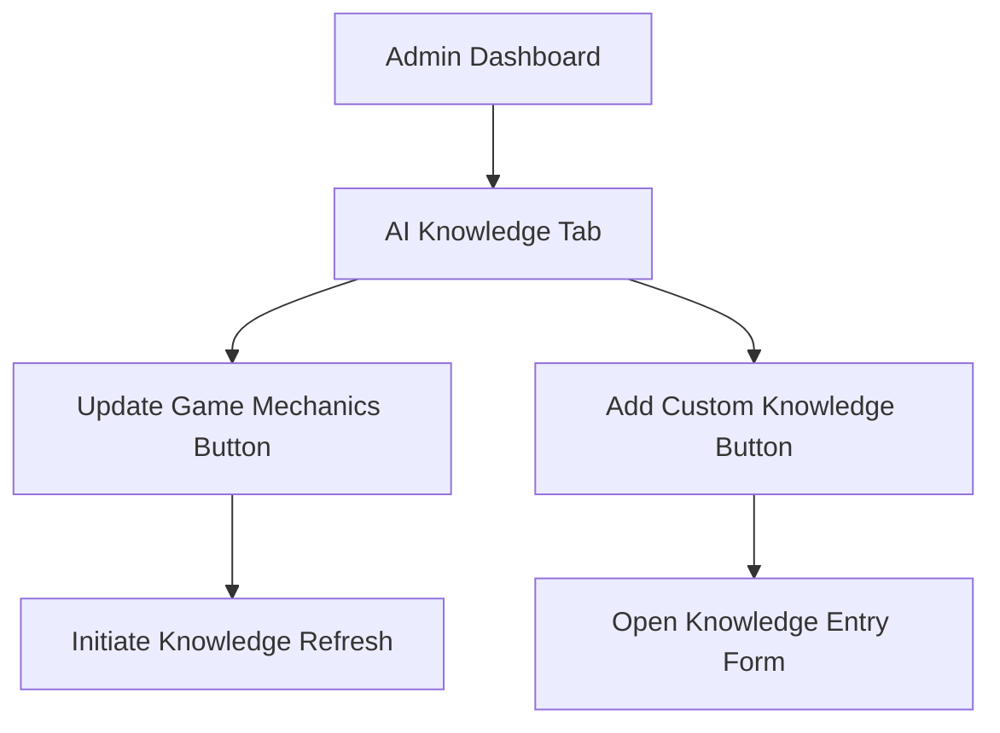
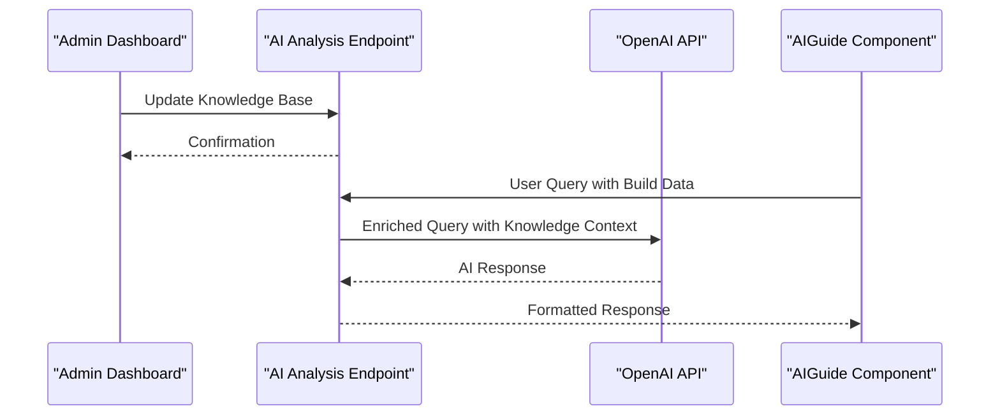
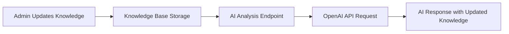

# AI Knowledge Base Management

<cite>
**Referenced Files in This Document**   
- [AdminDashboard.tsx](file://components/admin/AdminDashboard.tsx)
- [AIGuide.tsx](file://components/ai/AIGuide.tsx)
- [route.ts](file://app/api/ai/analyze/route.ts)
- [index.ts](file://types/index.ts)
- [en.json](file://messages/en.json)
- [i18n.ts](file://i18n.ts)
</cite>

## Table of Contents
1. [Introduction](#introduction)
2. [AI Knowledge Base Purpose](#ai-knowledge-base-purpose)
3. [Admin Dashboard UI Components](#admin-dashboard-ui-components)
4. [Knowledge Base Influence on AI Behavior](#knowledge-base-influence-on-ai-behavior)
5. [Workflow Implementation](#workflow-implementation)
6. [Relationship Between Admin Updates and AI Responses](#relationship-between-admin-updates-and-ai-responses)
7. [Common Issues and Solutions](#common-issues-and-solutions)
8. [Best Practices for Knowledge Entry Structure](#best-practices-for-knowledge-entry-structure)
9. [Conclusion](#conclusion)

## Introduction
The AI Knowledge Base Management system in the Admin Dashboard enables administrators to maintain up-to-date game mechanics and custom knowledge for the AI assistant. This functionality ensures that the AI provides accurate, relevant advice to users of the Prometheus build planner for Path of Exile 2 and Diablo IV. The system connects administrative actions with AI response quality through a well-defined architecture that integrates frontend components, API endpoints, and external AI services.

## AI Knowledge Base Purpose
The AI knowledge base serves as the foundation for the AI assistant's expertise in ARPG game mechanics. Maintaining current information is critical because the AI's recommendations directly impact user decisions about build optimization, gear selection, and gameplay strategies. Outdated knowledge can lead to inaccurate suggestions that misguide players, potentially causing frustration and reduced trust in the platform.

The knowledge base has two primary components:
1. **Game Mechanics**: Core rules, balance changes, and meta shifts from official patch notes
2. **Custom Knowledge**: Platform-specific insights, community-vetted strategies, and expert commentary

Regular updates ensure the AI remains aligned with the current game state, providing users with timely advice that reflects the latest developments in both Path of Exile 2 and Diablo IV.

**Section sources**
- [AdminDashboard.tsx](file://components/admin/AdminDashboard.tsx#L195-L212)
- [route.ts](file://app/api/ai/analyze/route.ts#L9-L26)

## Admin Dashboard UI Components
The Admin Dashboard provides dedicated UI components for managing the AI knowledge base, accessible through the "AI Knowledge" tab. These components are implemented as interactive buttons within the dashboard interface.

The two primary UI elements are:
- **Update Game Mechanics**: A button that initiates the process of refreshing the AI's knowledge with the latest game mechanics
- **Add Custom Knowledge**: A button that allows administrators to manually input additional information into the knowledge base

These components are styled consistently with the platform's design language, featuring hover effects and visual feedback to indicate interactivity. The buttons are prominently displayed within the AI Knowledge section of the dashboard, making them easily accessible to administrators.

**Diagram sources**
- [AdminDashboard.tsx](file://components/admin/AdminDashboard.tsx#L202-L209)

**Section sources**
- [AdminDashboard.tsx](file://components/admin/AdminDashboard.tsx#L195-L212)

## Knowledge Base Influence on AI Behavior
Administrative actions in the AI Knowledge tab directly influence the behavior of the AI analysis endpoint and the AIGuide component. When an administrator updates the knowledge base, these changes propagate through the system to affect how the AI interprets queries and generates responses.

The AIGuide component, which provides the user-facing AI chat interface, relies on the knowledge base through the AI analysis API endpoint. When a user submits a query, the AIGuide component sends the request to the analysis endpoint, which incorporates the current knowledge base content into its interaction with the OpenAI API.

The relationship between components follows this flow:
1. Admin updates knowledge via Admin Dashboard
2. Knowledge changes are stored in the system
3. When AIGuide sends a user query to the analysis endpoint
4. The endpoint combines the query with current knowledge base context
5. The enriched query is sent to OpenAI
6. AI response reflects updated knowledge

**Diagram sources**
- [AdminDashboard.tsx](file://components/admin/AdminDashboard.tsx#L195-L212)
- [AIGuide.tsx](file://components/ai/AIGuide.tsx#L15-L34)
- [route.ts](file://app/api/ai/analyze/route.ts#L28-L91)

**Section sources**
- [AIGuide.tsx](file://components/ai/AIGuide.tsx#L7-L131)
- [route.ts](file://app/api/ai/analyze/route.ts#L28-L91)

## Workflow Implementation
The implementation of the AI knowledge management workflow is currently represented in the AdminDashboard component, though the actual functionality is not yet fully implemented in the codebase. The UI elements are present and styled, but the event handlers for the knowledge management buttons do not contain the complete logic for their intended workflows.

The "Update Game Mechanics" button is designed to refresh the AI's knowledge with the latest game mechanics, likely by synchronizing with external data sources or internal databases that track game changes. The "Add Custom Knowledge" button is intended to open a form or interface where administrators can input new information directly into the knowledge base.

While the current implementation shows the UI structure, the actual integration with backend systems and data storage mechanisms is not visible in the provided code. This suggests that the feature is either in development or relies on external services not included in the repository.

**Section sources**
- [AdminDashboard.tsx](file://components/admin/AdminDashboard.tsx#L202-L209)

## Relationship Between Admin Updates and AI Responses
The relationship between admin-updated knowledge and AI responses generated via the OpenAI API is mediated through the system prompt and context injection mechanism in the AI analysis endpoint. The SYSTEM_PROMPT constant in the analysis route defines the AI's role and responsibilities, establishing it as an expert ARPG build advisor for Path of Exile 2 and Diablo IV.

When the knowledge base is updated by administrators, this information should be incorporated into the context that accompanies user queries sent to the OpenAI API. The analysis endpoint already has a mechanism for adding context to user messages through the `context` parameter in the request body, which is prepended to the user message before being sent to OpenAI.

This architecture allows the AI to provide responses that are not only based on its general training but also informed by the specific, up-to-date knowledge maintained by administrators. For example, if a recent patch changed a key game mechanic, the admin can update this information in the knowledge base, and subsequent AI responses will reflect this change.

**Diagram sources**
- [route.ts](file://app/api/ai/analyze/route.ts#L48-L55)
- [route.ts](file://app/api/ai/analyze/route.ts#L58-L66)

**Section sources**
- [route.ts](file://app/api/ai/analyze/route.ts#L9-L26)

## Common Issues and Solutions
Several common issues can arise in AI knowledge base management, particularly related to information accuracy and timeliness. The most significant issue is outdated information causing inaccurate AI suggestions, which can occur when game mechanics change due to patches or updates but the knowledge base is not correspondingly updated.

Solutions for maintaining knowledge base accuracy include:
- Implementing automated verification processes that cross-reference knowledge entries with official patch notes
- Establishing a review workflow where multiple administrators must approve significant knowledge changes
- Creating a logging system that tracks when knowledge entries were last updated and by whom
- Developing a feedback mechanism where users can report inaccurate AI suggestions, triggering a knowledge review

The system should also address the challenge of knowledge consistency across different game versions and expansions. Since the platform supports both Path of Exile 2 and Diablo IV, the knowledge base must clearly distinguish between game-specific mechanics to prevent the AI from applying rules from one game to the other incorrectly.

**Section sources**
- [route.ts](file://app/api/ai/analyze/route.ts#L10-L26)
- [en.json](file://messages/en.json#L77-L88)

## Best Practices for Knowledge Entry Structure
To maximize AI response quality, custom knowledge entries should follow specific structural guidelines. Well-structured entries ensure that the AI can effectively parse and apply the information when generating responses.

Best practices include:
- Using clear, specific language that avoids ambiguity
- Organizing information hierarchically with clear categories and subcategories
- Including context about when and where knowledge applies (e.g., specific game versions, activities, or character levels)
- Providing examples of how the knowledge should be applied in practice
- Using consistent terminology that matches the language used in official game documentation

Knowledge entries should also include metadata such as:
- Date of last update
- Source of information (official patch notes, community testing, etc.)
- Confidence level in the accuracy of the information
- Related game mechanics or synergies

This structured approach ensures that when the AI incorporates this knowledge into its responses, it can do so accurately and provide users with comprehensive, well-contextualized advice.

**Section sources**
- [index.ts](file://types/index.ts#L1-L136)
- [en.json](file://messages/en.json#L77-L88)

## Conclusion
The AI Knowledge Base Management system in the Admin Dashboard plays a crucial role in maintaining the quality and accuracy of the AI assistant's recommendations. By providing administrators with tools to update game mechanics and add custom knowledge, the system ensures that the AI remains current with the evolving landscapes of Path of Exile 2 and Diablo IV. The architecture connects administrative actions with AI behavior through the analysis endpoint, which enriches user queries with up-to-date knowledge before sending them to the OpenAI API. To maximize effectiveness, administrators should follow best practices for structuring knowledge entries and implement verification processes to ensure accuracy. Future development should focus on completing the workflow implementations and adding robust verification and feedback mechanisms.