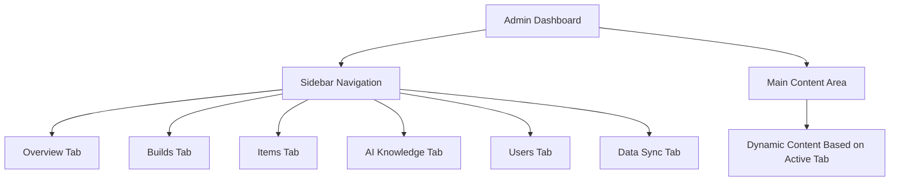
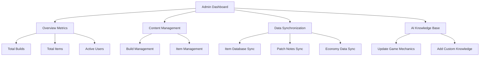
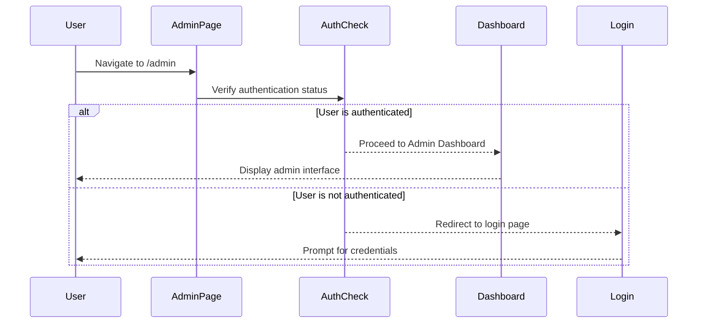

# Admin Dashboard Overview

<cite>
**Referenced Files in This Document**   
- [AdminDashboard.tsx](file://components/admin/AdminDashboard.tsx)
- [page.tsx](file://app/[locale]/admin/page.tsx)
- [sync.ts](file://lib/api/sync.ts)
- [middleware.ts](file://middleware.ts)
</cite>

## Table of Contents
1. [Introduction](#introduction)
2. [UI Layout and Navigation](#ui-layout-and-navigation)
3. [Core Functionalities](#core-functionalities)
4. [State Management and React Implementation](#state-management-and-react-implementation)
5. [Authentication and Security](#authentication-and-security)
6. [Integration with External Systems](#integration-with-external-systems)
7. [Visual Design and Styling](#visual-design-and-styling)

## Introduction

The Admin Dashboard serves as the central control panel for administrators of the Prometheus-Planner V2 platform. It provides comprehensive management capabilities for core platform content including builds, items, AI knowledge base, user data, and system synchronization processes. The interface is designed to offer both an overview of platform metrics and detailed control over content management, making it the primary tool for maintaining and updating the application's data ecosystem.

**Section sources**
- [AdminDashboard.tsx](file://components/admin/AdminDashboard.tsx#L1-L219)

## UI Layout and Navigation

The Admin Dashboard features a clean, two-column layout optimized for administrative workflows. The interface is divided into a fixed sidebar navigation and a dynamic main content area. The sidebar contains tab-based navigation with clearly labeled sections: Overview, Builds, Items, AI Knowledge, Users, and Data Sync. Each tab is represented with an icon and text label, providing intuitive access to different administrative functions.

The main content area dynamically updates based on the selected tab, displaying relevant information and controls. The layout uses a responsive grid system that adapts to different screen sizes, with the sidebar collapsing appropriately on smaller devices. The header section displays the "Admin Dashboard" title and a descriptive subtitle indicating the dashboard's purpose in managing platform content.

**Diagram sources**
- [AdminDashboard.tsx](file://components/admin/AdminDashboard.tsx#L34-L54)

**Section sources**
- [AdminDashboard.tsx](file://components/admin/AdminDashboard.tsx#L23-L54)

## Core Functionalities

The Admin Dashboard provides several key administrative functions organized into distinct sections. The Overview tab displays critical platform metrics including total builds (127), total items (2,458), and active users (8,923). These metrics provide administrators with immediate insight into the platform's content volume and user engagement.

The dashboard also features quick action buttons for common administrative tasks such as creating builds, importing items, syncing data, and updating AI knowledge. These actions streamline content management workflows and reduce the number of steps required to perform essential maintenance tasks.

The Data Sync section enables administrators to manually trigger synchronization processes for various data types including the item database, patch notes, and economy data from external sources like poe.ninja. Each sync process displays the timestamp of the last synchronization and the scheduled time for the next automatic sync.

The AI Knowledge section allows administrators to update the AI assistant's knowledge base with the latest game mechanics for Path of Exile 2 and Diablo IV, ensuring that the AI advisor provides accurate and up-to-date recommendations to users.

**Diagram sources**
- [AdminDashboard.tsx](file://components/admin/AdminDashboard.tsx#L59-L106)
- [AdminDashboard.tsx](file://components/admin/AdminDashboard.tsx#L143-L193)
- [AdminDashboard.tsx](file://components/admin/AdminDashboard.tsx#L195-L212)

**Section sources**
- [AdminDashboard.tsx](file://components/admin/AdminDashboard.tsx#L59-L212)

## State Management and React Implementation

The Admin Dashboard component is implemented as a React client component using the 'use client' directive. It employs React's useState hook to manage the active tab state, with the activeTab state variable controlling which content section is currently displayed. The state is typed using TypeScript to ensure type safety, with the activeTab restricted to specific string literals representing the available tabs.

The component uses a tabs array to define the navigation structure, with each tab containing an ID, label, and icon. This data-driven approach to navigation makes it easy to add or modify tabs without changing the rendering logic. The tab switching mechanism is implemented through onClick event handlers that update the activeTab state when a sidebar button is clicked.

The conditional rendering of content sections is achieved through JavaScript logical AND operators, where each tab's content is only rendered when its corresponding ID matches the activeTab state. This approach ensures that only the relevant content is included in the DOM, improving performance and reducing memory usage.

**Section sources**
- [AdminDashboard.tsx](file://components/admin/AdminDashboard.tsx#L11-L12)
- [AdminDashboard.tsx](file://components/admin/AdminDashboard.tsx#L13-L20)
- [AdminDashboard.tsx](file://components/admin/AdminDashboard.tsx#L37-L53)

## Authentication and Security

The Admin Dashboard is protected by an authentication mechanism implemented at the page level. The admin page route (app/[locale]/admin/page.tsx) contains commented code indicating the planned authentication check that will redirect unauthorized users to the login page. Although the authentication logic is currently commented out with a TODO note, the implementation pattern follows Next.js best practices using the redirect function from next/navigation.

The security model is designed to prevent unauthorized access by checking the user's authentication status before rendering the AdminDashboard component. In production, this check will verify whether the user has the necessary administrative privileges before granting access to the sensitive administrative functions.

The middleware configuration in middleware.ts handles internationalization routing but does not currently include authentication checks, indicating that authentication is intended to be handled at the page level rather than globally.

**Diagram sources**
- [page.tsx](file://app/[locale]/admin/page.tsx#L7-L11)
- [middleware.ts](file://middleware.ts#L1-L16)

**Section sources**
- [page.tsx](file://app/[locale]/admin/page.tsx#L4-L11)

## Integration with External Systems

The Admin Dashboard facilitates integration with multiple external systems through its data synchronization functionality. The sync.ts file in the lib/api directory defines the interface and implementation for various synchronization processes that connect to external APIs.

The system is designed to sync item data from game APIs, economy data from poe.ninja, and patch notes from official game sources. Each synchronization function follows a consistent pattern with error handling and result reporting. The sync configuration includes settings for enabling/disabling sync processes and defining sync intervals.

These integration points ensure that the platform's content remains current with the latest game updates and market conditions. The manual sync buttons in the dashboard provide administrators with immediate control over these processes, allowing them to refresh data on demand rather than waiting for scheduled automatic syncs.

**Section sources**
- [sync.ts](file://lib/api/sync.ts#L1-L99)
- [AdminDashboard.tsx](file://components/admin/AdminDashboard.tsx#L143-L193)

## Visual Design and Styling

The Admin Dashboard employs Tailwind CSS for styling, with a dark theme that provides high contrast and reduces eye strain during extended administrative sessions. The color scheme uses a dark background (#050506) with text in light gray tones, and accent colors in gold (#c5a059) for interactive elements and headings.

The typography combines serif fonts for headings with sans-serif for body text, creating a visual hierarchy that guides the user's attention. Spacing is carefully managed with consistent padding and margins, and the layout uses a maximum width of 1800px to ensure readability on large screens.

Interactive elements include hover effects that change border colors and background shades, providing visual feedback for user interactions. The active tab in the sidebar is highlighted with a gold background and black text, clearly indicating the current view. Icons from the lucide-react library enhance usability by providing visual cues for each navigation option.

**Section sources**
- [AdminDashboard.tsx](file://components/admin/AdminDashboard.tsx#L23-L219)