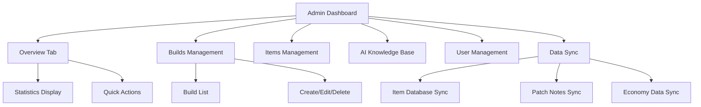
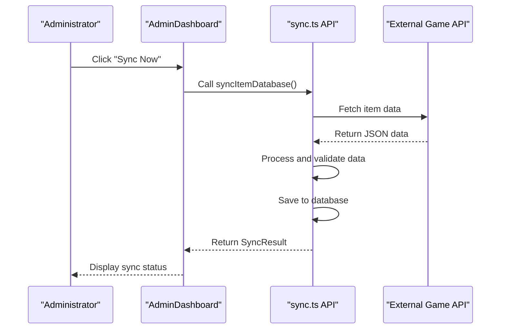
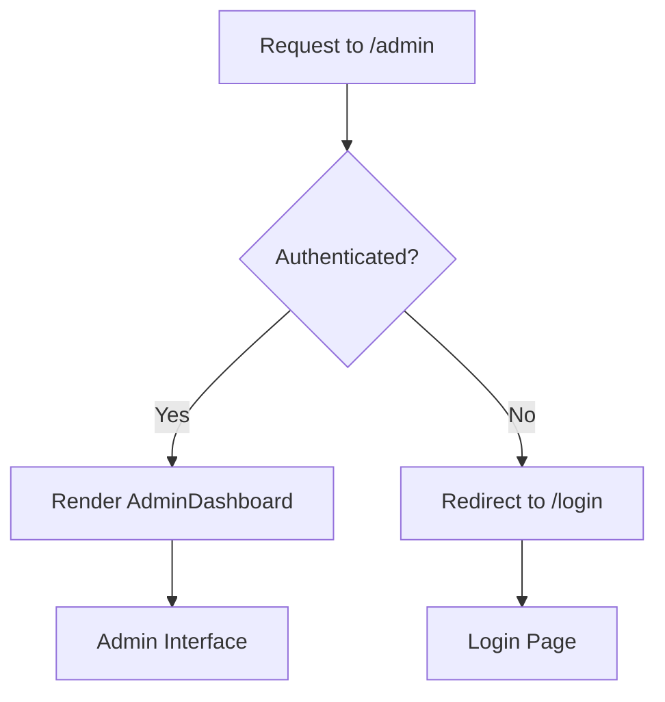
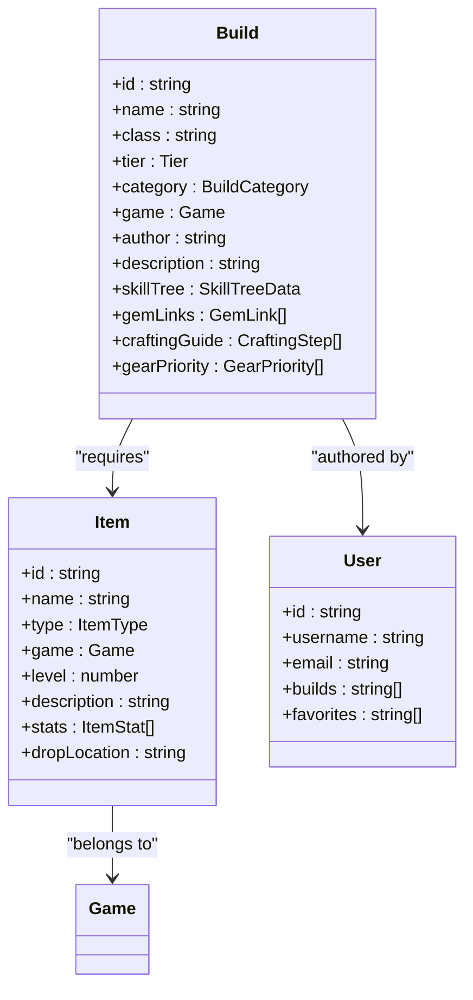

# Admin System

<cite>
**Referenced Files in This Document**   
- [AdminDashboard.tsx](file://components/admin/AdminDashboard.tsx)
- [sync.ts](file://lib/api/sync.ts)
- [page.tsx](file://app/[locale]/admin/page.tsx)
- [DEPLOYMENT_GUIDE.md](file://DEPLOYMENT_GUIDE.md)
- [IMPLEMENTATION_SUMMARY.md](file://IMPLEMENTATION_SUMMARY.md)
- [types/index.ts](file://types/index.ts)
- [middleware.ts](file://middleware.ts)
- [i18n.ts](file://i18n.ts)
</cite>

## Table of Contents
1. [Introduction](#introduction)
2. [Admin Dashboard Interface](#admin-dashboard-interface)
3. [Data Synchronization Controls](#data-synchronization-controls)
4. [User Management and Access Control](#user-management-and-access-control)
5. [Build and Item Management Workflows](#build-and-item-management-workflows)
6. [Security Considerations](#security-considerations)
7. [Deployment on Vercel](#deployment-on-vercel)
8. [Troubleshooting Guide](#troubleshooting-guide)
9. [System Integration](#system-integration)
10. [Backup and Recovery Procedures](#backup-and-recovery-procedures)

## Introduction
The Admin System in Prometheus-Planner V2 provides comprehensive administrative functionality for managing content, synchronizing data, and controlling platform operations. This document details the architecture, workflows, and operational considerations for the admin interface, focusing on content management for builds, items, and AI knowledge base, as well as data synchronization, user management, and security mechanisms.

**Section sources**
- [IMPLEMENTATION_SUMMARY.md](file://IMPLEMENTATION_SUMMARY.md#L39-L49)
- [DEPLOYMENT_GUIDE.md](file://DEPLOYMENT_GUIDE.md#L44-L58)

## Admin Dashboard Interface
The Admin Dashboard serves as the central interface for administrative operations, providing a tab-based navigation system for managing different aspects of the platform. The dashboard includes sections for overview statistics, build management, item database, AI knowledge base, user management, and data synchronization.

The interface is implemented as a client-side React component with a responsive layout that adapts to different screen sizes. It features a sidebar navigation with icons representing each functional area, including Builds, Items, AI Knowledge, Users, and Data Sync. The dashboard displays key metrics such as total builds, items, and active users on the overview tab, along with quick action buttons for common administrative tasks.

**Diagram sources**
- [AdminDashboard.tsx](file://components/admin/AdminDashboard.tsx#L10-L219)

**Section sources**
- [AdminDashboard.tsx](file://components/admin/AdminDashboard.tsx#L10-L219)

## Data Synchronization Controls
The data synchronization system enables administrators to update game data from external sources through the `lib/api/sync.ts` module. This system provides functions for synchronizing various types of data, including item databases, economy data, patch notes, and leaderboards from external APIs.

The synchronization functionality is exposed through the Admin Dashboard's "Data Sync" tab, which provides manual sync controls for different data categories. Each sync operation includes status information showing the last sync time and next scheduled sync. The system is designed to fetch data from official game APIs, community resources like poe.ninja, and other external sources to keep the platform's content up-to-date.

**Diagram sources**
- [sync.ts](file://lib/api/sync.ts#L17-L99)
- [AdminDashboard.tsx](file://components/admin/AdminDashboard.tsx#L143-L193)

**Section sources**
- [sync.ts](file://lib/api/sync.ts#L1-L99)
- [AdminDashboard.tsx](file://components/admin/AdminDashboard.tsx#L143-L193)

## User Management and Access Control
The admin system implements access control through route protection mechanisms, ensuring that only authorized users can access administrative functionality. The admin route at `/admin` is protected and will redirect unauthenticated users to the login page.

While the current implementation includes placeholder comments for authentication checks, the access control system is designed to verify user authentication status before granting access to the AdminDashboard component. The system will integrate with an authentication provider (likely NextAuth.js based on the implementation summary) to manage user sessions and permissions.

The user management interface within the Admin Dashboard provides controls for viewing and managing user accounts, though specific implementation details are not visible in the current codebase. The system is designed to support user role management, with administrative privileges restricted to authorized personnel.

**Diagram sources**
- [page.tsx](file://app/[locale]/admin/page.tsx#L1-L12)
- [middleware.ts](file://middleware.ts#L1-L16)

**Section sources**
- [page.tsx](file://app/[locale]/admin/page.tsx#L1-L12)
- [i18n.ts](file://i18n.ts#L1-L17)

## Build and Item Management Workflows
The Admin Dashboard provides comprehensive workflows for managing builds and items, which are core content types in the Prometheus-Planner V2 platform. The build management interface allows administrators to create, edit, and delete build entries, which represent character configurations for games like PoE 2 and Diablo IV.

The build management interface displays a list of existing builds with their names, tier ratings, categories, and associated games. Each build entry includes action buttons for viewing details, editing, and deleting. The system supports rich build data including skill trees, gem links, crafting guides, gear priorities, and leveling guides, as defined in the Build interface type.

Similarly, the item management system allows administrators to maintain the item database, which includes various item types such as Uniques, Legendaries, Rares, and Currency items. The system is designed to support item statistics, drop locations, and visual representations.

**Diagram sources**
- [types/index.ts](file://types/index.ts#L9-L136)
- [AdminDashboard.tsx](file://components/admin/AdminDashboard.tsx#L109-L141)

**Section sources**
- [types/index.ts](file://types/index.ts#L1-L136)
- [AdminDashboard.tsx](file://components/admin/AdminDashboard.tsx#L109-L141)

## Security Considerations
The admin system incorporates several security measures to protect against unauthorized access and ensure the integrity of administrative operations. The primary security mechanism is route protection, which prevents unauthenticated users from accessing the admin interface.

The system is designed to implement authentication checks in the admin page component, redirecting unauthorized users to the login page. While the current implementation includes TODO comments for adding authentication, the architecture is prepared for integration with a proper authentication system.

Additional security considerations include protecting API endpoints used for data synchronization and content management, ensuring that only authorized administrators can trigger data sync operations or modify content. The system should also implement audit logging to track administrative actions, though this functionality is not yet visible in the current codebase.

The deployment configuration on Vercel requires proper environment variable management, particularly for API keys and database credentials, to prevent exposure of sensitive information.

**Section sources**
- [page.tsx](file://app/[locale]/admin/page.tsx#L4-L9)
- [DEPLOYMENT_GUIDE.md](file://DEPLOYMENT_GUIDE.md#L15-L32)

## Deployment on Vercel
The admin functionality is deployed on Vercel with specific configuration requirements to ensure proper operation. The deployment process requires setting the output directory to `.next` in the Vercel project settings, which resolves build errors related to incorrect output paths.

Environment variables must be configured both locally and in the Vercel dashboard, including the `OPENAI_API_KEY` for AI functionality and `NEXT_PUBLIC_APP_URL` for application routing. These variables are essential for the proper functioning of the admin system, particularly for AI knowledge base updates and API integrations.

The application has been upgraded to Next.js 15.0.0 to address security vulnerabilities, ensuring that the admin interface runs on a secure foundation. The deployment process follows standard Next.js patterns with `npm run build` for production builds and `npm start` for running the application.

The admin system benefits from Vercel's global CDN and edge network, ensuring low-latency access for administrators worldwide. The deployment configuration supports the locale-based routing system, allowing administrators to access the interface in their preferred language (English or Arabic).

**Section sources**
- [DEPLOYMENT_GUIDE.md](file://DEPLOYMENT_GUIDE.md#L1-L152)
- [vercel.json](file://vercel.json)

## Troubleshooting Guide
This section provides guidance for resolving common issues with the admin system, particularly related to data synchronization and deployment.

### Sync Operations Failing
When data sync operations fail, administrators should:
1. Verify network connectivity between the server and external APIs
2. Check the status of external APIs (poe.ninja, game APIs)
3. Review API rate limits and usage quotas
4. Examine error messages in the sync result for specific failure details
5. Ensure proper API credentials are configured in environment variables

Common causes of sync failures include network timeouts, API changes, authentication issues, and rate limiting. The system should provide detailed error messages to assist in diagnosis.

### Data Import Issues
For problems with data import:
1. Validate the format of imported data against expected schemas
2. Check for required fields and data types
3. Verify file encoding and structure
4. Ensure sufficient server resources (memory, processing power)
5. Review logs for parsing or validation errors

### Authentication Problems
If administrators cannot access the admin interface:
1. Verify that environment variables are properly set
2. Check browser cookies and session storage
3. Clear browser cache and try incognito mode
4. Ensure the authentication service is running
5. Verify user has administrative privileges

### Deployment Issues
For Vercel deployment problems:
1. Confirm output directory is set to `.next`
2. Verify all environment variables are configured
3. Check Node.js version compatibility (18+ recommended)
4. Review build logs for errors
5. Ensure proper Git repository connection

**Section sources**
- [DEPLOYMENT_GUIDE.md](file://DEPLOYMENT_GUIDE.md#L129-L152)
- [sync.ts](file://lib/api/sync.ts#L10-L15)

## System Integration
The admin system integrates with various components of the Prometheus-Planner V2 application to ensure that administrative changes are reflected throughout the platform.

When new builds are created or existing ones are modified through the admin interface, these changes are propagated to the public database, making them available to all users. Updated tier ratings affect leaderboards by recalculating rankings based on the new meta assessments. Changes to item data are reflected in the item database, affecting build recommendations and gear suggestions.

The AI knowledge base updates initiated through the admin interface enhance the AI assistant's capabilities, allowing it to provide more accurate and up-to-date advice to users. Data synchronization operations ensure that the platform's content remains current with the latest game patches and economic conditions.

The integration between the admin system and the rest of the application is designed to be seamless, with changes taking effect immediately or after a brief processing period. This ensures that the platform remains responsive to changes in the game meta and community needs.

**Section sources**
- [IMPLEMENTATION_SUMMARY.md](file://IMPLEMENTATION_SUMMARY.md#L44-L48)
- [sync.ts](file://lib/api/sync.ts#L17-L99)

## Backup and Recovery Procedures
The admin system should implement comprehensive backup and recovery procedures to protect against data loss and ensure business continuity.

Regular automated backups should be performed for all administrative data, including:
- Build configurations and metadata
- Item database entries
- User accounts and permissions
- AI knowledge base content
- Audit logs and administrative actions

Backups should be stored in multiple locations, including off-site storage, with encryption for sensitive data. The system should support point-in-time recovery to allow restoration to a specific state before an error occurred.

Recovery procedures should be documented and tested regularly to ensure they work as expected. This includes:
- Full system restoration from backups
- Selective restoration of specific data types
- Verification of data integrity after recovery
- Testing of restored systems before returning to production

While specific backup implementation details are not visible in the current codebase, the system architecture should support these capabilities through database-level backup features and application-level export functionality.

**Section sources**
- [IMPLEMENTATION_SUMMARY.md](file://IMPLEMENTATION_SUMMARY.md#L156-L159)
- [DEPLOYMENT_GUIDE.md](file://DEPLOYMENT_GUIDE.md#L211-L213)