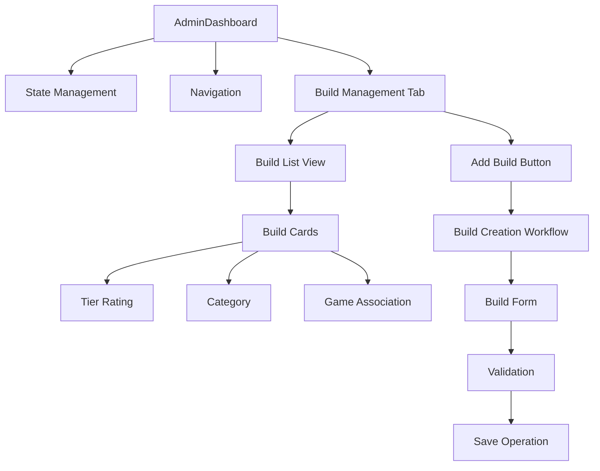
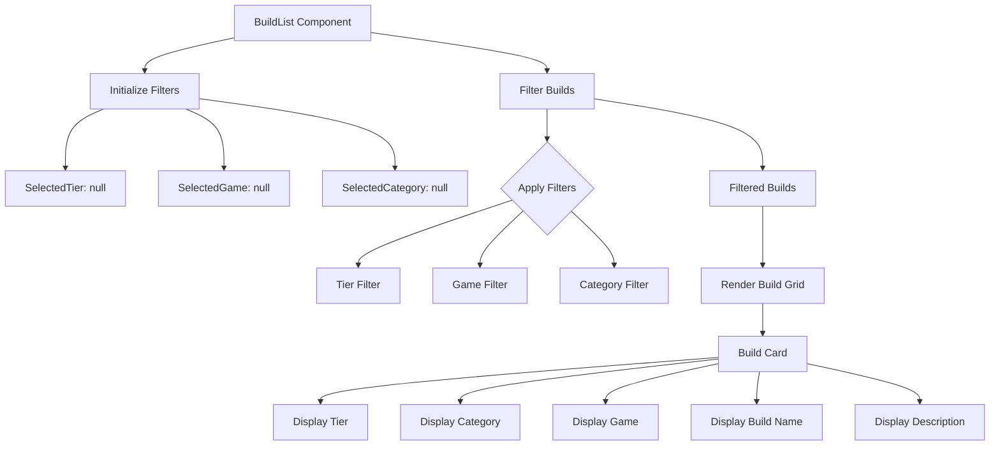
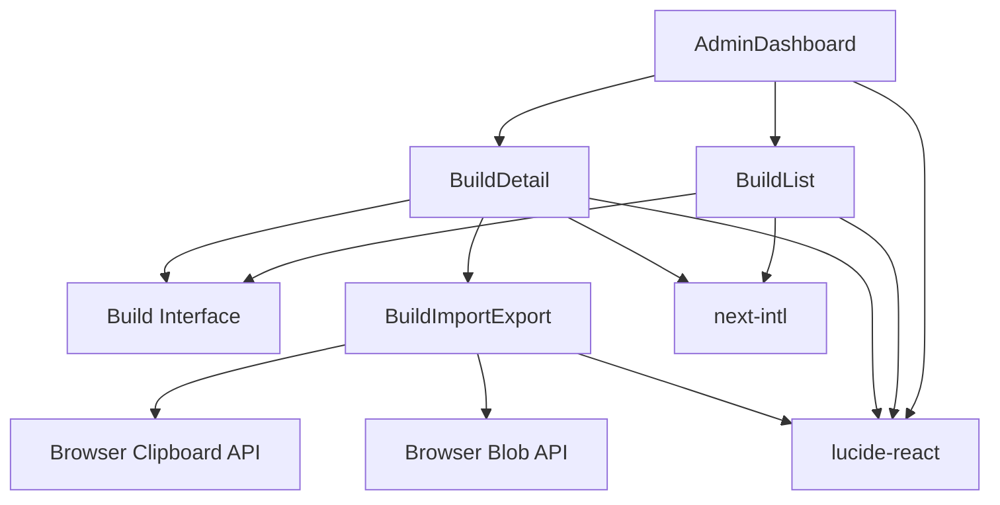

# Build Management

<cite>
**Referenced Files in This Document**   
- [AdminDashboard.tsx](file://components/admin/AdminDashboard.tsx)
- [BuildList.tsx](file://components/builds/BuildList.tsx)
- [BuildDetail.tsx](file://components/builds/BuildDetail.tsx)
- [BuildImportExport.tsx](file://components/builds/BuildImportExport.tsx)
- [index.ts](file://types/index.ts)
- [page.tsx](file://app/[locale]/admin/page.tsx)
- [DEPLOYMENT_GUIDE.md](file://DEPLOYMENT_GUIDE.md)
- [Leaderboards.tsx](file://components/leaderboards/Leaderboards.tsx)
- [route.ts](file://app/api/ai/analyze/route.ts)
</cite>

## Table of Contents
1. [Introduction](#introduction)
2. [Project Structure](#project-structure)
3. [Core Components](#core-components)
4. [Architecture Overview](#architecture-overview)
5. [Detailed Component Analysis](#detailed-component-analysis)
6. [Dependency Analysis](#dependency-analysis)
7. [Performance Considerations](#performance-considerations)
8. [Troubleshooting Guide](#troubleshooting-guide)
9. [Conclusion](#conclusion)

## Introduction
The Build Management system within the Admin Dashboard provides comprehensive tools for administrators to manage user-generated builds for Path of Exile 2 and Diablo IV. This documentation details the implementation of the 'Manage Builds' tab, including the list view of existing builds with their tier ratings, categories, and associated games. The system enables administrators to view, edit, and delete builds through an intuitive interface implemented in AdminDashboard.tsx. The 'Add Build' workflow integrates with the existing build creation system, allowing seamless addition of new builds to the platform. Published builds are automatically reflected in the public builds listing and affect leaderboards based on their performance metrics.

## Project Structure
The build management functionality is organized across several key directories within the application. The Admin Dashboard component resides in the components/admin directory, while build-specific components are located in components/builds. The application routes are structured with locale-based routing, where the admin interface is accessible through the [locale]/admin path. Build data models are defined in the types directory, providing a consistent interface for build-related operations throughout the application.

```mermaid
graph TB
subgraph "Components"
A[AdminDashboard.tsx]
B[BuildList.tsx]
C[BuildDetail.tsx]
D[BuildImportExport.tsx]
end
subgraph "Pages"
E[app/[locale]/admin/page.tsx]
F[app/[locale]/builds/page.tsx]
G[app/[locale]/builds/[id]/page.tsx]
end
subgraph "Types"
H[types/index.ts]
end
A --> E
B --> F
C --> G
H --> A
H --> B
H --> C
H --> D
```

**Diagram sources**
- [AdminDashboard.tsx](file://components/admin/AdminDashboard.tsx#L1-L219)
- [BuildList.tsx](file://components/builds/BuildList.tsx#L1-L265)
- [BuildDetail.tsx](file://components/builds/BuildDetail.tsx#L1-L224)
- [index.ts](file://types/index.ts#L1-L136)

**Section sources**
- [AdminDashboard.tsx](file://components/admin/AdminDashboard.tsx#L1-L219)
- [BuildList.tsx](file://components/builds/BuildList.tsx#L1-L265)

## Core Components
The build management system consists of several core components that work together to provide a comprehensive administration interface. The AdminDashboard component serves as the main container for the build management functionality, providing navigation between different administrative tasks. The BuildList component displays existing builds with their tier ratings, categories, and associated games, allowing administrators to quickly assess the build library. The BuildDetail component provides in-depth information about individual builds, including skill trees, gem links, and leveling guides. The BuildImportExport component enables administrators to import and export build configurations, facilitating content sharing and backup.

**Section sources**
- [AdminDashboard.tsx](file://components/admin/AdminDashboard.tsx#L1-L219)
- [BuildList.tsx](file://components/builds/BuildList.tsx#L1-L265)
- [BuildDetail.tsx](file://components/builds/BuildDetail.tsx#L1-L224)
- [BuildImportExport.tsx](file://components/builds/BuildImportExport.tsx#L1-L118)

## Architecture Overview
The build management architecture follows a component-based design pattern with clear separation of concerns. The AdminDashboard component manages the overall state and navigation, while specialized components handle specific aspects of build management. The system leverages React's useState hook for client-side state management, enabling dynamic interactions without requiring page reloads. Build data is structured according to the Build interface defined in types/index.ts, ensuring consistency across the application. The architecture supports both client-side rendering for interactive components and server-side rendering for static content, optimizing performance and SEO.



**Diagram sources**
- [AdminDashboard.tsx](file://components/admin/AdminDashboard.tsx#L1-L219)
- [BuildList.tsx](file://components/builds/BuildList.tsx#L1-L265)
- [index.ts](file://types/index.ts#L1-L136)

## Detailed Component Analysis

### Admin Dashboard Analysis
The AdminDashboard component implements the main interface for build management, featuring a sidebar navigation system that allows switching between different administrative functions. The activeTab state variable controls which section is currently displayed, with 'builds' representing the build management functionality. When the builds tab is active, the component renders a dedicated section for managing builds, including a list of existing builds and an 'Add Build' button for creating new ones.

```mermaid
classDiagram
class AdminDashboard {
+activeTab : 'overview' | 'builds' | 'items' | 'ai' | 'users' | 'sync'
+setActiveTab(tab : string) : void
+tabs : Array<{id : string, label : string, icon : React.Component}>
+render() : JSX.Element
}
AdminDashboard --> BuildList : "displays"
AdminDashboard --> BuildDetail : "navigates to"
```

**Diagram sources**
- [AdminDashboard.tsx](file://components/admin/AdminDashboard.tsx#L1-L219)

**Section sources**
- [AdminDashboard.tsx](file://components/admin/AdminDashboard.tsx#L1-L219)
- [page.tsx](file://app/[locale]/admin/page.tsx#L1-L12)

### Build List Analysis
The BuildList component displays a grid of build cards, each representing a specific build with its tier rating, category, and associated game. The component implements filtering functionality that allows administrators to filter builds by tier, category, or game. The tierColors object defines visual styling for different tier ratings, with S-Tier builds receiving a gold-to-orange gradient, A-Tier builds receiving a green-to-emerald gradient, and so on. The component uses the mockBuilds array as sample data, which will be replaced with real data from an API or database in production.



**Diagram sources**
- [BuildList.tsx](file://components/builds/BuildList.tsx#L1-L265)

**Section sources**
- [BuildList.tsx](file://components/builds/BuildList.tsx#L1-L265)
- [index.ts](file://types/index.ts#L1-L136)

### Build Detail Analysis
The BuildDetail component provides a comprehensive view of individual builds, including detailed information about the build's configuration, skill tree, gem links, and leveling guide. The component implements a tabbed interface that allows administrators to navigate between different aspects of the build. The build data is structured according to the Build interface, which includes properties such as name, class, tier, category, game, author, and various build-specific details like skillTree, gemLinks, and craftingGuide.

```mermaid
classDiagram
class Build {
+id : string
+name : string
+class : string
+tier : Tier
+category : BuildCategory
+game : Game
+author : string
+authorId : string
+views : number
+upvotes : number
+downvotes : number
+comments : number
+lastUpdated : string
+description : string
+fullDescription? : string
+skillTree? : SkillTreeData
+gemLinks? : GemLink[]
+craftingGuide? : CraftingStep[]
+gearPriority? : GearPriority[]
+gameplayVideo? : string
+levelingGuide? : LevelingStep[]
+tags : string[]
+buildCode? : string
+seoMeta? : SEOMeta
}
class SkillTreeData {
+nodes : SkillNode[]
+connections : SkillConnection[]
+zoom? : number
+pan? : {x : number, y : number}
}
class SkillNode {
+id : string
+name : string
+description : string
+x : number
+y : number
+type : 'small' | 'notable' | 'keystone' | 'start'
+stats? : string[]
+imageUrl? : string
}
class SkillConnection {
+from : string
+to : string
}
Build --> SkillTreeData : "contains"
SkillTreeData --> SkillNode : "contains"
SkillTreeData --> SkillConnection : "contains"
```

**Diagram sources**
- [BuildDetail.tsx](file://components/builds/BuildDetail.tsx#L1-L224)
- [index.ts](file://types/index.ts#L1-L136)

**Section sources**
- [BuildDetail.tsx](file://components/builds/BuildDetail.tsx#L1-L224)
- [index.ts](file://types/index.ts#L1-L136)

## Dependency Analysis
The build management system has several key dependencies that enable its functionality. The AdminDashboard component depends on the BuildList and BuildDetail components for displaying build information. The BuildList component relies on the Build interface defined in types/index.ts for data structure consistency. The BuildImportExport component depends on browser APIs for clipboard operations and file downloads. The system also depends on external libraries such as lucide-react for icons and next-intl for internationalization.



**Diagram sources**
- [AdminDashboard.tsx](file://components/admin/AdminDashboard.tsx#L1-L219)
- [BuildList.tsx](file://components/builds/BuildList.tsx#L1-L265)
- [BuildDetail.tsx](file://components/builds/BuildDetail.tsx#L1-L224)
- [BuildImportExport.tsx](file://components/builds/BuildImportExport.tsx#L1-L118)
- [index.ts](file://types/index.ts#L1-L136)

**Section sources**
- [AdminDashboard.tsx](file://components/admin/AdminDashboard.tsx#L1-L219)
- [BuildList.tsx](file://components/builds/BuildList.tsx#L1-L265)
- [BuildDetail.tsx](file://components/builds/BuildDetail.tsx#L1-L224)
- [BuildImportExport.tsx](file://components/builds/BuildImportExport.tsx#L1-L118)

## Performance Considerations
The build management system is designed with performance in mind, following the architecture support guidelines outlined in DEPLOYMENT_GUIDE.md. The system targets a PageSpeed score of 90+ and a Lighthouse performance score of 90+, with a first contentful paint time under 1.8 seconds and time to interactive under 3.8 seconds. The component-based architecture enables code splitting and lazy loading, reducing initial load times. The use of client-side state management minimizes server requests for interactive operations. The system also implements efficient data filtering and rendering to handle large numbers of builds without performance degradation.

## Troubleshooting Guide
Common issues in the build management system include form validation errors and failed save operations. Form validation errors typically occur when required fields are missing or when data types don't match the expected format. These can be resolved by ensuring all required fields are filled and that data types match the Build interface definition. Failed save operations may result from network issues or server-side validation errors. To resolve these, administrators should check their internet connection and verify that all build data meets the required criteria. Data consistency issues can occur when modifying build attributes that impact tier ratings or game balance. To maintain data consistency, administrators should carefully consider the implications of changes to tier ratings, categories, or game associations, and update related build properties accordingly.

**Section sources**
- [AdminDashboard.tsx](file://components/admin/AdminDashboard.tsx#L1-L219)
- [BuildList.tsx](file://components/builds/BuildList.tsx#L1-L265)
- [BuildDetail.tsx](file://components/builds/BuildDetail.tsx#L1-L224)
- [DEPLOYMENT_GUIDE.md](file://DEPLOYMENT_GUIDE.md#L89-L123)

## Conclusion
The build management functionality within the Admin Dashboard provides a comprehensive interface for administrators to manage builds for Path of Exile 2 and Diablo IV. The system features a well-organized component structure, clear data models, and intuitive user interfaces for viewing, editing, and deleting builds. The 'Add Build' workflow integrates seamlessly with the existing build creation system, and published builds are automatically reflected in public listings and leaderboards. By following the guidelines outlined in this documentation, administrators can effectively manage the build library while maintaining data consistency and system performance.