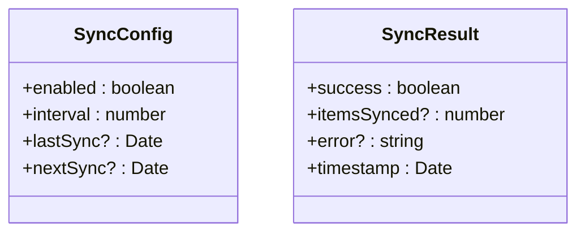
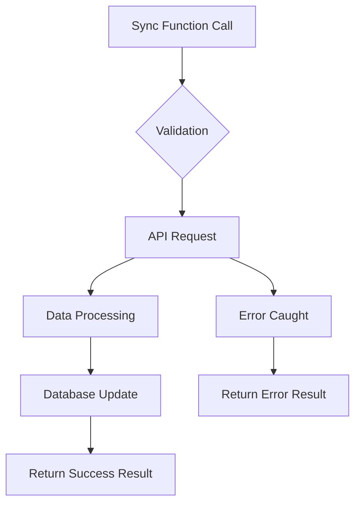
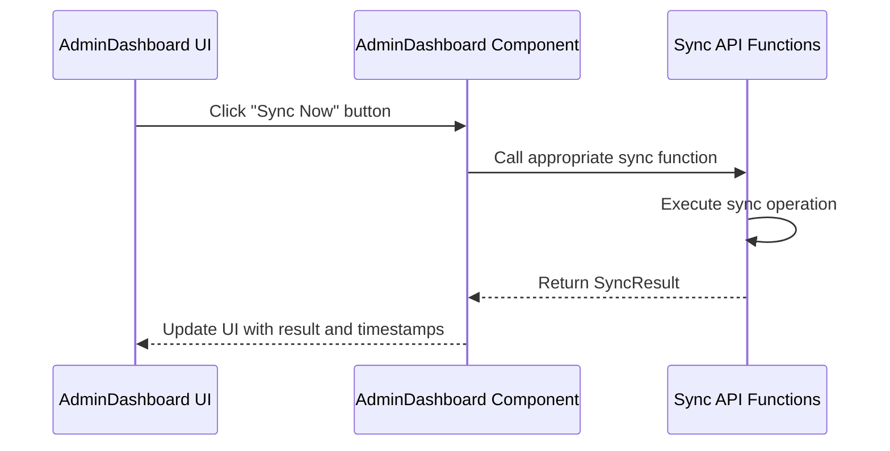
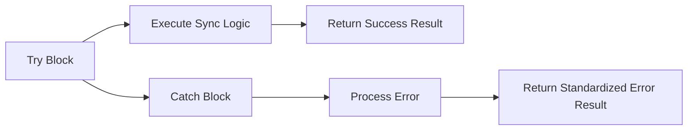

# Data Synchronization

<cite>
**Referenced Files in This Document**   
- [sync.ts](file://lib/api/sync.ts)
- [AdminDashboard.tsx](file://components/admin/AdminDashboard.tsx)
- [types/index.ts](file://types/index.ts)
- [route.ts](file://app/api/ai/analyze/route.ts)
</cite>

## Table of Contents
1. [Introduction](#introduction)
2. [Core Data Structures](#core-data-structures)
3. [Sync Functions Implementation](#sync-functions-implementation)
4. [UI Integration](#ui-integration)
5. [Error Handling Patterns](#error-handling-patterns)
6. [Performance Considerations](#performance-considerations)
7. [Troubleshooting Guide](#troubleshooting-guide)

## Introduction
The data synchronization system in Prometheus-Planner V2 enables automated updates of critical game data including item databases, economy data, patch notes, and leaderboards. This system is accessible through the Data Sync tab in the Admin Dashboard and provides administrators with controls to manually trigger sync operations or monitor scheduled automatic syncs. The implementation follows a consistent pattern across all sync functions, using standardized interfaces for configuration and result reporting.

## Core Data Structures

The synchronization system is built around two primary TypeScript interfaces defined in `lib/api/sync.ts` that standardize the configuration and output of all sync operations.



**Diagram sources**
- [sync.ts](file://lib/api/sync.ts#L3-L15)

**Section sources**
- [sync.ts](file://lib/api/sync.ts#L3-L15)

### SyncConfig Interface
The `SyncConfig` interface defines the configuration parameters for synchronization operations:
- **enabled**: boolean flag indicating whether the sync process is active
- **interval**: number representing the sync frequency in minutes
- **lastSync**: optional Date indicating when the last successful sync occurred
- **nextSync**: optional Date indicating when the next sync is scheduled

### SyncResult Interface
The `SyncResult` interface standardizes the response format for all sync operations:
- **success**: boolean indicating whether the sync completed successfully
- **itemsSynced**: optional number indicating how many items were processed (used where applicable)
- **error**: optional string containing error details if the sync failed
- **timestamp**: Date indicating when the sync operation completed

## Sync Functions Implementation

The system implements four specialized sync functions for different data types, all following the same async/await pattern with try-catch error handling.



**Diagram sources**
- [sync.ts](file://lib/api/sync.ts#L18-L98)

**Section sources**
- [sync.ts](file://lib/api/sync.ts#L18-L98)

### syncItemDatabase Function
This function synchronizes the item database for specified games:
- **Parameters**: `game: 'PoE 2' | 'Diablo IV'`
- **Return Type**: `Promise<SyncResult>`
- **Special Feature**: Includes `itemsSynced` count in the result
- **Implementation Status**: Currently contains TODO comments indicating planned integration with game APIs

### syncEconomyData Function
Handles synchronization of economy data from external sources:
- **Parameters**: None
- **Return Type**: `Promise<SyncResult>`
- **Target Source**: poe.ninja API (as indicated in comments)
- **Implementation Status**: Placeholder implementation with planned fetch call to poe.ninja

### syncPatchNotes Function
Responsible for updating patch notes content:
- **Parameters**: `game: 'PoE 2' | 'Diablo IV'`
- **Return Type**: `Promise<SyncResult>`
- **Planned Features**: Fetch from official sources and translation capabilities
- **Implementation Status**: Basic structure in place with TODO comments for feature implementation

### syncLeaderboards Function
Manages leaderboard data synchronization:
- **Parameters**: `game: 'PoE 2' | 'Diablo IV'`
- **Return Type**: `Promise<SyncResult>`
- **Planned Features**: Fetch leaderboard data, update player rankings, extract build information
- **Implementation Status**: Framework implemented with TODO comments for actual data fetching

## UI Integration

The Admin Dashboard provides a user interface for managing and monitoring sync operations, creating a direct relationship between frontend controls and backend functions.



**Diagram sources**
- [AdminDashboard.tsx](file://components/admin/AdminDashboard.tsx#L144-L190)
- [sync.ts](file://lib/api/sync.ts#L18-L98)

**Section sources**
- [AdminDashboard.tsx](file://components/admin/AdminDashboard.tsx#L144-L190)

The Data Sync tab in the Admin Dashboard displays three primary sync operations:
- **Item Database Sync**: Shows last sync 2 hours ago, next sync in 6 hours
- **Patch Notes Sync**: Shows last sync 1 day ago, next sync in 12 hours
- **Economy Data Sync**: Shows last sync 30 minutes ago, next sync in 30 minutes

Each section includes a "Sync Now" button that would trigger the corresponding backend function and display real-time status updates.

## Error Handling Patterns

All sync functions implement a consistent error handling strategy using try-catch blocks to ensure graceful failure and meaningful error reporting.



**Diagram sources**
- [sync.ts](file://lib/api/sync.ts#L21-L37)

**Section sources**
- [sync.ts](file://lib/api/sync.ts#L21-L37)

Key aspects of the error handling implementation:
- **Standardized Error Format**: All errors are returned through the `SyncResult` interface with the `error` field populated
- **Error Type Checking**: Uses `error instanceof Error` to safely extract error messages
- **Fallback Message**: Provides 'Unknown error' message if the error object doesn't have a message property
- **Timestamp Tracking**: Includes timestamp in both success and error results for debugging and monitoring

The pattern follows this structure:
```typescript
try {
  // Sync logic here
  return { success: true, /* other fields */ timestamp: new Date() };
} catch (error) {
  return { 
    success: false, 
    error: error instanceof Error ? error.message : 'Unknown error',
    timestamp: new Date() 
  };
}
```

## Performance Considerations

The synchronization system incorporates several performance considerations to balance data freshness with system efficiency.

### Sync Intervals and Scheduling
The system uses different sync intervals based on data volatility:
- **Economy Data**: Syncs every 30 minutes (high volatility, market changes)
- **Item Database**: Syncs every 6 hours (moderate volatility, game updates)
- **Patch Notes**: Syncs every 12 hours (low volatility, infrequent updates)

These intervals are managed through the `interval` property in the `SyncConfig` interface, allowing administrators to adjust frequencies based on their needs.

### Incremental vs Full Updates
While the current implementation appears to use full refreshes (as indicated by TODO comments), the system design allows for both update strategies:
- **Full Refreshes**: Suitable for comprehensive updates when game patches occur
- **Incremental Updates**: More efficient for regular syncs, only updating changed records

The absence of specific parameters for incremental syncs in the current function signatures suggests the system may currently favor full refreshes, but could be extended to support delta updates.

### API Rate Limiting Considerations
The system design accounts for external API limitations:
- The staggered sync schedule prevents simultaneous requests to external APIs
- Error handling includes provisions for API-specific errors
- The modular function design allows for implementing retry logic with exponential backoff

## Troubleshooting Guide

This section provides guidance for diagnosing and resolving common sync issues that may occur in the Prometheus-Planner V2 system.

**Section sources**
- [sync.ts](file://lib/api/sync.ts#L21-L98)
- [AdminDashboard.tsx](file://components/admin/AdminDashboard.tsx#L144-L190)

### API Rate Limiting
**Symptoms**: Sync failures with error messages containing "rate limit" or HTTP 429 status codes
**Solutions**:
- Implement exponential backoff retry logic in sync functions
- Adjust sync intervals to stay within API rate limits
- Cache responses to reduce redundant API calls
- Implement request queuing to prevent burst requests

### Network Timeouts
**Symptoms**: Sync operations failing with timeout errors or no response
**Solutions**:
- Add timeout configuration to fetch calls with reasonable defaults (e.g., 30 seconds)
- Implement retry mechanisms for transient network issues
- Add network status monitoring to prevent sync attempts during outages
- Use progressive timeout values based on data size

### Data Parsing Errors
**Symptoms**: Sync succeeds but data appears incomplete or incorrectly formatted
**Solutions**:
- Implement robust data validation before database insertion
- Add schema validation for API responses
- Include data transformation error handling
- Implement fallback mechanisms for malformed data
- Add comprehensive logging for parsing operations

### General Troubleshooting Steps
1. **Check Error Messages**: Examine the `error` field in `SyncResult` for specific details
2. **Verify Timestamps**: Confirm sync operations are occurring at expected intervals
3. **Review API Status**: Check the status of external APIs (poe.ninja, game APIs)
4. **Monitor Network**: Ensure stable connectivity between the application and data sources
5. **Check Configuration**: Verify `SyncConfig` settings are appropriate for current conditions