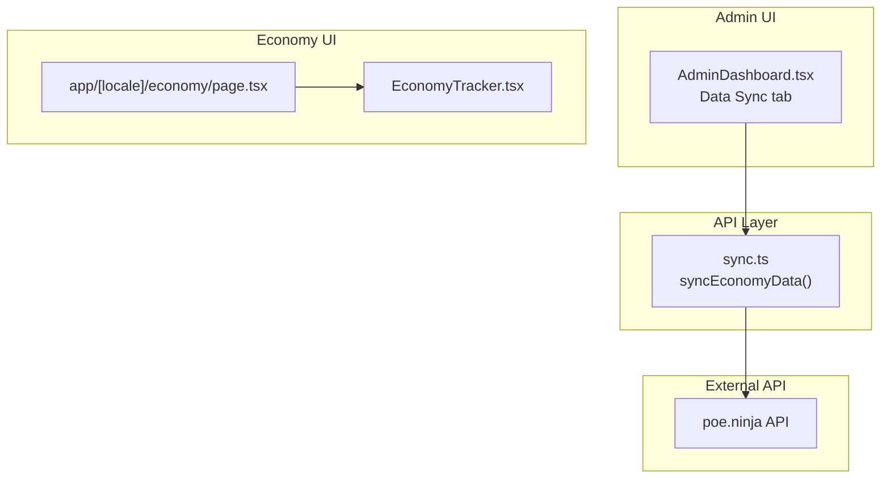
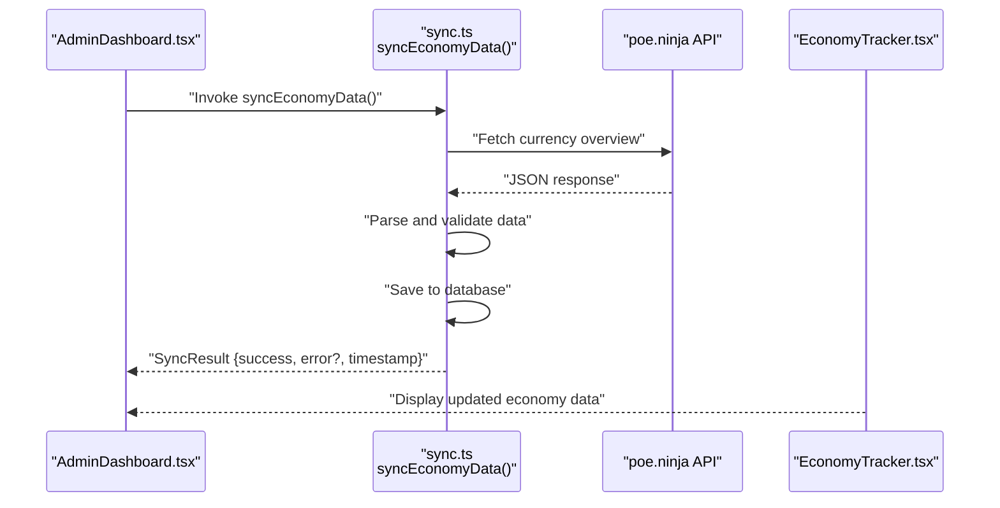
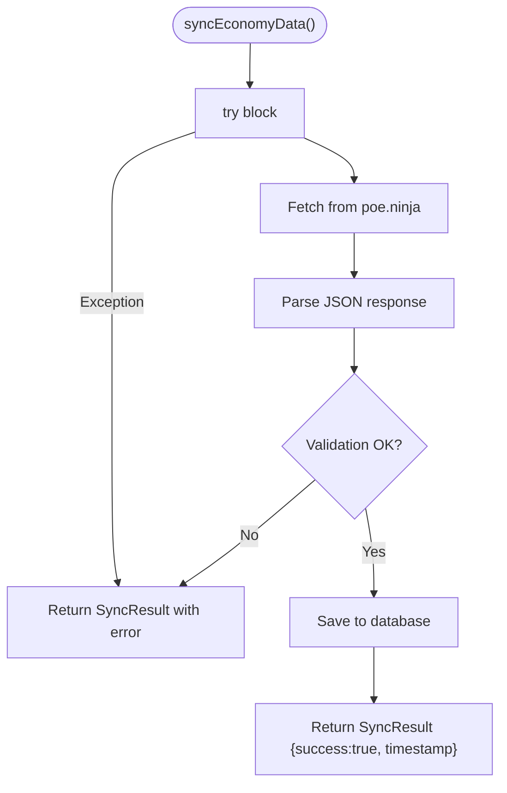
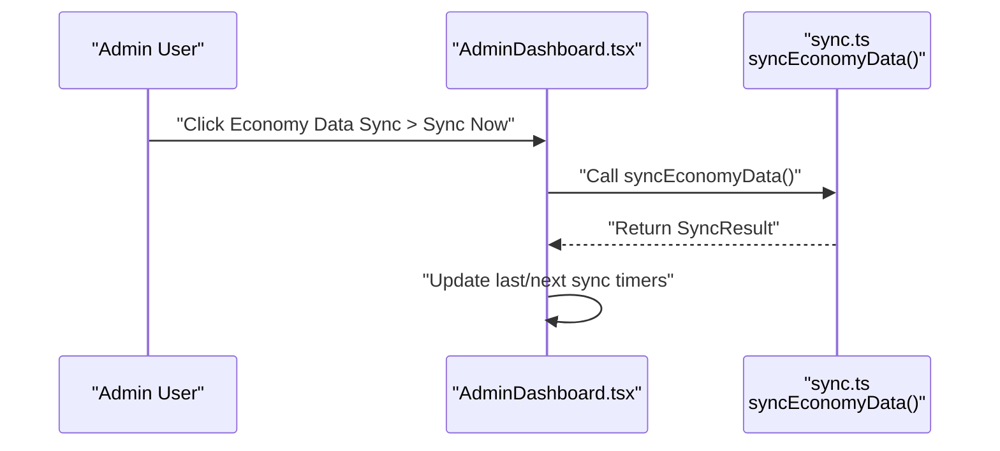
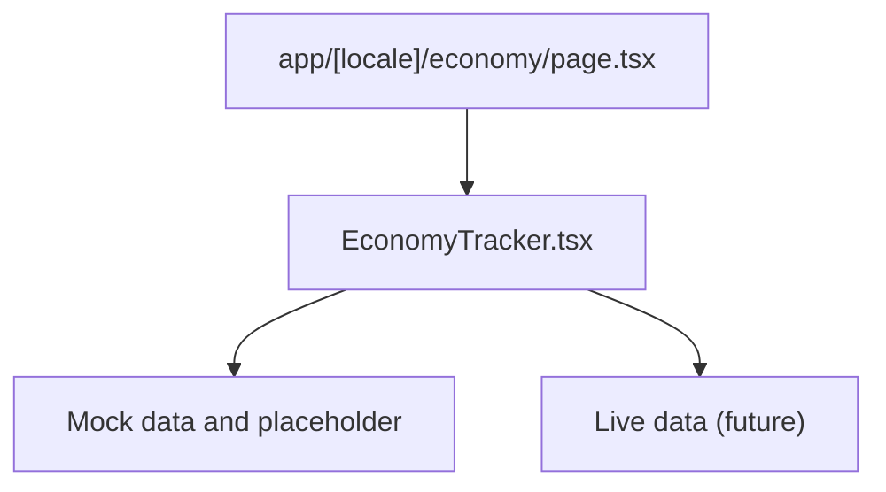
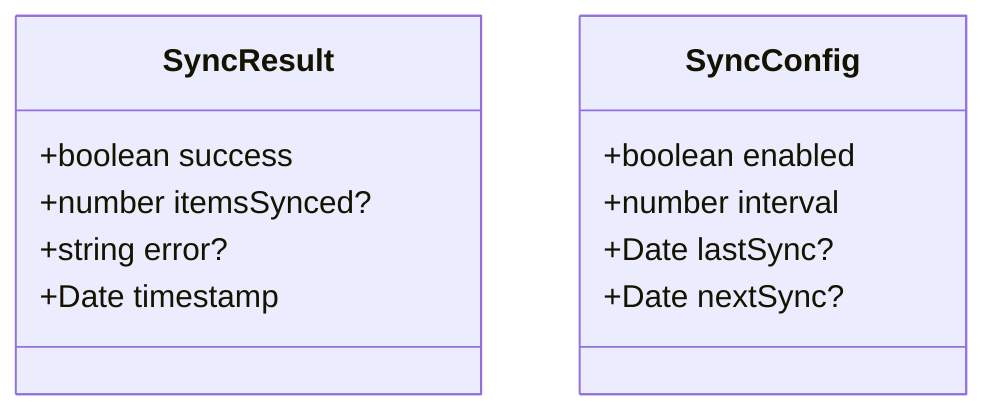
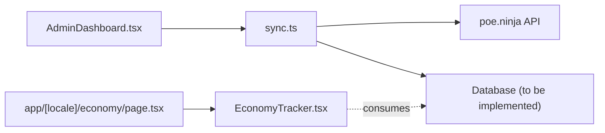

# Economy Data Synchronization

<cite>
**Referenced Files in This Document**
- [sync.ts](file://lib/api/sync.ts)
- [AdminDashboard.tsx](file://components/admin/AdminDashboard.tsx)
- [EconomyTracker.tsx](file://components/economy/EconomyTracker.tsx)
- [page.tsx](file://app/[locale]/economy/page.tsx)
- [IMPLEMENTATION_SUMMARY.md](file://IMPLEMENTATION_SUMMARY.md)
- [route.ts](file://app/api/ai/analyze/route.ts)
</cite>

## Table of Contents
1. [Introduction](#introduction)
2. [Project Structure](#project-structure)
3. [Core Components](#core-components)
4. [Architecture Overview](#architecture-overview)
5. [Detailed Component Analysis](#detailed-component-analysis)
6. [Dependency Analysis](#dependency-analysis)
7. [Performance Considerations](#performance-considerations)
8. [Troubleshooting Guide](#troubleshooting-guide)
9. [Conclusion](#conclusion)

## Introduction
This document explains the economy data synchronization feature in Prometheus-Planner V2 with a focus on the syncEconomyData function located in lib/api/sync.ts. The function is designed to integrate with poe.ninja to retrieve real-time currency and item pricing data. It follows a zero-parameter signature and returns a Promise<SyncResult>, encapsulating success status, optional error messages, and a timestamped response. The document also covers the intended fetch-and-save workflow, error handling via try-catch, and how this function is intended to be invoked from the Admin Dashboard’s Data Sync tab. Finally, it addresses potential issues such as API rate limits, network timeouts, and JSON parsing errors, along with performance considerations and recommended solutions.

## Project Structure
The economy synchronization feature spans several parts of the codebase:
- The sync function definition resides in lib/api/sync.ts.
- The Admin Dashboard UI exposes a “Data Sync” tab with an “Economy Data Sync” section and a “Sync Now” button.
- The Economy Tracker UI currently displays mock data and indicates future integration with poe.ninja.
- The Economy page imports the EconomyTracker component.
- The implementation summary outlines the planned integration with poe.ninja and environment configuration.

**Diagram sources**
- [AdminDashboard.tsx](file://components/admin/AdminDashboard.tsx#L143-L193)
- [sync.ts](file://lib/api/sync.ts#L40-L58)
- [EconomyTracker.tsx](file://components/economy/EconomyTracker.tsx#L1-L56)
- [page.tsx](file://app/[locale]/economy/page.tsx#L1-L19)

**Section sources**
- [AdminDashboard.tsx](file://components/admin/AdminDashboard.tsx#L143-L193)
- [sync.ts](file://lib/api/sync.ts#L40-L58)
- [EconomyTracker.tsx](file://components/economy/EconomyTracker.tsx#L1-L56)
- [page.tsx](file://app/[locale]/economy/page.tsx#L1-L19)

## Core Components
- syncEconomyData: Zero-parameter async function returning Promise<SyncResult>. It includes a try-catch block and returns a standardized SyncResult with success, timestamp, and optional error.
- SyncResult: Interface with success, optional itemsSynced, optional error, and timestamp.
- SyncConfig: Interface for scheduling and tracking sync intervals and timestamps.
- EconomyTracker: Client-side component that currently renders mock economy data and indicates future integration with poe.ninja.
- Economy Page: Imports and renders EconomyTracker.
- Admin Dashboard: Provides a “Data Sync” tab with an “Economy Data Sync” section and a “Sync Now” button.

Key implementation notes:
- The function signature is intentionally zero-parameter to simplify invocation from UI controls and scheduled tasks.
- The return type SyncResult ensures consistent reporting across all sync functions.
- The function body contains commented fetch and save placeholders indicating the intended workflow.

**Section sources**
- [sync.ts](file://lib/api/sync.ts#L10-L15)
- [sync.ts](file://lib/api/sync.ts#L40-L58)
- [EconomyTracker.tsx](file://components/economy/EconomyTracker.tsx#L1-L56)
- [page.tsx](file://app/[locale]/economy/page.tsx#L1-L19)
- [AdminDashboard.tsx](file://components/admin/AdminDashboard.tsx#L143-L193)

## Architecture Overview
The economy synchronization architecture consists of:
- UI triggers: Admin Dashboard’s “Economy Data Sync” section with a “Sync Now” button.
- API layer: syncEconomyData function orchestrating the fetch-and-save workflow.
- External service: poe.ninja API providing currency and item pricing data.
- UI consumption: Economy page rendering live economy data once integrated.

**Diagram sources**
- [AdminDashboard.tsx](file://components/admin/AdminDashboard.tsx#L177-L190)
- [sync.ts](file://lib/api/sync.ts#L40-L58)
- [EconomyTracker.tsx](file://components/economy/EconomyTracker.tsx#L1-L56)

## Detailed Component Analysis

### syncEconomyData Function
- Purpose: Integrate with poe.ninja to retrieve real-time economy data and persist it.
- Signature: async function syncEconomyData(): Promise<SyncResult>
- Workflow:
  - Attempt to fetch data from poe.ninja.
  - Parse and validate the response.
  - Persist the data to the database.
  - Return a standardized SyncResult with success and timestamp.
- Error Handling: try-catch around the entire workflow; on failure, return SyncResult with success=false and error message.
- Timestamped Response: Always includes a timestamp for auditability and scheduling.

**Diagram sources**
- [sync.ts](file://lib/api/sync.ts#L40-L58)

**Section sources**
- [sync.ts](file://lib/api/sync.ts#L40-L58)

### Admin Dashboard Integration
- The “Data Sync” tab includes an “Economy Data Sync” section with a “Sync Now” button.
- The section description indicates syncing prices from poe.ninja.
- The UI shows last synced and next sync timing placeholders, reflecting the intended scheduling behavior.

**Diagram sources**
- [AdminDashboard.tsx](file://components/admin/AdminDashboard.tsx#L177-L190)
- [sync.ts](file://lib/api/sync.ts#L40-L58)

**Section sources**
- [AdminDashboard.tsx](file://components/admin/AdminDashboard.tsx#L177-L190)

### Economy UI and Future Integration
- The Economy page imports EconomyTracker, which currently renders mock currency data and a placeholder indicating future integration with poe.ninja.
- Once the backend sync is implemented, EconomyTracker will consume real economy data.

**Diagram sources**
- [page.tsx](file://app/[locale]/economy/page.tsx#L1-L19)
- [EconomyTracker.tsx](file://components/economy/EconomyTracker.tsx#L1-L56)

**Section sources**
- [page.tsx](file://app/[locale]/economy/page.tsx#L1-L19)
- [EconomyTracker.tsx](file://components/economy/EconomyTracker.tsx#L1-L56)

### Supporting Types and Interfaces
- SyncResult: Standardized shape for sync outcomes.
- SyncConfig: Defines scheduling fields (enabled, interval, lastSync, nextSync).

**Diagram sources**
- [sync.ts](file://lib/api/sync.ts#L10-L15)
- [sync.ts](file://lib/api/sync.ts#L3-L8)

**Section sources**
- [sync.ts](file://lib/api/sync.ts#L10-L15)
- [sync.ts](file://lib/api/sync.ts#L3-L8)

## Dependency Analysis
- syncEconomyData depends on:
  - poe.ninja API for data.
  - A database layer for persistence (placeholder in comments).
- AdminDashboard depends on:
  - The presence of a sync endpoint or client-side function to trigger syncEconomyData.
- EconomyTracker depends on:
  - Real economy data from the backend once implemented.

**Diagram sources**
- [AdminDashboard.tsx](file://components/admin/AdminDashboard.tsx#L143-L193)
- [sync.ts](file://lib/api/sync.ts#L40-L58)
- [page.tsx](file://app/[locale]/economy/page.tsx#L1-L19)
- [EconomyTracker.tsx](file://components/economy/EconomyTracker.tsx#L1-L56)

**Section sources**
- [AdminDashboard.tsx](file://components/admin/AdminDashboard.tsx#L143-L193)
- [sync.ts](file://lib/api/sync.ts#L40-L58)
- [page.tsx](file://app/[locale]/economy/page.tsx#L1-L19)
- [EconomyTracker.tsx](file://components/economy/EconomyTracker.tsx#L1-L56)

## Performance Considerations
- Sync Frequency:
  - Use SyncConfig.interval to schedule periodic syncs. Typical values could be 15–60 minutes depending on poe.ninja rate limits and data volatility.
  - Track lastSync and nextSync to prevent redundant runs.
- Data Freshness:
  - Ensure the UI reflects the latest timestamp from SyncResult to inform users about data staleness.
  - Consider caching responses locally to reduce repeated network calls during short intervals.
- Impact on User Experience:
  - Run syncs asynchronously to avoid blocking UI.
  - Provide progress feedback in the Admin Dashboard while a sync is in progress.
  - Batch updates to minimize UI re-renders.

[No sources needed since this section provides general guidance]

## Troubleshooting Guide
Common issues and recommended solutions:
- API Rate Limits:
  - Implement exponential backoff and retry logic when encountering rate-limit responses.
  - Respect any Retry-After headers returned by poe.ninja.
  - Reduce sync frequency or stagger multiple sync jobs.
- Network Timeouts:
  - Set reasonable fetch timeouts (e.g., 10–30 seconds) and handle AbortSignal.
  - Fail gracefully with SyncResult.success=false and a descriptive error message.
- JSON Parsing Errors:
  - Validate response content-type and handle malformed JSON.
  - Log raw responses for debugging and surface user-friendly messages.
- Backend Persistence:
  - Ensure database writes are idempotent and handle conflicts (e.g., upsert).
  - Validate data shapes before saving to prevent partial writes.
- UI Feedback:
  - Display SyncResult.timestamp and error messages in the Admin Dashboard.
  - Show last/next sync timers to indicate health and freshness.

**Section sources**
- [sync.ts](file://lib/api/sync.ts#L40-L58)

## Conclusion
The economy data synchronization feature is centered around syncEconomyData, a zero-parameter async function returning a standardized SyncResult. The Admin Dashboard’s Data Sync tab provides the user-facing trigger, while the Economy page and EconomyTracker form the consumption layer. The implementation summary confirms the planned integration with poe.ninja and highlights environment configuration for external APIs. By following the outlined error handling strategies, performance recommendations, and integration patterns, the team can deliver reliable, timely, and user-friendly economy tracking.