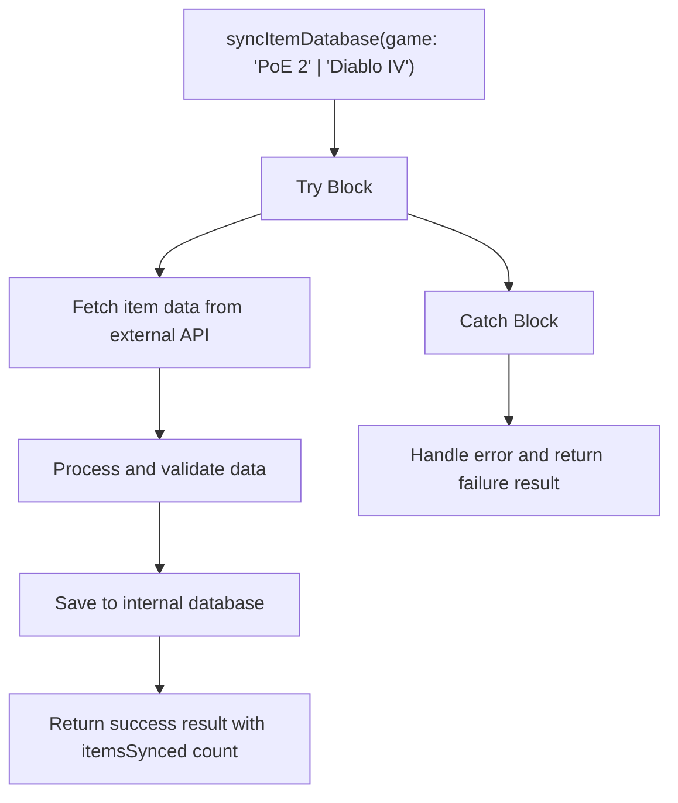
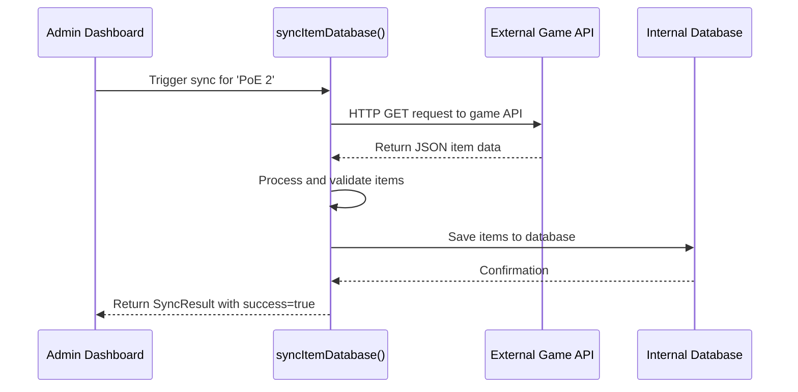
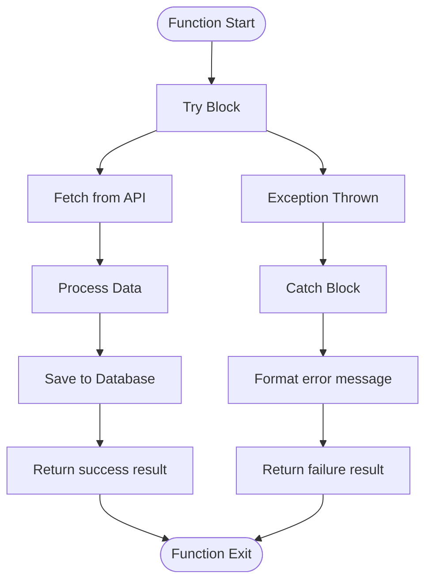
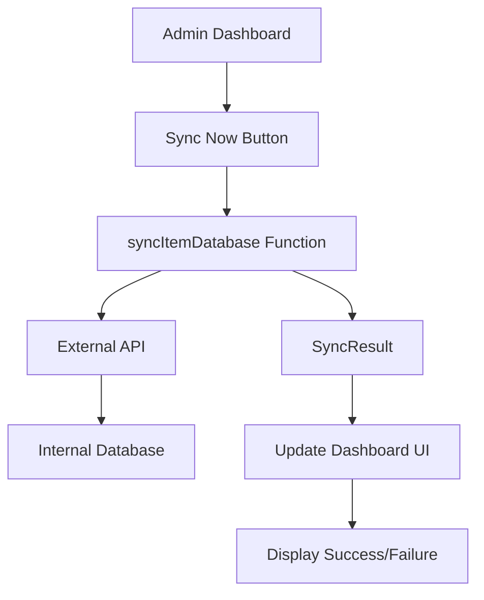

# Item Database Synchronization

<cite>
**Referenced Files in This Document**   
- [sync.ts](file://lib/api/sync.ts#L18-L38)
- [AdminDashboard.tsx](file://components/admin/AdminDashboard.tsx#L143-L160)
- [ItemDatabase.tsx](file://components/database/ItemDatabase.tsx)
- [index.ts](file://types/index.ts#L97-L107)
</cite>

## Table of Contents
1. [Introduction](#introduction)
2. [Core Function Implementation](#core-function-implementation)
3. [Workflow and Data Flow](#workflow-and-data-flow)
4. [Error Handling and Status Reporting](#error-handling-and-status-reporting)
5. [UI Integration and Trigger Mechanism](#ui-integration-and-trigger-mechanism)
6. [Data Model and Type Definitions](#data-model-and-type-definitions)
7. [Common Issues and Troubleshooting](#common-issues-and-troubleshooting)
8. [Performance Considerations](#performance-considerations)

## Introduction
The Item Database Synchronization feature in Prometheus-Planner V2 is designed to maintain an up-to-date repository of in-game items for both Path of Exile 2 and Diablo IV. This documentation details the implementation of the `syncItemDatabase` function, which orchestrates the process of fetching, processing, and storing item data from external sources into the application's internal database. The system is designed with reliability, error resilience, and operational transparency in mind, providing clear success/failure states and timestamped results for monitoring and debugging purposes.

## Core Function Implementation

The `syncItemDatabase` function serves as the primary interface for synchronizing item data across supported games. Located in `lib/api/sync.ts`, this asynchronous function accepts a game parameter that constrains input to either 'PoE 2' or 'Diablo IV', ensuring type safety and preventing invalid game selections.

**Diagram sources**
- [sync.ts](file://lib/api/sync.ts#L18-L38)

**Section sources**
- [sync.ts](file://lib/api/sync.ts#L18-L38)

## Workflow and Data Flow

The intended workflow for the item database synchronization follows a structured sequence of operations designed to ensure data integrity and consistency. When triggered, the function initiates an HTTP request to a game-specific API endpoint (currently placeholder) to retrieve the latest item data. The retrieved data undergoes processing to conform to the application's internal schema before being persisted to the database.

The function returns a `SyncResult` object that includes a success flag, optional itemsSynced count, error message (if applicable), and timestamp. This return pattern enables consumers to programmatically determine the outcome of the synchronization operation and respond accordingly.

**Diagram sources**
- [sync.ts](file://lib/api/sync.ts#L18-L38)
- [AdminDashboard.tsx](file://components/admin/AdminDashboard.tsx#L143-L160)

**Section sources**
- [sync.ts](file://lib/api/sync.ts#L18-L38)

## Error Handling and Status Reporting

The function implements a robust try-catch error handling pattern to gracefully manage failures during the synchronization process. All potential errors are caught and transformed into a standardized `SyncResult` response format, ensuring consistent output regardless of success or failure.

In the success path, the function returns a `SyncResult` with `success: true`, the count of items synchronized, and a timestamp of completion. In the error path, it returns `success: false` with an error message extracted from the caught exception (or a generic message if the error type is unknown) and a timestamp of when the failure occurred.

**Diagram sources**
- [sync.ts](file://lib/api/sync.ts#L21-L37)

**Section sources**
- [sync.ts](file://lib/api/sync.ts#L21-L37)

## UI Integration and Trigger Mechanism

The synchronization functionality is accessible through the Admin Dashboard UI component, which provides administrators with a user-friendly interface to initiate and monitor synchronization operations. The "Sync Now" button in the Item Database Sync section allows manual triggering of the synchronization process.

The Admin Dashboard displays operational metadata including the time of the last synchronization and the scheduled time for the next automatic sync, providing visibility into the synchronization status without requiring direct interaction with the underlying code.

**Diagram sources**
- [AdminDashboard.tsx](file://components/admin/AdminDashboard.tsx#L143-L160)
- [sync.ts](file://lib/api/sync.ts#L18-L38)

**Section sources**
- [AdminDashboard.tsx](file://components/admin/AdminDashboard.tsx#L143-L160)

## Data Model and Type Definitions

The synchronization process operates on well-defined type interfaces that ensure type safety and data consistency. The `SyncResult` interface defines the structure of the function's return value, while the `Item` interface in the types module specifies the expected schema for individual items in the database.

The current implementation includes placeholder logic with a hardcoded `itemsSynced: 0` value, indicating that the actual item counting mechanism will be implemented when the API integration is completed. The function is designed to replace this placeholder with the actual count of items processed during synchronization.

**Section sources**
- [sync.ts](file://lib/api/sync.ts#L10-L15)
- [index.ts](file://types/index.ts#L97-L107)

## Common Issues and Troubleshooting

Several potential issues may arise during the synchronization process, each requiring specific troubleshooting approaches:

**API Downtime**: When external APIs are unavailable, the function will catch the network error and return a failure result. Implement retry logic with exponential backoff to handle temporary outages.

**Rate Limiting**: External APIs often impose rate limits. Monitor response headers for rate limit information and implement appropriate delays between requests. Consider caching strategies to minimize API calls.

**Data Schema Mismatches**: Changes in the external API's data structure can cause parsing errors. Implement robust data validation and transformation logic to handle schema variations, with fallback mechanisms for unexpected data formats.

**Network Timeouts**: Configure appropriate timeout values for API requests and implement retry mechanisms for timeout-related failures.

**Section sources**
- [sync.ts](file://lib/api/sync.ts#L19-L25)

## Performance Considerations

The synchronization system should implement both full and incremental sync strategies to balance data freshness with performance efficiency. Full synchronization retrieves all items from the API, ensuring complete data consistency but consuming more bandwidth and processing time. Incremental synchronization only fetches items that have been added or modified since the last sync, significantly reducing resource usage.

Caching strategies should be employed to minimize redundant API calls and improve response times. Consider implementing a cache layer that stores recently synchronized data, with appropriate cache invalidation policies based on update frequency and data criticality.

The current placeholder implementation suggests that performance optimization will be addressed during the actual API integration phase, with attention to efficient data processing and database operations.

**Section sources**
- [sync.ts](file://lib/api/sync.ts#L18-L38)
- [AdminDashboard.tsx](file://components/admin/AdminDashboard.tsx#L158)