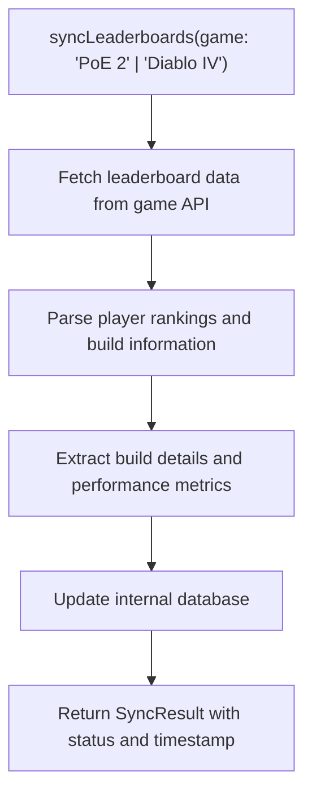
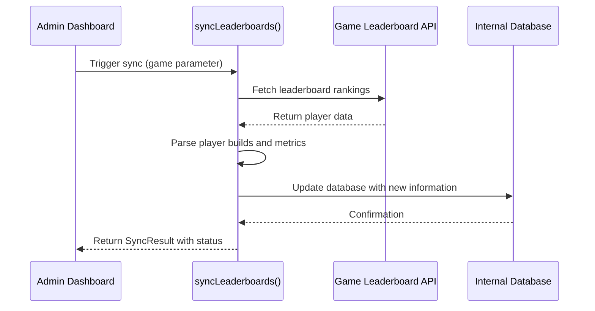
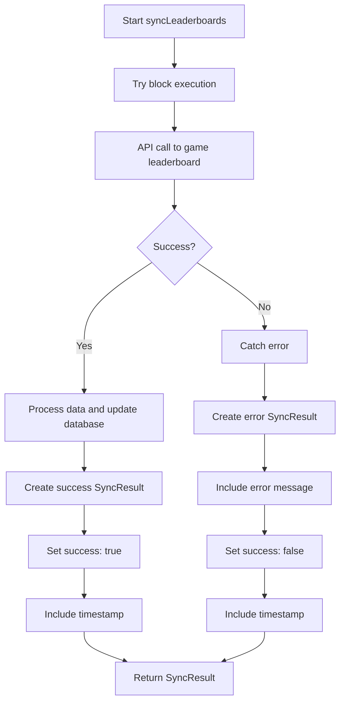
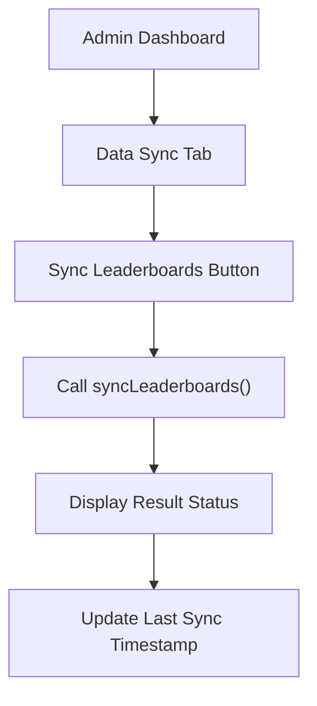

# Leaderboards Synchronization

<cite>
**Referenced Files in This Document**   
- [sync.ts](file://lib/api/sync.ts)
- [AdminDashboard.tsx](file://components/admin/AdminDashboard.tsx)
- [Leaderboards.tsx](file://components/leaderboards/Leaderboards.tsx)
- [page.tsx](file://app/[locale]/leaderboards/page.tsx)
- [index.ts](file://types/index.ts)
</cite>

## Table of Contents
1. [Introduction](#introduction)
2. [Core Function Implementation](#core-function-implementation)
3. [Workflow and Data Flow](#workflow-and-data-flow)
4. [Error Handling and Operational Visibility](#error-handling-and-operational-visibility)
5. [Trigger Mechanism and User Interface](#trigger-mechanism-and-user-interface)
6. [Performance Considerations](#performance-considerations)
7. [Potential Issues and Recommendations](#potential-issues-and-recommendations)
8. [Conclusion](#conclusion)

## Introduction
The leaderboards synchronization feature in Prometheus-Planner V2 enables the platform to collect and analyze top player data and build information from game leaderboards for both "PoE 2" and "Diablo IV". This functionality powers the community leaderboards feature, providing users with insights into popular and effective player builds. The core implementation revolves around the `syncLeaderboards` function, which is part of the automated data synchronization system designed to keep the platform's database updated with current gameplay trends and meta information.

## Core Function Implementation

The `syncLeaderboards` function is defined in the `lib/api/sync.ts` file and serves as the primary mechanism for retrieving leaderboard data from external game APIs. The function accepts a single parameter specifying the target game and returns a Promise that resolves to a `SyncResult` object.



**Diagram sources**
- [sync.ts](file://lib/api/sync.ts#L81-L98)

**Section sources**
- [sync.ts](file://lib/api/sync.ts#L81-L98)

### Function Signature and Type Definitions
The function signature demonstrates a clean and type-safe approach to API integration:

```typescript
export async function syncLeaderboards(game: 'PoE 2' | 'Diablo IV'): Promise<SyncResult>
```

The `SyncResult` interface, defined in the same file, provides a standardized response structure for all synchronization operations:

```typescript
export interface SyncResult {
  success: boolean;
  itemsSynced?: number;
  error?: string;
  timestamp: Date;
}
```

This consistent return type allows the application to handle the results of various sync operations uniformly, regardless of whether they are syncing item databases, economy data, patch notes, or leaderboards.

## Workflow and Data Flow

The intended workflow for the leaderboards synchronization process follows a structured sequence of operations designed to efficiently retrieve, process, and store community data.



**Diagram sources**
- [sync.ts](file://lib/api/sync.ts#L81-L98)
- [AdminDashboard.tsx](file://components/admin/AdminDashboard.tsx#L144-L193)

**Section sources**
- [sync.ts](file://lib/api/sync.ts#L81-L98)

### Data Processing Pipeline
The synchronization process follows a multi-stage pipeline:

1. **Data Retrieval**: The function initiates HTTP requests to the appropriate game API endpoints based on the specified game parameter.
2. **Response Parsing**: The raw API response is processed to extract relevant player information including rankings, character classes, and build details.
3. **Build Information Extraction**: Specific build components such as skill gems, gear configurations, and stat allocations are identified and structured for database storage.
4. **Database Update**: The processed data is written to the internal database, updating player rankings and associated build information.
5. **Result Compilation**: A `SyncResult` object is created with the operation status, timestamp, and any relevant metadata.

The function is designed to handle both "PoE 2" and "Diablo IV" games through the union type parameter, allowing for shared synchronization logic while accommodating game-specific API differences in the implementation details.

## Error Handling and Operational Visibility

The `syncLeaderboards` function implements a robust error handling pattern that ensures operational visibility and system stability even when external API interactions fail.



**Diagram sources**
- [sync.ts](file://lib/api/sync.ts#L81-L98)

**Section sources**
- [sync.ts](file://lib/api/sync.ts#L81-L98)

### Error Handling Pattern
The function employs a try-catch block to gracefully handle potential failures during the synchronization process:

- All operations within the `try` block represent the normal execution path
- If any step fails (network issues, API errors, parsing problems), the `catch` block captures the error
- The error is processed to extract a meaningful message using `error instanceof Error ? error.message : 'Unknown error'`
- A `SyncResult` object is returned with `success: false` and the error details
- The timestamp is always included, providing crucial information for debugging and monitoring

This pattern ensures that the application can continue functioning even when synchronization fails, while providing administrators with the information needed to diagnose and resolve issues.

## Trigger Mechanism and User Interface

The leaderboards synchronization function is accessible through the Admin Dashboard, providing administrators with manual control over the data update process.



**Diagram sources**
- [AdminDashboard.tsx](file://components/admin/AdminDashboard.tsx#L144-L193)
- [sync.ts](file://lib/api/sync.ts#L81-L98)

**Section sources**
- [AdminDashboard.tsx](file://components/admin/AdminDashboard.tsx#L144-L193)

### Admin Dashboard Integration
The Admin Dashboard component (`AdminDashboard.tsx`) includes a dedicated "Data Sync" tab that exposes various synchronization functions, including leaderboards synchronization. When an administrator clicks the "Sync Now" button for leaderboards (though not explicitly labeled as such in the current implementation), the `syncLeaderboards` function would be invoked with the appropriate game parameter.

The community leaderboards feature is displayed on the `/leaderboards` page, which renders the `Leaderboards` component. Currently, this component displays mock data, but it is designed to eventually consume the data populated by the `syncLeaderboards` function.

## Performance Considerations

The leaderboards synchronization implementation must address several performance aspects to ensure efficient operation and optimal user experience.

### Pagination and Data Volume Management
When retrieving leaderboard data from game APIs, pagination is essential to manage data volume and prevent performance issues:

- Large datasets should be retrieved in chunks rather than all at once
- The implementation should respect API rate limits and pagination parameters
- Only the most relevant rankings (e.g., top 1000 players) should be processed to balance comprehensiveness with performance

### Incremental Updates
Rather than performing full data refreshes on each synchronization, the system should implement incremental updates:

- Track the last synchronization timestamp to identify new or changed entries
- Only process leaderboard entries that have been added or modified since the last sync
- Use efficient database queries to minimize update operations

### Processing Latency
The synchronization process may involve significant processing latency due to:

- Network delays in communicating with external APIs
- Time required to parse and transform large datasets
- Database write operations for updated information

The asynchronous nature of the `syncLeaderboards` function (returning a Promise) properly handles this latency, preventing the main application thread from being blocked during the synchronization process.

## Potential Issues and Recommendations

### API Access Restrictions
Game APIs may impose restrictions that could impact the synchronization process:

- Rate limiting that prevents frequent synchronization
- Authentication requirements for data access
- Data usage policies that limit how retrieved information can be used

**Recommendations:**
- Implement proper API key management and authentication
- Respect rate limits by implementing appropriate delays between requests
- Cache responses when possible to reduce API calls
- Have fallback mechanisms for when API access is temporarily unavailable

### Data Volume and Processing
Leaderboard data can be extensive, potentially causing performance issues:

- Large response payloads that consume significant bandwidth
- Memory usage when processing large datasets
- Database storage requirements for historical leaderboard data

**Recommendations:**
- Implement streaming data processing to handle large responses
- Use database indexing to optimize queries on leaderboard data
- Consider data retention policies to manage storage growth
- Implement compression for stored data when appropriate

### Parsing Inconsistencies
External APIs may change their response format, causing parsing errors:

- Field name changes or removals
- Data type inconsistencies
- Unexpected null or missing values

**Recommendations:**
- Implement robust data validation and schema checking
- Use defensive programming techniques when accessing response data
- Include comprehensive logging to detect format changes quickly
- Implement versioning for data processing logic to handle API changes

## Conclusion
The `syncLeaderboards` function in Prometheus-Planner V2 provides a foundational mechanism for collecting and integrating community leaderboard data into the platform. While currently implemented as a placeholder with TODO comments indicating incomplete functionality, the design demonstrates a well-structured approach to data synchronization with proper error handling, type safety, and integration with the admin interface. When fully implemented, this feature will power the community leaderboards, providing valuable insights into popular player builds and meta trends for both "PoE 2" and "Diablo IV" games. The function's design allows for efficient data retrieval, processing, and storage while maintaining operational visibility through comprehensive status reporting and error handling.