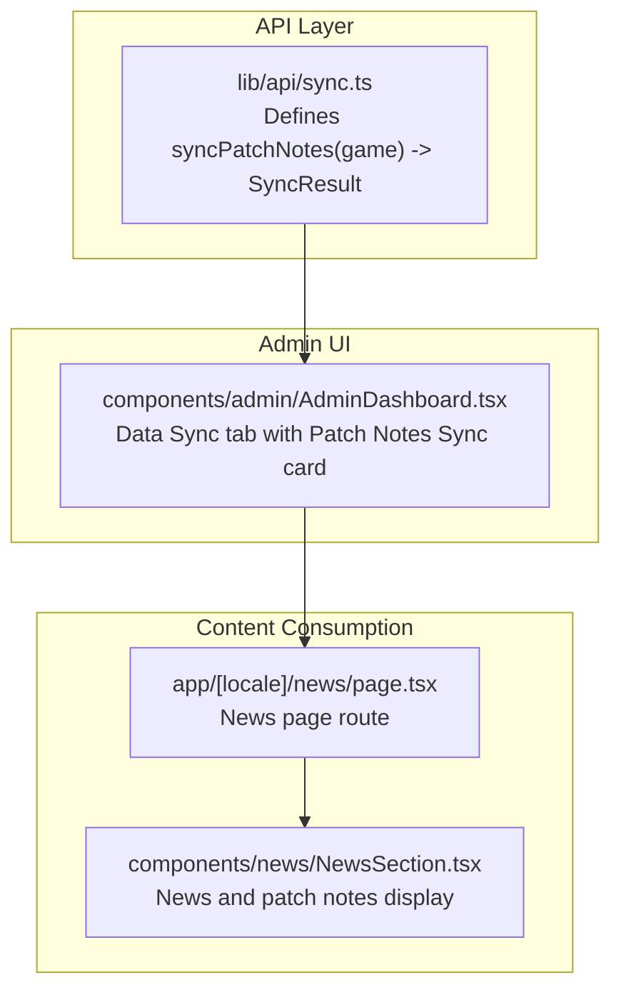
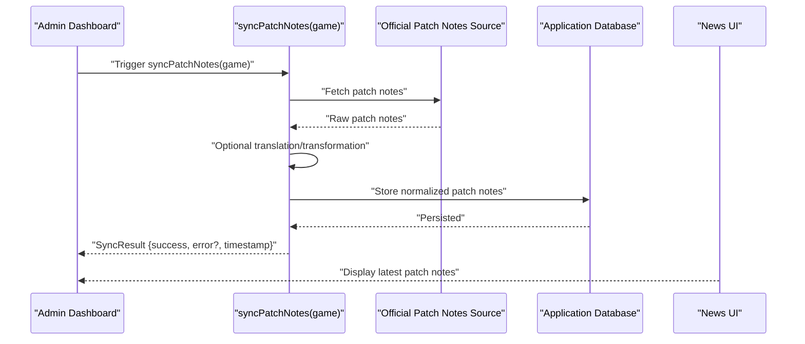
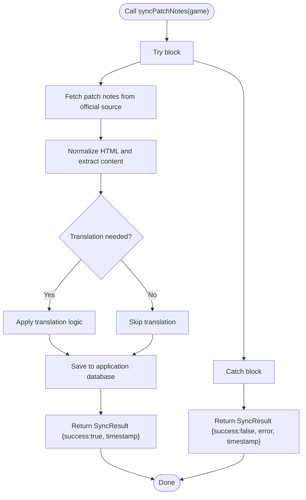
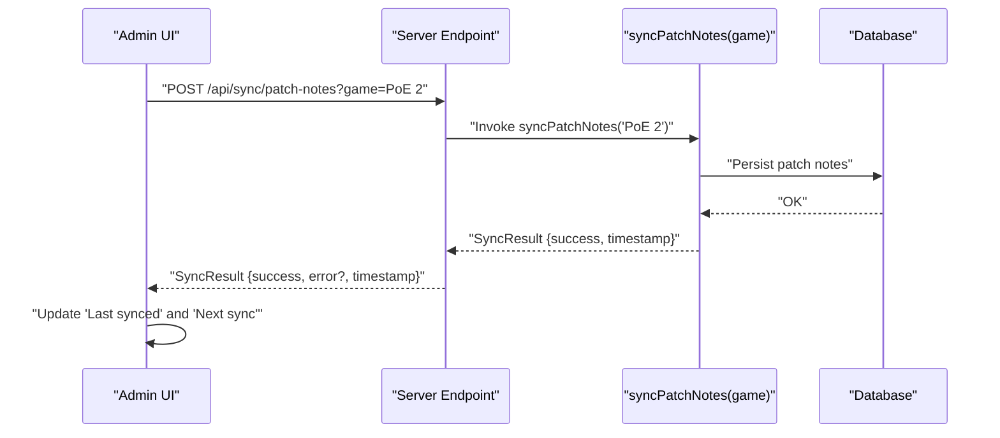
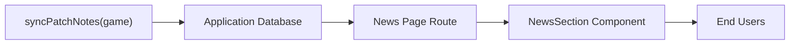
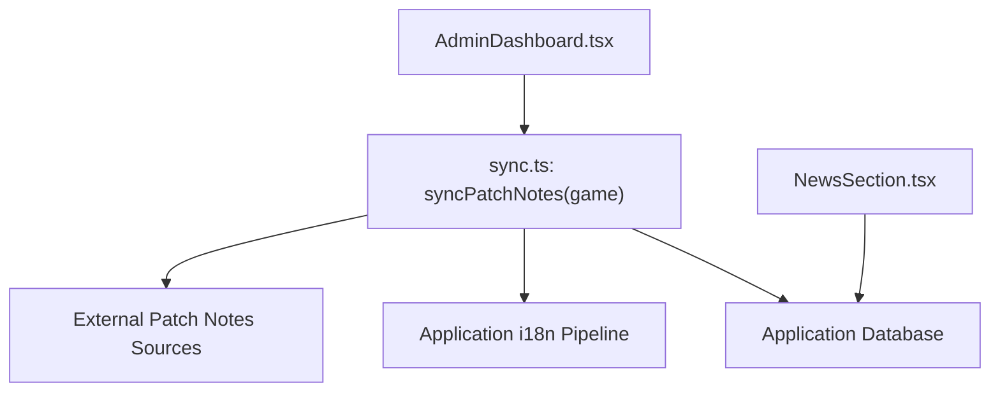

# Patch Notes Synchronization

<cite>
**Referenced Files in This Document**
- [sync.ts](file://lib/api/sync.ts)
- [AdminDashboard.tsx](file://components/admin/AdminDashboard.tsx)
- [NewsSection.tsx](file://components/news/NewsSection.tsx)
- [page.tsx (News)](file://app/[locale]/news/page.tsx)
- [IMPLEMENTATION_SUMMARY.md](file://IMPLEMENTATION_SUMMARY.md)
- [README.md](file://README.md)
- [index.ts](file://types/index.ts)
</cite>

## Table of Contents
1. [Introduction](#introduction)
2. [Project Structure](#project-structure)
3. [Core Components](#core-components)
4. [Architecture Overview](#architecture-overview)
5. [Detailed Component Analysis](#detailed-component-analysis)
6. [Dependency Analysis](#dependency-analysis)
7. [Performance Considerations](#performance-considerations)
8. [Troubleshooting Guide](#troubleshooting-guide)
9. [Conclusion](#conclusion)
10. [Appendices](#appendices)

## Introduction
This document explains the patch notes synchronization feature in Prometheus-Planner V2. It focuses on the syncPatchNotes function in lib/api/sync.ts, detailing its signature, intended workflow, error handling, and timestamp tracking. It also describes how this function integrates with the Admin Dashboard UI and supports timely content updates for users. Mitigation strategies for common challenges such as HTML parsing, translation delays, and version conflicts are provided, along with performance considerations for sync intervals and bandwidth usage.

## Project Structure
The patch notes synchronization feature spans the API layer and the Admin Dashboard UI. The API layer defines the function contract and return type, while the Admin Dashboard exposes controls to trigger and observe sync operations.

**Diagram sources**
- [sync.ts](file://lib/api/sync.ts#L60-L78)
- [AdminDashboard.tsx](file://components/admin/AdminDashboard.tsx#L143-L190)
- [page.tsx (News)](file://app/[locale]/news/page.tsx#L1-L19)
- [NewsSection.tsx](file://components/news/NewsSection.tsx#L1-L58)

**Section sources**
- [sync.ts](file://lib/api/sync.ts#L60-L78)
- [AdminDashboard.tsx](file://components/admin/AdminDashboard.tsx#L143-L190)
- [page.tsx (News)](file://app/[locale]/news/page.tsx#L1-L19)
- [NewsSection.tsx](file://components/news/NewsSection.tsx#L1-L58)

## Core Components
- syncPatchNotes(game): Asynchronous function that accepts a game parameter of type 'PoE 2' | 'Diablo IV' and returns a SyncResult object. The function is currently a placeholder with a TODO comment indicating that the implementation is pending.
- SyncResult: Standardized result type with fields success, itemsSynced (optional), error (optional), and timestamp. The timestamp field enables audit logging and reporting.

Key characteristics:
- Parameter: game accepts either 'PoE 2' or 'Diablo IV'.
- Return type: SyncResult with success flag, optional error message, and timestamp.
- Placeholder behavior: Returns success with a timestamp when no external operation is performed.

Practical example patterns (placeholder):
- Success response: success is true, timestamp is set to the current time.
- Failure response: success is false, error is populated with a human-readable message, timestamp is set to the current time.

Integration points:
- Admin Dashboard UI exposes a “Patch Notes Sync” card with a “Sync Now” button under the “Data Sync” tab.
- The News page and NewsSection component consume patch notes content for display.

**Section sources**
- [sync.ts](file://lib/api/sync.ts#L60-L78)
- [index.ts](file://types/index.ts#L1-L2)
- [AdminDashboard.tsx](file://components/admin/AdminDashboard.tsx#L143-L190)
- [page.tsx (News)](file://app/[locale]/news/page.tsx#L1-L19)
- [NewsSection.tsx](file://components/news/NewsSection.tsx#L1-L58)

## Architecture Overview
The patch notes sync workflow is designed to be modular and extensible. The Admin Dashboard triggers the sync operation, which internally calls syncPatchNotes. The function’s return value (SyncResult) standardizes success/failure reporting and timestamps for auditing.

**Diagram sources**
- [sync.ts](file://lib/api/sync.ts#L60-L78)
- [AdminDashboard.tsx](file://components/admin/AdminDashboard.tsx#L143-L190)
- [NewsSection.tsx](file://components/news/NewsSection.tsx#L1-L58)

## Detailed Component Analysis

### syncPatchNotes Function
Purpose:
- Retrieve official patch notes for the specified game.
- Optionally translate content for multilingual support.
- Store normalized patch notes in the application database.
- Return a standardized SyncResult with success status, optional error, and timestamp.

Current state:
- Placeholder implementation with a TODO comment.
- Returns success with a timestamp when no external operation is performed.

Intended implementation outline:
- Fetch patch notes from official sources (e.g., game websites or developer blogs).
- Normalize HTML content to plain text or structured content suitable for rendering.
- Apply translation if needed using the application’s internationalization infrastructure.
- Persist to the database with metadata such as game, version, publish date, and language.
- Report itemsSynced if applicable (e.g., number of articles processed).

Error handling:
- Wrap external calls in try/catch blocks.
- On failure, populate error with a descriptive message and ensure timestamp is recorded.
- On success, ensure timestamp is set and success is true.

Timestamp tracking:
- Always set timestamp to the current time upon completion (success or failure).
- Use timestamp for audit logs and UI displays (e.g., “Last synced” and “Next sync”).

**Diagram sources**
- [sync.ts](file://lib/api/sync.ts#L60-L78)

**Section sources**
- [sync.ts](file://lib/api/sync.ts#L60-L78)

### Admin Dashboard Integration
The Admin Dashboard provides a “Data Sync” tab with a “Patch Notes Sync” card. Within this card:
- A “Sync Now” button triggers the patch notes synchronization.
- Status fields show “Last synced” and “Next sync” to inform administrators about timing.

Integration behavior:
- The UI should call the backend endpoint that invokes syncPatchNotes(game).
- After the operation completes, the UI updates the status fields with the returned SyncResult.timestamp and any error message.

**Diagram sources**
- [AdminDashboard.tsx](file://components/admin/AdminDashboard.tsx#L143-L190)
- [sync.ts](file://lib/api/sync.ts#L60-L78)

**Section sources**
- [AdminDashboard.tsx](file://components/admin/AdminDashboard.tsx#L143-L190)

### Content Consumption (News UI)
The News page and NewsSection component present patch notes and related articles to end users. The Admin Dashboard ensures that fresh patch notes are available for display by triggering the sync process.

**Diagram sources**
- [sync.ts](file://lib/api/sync.ts#L60-L78)
- [page.tsx (News)](file://app/[locale]/news/page.tsx#L1-L19)
- [NewsSection.tsx](file://components/news/NewsSection.tsx#L1-L58)

**Section sources**
- [page.tsx (News)](file://app/[locale]/news/page.tsx#L1-L19)
- [NewsSection.tsx](file://components/news/NewsSection.tsx#L1-L58)

## Dependency Analysis
- syncPatchNotes depends on:
  - External patch notes sources (official game websites or developer blogs).
  - Optional translation services aligned with the application’s i18n pipeline.
  - Application database for storing normalized patch notes.
- Admin Dashboard depends on:
  - Backend endpoint exposing syncPatchNotes(game).
  - UI components to render status and trigger actions.

**Diagram sources**
- [sync.ts](file://lib/api/sync.ts#L60-L78)
- [AdminDashboard.tsx](file://components/admin/AdminDashboard.tsx#L143-L190)
- [NewsSection.tsx](file://components/news/NewsSection.tsx#L1-L58)

**Section sources**
- [sync.ts](file://lib/api/sync.ts#L60-L78)
- [AdminDashboard.tsx](file://components/admin/AdminDashboard.tsx#L143-L190)
- [NewsSection.tsx](file://components/news/NewsSection.tsx#L1-L58)

## Performance Considerations
- Sync intervals:
  - Configure periodic syncs to balance freshness and resource usage. For patch notes, a moderate interval (e.g., every 6–12 hours) is often sufficient given release cadence.
  - Use SyncConfig with enabled, interval, lastSync, and nextSync fields to manage scheduling.
- Bandwidth usage:
  - Limit payload sizes by fetching only necessary fields (title, date, content summary).
  - Implement caching and ETags to avoid re-downloading unchanged content.
- HTML parsing:
  - Normalize HTML to plain text or sanitized HTML to reduce rendering overhead and improve accessibility.
  - Avoid heavy DOM parsing on the client; pre-process on the server.
- Translation:
  - Batch translate content during sync to minimize latency.
  - Cache translated content keyed by language and version to avoid redundant work.
- Version conflicts:
  - Track patch versions and skip duplicates when content has not changed.
  - Maintain a deduplication strategy (e.g., hash of content) to prevent repeated writes.

[No sources needed since this section provides general guidance]

## Troubleshooting Guide
Common issues and mitigations:
- HTML parsing failures:
  - Validate and sanitize HTML before storage. Use a robust parser and handle malformed tags gracefully.
  - Log parsing errors with context (URL, timestamp) for diagnostics.
- Translation delays:
  - Implement asynchronous translation with progress indicators in the Admin UI.
  - Cache translations and refresh only when content changes.
- Version conflicts:
  - Compare incoming version identifiers with stored records. Only update when newer.
  - Maintain a changelog of processed versions to aid audits.
- Network timeouts:
  - Set reasonable timeouts for external requests and retry with exponential backoff.
  - Fail gracefully with SyncResult.success=false and a descriptive error message.
- Audit and visibility:
  - Always record SyncResult.timestamp for every operation.
  - Display “Last synced” and “Next sync” in the Admin Dashboard to keep operators informed.

**Section sources**
- [sync.ts](file://lib/api/sync.ts#L60-L78)
- [AdminDashboard.tsx](file://components/admin/AdminDashboard.tsx#L143-L190)

## Conclusion
The patch notes synchronization feature is currently defined by the syncPatchNotes function and the Admin Dashboard UI. While the implementation is a placeholder, the design establishes a clear contract via SyncResult and a standardized workflow for fetching, translating, and storing patch notes. Integrating with the News UI ensures users receive timely updates. By adopting the suggested mitigation strategies and performance considerations, the team can evolve this feature into a robust, scalable solution that keeps content fresh and accessible across languages.

[No sources needed since this section summarizes without analyzing specific files]

## Appendices

### API Contract Reference
- Function: syncPatchNotes(game)
  - Parameters:
    - game: 'PoE 2' | 'Diablo IV'
  - Returns:
    - SyncResult with success, optional error, and timestamp
  - Behavior:
    - Placeholder returns success with timestamp
    - Future implementation should fetch, normalize, translate, and persist patch notes

**Section sources**
- [sync.ts](file://lib/api/sync.ts#L60-L78)
- [index.ts](file://types/index.ts#L1-L2)

### UI Integration Notes
- Admin Dashboard “Data Sync” tab includes a “Patch Notes Sync” card with “Sync Now” and status fields.
- News page and NewsSection component consume patch notes for display.

**Section sources**
- [AdminDashboard.tsx](file://components/admin/AdminDashboard.tsx#L143-L190)
- [page.tsx (News)](file://app/[locale]/news/page.tsx#L1-L19)
- [NewsSection.tsx](file://components/news/NewsSection.tsx#L1-L58)

### Feature Scope and Roadmap
- The feature is part of the Admin Dashboard’s automated data sync capabilities.
- The project roadmap highlights readiness for API development and real data integration.

**Section sources**
- [IMPLEMENTATION_SUMMARY.md](file://IMPLEMENTATION_SUMMARY.md#L39-L49)
- [README.md](file://README.md#L1-L19)