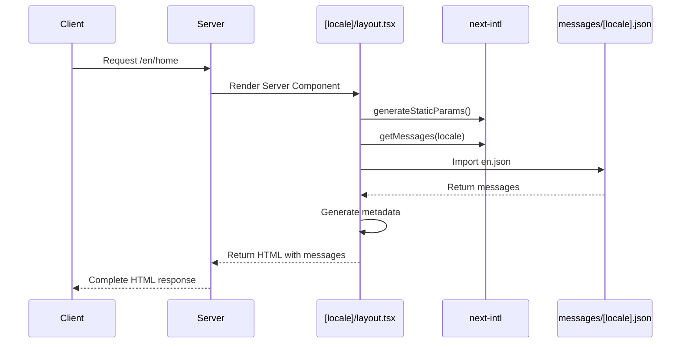
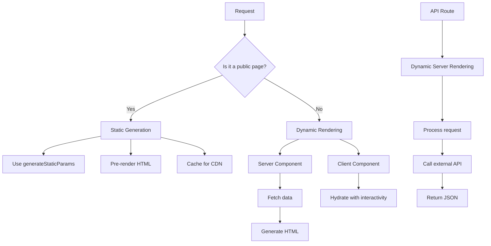
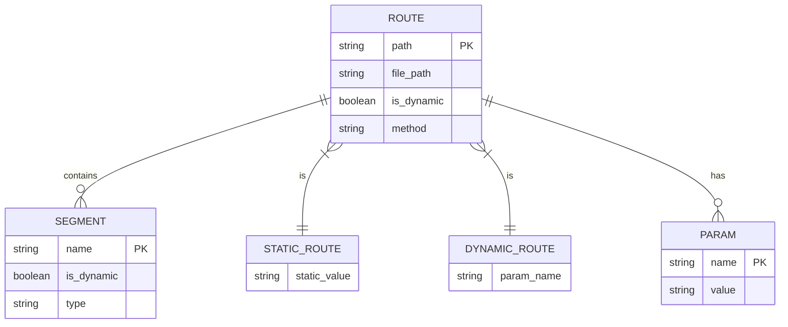
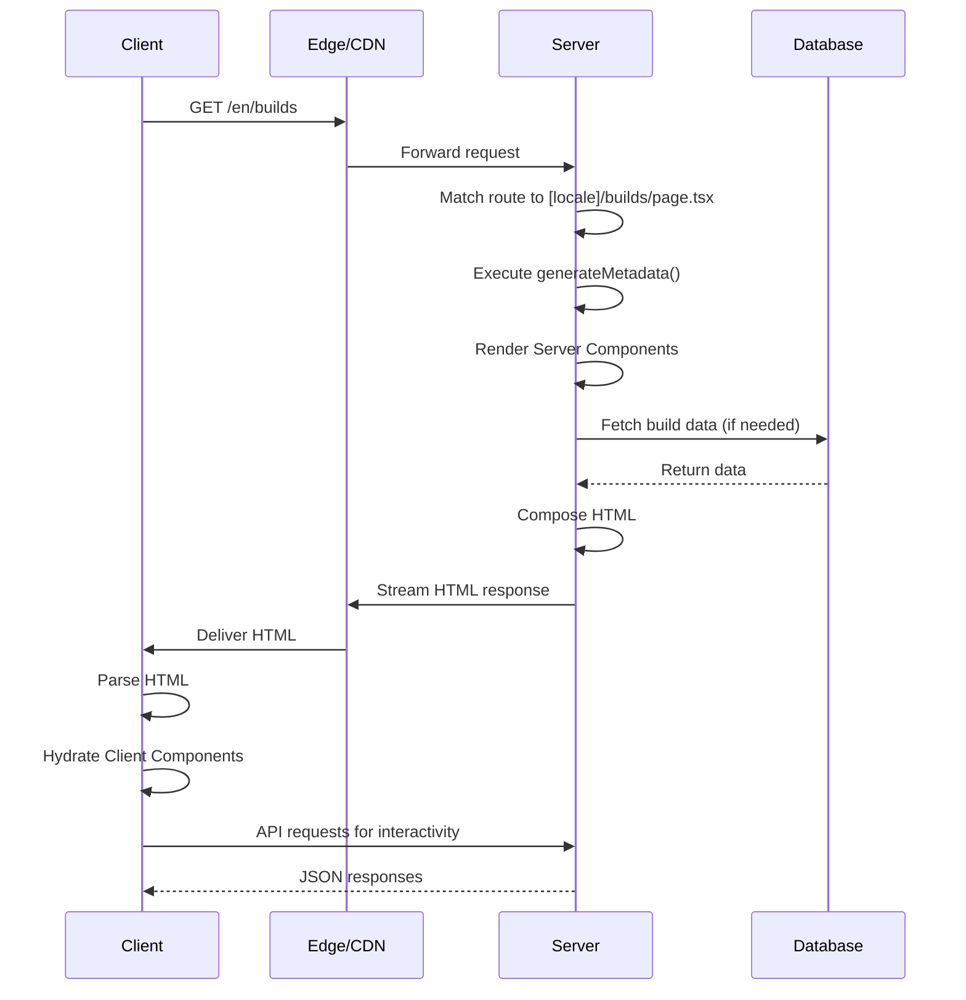
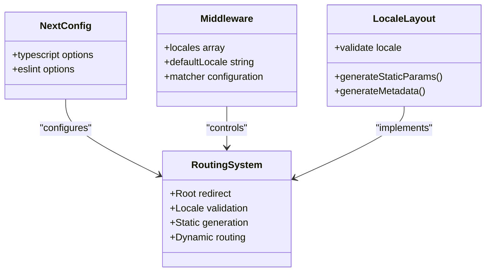

# App Router Architecture

<cite>
**Referenced Files in This Document**   
- [app/layout.tsx](file://app/layout.tsx)
- [app/[locale]/layout.tsx](file://app/[locale]/layout.tsx)
- [app/page.tsx](file://app/page.tsx)
- [app/[locale]/page.tsx](file://app/[locale]/page.tsx)
- [app/[locale]/builds/page.tsx](file://app/[locale]/builds/page.tsx)
- [app/[locale]/admin/page.tsx](file://app/[locale]/admin/page.tsx)
- [app/api/ai/analyze/route.ts](file://app/api/ai/analyze/route.ts)
- [components/Navigation.tsx](file://components/Navigation.tsx)
- [components/LanguageSwitcher.tsx](file://components/LanguageSwitcher.tsx)
- [i18n.ts](file://i18n.ts)
- [middleware.ts](file://middleware.ts)
- [next.config.mjs](file://next.config.mjs)
- [lib/seo.ts](file://lib/seo.ts)
- [messages/en.json](file://messages/en.json)
- [messages/ar.json](file://messages/ar.json)
</cite>

## Table of Contents
1. [Introduction](#introduction)
2. [Project Structure](#project-structure)
3. [Routing Hierarchy](#routing-hierarchy)
4. [Layout Structure](#layout-structure)
5. [Server Components and Data Fetching](#server-components-and-data-fetching)
6. [Rendering Strategy](#rendering-strategy)
7. [File-Based Routing System](#file-based-routing-system)
8. [Request Flow and React Server Components](#request-flow-and-react-server-components)
9. [Internationalization and Locale Handling](#internationalization-and-locale-handling)
10. [Configuration and Custom Routing](#configuration-and-custom-routing)

## Introduction
The Prometheus-Planner V2 application implements a sophisticated Next.js App Router architecture with full internationalization support. This documentation details the routing hierarchy, layout structure, rendering strategy, and internationalization implementation that enables a seamless multilingual experience for ARPG players.

**Section sources**
- [app/page.tsx](file://app/page.tsx#L1-L7)
- [app/[locale]/page.tsx](file://app/[locale]/page.tsx#L1-L202)

## Project Structure
The application follows a standard Next.js App Router structure with a clear separation between routes, components, and configuration files. The `app` directory contains the routing structure with root-level and locale-specific routes using the `[locale]` dynamic segment. Components are organized by feature in the `components` directory, while internationalization messages are stored in the `messages` directory.

```mermaid
graph TB
app[app/] --> locale[[locale]/]
app --> api[api/]
app --> globals[global.css]
app --> layout[layout.tsx]
app --> page[page.tsx]
locale --> builds[builds/]
locale --> admin[admin/]
locale --> ai[ai/]
locale --> community[community/]
locale --> database[database/]
locale --> economy[economy/]
locale --> leaderboards[leaderboards/]
locale --> news[news/]
locale --> profile[profile/]
locale --> settings[settings/]
locale --> layout[layout.tsx]
locale --> page[page.tsx]
api --> ai[ai/]
ai --> analyze[analyze/]
analyze --> route[route.ts]
components --> Navigation[Navigation.tsx]
components --> LanguageSwitcher[LanguageSwitcher.tsx]
components --> builds[builds/]
components --> admin[admin/]
components --> ai[ai/]
components --> community[community/]
components --> database[database/]
components --> economy[economy/]
components --> leaderboards[leaderboards/]
components --> news[news/]
messages --> en[en.json]
messages --> ar[ar.json]
```

**Diagram sources**
- [app](file://app)
- [components](file://components)
- [messages](file://messages)

**Section sources**
- [app](file://app)
- [components](file://components)
- [messages](file://messages)

## Routing Hierarchy
The application implements a hierarchical routing system with root-level and locale-specific routes. The routing hierarchy begins with a root `page.tsx` that redirects to the default locale, followed by a dynamic `[locale]` segment that captures the language code. All user-facing routes are nested within the `[locale]` directory, ensuring proper internationalization.

The routing structure supports both static and dynamic routes:
- Static routes: `/[locale]/builds`, `/[locale]/database`, `/[locale]/ai`
- Dynamic routes: `/[locale]/builds/[id]`
- API routes: `/api/ai/analyze`

The root `page.tsx` redirects to the default locale, while the `[locale]/page.tsx` serves as the home page for each language.

```mermaid
graph TD
A[/] --> B[/[locale]]
B --> C[/[locale]/builds]
B --> D[/[locale]/builds/[id]]
B --> E[/[locale]/database]
B --> F[/[locale]/ai]
B --> G[/[locale]/community]
B --> H[/[locale]/leaderboards]
B --> I[/[locale]/economy]
B --> J[/[locale]/news]
B --> K[/[locale]/profile]
B --> L[/[locale]/settings]
B --> M[/[locale]/admin]
N[/api/ai/analyze] --> POST
```

**Diagram sources**
- [app/page.tsx](file://app/page.tsx#L1-L7)
- [app/[locale]/page.tsx](file://app/[locale]/page.tsx#L1-L202)
- [app/[locale]/builds/page.tsx](file://app/[locale]/builds/page.tsx#L1-L21)
- [app/api/ai/analyze/route.ts](file://app/api/ai/analyze/route.ts#L1-L92)

**Section sources**
- [app/page.tsx](file://app/page.tsx#L1-L7)
- [app/[locale]/page.tsx](file://app/[locale]/page.tsx#L1-L202)
- [app/[locale]/builds/page.tsx](file://app/[locale]/builds/page.tsx#L1-L21)

## Layout Structure
The application implements a nested layout structure with a root layout and locale-specific layouts. The root `layout.tsx` provides the basic HTML structure, while the `[locale]/layout.tsx` handles internationalization and locale-specific UI elements.

The root layout (`app/layout.tsx`) defines the basic HTML structure with the `html` and `body` tags, applying global styles and setting the default language to English.

The locale layout (`app/[locale]/layout.tsx`) extends this structure by:
- Validating the locale parameter against supported locales
- Setting the HTML `lang` and `dir` attributes based on the locale
- Providing internationalized messages to client components via `NextIntlClientProvider`
- Rendering the navigation component that persists across all locale routes

This nested layout approach allows for shared UI elements (like navigation) to be preserved across routes while enabling locale-specific variations in direction and content.

```mermaid
classDiagram
class RootLayout {
+html lang="en"
+body with global styles
}
class LocaleLayout {
+html lang={locale}
+html dir={rtl|ltr}
+NextIntlClientProvider
+Navigation
+main{children}
}
RootLayout <|-- LocaleLayout : "extends"
```

**Diagram sources**
- [app/layout.tsx](file://app/layout.tsx#L1-L10)
- [app/[locale]/layout.tsx](file://app/[locale]/layout.tsx#L1-L49)

**Section sources**
- [app/layout.tsx](file://app/layout.tsx#L1-L10)
- [app/[locale]/layout.tsx](file://app/[locale]/layout.tsx#L1-L49)

## Server Components and Data Fetching
The application leverages React Server Components for metadata generation, internationalization, and initial data fetching. Server components are used extensively to optimize performance and reduce client-side JavaScript bundle size.

The `[locale]/layout.tsx` file demonstrates server component usage with:
- `generateMetadata` function that creates SEO-friendly metadata for each locale
- `generateStaticParams` function that pre-generates static paths for all supported locales
- `getMessages` function that fetches internationalization messages on the server

The `generateMetadata` function returns consistent metadata across all locale routes, including title and description optimized for search engines. The `generateStaticParams` function enables static generation for all supported locales (en, ar), improving performance and SEO.



**Diagram sources**
- [app/[locale]/layout.tsx](file://app/[locale]/layout.tsx#L8-L17)
- [i18n.ts](file://i18n.ts#L1-L17)
- [messages/en.json](file://messages/en.json)
- [messages/ar.json](file://messages/ar.json)

**Section sources**
- [app/[locale]/layout.tsx](file://app/[locale]/layout.tsx#L8-L17)
- [i18n.ts](file://i18n.ts#L1-L17)

## Rendering Strategy
The application employs a hybrid rendering strategy combining static site generation (SSG) for public pages and dynamic rendering for user-interactive features. This approach optimizes performance while maintaining interactivity where needed.

Public pages such as home, builds, database, and news are statically generated using:
- `generateStaticParams` to pre-render all locale variants
- Server Components for initial data fetching
- Static metadata generation

User-interactive features like the AI guide and build planner use client-side rendering with:
- Client Components for interactivity
- State management with React hooks
- Event handlers for user interactions

The home page (`[locale]/page.tsx`) exemplifies this hybrid approach, with a Server Component shell that wraps a Client Component containing interactive elements like the passive skill tree and weapon loadout selector.

API routes like `/api/ai/analyze` use dynamic server rendering to process requests and interact with external services (OpenAI), enabling real-time AI-powered build analysis.



**Diagram sources**
- [app/[locale]/layout.tsx](file://app/[locale]/layout.tsx#L8-L10)
- [app/[locale]/page.tsx](file://app/[locale]/page.tsx#L1-L202)
- [app/api/ai/analyze/route.ts](file://app/api/ai/analyze/route.ts#L1-L92)

**Section sources**
- [app/[locale]/layout.tsx](file://app/[locale]/layout.tsx#L8-L10)
- [app/[locale]/page.tsx](file://app/[locale]/page.tsx#L1-L202)
- [app/api/ai/analyze/route.ts](file://app/api/ai/analyze/route.ts#L1-L92)

## File-Based Routing System
The application implements Next.js file-based routing where the file structure directly maps to URL paths. This convention-based approach simplifies route management and makes the routing hierarchy explicit.

The routing system follows these patterns:
- `app/page.tsx` → `/` (redirects to default locale)
- `app/[locale]/page.tsx` → `/{locale}`
- `app/[locale]/builds/page.tsx` → `/{locale}/builds`
- `app/[locale]/builds/[id]/page.tsx` → `/{locale}/builds/{id}`
- `app/api/ai/analyze/route.ts` → `/api/ai/analyze`

Dynamic segments in square brackets (`[locale]`, `[id]`) capture route parameters that can be accessed in page and layout components. The `generateStaticParams` function in `[locale]/layout.tsx` ensures that static paths are generated for all supported locales.

This file-based approach eliminates the need for manual route configuration and provides a clear, predictable mapping between files and URLs.



**Diagram sources**
- [app/page.tsx](file://app/page.tsx#L1-L7)
- [app/[locale]/page.tsx](file://app/[locale]/page.tsx#L1-L202)
- [app/[locale]/builds/page.tsx](file://app/[locale]/builds/page.tsx#L1-L21)
- [app/[locale]/builds/[id]/page.tsx](file://app/[locale]/builds/[id]/page.tsx)
- [app/api/ai/analyze/route.ts](file://app/api/ai/analyze/route.ts#L1-L92)

**Section sources**
- [app/page.tsx](file://app/page.tsx#L1-L7)
- [app/[locale]/page.tsx](file://app/[locale]/page.tsx#L1-L202)
- [app/[locale]/builds/page.tsx](file://app/[locale]/builds/page.tsx#L1-L21)

## Request Flow and React Server Components
The application leverages React Server Components to optimize the request flow, reducing client-side JavaScript and improving performance. The request flow begins with a client request that is handled by the server, which renders Server Components and streams HTML to the client.

For a typical page request:
1. Client requests a URL (e.g., `/en/builds`)
2. Next.js routes to the appropriate Server Component
3. Server executes `generateStaticParams` and `generateMetadata`
4. Server fetches data and renders the component tree
5. Server streams HTML to the client
6. Client hydrates Client Components with interactivity

React Server Components enable data fetching closer to the database, reducing waterfall requests and improving Time to First Byte (TTFB). The `[locale]/layout.tsx` component fetches internationalization messages on the server, eliminating the need for client-side data fetching.

Client Components are used selectively for interactive elements, such as the navigation menu, language switcher, and AI analysis interface. These components are hydrated on the client after the initial HTML is delivered.



**Diagram sources**
- [app/[locale]/layout.tsx](file://app/[locale]/layout.tsx#L1-L49)
- [app/[locale]/page.tsx](file://app/[locale]/page.tsx#L1-L202)
- [components/Navigation.tsx](file://components/Navigation.tsx#L1-L99)
- [components/LanguageSwitcher.tsx](file://components/LanguageSwitcher.tsx#L1-L65)

**Section sources**
- [app/[locale]/layout.tsx](file://app/[locale]/layout.tsx#L1-L49)
- [app/[locale]/page.tsx](file://app/[locale]/page.tsx#L1-L202)
- [components/Navigation.tsx](file://components/Navigation.tsx#L1-L99)

## Internationalization and Locale Handling
The application implements comprehensive internationalization using next-intl, supporting English (en) and Arabic (ar) locales. The system handles locale detection, routing, content translation, and RTL (right-to-left) layout for Arabic.

Locale handling is implemented through:
- A `middleware.ts` file that intercepts requests and applies locale-based routing
- An `i18n.ts` configuration file that defines supported locales and default locale
- A `[locale]` dynamic segment that captures the language code
- JSON message files (`en.json`, `ar.json`) containing translated content
- Automatic direction detection (ltr for English, rtl for Arabic)

The middleware configures the routing matcher to handle both root paths and locale-prefixed paths, redirecting users based on their preferred language. The `generateStaticParams` function ensures that static paths are generated for all supported locales.

Language switching is implemented through the `LanguageSwitcher` component, which updates the URL path to reflect the selected locale. The `useTranslations` hook provides access to localized content in both Server and Client Components.

```mermaid
graph TD
A[Request] --> B{Has locale?}
B --> |No| C[Use accept-language header]
C --> D[Redirect to preferred locale]
B --> |Yes| E[Validate locale]
E --> F{Valid?}
F --> |Yes| G[Set HTML lang and dir]
F --> |No| H[Return 404]
G --> I[Load messages/[locale].json]
I --> J[Render page with translations]
K[User Click] --> L[LanguageSwitcher]
L --> M[Update URL to /{newLocale}]
M --> N[Reload page with new locale]
```

**Diagram sources**
- [middleware.ts](file://middleware.ts#L1-L16)
- [i18n.ts](file://i18n.ts#L1-L17)
- [app/[locale]/layout.tsx](file://app/[locale]/layout.tsx#L1-L49)
- [components/LanguageSwitcher.tsx](file://components/LanguageSwitcher.tsx#L1-L65)
- [messages/en.json](file://messages/en.json)
- [messages/ar.json](file://messages/ar.json)

**Section sources**
- [middleware.ts](file://middleware.ts#L1-L16)
- [i18n.ts](file://i18n.ts#L1-L17)
- [app/[locale]/layout.tsx](file://app/[locale]/layout.tsx#L1-L49)
- [components/LanguageSwitcher.tsx](file://components/LanguageSwitcher.tsx#L1-L65)

## Configuration and Custom Routing
The application's routing behavior is configured through `next.config.mjs` and `middleware.ts`. While the `next.config.mjs` file contains minimal configuration, the `middleware.ts` file implements custom routing logic for internationalization.

The middleware configuration:
- Defines supported locales (en, ar)
- Sets the default locale (en)
- Configures the request matcher to handle both root and locale-prefixed paths
- Automatically applies locale-based routing and redirection

The `generateStaticParams` function in `[locale]/layout.tsx` enables static generation for all supported locales, improving performance and SEO. This function returns an array of locale parameters, instructing Next.js to pre-render pages for each locale.

Custom routing behaviors include:
- Redirecting the root path to the default locale
- Validating locale parameters and returning 404 for invalid locales
- Preserving the locale context across navigation
- Supporting both static and dynamic route generation

The combination of Next.js App Router features and custom middleware enables a robust internationalization system that handles locale detection, routing, and content translation seamlessly.



**Diagram sources**
- [next.config.mjs](file://next.config.mjs#L1-L7)
- [middleware.ts](file://middleware.ts#L1-L16)
- [app/[locale]/layout.tsx](file://app/[locale]/layout.tsx#L8-L10)
- [app/page.tsx](file://app/page.tsx#L1-L7)

**Section sources**
- [next.config.mjs](file://next.config.mjs#L1-L7)
- [middleware.ts](file://middleware.ts#L1-L16)
- [app/[locale]/layout.tsx](file://app/[locale]/layout.tsx#L8-L10)
- [app/page.tsx](file://app/page.tsx#L1-L7)