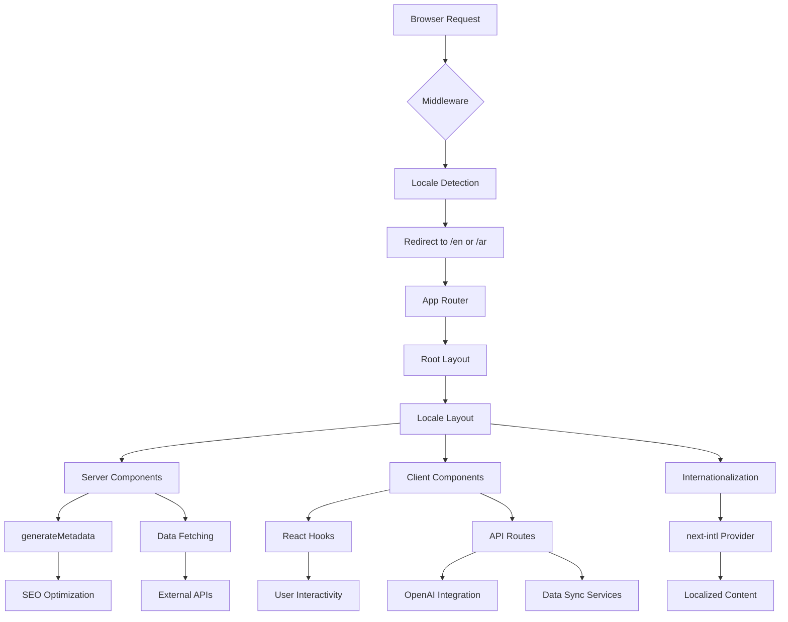
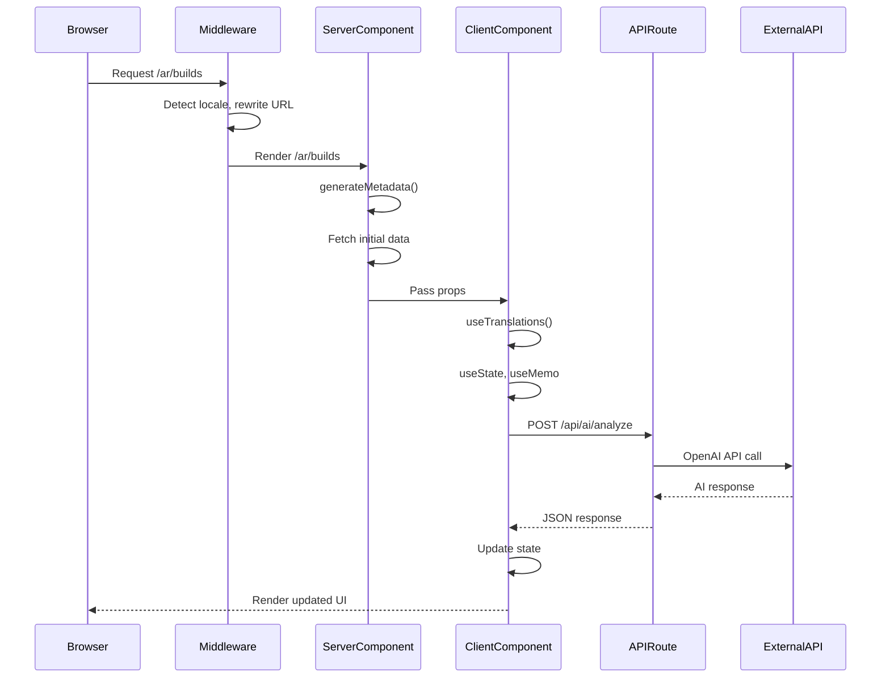
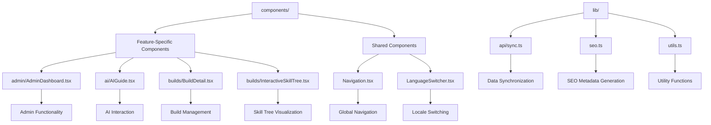

# Architecture Overview

<cite>
**Referenced Files in This Document**   
- [app/layout.tsx](file://app/layout.tsx)
- [app/[locale]/layout.tsx](file://app/[locale]/layout.tsx)
- [app/page.tsx](file://app/page.tsx)
- [app/[locale]/page.tsx](file://app/[locale]/page.tsx)
- [app/api/ai/analyze/route.ts](file://app/api/ai/analyze/route.ts)
- [components/Navigation.tsx](file://components/Navigation.tsx)
- [components/ai/AIGuide.tsx](file://components/ai/AIGuide.tsx)
- [components/admin/AdminDashboard.tsx](file://components/admin/AdminDashboard.tsx)
- [lib/seo.ts](file://lib/seo.ts)
- [lib/utils.ts](file://lib/utils.ts)
- [lib/api/sync.ts](file://lib/api/sync.ts)
- [i18n.ts](file://i18n.ts)
- [middleware.ts](file://middleware.ts)
- [next.config.mjs](file://next.config.mjs)
- [vercel.json](file://vercel.json)
</cite>

## Table of Contents
1. [Introduction](#introduction)
2. [Project Structure](#project-structure)
3. [Core Components](#core-components)
4. [Architecture Overview](#architecture-overview)
5. [Detailed Component Analysis](#detailed-component-analysis)
6. [Dependency Analysis](#dependency-analysis)
7. [Performance Considerations](#performance-considerations)
8. [Troubleshooting Guide](#troubleshooting-guide)
9. [Conclusion](#conclusion)

## Introduction
The Prometheus-Planner V2 application is a Next.js App Router-based platform designed for ARPG (Action Role-Playing Game) build planning, specifically targeting Path of Exile 2 and Diablo IV. The architecture leverages modern Next.js features including React Server Components, internationalization via next-intl, and App Router routing patterns. The system supports locale-based routing, server-side rendering for SEO optimization, and client-side interactivity for dynamic user experiences. Built with a feature-based component organization, the application separates concerns between server and client components, implements middleware for internationalization, and integrates with external APIs for AI analysis and data synchronization.

## Project Structure

```mermaid
graph TB
subgraph "App Router Structure"
A[app/] --> B[[layout.tsx]]
A --> C[[page.tsx]]
A --> D[[api/]]
A --> E[[[locale]/]]
E --> F[[layout.tsx]]
E --> G[[page.tsx]]
E --> H[admin/]
E --> I[ai/]
E --> J[builds/]
E --> K[community/]
E --> L[database/]
E --> M[economy/]
E --> N[leaderboards/]
E --> O[news/]
E --> P[profile/]
E --> Q[settings/]
end
subgraph "Component Organization"
R[components/] --> S[admin/]
R --> T[ai/]
R --> U[builds/]
R --> V[community/]
R --> W[database/]
R --> X[economy/]
R --> Y[leaderboards/]
R --> Z[news/]
R --> AA[Navigation.tsx]
R --> AB[LanguageSwitcher.tsx]
end
subgraph "Utilities & Configuration"
AC[lib/] --> AD[api/]
AC --> AE[seo.ts]
AC --> AF[utils.ts]
AG[i18n.ts]
AH[middleware.ts]
AI[next.config.mjs]
AJ[vercel.json]
end
A --> R
A --> AC
A --> AG
A --> AH
A --> AI
A --> AJ
```

**Diagram sources**
- [app/layout.tsx](file://app/layout.tsx)
- [app/[locale]/layout.tsx](file://app/[locale]/layout.tsx)
- [components/Navigation.tsx](file://components/Navigation.tsx)
- [lib/seo.ts](file://lib/seo.ts)
- [i18n.ts](file://i18n.ts)
- [middleware.ts](file://middleware.ts)

**Section sources**
- [app/layout.tsx](file://app/layout.tsx)
- [app/[locale]/layout.tsx](file://app/[locale]/layout.tsx)
- [components/](file://components/)
- [lib/](file://lib/)

## Core Components

The application's core components follow a feature-based organization pattern with clear separation between server and client components. The App Router structure enables locale-based routing through dynamic [locale] segments, while React Server Components handle metadata and SEO rendering. Client components manage interactivity using React hooks, and API routes facilitate communication with external services like OpenAI. The architecture implements internationalization at multiple levels: routing, layout, and content rendering, with locale detection handled by middleware.

**Section sources**
- [app/[locale]/page.tsx](file://app/[locale]/page.tsx)
- [components/ai/AIGuide.tsx](file://components/ai/AIGuide.tsx)
- [app/api/ai/analyze/route.ts](file://app/api/ai/analyze/route.ts)
- [lib/seo.ts](file://lib/seo.ts)

## Architecture Overview



**Diagram sources**
- [middleware.ts](file://middleware.ts)
- [app/layout.tsx](file://app/layout.tsx)
- [app/[locale]/layout.tsx](file://app/[locale]/layout.tsx)
- [app/[locale]/page.tsx](file://app/[locale]/page.tsx)
- [app/api/ai/analyze/route.ts](file://app/api/ai/analyze/route.ts)
- [lib/seo.ts](file://lib/seo.ts)

## Detailed Component Analysis

### Locale-Based Routing and Layout System
The application implements a robust internationalization system using Next.js App Router's dynamic segments. The [locale] directory serves as a catch-all for supported locales, with automatic static generation configured through generateStaticParams.

```mermaid
classDiagram
class RootLayout {
+html lang="en"
+body with global styles
}
class LocaleLayout {
+html lang={locale}
+dir={ltr|rtl}
+NextIntlClientProvider
+Navigation component
+generateMetadata()
+generateStaticParams()
}
class i18nConfig {
+locales : ['en', 'ar']
+defaultLocale : 'en'
+getRequestConfig()
}
class Middleware {
+createMiddleware()
+matcher : ['/','/(ar|en)/ : path*']
}
RootLayout --> LocaleLayout : "wraps"
LocaleLayout --> i18nConfig : "uses"
Middleware --> i18nConfig : "imports"
LocaleLayout --> NextIntlClientProvider : "provides messages"
```

**Diagram sources**
- [app/layout.tsx](file://app/layout.tsx)
- [app/[locale]/layout.tsx](file://app/[locale]/layout.tsx)
- [i18n.ts](file://i18n.ts)
- [middleware.ts](file://middleware.ts)

### Data Flow Architecture
The application implements a hybrid rendering strategy combining server-side rendering for SEO-critical pages and client-side interactivity for dynamic features. Data flows from API routes through server components to client components via props and React context.



**Diagram sources**
- [app/[locale]/page.tsx](file://app/[locale]/page.tsx)
- [components/ai/AIGuide.tsx](file://components/ai/AIGuide.tsx)
- [app/api/ai/analyze/route.ts](file://app/api/ai/analyze/route.ts)
- [lib/seo.ts](file://lib/seo.ts)

### Component Organization Pattern
The application follows a feature-based component organization with clear separation between UI components and utility functions. Shared components are organized by feature domain, while utilities are centralized in the lib/ directory.



**Diagram sources**
- [components/admin/AdminDashboard.tsx](file://components/admin/AdminDashboard.tsx)
- [components/ai/AIGuide.tsx](file://components/ai/AIGuide.tsx)
- [components/Navigation.tsx](file://components/Navigation.tsx)
- [lib/api/sync.ts](file://lib/api/sync.ts)
- [lib/seo.ts](file://lib/seo.ts)
- [lib/utils.ts](file://lib/utils.ts)

**Section sources**
- [components/](file://components/)
- [lib/](file://lib/)

## Dependency Analysis

```mermaid
graph LR
A[middleware.ts] --> B[i18n.ts]
C[app/[locale]/layout.tsx] --> B
C --> D[components/Navigation.tsx]
E[app/[locale]/page.tsx] --> F[lib/seo.ts]
G[components/ai/AIGuide.tsx] --> H[app/api/ai/analyze/route.ts]
H --> I[OpenAI API]
J[components/admin/AdminDashboard.tsx] --> K[lib/api/sync.ts]
K --> L[External Game APIs]
M[app/layout.tsx] --> N[globals.css]
O[next.config.mjs] --> P[Tailwind CSS]
Q[vercel.json] --> R[Vercel Deployment]
```

**Diagram sources**
- [middleware.ts](file://middleware.ts)
- [i18n.ts](file://i18n.ts)
- [app/[locale]/layout.tsx](file://app/[locale]/layout.tsx)
- [components/Navigation.tsx](file://components/Navigation.tsx)
- [app/[locale]/page.tsx](file://app/[locale]/page.tsx)
- [lib/seo.ts](file://lib/seo.ts)
- [app/api/ai/analyze/route.ts](file://app/api/ai/analyze/route.ts)
- [lib/api/sync.ts](file://lib/api/sync.ts)
- [next.config.mjs](file://next.config.mjs)
- [vercel.json](file://vercel.json)

**Section sources**
- [middleware.ts](file://middleware.ts)
- [i18n.ts](file://i18n.ts)
- [app/api/ai/analyze/route.ts](file://app/api/ai/analyze/route.ts)
- [lib/api/sync.ts](file://lib/api/sync.ts)
- [vercel.json](file://vercel.json)

## Performance Considerations
The application architecture incorporates several performance optimizations:
- Static generation of locale routes via generateStaticParams for improved loading speed
- Server-side rendering of metadata for SEO optimization
- Client-side hydration only for interactive components
- Efficient data fetching patterns with React Server Components
- Caching strategies through Vercel's edge network
- Code splitting by route and component
- Image optimization through Next.js Image component (implied by framework)
- Bundle optimization via tree-shaking and minification

The App Router enables selective hydration, ensuring only necessary components become interactive. API routes are isolated for efficient scaling, and the middleware handles locale detection at the edge for minimal latency.

## Troubleshooting Guide

**Section sources**
- [middleware.ts](file://middleware.ts)
- [app/[locale]/layout.tsx](file://app/[locale]/layout.tsx)
- [app/api/ai/analyze/route.ts](file://app/api/ai/analyze/route.ts)
- [lib/api/sync.ts](file://lib/api/sync.ts)

## Conclusion
The Prometheus-Planner V2 architecture demonstrates a modern Next.js application leveraging the App Router for internationalized routing, React Server Components for SEO optimization, and a clean separation of concerns between server and client functionality. The locale-based routing system with [locale] dynamic segments enables efficient internationalization, while the middleware handles locale detection and redirection. The feature-based component organization promotes maintainability and scalability, and the integration with external APIs like OpenAI enhances the user experience with AI-powered build analysis. Deployed on Vercel, the application benefits from edge optimization and serverless functions for API routes, ensuring high performance and scalability. The architecture successfully balances server-side rendering for SEO with client-side interactivity for dynamic features, following React best practices and Next.js conventions.