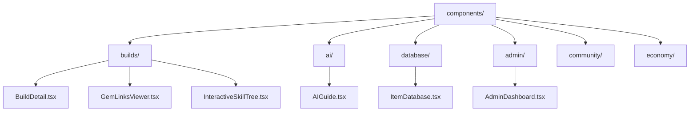
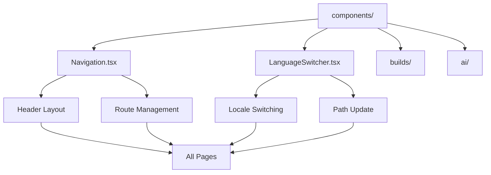

# Component Organization & Architecture

<cite>
**Referenced Files in This Document**   
- [BuildDetail.tsx](file://components/builds/BuildDetail.tsx)
- [Navigation.tsx](file://components/Navigation.tsx)
- [LanguageSwitcher.tsx](file://components/LanguageSwitcher.tsx)
- [GemLinksViewer.tsx](file://components/builds/GemLinksViewer.tsx)
- [InteractiveSkillTree.tsx](file://components/builds/InteractiveSkillTree.tsx)
- [CraftingGuide.tsx](file://components/builds/CraftingGuide.tsx)
- [GearPriorityChart.tsx](file://components/builds/GearPriorityChart.tsx)
- [BuildImportExport.tsx](file://components/builds/BuildImportExport.tsx)
- [AIGuide.tsx](file://components/ai/AIGuide.tsx)
- [ItemDatabase.tsx](file://components/database/ItemDatabase.tsx)
- [AdminDashboard.tsx](file://components/admin/AdminDashboard.tsx)
- [index.ts](file://types/index.ts)
- [utils.ts](file://lib/utils.ts)
- [tsconfig.json](file://tsconfig.json)
</cite>

## Table of Contents
1. [Introduction](#introduction)
2. [Feature-Based Component Grouping](#feature-based-component-grouping)
3. [Shared Global Components](#shared-global-components)
4. [Server and Client Component Division](#server-and-client-component-division)
5. [Module Import Structure](#module-import-structure)
6. [Type and Utility Integration](#type-and-utility-integration)
7. [Component Composition Patterns](#component-composition-patterns)
8. [Scalability and Module Addition](#scalability-and-module-addition)
9. [Architecture Diagram](#architecture-diagram)

## Introduction
The Prometheus-Planner V2 application implements a well-structured component organization pattern that follows modern React best practices with Next.js. The architecture emphasizes feature-based grouping, clear separation of concerns, and scalable design principles. This documentation details the component organization strategy, highlighting how the codebase maintains modularity, reusability, and maintainability through its directory structure and architectural patterns.

## Feature-Based Component Grouping
The component organization in Prometheus-Planner V2 follows a feature-based grouping strategy within the `components/` directory, where components are organized by domain functionality. This approach adheres to the single responsibility principle, ensuring each component directory contains only elements relevant to its specific feature domain.

The directory structure reflects distinct functional areas such as builds, ai, database, admin, and other game-related features. Each feature directory contains components that are specific to that domain, creating clear boundaries and reducing cross-dependency between unrelated features. This organization improves code discoverability and makes it easier for developers to locate and modify components related to specific functionality.



**Diagram sources**
- [components/builds/BuildDetail.tsx](file://components/builds/BuildDetail.tsx)
- [components/ai/AIGuide.tsx](file://components/ai/AIGuide.tsx)
- [components/database/ItemDatabase.tsx](file://components/database/ItemDatabase.tsx)
- [components/admin/AdminDashboard.tsx](file://components/admin/AdminDashboard.tsx)

**Section sources**
- [components/builds/BuildDetail.tsx](file://components/builds/BuildDetail.tsx)
- [components/ai/AIGuide.tsx](file://components/ai/AIGuide.tsx)
- [components/database/ItemDatabase.tsx](file://components/database/ItemDatabase.tsx)

## Shared Global Components
Shared components that serve global functionality across multiple feature domains are placed at the root level of the `components/` directory. This strategic placement enables universal access and reuse throughout the application without requiring complex import paths or duplication.

The Navigation.tsx and LanguageSwitcher.tsx components exemplify this pattern, providing essential UI functionality that spans across all pages and features. These components are designed with reusability in mind, implementing clean interfaces that can be easily integrated into any part of the application. By positioning these shared components at the root level, the architecture ensures consistent navigation and internationalization experiences across the entire application.



**Diagram sources**
- [components/Navigation.tsx](file://components/Navigation.tsx)
- [components/LanguageSwitcher.tsx](file://components/LanguageSwitcher.tsx)

**Section sources**
- [components/Navigation.tsx](file://components/Navigation.tsx)
- [components/LanguageSwitcher.tsx](file://components/LanguageSwitcher.tsx)

## Server and Client Component Division
The architecture implements a clear distinction between server and client components, leveraging Next.js App Router's React Server Components feature. This division optimizes performance by minimizing client-side JavaScript bundle size while maintaining interactivity where needed.

Interactive components that require client-side functionality such as state management, event handlers, or browser APIs use the `'use client'` directive at the top of the file. This includes components like BuildDetail.tsx, InteractiveSkillTree.tsx, and AIGuide.tsx, which implement user interactions, dynamic state changes, and real-time updates. Non-interactive, static UI elements remain as server components, allowing them to be rendered on the server and reducing the amount of JavaScript sent to the client.

This strategic division follows the principle of progressive enhancement, where the core content is delivered as server-rendered HTML, and interactivity is added only to components that require it. This approach improves initial load performance, enhances SEO, and reduces the client-side JavaScript footprint.

**Section sources**
- [components/builds/BuildDetail.tsx](file://components/builds/BuildDetail.tsx)
- [components/builds/InteractiveSkillTree.tsx](file://components/builds/InteractiveSkillTree.tsx)
- [components/ai/AIGuide.tsx](file://components/ai/AIGuide.tsx)
- [components/Navigation.tsx](file://components/Navigation.tsx)

## Module Import Structure
The project implements a clean and consistent module import structure using path aliases to improve code readability and maintainability. The `@/` alias is configured in the tsconfig.json file to map to the root directory, enabling absolute imports from any location in the codebase.

This import strategy eliminates the need for relative path traversals (e.g., `../../../`) which can become complex and error-prone in deeply nested directory structures. Instead, components can import dependencies using absolute paths that are easier to read, refactor, and maintain. For example, components import types using `@/types` and utilities using `@/lib/utils`, creating a consistent import pattern across the application.

The alias configuration in tsconfig.json establishes this import structure, making it easy for developers to understand the origin of imported modules regardless of the current file's location in the directory hierarchy.

**Section sources**
- [tsconfig.json](file://tsconfig.json)
- [components/builds/BuildDetail.tsx](file://components/builds/BuildDetail.tsx)
- [components/ai/AIGuide.tsx](file://components/ai/AIGuide.tsx)

## Type and Utility Integration
Components maintain consistency and type safety by consuming shared types from the `types/` directory and utilities from the `lib/` directory. This centralized approach to type definitions and utility functions ensures uniform data structures and behavior across the application.

The `types/index.ts` file exports comprehensive TypeScript interfaces that define the shape of data used throughout the application, such as the Build interface which standardizes build-related data across components. Components import these types using the `@/types` alias, ensuring type consistency and enabling better IDE support and compile-time error checking.

Similarly, the `lib/` directory contains shared utility functions that encapsulate common logic and operations. The `lib/utils.ts` file, for example, exports helper functions like `cn()` for conditional class name composition, `formatNumber()` for number formatting, and `formatDate()` for date formatting. These utilities promote code reuse and ensure consistent presentation and behavior across different components.

```mermaid
graph TD
A[Component] --> B[Import Types]
A --> C[Import Utilities]
B --> D[@/types]
C --> E[@/lib/utils]
D --> F[Build Interface]
D --> G[SkillTreeData]
D --> H[GemLink]
E --> I[cn function]
E --> J[formatNumber]
E --> K[formatDate]
F --> L[BuildDetail.tsx]
G --> M[InteractiveSkillTree.tsx]
H --> N[GemLinksViewer.tsx]
I --> O[All Components]
J --> P[Display Components]
K --> Q[Date Components]
```

**Diagram sources**
- [types/index.ts](file://types/index.ts)
- [lib/utils.ts](file://lib/utils.ts)
- [components/builds/BuildDetail.tsx](file://components/builds/BuildDetail.tsx)

**Section sources**
- [types/index.ts](file://types/index.ts)
- [lib/utils.ts](file://lib/utils.ts)
- [components/builds/BuildDetail.tsx](file://components/builds/BuildDetail.tsx)

## Component Composition Patterns
The architecture demonstrates effective component composition patterns, where complex views are built by combining smaller, focused sub-components. This approach follows the principle of composition over inheritance, creating flexible and reusable UI elements.

The BuildDetail.tsx component serves as a prime example of this pattern, importing and orchestrating multiple sub-components to create a comprehensive build view. It composes the InteractiveSkillTree, GemLinksViewer, CraftingGuide, GearPriorityChart, and BuildImportExport components, each responsible for a specific aspect of build information. This composition allows for independent development and testing of each sub-component while enabling the creation of rich, feature-complete views.

This pattern promotes reusability, as sub-components like GemLinksViewer can be used in multiple contexts beyond the build detail page. It also improves maintainability by isolating functionality and reducing the cognitive load when working with complex UIs. The parent component manages the overall layout and state, while child components handle their specific domains of responsibility.

**Section sources**
- [components/builds/BuildDetail.tsx](file://components/builds/BuildDetail.tsx)
- [components/builds/GemLinksViewer.tsx](file://components/builds/GemLinksViewer.tsx)
- [components/builds/InteractiveSkillTree.tsx](file://components/builds/InteractiveSkillTree.tsx)
- [components/builds/CraftingGuide.tsx](file://components/builds/CraftingGuide.tsx)
- [components/builds/GearPriorityChart.tsx](file://components/builds/GearPriorityChart.tsx)
- [components/builds/BuildImportExport.tsx](file://components/builds/BuildImportExport.tsx)

## Scalability and Module Addition
The component organization pattern is designed with scalability in mind, making it straightforward to add new feature modules to the application. The feature-based directory structure provides a clear blueprint for introducing new domains, following the established patterns of the existing codebase.

To add a new feature module, developers create a new directory under `components/` with a descriptive name that reflects the feature domain. Within this directory, they implement the necessary components following the same principles of single responsibility and client/server separation. The new components can leverage the existing type system and utility functions, ensuring consistency with the rest of the application.

The import alias system and centralized type definitions further enhance scalability by providing a consistent development experience regardless of when or where new components are added. This architectural approach allows the codebase to grow organically while maintaining structural integrity and developer productivity.

**Section sources**
- [components/builds/BuildDetail.tsx](file://components/builds/BuildDetail.tsx)
- [components/ai/AIGuide.tsx](file://components/ai/AIGuide.tsx)
- [components/database/ItemDatabase.tsx](file://components/database/ItemDatabase.tsx)

## Architecture Diagram
The following diagram illustrates the overall component architecture of Prometheus-Planner V2, showing the relationships between the main structural elements of the codebase.

```mermaid
graph TD
A[Root Components] --> B[Navigation.tsx]
A --> C[LanguageSwitcher.tsx]
D[Feature Components] --> E[builds/]
D --> F[ai/]
D --> G[database/]
D --> H[admin/]
E --> I[BuildDetail.tsx]
E --> J[Sub-components]
F --> K[AIGuide.tsx]
G --> L[ItemDatabase.tsx]
H --> M[AdminDashboard.tsx]
I --> N[InteractiveSkillTree]
I --> O[GemLinksViewer]
I --> P[CraftingGuide]
I --> Q[GearPriorityChart]
I --> R[BuildImportExport]
B --> S[Global UI]
C --> T[Internationalization]
U[Shared Resources] --> V[@/types]
U --> W[@/lib]
V --> X[Type Definitions]
W --> Y[Utility Functions]
I -.-> V
J -.-> V
K -.-> V
L -.-> V
M -.-> V
I -.-> W
J -.-> W
K -.-> W
L -.-> W
M -.-> W
B -.-> W
C -.-> W
```

**Diagram sources**
- [components/Navigation.tsx](file://components/Navigation.tsx)
- [components/LanguageSwitcher.tsx](file://components/LanguageSwitcher.tsx)
- [components/builds/BuildDetail.tsx](file://components/builds/BuildDetail.tsx)
- [components/ai/AIGuide.tsx](file://components/ai/AIGuide.tsx)
- [components/database/ItemDatabase.tsx](file://components/database/ItemDatabase.tsx)
- [components/admin/AdminDashboard.tsx](file://components/admin/AdminDashboard.tsx)
- [types/index.ts](file://types/index.ts)
- [lib/utils.ts](file://lib/utils.ts)