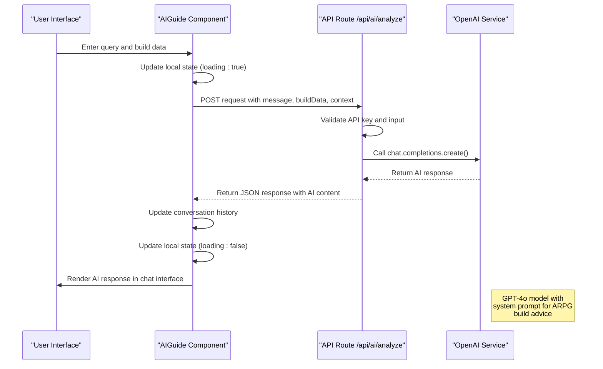

# Data Flow & State Architecture

<cite>
**Referenced Files in This Document**   
- [app/api/ai/analyze/route.ts](file://app/api/ai/analyze/route.ts)
- [lib/api/sync.ts](file://lib/api/sync.ts)
- [components/ai/AIGuide.tsx](file://components/ai/AIGuide.tsx)
- [components/economy/EconomyTracker.tsx](file://components/economy/EconomyTracker.tsx)
- [components/database/ItemDatabase.tsx](file://components/database/ItemDatabase.tsx)
- [components/builds/BuildList.tsx](file://components/builds/BuildList.tsx)
- [types/index.ts](file://types/index.ts)
- [package.json](file://package.json)
- [PROJECT_STATUS.md](file://PROJECT_STATUS.md)
</cite>

## Table of Contents
1. [Introduction](#introduction)
2. [Data Flow Architecture Overview](#data-flow-architecture-overview)
3. [Server-Side Data Flow](#server-side-data-flow)
4. [Client-Side Data Flow](#client-side-data-flow)
5. [External Data Synchronization](#external-data-synchronization)
6. [State Management Strategy](#state-management-strategy)
7. [AI Analysis Workflow](#ai-analysis-workflow)
8. [Error Handling and Loading States](#error-handling-and-loading-states)
9. [Caching and Performance Optimization](#caching-and-performance-optimization)
10. [Configuration and Environment Variables](#configuration-and-environment-variables)

## Introduction
The Prometheus-Planner V2 application implements a modern data flow architecture that integrates server-side API routes, client-side components, and external services to provide a comprehensive build planning experience for ARPG players. The system is designed to handle data synchronization from game APIs and third-party services like poe.ninja, process AI analysis requests through OpenAI, and manage both local and global state effectively. This document details the data flow patterns, state management strategies, and integration points that enable the application's core functionality.

## Data Flow Architecture Overview

```mermaid
graph TD
subgraph "Client Components"
AIGuide["AI Guide Component"]
EconomyTracker["Economy Tracker"]
ItemDatabase["Item Database"]
BuildList["Build List"]
end
subgraph "Server-Side"
APIRoute["API Route: /api/ai/analyze"]
SyncLib["lib/api/sync.ts"]
end
subgraph "External Systems"
OpenAI["OpenAI API"]
PoENinja["poe.ninja API"]
GameAPIs["Game APIs"]
end
AIGuide --> |POST /api/ai/analyze| APIRoute
APIRoute --> |OpenAI SDK| OpenAI
OpenAI --> |Streaming Response| APIRoute
APIRoute --> |JSON Response| AIGuide
SyncLib --> |Fetch| PoENinja
SyncLib --> |Fetch| GameAPIs
SyncLib --> |Store Data| Database[(Application Database)]
EconomyTracker --> |Display| Database
ItemDatabase --> |Display| Database
BuildList --> |Display| Database
style AIGuide fill:#141417,stroke:#3d3d43
style EconomyTracker fill:#141417,stroke:#3d3d43
style ItemDatabase fill:#141417,stroke:#3d3d43
style BuildList fill:#141417,stroke:#3d3d43
style APIRoute fill:#141417,stroke:#3d3d43
style SyncLib fill:#141417,stroke:#3d3d43
```

**Diagram sources**
- [app/api/ai/analyze/route.ts](file://app/api/ai/analyze/route.ts)
- [lib/api/sync.ts](file://lib/api/sync.ts)
- [components/ai/AIGuide.tsx](file://components/ai/AIGuide.tsx)

**Section sources**
- [app/api/ai/analyze/route.ts](file://app/api/ai/analyze/route.ts)
- [lib/api/sync.ts](file://lib/api/sync.ts)
- [components/ai/AIGuide.tsx](file://components/ai/AIGuide.tsx)

## Server-Side Data Flow

The server-side data flow in Prometheus-Planner V2 is centered around Next.js API routes that handle specific functionality. The primary API endpoint at `app/api/ai/analyze/route.ts` serves as the integration point between the client application and the OpenAI service. This route receives user input and build context from the client, processes it with appropriate validation, and forwards the request to the OpenAI API using the official OpenAI SDK.

The API route implements a structured data flow: it first validates the presence of required environment variables (specifically the OpenAI API key), then parses the incoming request body to extract the user message, build data, and additional context. These elements are combined into a formatted user message that provides contextual information to the AI model. The system uses a predefined system prompt that establishes the AI's role as an expert ARPG build advisor, ensuring consistent and relevant responses.

Error handling is implemented at multiple levels, with specific handling for OpenAI API errors and general internal server errors. The response structure includes not only the AI-generated content but also metadata about the model used and token usage, providing transparency into the AI processing. This server-side component acts as a secure intermediary, protecting the OpenAI API key from exposure to the client while enabling rich AI-powered functionality.

**Section sources**
- [app/api/ai/analyze/route.ts](file://app/api/ai/analyze/route.ts)

## Client-Side Data Flow

Client-side data flow in Prometheus-Planner V2 follows a component-based pattern where individual components handle their own data fetching and state management. The application uses React's built-in hooks for local state management within components, with `useState` being the primary mechanism for managing interactive states such as form inputs, loading indicators, and UI state.

The AI Guide component (`components/ai/AIGuide.tsx`) demonstrates a typical client-side data flow pattern: user input is captured through controlled components, state is updated locally to reflect the conversation history, and API calls are made to the server when needed. During API requests, loading states are managed through boolean flags that control the display of loading indicators, providing visual feedback to users during asynchronous operations.

Other components like the Economy Tracker and Item Database currently use mock data but are designed to eventually fetch data from API endpoints. The data flow pattern across these components is consistent: initialization of state, event handling for user interactions, conditional rendering based on state, and updates to the UI in response to data changes. The application is structured to support both direct API calls from components and data passed down from parent components or context providers.

**Section sources**
- [components/ai/AIGuide.tsx](file://components/ai/AIGuide.tsx)
- [components/economy/EconomyTracker.tsx](file://components/economy/EconomyTracker.tsx)
- [components/database/ItemDatabase.tsx](file://components/database/ItemDatabase.tsx)

## External Data Synchronization

The `lib/api/sync.ts` file defines the application's external data synchronization framework, which is designed to integrate with various third-party services and game APIs. This module exports several functions for synchronizing different types of data, including item databases, economy data from poe.ninja, patch notes, and leaderboards.

Each synchronization function follows a consistent pattern: it attempts to fetch data from external sources, process it appropriately, and store it in the application's database. The functions return a standardized `SyncResult` interface that includes success status, metadata about the sync operation, and error information when applicable. This consistent return structure enables uniform handling of synchronization results across the application.

Although the current implementation contains placeholder code (indicated by TODO comments and commented-out fetch operations), the architecture is designed to support regular, automated synchronization of external data. The `SyncConfig` interface suggests that synchronization can be configured with specific intervals and enabled/disabled as needed, allowing for flexible data update strategies based on the volatility and importance of different data types.

**Section sources**
- [lib/api/sync.ts](file://lib/api/sync.ts)

## State Management Strategy

Prometheus-Planner V2 employs a tiered state management strategy that combines React's built-in state hooks with Zustand for potential global state needs. Currently, the application primarily uses React's `useState` hook for local component state management, as evidenced by multiple components that manage their own state for UI interactions, form inputs, and loading states.

According to the project status documentation, Zustand is available and ready for global state management when needed, indicating a deliberate architectural decision to start with simpler local state solutions and escalate to global state management only when necessary. This approach follows React best practices by avoiding premature complexity while ensuring scalability for features that require shared state across multiple components.

The application also leverages `useTranslations` from next-intl for internationalization state, demonstrating the use of custom hooks for specialized state management needs. Form state is handled by react-hook-form, which is included in the dependencies, suggesting a structured approach to form management that separates form state from component state for better performance and maintainability.

**Section sources**
- [components/ai/AIGuide.tsx](file://components/ai/AIGuide.tsx)
- [components/builds/BuildList.tsx](file://components/builds/BuildList.tsx)
- [PROJECT_STATUS.md](file://PROJECT_STATUS.md)

## AI Analysis Workflow

**Diagram sources**
- [app/api/ai/analyze/route.ts](file://app/api/ai/analyze/route.ts)
- [components/ai/AIGuide.tsx](file://components/ai/AIGuide.tsx)

**Section sources**
- [app/api/ai/analyze/route.ts](file://app/api/ai/analyze/route.ts)
- [components/ai/AIGuide.tsx](file://components/ai/AIGuide.tsx)

## Error Handling and Loading States

The application implements error handling and loading states at both the client and server levels. On the server side, the AI analysis route includes comprehensive error handling that checks for missing API keys and invalid input, returning appropriate HTTP status codes and error messages. Specific error handling for OpenAI API errors allows for differentiated responses based on the type of error encountered, while also logging errors to the console for debugging purposes.

On the client side, loading states are managed through boolean flags that control the display of loading indicators. The AI Guide component, for example, uses an `isLoading` state variable to show a loading animation when waiting for AI responses. This provides immediate visual feedback to users, improving the perceived performance of the application. Error states are currently handled through conditional rendering, with components displaying appropriate messages when data is unavailable or operations fail.

The project status documentation indicates that proper error boundaries, loading states, and error handling are items in the technical debt list, suggesting that while basic implementations exist, there is room for enhancement in these areas to provide a more robust user experience across the entire application.

**Section sources**
- [app/api/ai/analyze/route.ts](file://app/api/ai/analyze/route.ts)
- [components/ai/AIGuide.tsx](file://components/ai/AIGuide.tsx)
- [PROJECT_STATUS.md](file://PROJECT_STATUS.md)

## Caching and Performance Optimization

While explicit caching mechanisms are not yet implemented in the current codebase, the architecture is designed with performance optimization in mind. The project status documentation identifies caching strategy implementation as a technical debt item, indicating recognition of its importance for future development. The separation of data synchronization logic into the `lib/api/sync.ts` module suggests an intention to implement periodic data updates rather than real-time fetching, which serves as a form of caching by reducing the frequency of external API calls.

The AI analysis workflow includes parameters like `max_tokens` and `temperature` that can be adjusted to balance response quality and cost/performance. The use of Next.js provides built-in opportunities for server-side rendering and static generation, which can significantly improve performance for content that doesn't change frequently. The component structure, with clear separation of concerns and reusable UI elements, supports efficient rendering and minimizes unnecessary re-renders.

Payload size reduction is addressed through selective data transmission: the AI analysis endpoint only sends necessary context (message, buildData, context) rather than entire application state, minimizing network overhead. The type definitions in `types/index.ts` ensure type safety and can help prevent runtime errors that might impact performance.

**Section sources**
- [lib/api/sync.ts](file://lib/api/sync.ts)
- [app/api/ai/analyze/route.ts](file://app/api/ai/analyze/route.ts)
- [types/index.ts](file://types/index.ts)
- [PROJECT_STATUS.md](file://PROJECT_STATUS.md)

## Configuration and Environment Variables

The application relies on environment variables for configuration, particularly for external service integrations. The AI analysis route explicitly checks for the presence of `OPENAI_API_KEY` in the environment variables, demonstrating a secure approach to managing sensitive credentials. This pattern protects API keys from being exposed in the client-side code or version control.

The architecture is designed to support configuration of various API endpoints and service integrations through environment variables, allowing for different settings in development, staging, and production environments. The presence of placeholder URLs in the sync module comments suggests that actual API endpoints will be configured through environment variables once implemented.

The application also uses environment variables for internationalization configuration, with locale settings defined in `i18n.ts` and middleware that handles locale detection and routing. This configuration approach enables flexible deployment across different regions and languages without requiring code changes, supporting the application's global accessibility goals.

**Section sources**
- [app/api/ai/analyze/route.ts](file://app/api/ai/analyze/route.ts)
- [lib/api/sync.ts](file://lib/api/sync.ts)
- [middleware.ts](file://middleware.ts)
- [PROJECT_STATUS.md](file://PROJECT_STATUS.md)