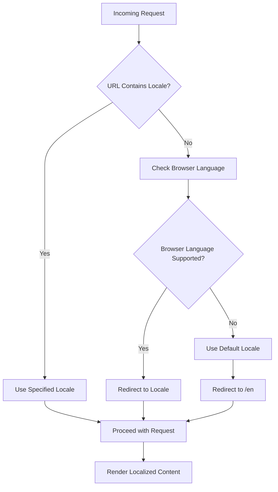
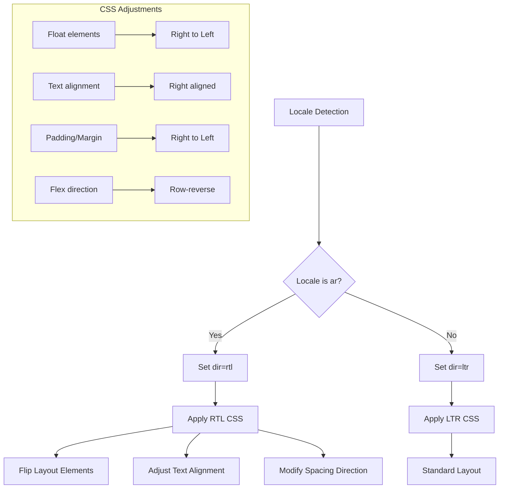
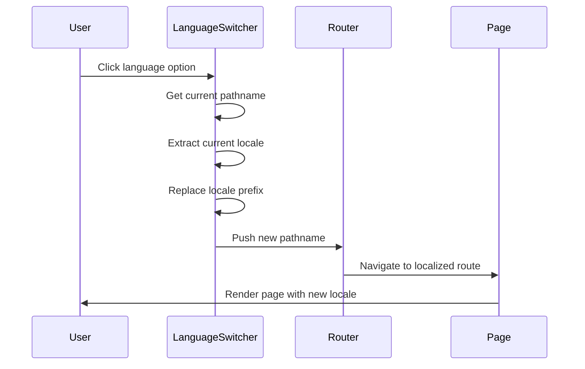
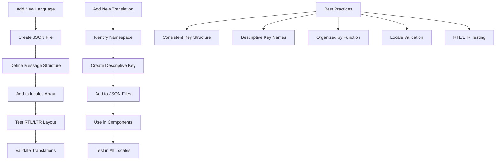

# Internationalization & Locale Routing

<cite>
**Referenced Files in This Document**   
- [middleware.ts](file://middleware.ts)
- [i18n.ts](file://i18n.ts)
- [app/[locale]/layout.tsx](file://app/[locale]/layout.tsx)
- [messages/en.json](file://messages/en.json)
- [messages/ar.json](file://messages/ar.json)
- [components/LanguageSwitcher.tsx](file://components/LanguageSwitcher.tsx)
- [app/globals.css](file://app/globals.css)
- [app/page.tsx](file://app/page.tsx)
</cite>

## Table of Contents
1. [Introduction](#introduction)
2. [Middleware Request Interception](#middleware-request-interception)
3. [Internationalization Configuration](#internationalization-configuration)
4. [Locale-Aware Routing System](#locale-aware-routing-system)
5. [Message File Structure](#message-file-structure)
6. [RTL Support Implementation](#rtl-support-implementation)
7. [Language Switching Mechanism](#language-switching-mechanism)
8. [Translation Usage in Components](#translation-usage-in-components)
9. [Best Practices for Internationalization](#best-practices-for-internationalization)

## Introduction
The Prometheus-Planner V2 application implements a comprehensive internationalization system that supports English (en) and Arabic (ar) languages with full RTL (right-to-left) layout support for Arabic. The system leverages Next.js with the next-intl library to provide locale-aware routing, automatic language detection, and seamless translation management. This documentation details the architecture and implementation of the internationalization system, covering middleware interception, locale configuration, message management, and RTL support.

## Middleware Request Interception
The middleware.ts file intercepts all incoming requests to detect and redirect users based on their preferred language. It uses the next-intl middleware to automatically handle locale detection from various sources including URL parameters, cookies, and browser language preferences.



**Diagram sources**
- [middleware.ts](file://middleware.ts#L1-L15)

**Section sources**
- [middleware.ts](file://middleware.ts#L1-L15)

## Internationalization Configuration
The i18n.ts configuration file defines the supported locales and sets up the internationalization framework. It exports the supported locales array, defines the default locale, and configures the message loading mechanism for the next-intl library.

```mermaid
classDiagram
class i18nConfig {
+locales : string[]
+defaultLocale : string
+Locale : type
+getRequestConfig()
}
i18nConfig --> "1" LocaleSupport : defines
LocaleSupport --> "2" Language : supports
Language --> "en" : English
Language --> "ar" : Arabic
```

**Diagram sources**
- [i18n.ts](file://i18n.ts#L4-L16)

**Section sources**
- [i18n.ts](file://i18n.ts#L4-L16)

## Locale-Aware Routing System
The application implements locale-aware routing through the [locale] dynamic segment in the app directory. This enables localized versions of all pages with proper URL routing patterns. The system automatically generates static paths for each supported locale and validates locale parameters to prevent invalid locale access.

```mermaid
flowchart TB
subgraph "URL Structure"
A[/] --> B[/{locale}]
B --> C[/{locale}/builds]
B --> D[/{locale}/database]
B --> E[/{locale}/ai]
B --> F[/{locale}/community]
end
subgraph "Routing Logic"
G[Root Request] --> H[Redirect to /en]
H --> I[Locale Validation]
I --> J{Valid Locale?}
J --> |Yes| K[Render Localized Page]
J --> |No| L[Return 404]
end
```

**Diagram sources**
- [app/[locale]/layout.tsx](file://app/[locale]/layout.tsx#L8-L10)
- [app/page.tsx](file://app/page.tsx#L4-L6)

**Section sources**
- [app/[locale]/layout.tsx](file://app/[locale]/layout.tsx#L8-L10)
- [app/page.tsx](file://app/page.tsx#L4-L6)

## Message File Structure
The messages directory contains JSON files for each supported language, providing translated content for all UI elements. The structure follows a nested key organization by functional areas (common, nav, builds, etc.), enabling modular translation management and easy maintenance.

```mermaid
erDiagram
MESSAGES ||--o{ ENGLISH : contains
MESSAGES ||--o{ ARABIC : contains
ENGLISH ||--o{ COMMON : contains
ENGLISH ||--o{ NAVIGATION : contains
ENGLISH ||--o{ BUILDS : contains
ENGLISH ||--o{ DATABASE : contains
ENGLISH ||--o{ AI : contains
ARABIC ||--o{ COMMON : contains
ARABIC ||--o{ NAVIGATION : contains
ARABIC ||--o{ BUILDS : contains
ARABIC ||--o{ DATABASE : contains
ARABIC ||--o{ AI : contains
class COMMON {
appName: string
language: string
search: string
filter: string
}
class NAVIGATION {
home: string
builds: string
database: string
aiGuide: string
}
```

**Diagram sources**
- [messages/en.json](file://messages/en.json)
- [messages/ar.json](file://messages/ar.json)

**Section sources**
- [messages/en.json](file://messages/en.json)
- [messages/ar.json](file://messages/ar.json)

## RTL Support Implementation
The application implements comprehensive RTL support for Arabic language users, including CSS adjustments and layout flipping. The system automatically applies RTL styling based on the current locale, ensuring proper text direction, layout alignment, and UI element positioning for Arabic users.



**Diagram sources**
- [app/[locale]/layout.tsx](file://app/[locale]/layout.tsx#L35-L37)
- [app/globals.css](file://app/globals.css#L11-L18)

**Section sources**
- [app/[locale]/layout.tsx](file://app/[locale]/layout.tsx#L35-L37)
- [app/globals.css](file://app/globals.css#L11-L18)

## Language Switching Mechanism
The LanguageSwitcher component enables users to switch between available languages while preserving their current route path. When a user selects a new language, the component replaces the locale prefix in the current pathname and navigates to the localized version of the same page.



**Diagram sources**
- [components/LanguageSwitcher.tsx](file://components/LanguageSwitcher.tsx#L19-L22)

**Section sources**
- [components/LanguageSwitcher.tsx](file://components/LanguageSwitcher.tsx#L19-L22)

## Translation Usage in Components
Components use translations through the useTranslations hook from next-intl, which provides access to message keys organized by namespaces. This approach enables type-safe access to translation keys and supports nested message structures for better organization.

```mermaid
classDiagram
class TranslationSystem {
+useTranslations()
+getMessages()
+getRequestConfig()
}
TranslationSystem --> "1" MessageNamespace : uses
MessageNamespace --> "n" TranslationKey : contains
TranslationKey --> "common" : Common UI elements
TranslationKey --> "nav" : Navigation labels
TranslationKey --> "builds" : Build-related text
TranslationKey --> "ai" : AI feature text
class Component {
+useTranslations()
+render()
}
Component --> TranslationSystem : depends on
```

**Diagram sources**
- [app/[locale]/page.tsx](file://app/[locale]/page.tsx#L22-L23)
- [components/Navigation.tsx](file://components/Navigation.tsx#L21-L22)

**Section sources**
- [app/[locale]/page.tsx](file://app/[locale]/page.tsx#L22-L23)
- [components/Navigation.tsx](file://components/Navigation.tsx#L21-L22)

## Best Practices for Internationalization
The internationalization system in Prometheus-Planner V2 follows several best practices for adding new translations and supporting additional languages. These include maintaining consistent message key structures, using descriptive key names, organizing messages by functional areas, and implementing proper locale validation.



**Section sources**
- [i18n.ts](file://i18n.ts#L4-L7)
- [messages/en.json](file://messages/en.json)
- [messages/ar.json](file://messages/ar.json)