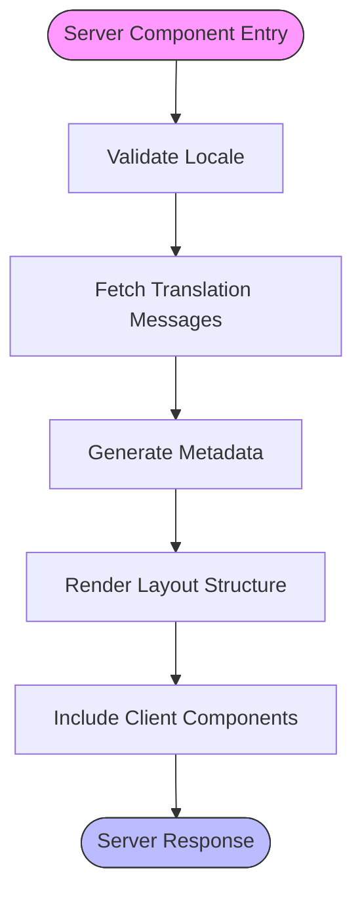

# Server vs Client Components

<cite>
**Referenced Files in This Document**   
- [app/layout.tsx](file://app/layout.tsx)
- [app/[locale]/layout.tsx](file://app/[locale]/layout.tsx)
- [components/ai/AIGuide.tsx](file://components/ai/AIGuide.tsx)
- [components/builds/InteractiveSkillTree.tsx](file://components/builds/InteractiveSkillTree.tsx)
- [components/Navigation.tsx](file://components/Navigation.tsx)
- [components/LanguageSwitcher.tsx](file://components/LanguageSwitcher.tsx)
- [app/[locale]/ai/page.tsx](file://app/[locale]/ai/page.tsx)
- [app/[locale]/builds/[id]/page.tsx](file://app/[locale]/builds/[id]/page.tsx)
- [lib/seo.ts](file://lib/seo.ts)
</cite>

## Table of Contents
1. [Introduction](#introduction)
2. [Project Structure](#project-structure)
3. [Core Components](#core-components)
4. [Architecture Overview](#architecture-overview)
5. [Detailed Component Analysis](#detailed-component-analysis)
6. [Dependency Analysis](#dependency-analysis)
7. [Performance Considerations](#performance-considerations)
8. [Troubleshooting Guide](#troubleshooting-guide)
9. [Conclusion](#conclusion)

## Introduction
The Prometheus-Planner V2 application implements a modern React Server Components architecture that strategically separates server and client components to optimize performance, reduce bundle size, and enhance user experience. This documentation details the architectural decisions, component patterns, and best practices used in the application to leverage the strengths of both server and client components effectively.

## Project Structure

```mermaid
graph TB
subgraph "App Directory"
A[app/layout.tsx] --> B[app/[locale]/layout.tsx]
B --> C[app/[locale]/page.tsx]
B --> D[app/[locale]/ai/page.tsx]
B --> E[app/[locale]/builds/[id]/page.tsx]
end
subgraph "Components"
F[components/Navigation.tsx] --> G[components/ai/AIGuide.tsx]
H[components/builds/InteractiveSkillTree.tsx] --> I[components/LanguageSwitcher.tsx]
end
subgraph "Libraries"
J[lib/seo.ts]
end
A --> F
D --> G
E --> H
E --> J
```

**Diagram sources**
- [app/layout.tsx](file://app/layout.tsx)
- [app/[locale]/layout.tsx](file://app/[locale]/layout.tsx)
- [components/Navigation.tsx](file://components/Navigation.tsx)
- [components/ai/AIGuide.tsx](file://components/ai/AIGuide.tsx)
- [components/builds/InteractiveSkillTree.tsx](file://components/builds/InteractiveSkillTree.tsx)
- [lib/seo.ts](file://lib/seo.ts)

**Section sources**
- [app/layout.tsx](file://app/layout.tsx)
- [app/[locale]/layout.tsx](file://app/[locale]/layout.tsx)

## Core Components

The Prometheus-Planner V2 application implements a clear separation between server and client components, following Next.js App Router conventions. Server components handle layout, metadata generation, and data fetching, while client components manage interactivity, state, and user events.

Server components like `app/[locale]/layout.tsx` handle internationalization, metadata generation, and layout structure, rendering on the server to minimize client-side JavaScript. These components can directly access backend resources and APIs without exposing sensitive logic to the client.

Client components such as `AIGuide.tsx` and `InteractiveSkillTree.tsx` are marked with the `'use client'` directive and manage state, user interactions, and real-time updates. These components implement complex UI logic that requires client-side execution and event handling.

**Section sources**
- [app/[locale]/layout.tsx](file://app/[locale]/layout.tsx#L1-L49)
- [components/ai/AIGuide.tsx](file://components/ai/AIGuide.tsx#L1-L131)
- [components/builds/InteractiveSkillTree.tsx](file://components/builds/InteractiveSkillTree.tsx#L1-L173)

## Architecture Overview

```mermaid
graph TD
subgraph "Server Components"
A[app/layout.tsx] --> B[app/[locale]/layout.tsx]
B --> C[generateMetadata]
B --> D[getMessages]
B --> E[Navigation]
F[app/[locale]/builds/[id]/page.tsx] --> G[generateBuildSEOMeta]
end
subgraph "Client Components"
H[AIGuide.tsx] --> I[useState]
H --> J[useTranslations]
K[InteractiveSkillTree.tsx] --> L[useState]
K --> M[useRef]
K --> N[useEffect]
O[Navigation.tsx] --> P[useTranslations]
O --> Q[useLocale]
O --> R[usePathname]
end
B --> H
F --> K
A --> O
```

**Diagram sources**
- [app/layout.tsx](file://app/layout.tsx)
- [app/[locale]/layout.tsx](file://app/[locale]/layout.tsx)
- [components/ai/AIGuide.tsx](file://components/ai/AIGuide.tsx)
- [components/builds/InteractiveSkillTree.tsx](file://components/builds/InteractiveSkillTree.tsx)
- [components/Navigation.tsx](file://components/Navigation.tsx)
- [lib/seo.ts](file://lib/seo.ts)

## Detailed Component Analysis

### Server Components Analysis

Server components in Prometheus-Planner V2 are strategically used for layouts, metadata generation, and non-interactive UI elements to improve performance through server-side rendering and reduced bundle size.

The root layout component `app/layout.tsx` serves as the outermost container that wraps all pages with basic HTML structure. This server component defines the document structure without requiring interactivity, making it ideal for server rendering.

The locale-specific layout `app/[locale]/layout.tsx` demonstrates advanced server component patterns by handling internationalization, metadata generation, and locale validation. This component uses server-only functions like `getMessages()` from next-intl/server to fetch translation messages and provide them to the client through the NextIntlClientProvider. The component also generates metadata and handles RTL/LTR direction based on locale, all processed on the server.

Build detail pages like `app/[locale]/builds/[id]/page.tsx` showcase data fetching and SEO optimization patterns. These server components generate rich metadata using the `generateBuildSEOMeta` function from lib/seo.ts, creating optimized titles, descriptions, and Open Graph tags based on build data. By performing this logic on the server, the application ensures search engines receive fully rendered content while minimizing client-side JavaScript.



**Diagram sources**
- [app/[locale]/layout.tsx](file://app/[locale]/layout.tsx#L8-L49)
- [app/[locale]/builds/[id]/page.tsx](file://app/[locale]/builds/[id]/page.tsx#L89-L96)
- [lib/seo.ts](file://lib/seo.ts#L3-L39)

**Section sources**
- [app/layout.tsx](file://app/layout.tsx#L1-L10)
- [app/[locale]/layout.tsx](file://app/[locale]/layout.tsx#L1-L49)
- [app/[locale]/builds/[id]/page.tsx](file://app/[locale]/builds/[id]/page.tsx#L89-L101)
- [lib/seo.ts](file://lib/seo.ts#L1-L49)

### Client Components Analysis

Client components in Prometheus-Planner V2 are used for interactive features that require state management, event handlers, and real-time updates. These components are marked with the `'use client'` directive to indicate they should be hydrated on the client side.

The `AIGuide.tsx` component implements a chat interface with stateful interactions, using useState hooks to manage message history, input state, and loading status. This component handles user events like sending messages and displays real-time responses with loading indicators. The component also uses client-side translation hooks from next-intl to provide localized content after the initial server render.

The `InteractiveSkillTree.tsx` component demonstrates complex interactive UI patterns with zoom, pan, and node selection functionality. It uses multiple state variables to track zoom level, pan position, and selected nodes, along with useRef to access DOM elements for event handling. The component implements mouse event handlers for dragging and zooming, requiring client-side execution for responsive interactions.

Navigation components like `Navigation.tsx` and `LanguageSwitcher.tsx` handle user interactions for routing and locale switching. These components use Next.js navigation hooks to access current pathname and locale, updating UI based on route changes and handling click events to navigate between pages.


**Diagram sources**
- [components/ai/AIGuide.tsx](file://components/ai/AIGuide.tsx#L1-L131)
- [components/builds/InteractiveSkillTree.tsx](file://components/builds/InteractiveSkillTree.tsx#L1-L173)
- [components/Navigation.tsx](file://components/Navigation.tsx#L1-L99)
- [components/LanguageSwitcher.tsx](file://components/LanguageSwitcher.tsx#L1-L65)

**Section sources**
- [components/ai/AIGuide.tsx](file://components/ai/AIGuide.tsx#L1-L131)
- [components/builds/InteractiveSkillTree.tsx](file://components/builds/InteractiveSkillTree.tsx#L1-L173)
- [components/Navigation.tsx](file://components/Navigation.tsx#L1-L99)
- [components/LanguageSwitcher.tsx](file://components/LanguageSwitcher.tsx#L1-L65)

### Component Boundary Analysis

The boundary between server and client components in Prometheus-Planner V2 follows Next.js conventions, with clear rules for prop passing and serialization. Server components can import and render client components, but not vice versa.

When server components pass props to client components, the data must be serializable. Complex objects like functions, dates, or React elements cannot be passed across the boundary. In the application, server components pass simple data structures like build information or configuration objects to client components.

The `app/[locale]/ai/page.tsx` demonstrates the component boundary pattern, where a server component renders the `AIGuide` client component without passing any props. This pattern is used when the client component manages its own state and data fetching.

For cases requiring data transfer, the application uses serialized plain objects. For example, build data is passed from the server-rendered `app/[locale]/builds/[id]/page.tsx` to the `BuildDetail` client component as a serializable Build object, with all functions and non-serializable properties removed.

```mermaid
classDiagram
class ServerComponent {
+generateMetadata()
+getMessages()
+validateLocale()
}
class ClientComponent {
+useState()
+useEffect()
+useRef()
+eventHandlers()
}
class SerializableData {
+string
+number
+boolean
+null
+object
+array
}
ServerComponent --> ClientComponent : "renders"
ServerComponent --> SerializableData : "passes props"
ClientComponent --> SerializableData : "receives props"
note right of ServerComponent
Runs only on server
Can access backend resources
No client-side JavaScript
end note
note right of ClientComponent
Hydrated on client
Manages state and effects
Handles user interactions
end note
```

**Diagram sources**
- [app/[locale]/ai/page.tsx](file://app/[locale]/ai/page.tsx#L1-L20)
- [app/[locale]/builds/[id]/page.tsx](file://app/[locale]/builds/[id]/page.tsx#L98-L100)
- [components/ai/AIGuide.tsx](file://components/ai/AIGuide.tsx#L1-L131)

**Section sources**
- [app/[locale]/ai/page.tsx](file://app/[locale]/ai/page.tsx#L1-L20)
- [app/[locale]/builds/[id]/page.tsx](file://app/[locale]/builds/[id]/page.tsx#L1-L101)

## Dependency Analysis

```mermaid
graph TD
A[app/layout.tsx] --> B[app/[locale]/layout.tsx]
B --> C[Navigation]
B --> D[NextIntlClientProvider]
C --> E[useTranslations]
C --> F[useLocale]
C --> G[usePathname]
D --> H[getMessages]
I[app/[locale]/ai/page.tsx] --> J[AIGuide]
J --> K[useState]
J --> L[useTranslations]
M[app/[locale]/builds/[id]/page.tsx] --> N[BuildDetail]
M --> O[generateBuildSEOMeta]
O --> P[Build]
```

**Diagram sources**
- [app/layout.tsx](file://app/layout.tsx)
- [app/[locale]/layout.tsx](file://app/[locale]/layout.tsx)
- [components/Navigation.tsx](file://components/Navigation.tsx)
- [components/ai/AIGuide.tsx](file://components/ai/AIGuide.tsx)
- [app/[locale]/ai/page.tsx](file://app/[locale]/ai/page.tsx)
- [app/[locale]/builds/[id]/page.tsx](file://app/[locale]/builds/[id]/page.tsx)
- [lib/seo.ts](file://lib/seo.ts)

**Section sources**
- [app/layout.tsx](file://app/layout.tsx)
- [app/[locale]/layout.tsx](file://app/[locale]/layout.tsx)
- [components/Navigation.tsx](file://components/Navigation.tsx)
- [components/ai/AIGuide.tsx](file://components/ai/AIGuide.tsx)
- [app/[locale]/ai/page.tsx](file://app/[locale]/ai/page.tsx)
- [app/[locale]/builds/[id]/page.tsx](file://app/[locale]/builds/[id]/page.tsx)
- [lib/seo.ts](file://lib/seo.ts)

## Performance Considerations

The server-client component architecture in Prometheus-Planner V2 provides significant performance benefits by minimizing client-side JavaScript and optimizing rendering. Server components reduce bundle size by keeping non-interactive logic on the server, resulting in faster initial page loads and improved time to interactive.

By using server components for layouts and metadata, the application ensures search engines receive fully rendered content while reducing the amount of JavaScript that needs to be downloaded and executed on the client. This approach improves SEO and accessibility while maintaining rich interactive features where needed.

The strategic placement of client components ensures that only essential interactivity is shipped to the client. Components like `AIGuide.tsx` and `InteractiveSkillTree.tsx` are isolated to specific routes, preventing unnecessary JavaScript loading on pages that don't require their functionality.

Data fetching patterns further enhance performance by allowing server components to directly access backend resources without the overhead of API calls. This reduces network latency and eliminates the need for loading states on initial render.

## Troubleshooting Guide

Common issues in the server-client component architecture include hydration errors, prop serialization limitations, and incorrect component placement. Hydration errors typically occur when server-rendered content doesn't match client-rendered content, often due to using client-only APIs like window or document in server components.

Prop serialization issues arise when attempting to pass non-serializable data like functions or dates across the server-client boundary. To resolve this, ensure all props passed to client components are plain objects with serializable values.

Component placement errors occur when client components are used in server-only contexts or when server components are incorrectly marked as client components. Always verify that interactive components requiring state or effects are marked with `'use client'` and that non-interactive layout components remain as server components.

Debugging strategies include checking the browser console for hydration errors, verifying component boundaries in the React DevTools, and ensuring all client components are properly isolated from server-only logic.

**Section sources**
- [components/ai/AIGuide.tsx](file://components/ai/AIGuide.tsx)
- [components/builds/InteractiveSkillTree.tsx](file://components/builds/InteractiveSkillTree.tsx)
- [app/[locale]/layout.tsx](file://app/[locale]/layout.tsx)

## Conclusion

The server-client component architecture in Prometheus-Planner V2 effectively balances performance and interactivity by strategically placing components based on their requirements. Server components handle layouts, metadata, and data fetching to reduce bundle size and improve initial load performance, while client components manage interactive features that require state and event handling.

This architectural approach follows Next.js best practices, leveraging the strengths of both server and client rendering to create a fast, SEO-friendly application with rich interactive features. By understanding the component boundary rules and proper usage patterns, developers can optimize component placement and create efficient, maintainable code.