# Component Architecture

<cite>
**Referenced Files in This Document**   
- [app/layout.tsx](file://app/layout.tsx)
- [components/Navigation.tsx](file://components/Navigation.tsx)
- [components/LanguageSwitcher.tsx](file://components/LanguageSwitcher.tsx)
- [components/builds/InteractiveSkillTree.tsx](file://components/builds/InteractiveSkillTree.tsx)
- [components/builds/GemLinksViewer.tsx](file://components/builds/GemLinksViewer.tsx)
- [components/builds/BuildDetail.tsx](file://components/builds/BuildDetail.tsx)
- [components/builds/BuildList.tsx](file://components/builds/BuildList.tsx)
- [components/admin/AdminDashboard.tsx](file://components/admin/AdminDashboard.tsx)
- [components/ai/AIGuide.tsx](file://components/ai/AIGuide.tsx)
- [components/database/ItemDatabase.tsx](file://components/database/ItemDatabase.tsx)
- [components/economy/EconomyTracker.tsx](file://components/economy/EconomyTracker.tsx)
- [components/community/CommunityHub.tsx](file://components/community/CommunityHub.tsx)
- [types/index.ts](file://types/index.ts)
- [app/[locale]/page.tsx](file://app/[locale]/page.tsx)
- [app/[locale]/builds/[id]/page.tsx](file://app/[locale]/builds/[id]/page.tsx)
</cite>

## Table of Contents
1. [Component Hierarchy and Structure](#component-hierarchy-and-structure)
2. [Props and State Management Patterns](#props-and-state-management-patterns)
3. [Reusable UI Patterns](#reusable-ui-patterns)
4. [Client vs Server Component Boundaries](#client-vs-server-component-boundaries)
5. [Data Consumption and Loading States](#data-consumption-and-loading-states)
6. [Accessibility and RTL Support](#accessibility-and-rtl-support)
7. [Animation and Responsive Design](#animation-and-responsive-design)
8. [Common Issues and Best Practices](#common-issues-and-best-practices)

## Component Hierarchy and Structure

The UI component architecture of Prometheus-Planner V2 follows a hierarchical structure that begins with global components and extends to feature-specific components. The architecture is organized around the App Router framework, with components categorized by their functional domains.

At the top level, the **Navigation** and **LanguageSwitcher** components serve as global UI elements that appear across all pages. These components are imported into the root layout and provide consistent navigation and localization functionality throughout the application.

The component hierarchy flows from general to specific:
- **Global Components**: Navigation, LanguageSwitcher
- **Feature Components**: InteractiveSkillTree, GemLinksViewer, BuildDetail, BuildList
- **Domain-Specific Components**: AdminDashboard, AIGuide, ItemDatabase, EconomyTracker, CommunityHub

Each feature area has its own dedicated component directory under `/components`, following the pattern `/components/[feature]`. This organization enables clear separation of concerns and makes it easy to locate components related to specific functionality.

The **InteractiveSkillTree** component represents a complex visualization component that allows users to interact with skill tree data. It includes zoom, pan, and node selection capabilities, making it one of the most sophisticated UI components in the application.

The **GemLinksViewer** component displays gem linking configurations for builds, showing how different gems are connected and their properties. This component is used within build detail pages to visualize the gem setup for a particular build.

**Section sources**
- [components/Navigation.tsx](file://components/Navigation.tsx)
- [components/LanguageSwitcher.tsx](file://components/LanguageSwitcher.tsx)
- [components/builds/InteractiveSkillTree.tsx](file://components/builds/InteractiveSkillTree.tsx)
- [components/builds/GemLinksViewer.tsx](file://components/builds/GemLinksViewer.tsx)

## Props and State Management Patterns

The component architecture employs a consistent pattern for props and state management across the application. Components are designed to be reusable and configurable through props, with state managed at the appropriate level to avoid unnecessary re-renders.

For data transfer between components, the application uses TypeScript interfaces defined in `types/index.ts` to ensure type safety. The **Build** interface serves as the primary data structure for build-related components, containing properties such as name, class, tier, category, and various build details.

State management follows the principle of lifting state up to the nearest common ancestor. For example, in the **AdminDashboard** component, the active tab state is managed at the dashboard level and passed down to individual tab components as needed.

```mermaid
classDiagram
class Build {
+id : string
+name : string
+class : string
+tier : Tier
+category : BuildCategory
+game : Game
+author : string
+views : number
+upvotes : number
+description : string
+skillTree? : SkillTreeData
+gemLinks? : GemLink[]
+craftingGuide? : CraftingStep[]
+gearPriority? : GearPriority[]
+levelingGuide? : LevelingStep[]
+tags : string[]
}
class SkillTreeData {
+nodes : SkillNode[]
+connections : SkillConnection[]
+zoom? : number
+pan? : { x : number; y : number }
}
class SkillNode {
+id : string
+name : string
+description : string
+x : number
+y : number
+type : 'small' | 'notable' | 'keystone' | 'start'
+stats? : string[]
}
class SkillConnection {
+from : string
+to : string
}
class GemLink {
+id : string
+name : string
+level : number
+quality : number
+links : string[]
+spiritCost? : number
}
Build --> SkillTreeData : "contains"
SkillTreeData --> SkillNode : "has many"
SkillTreeData --> SkillConnection : "has many"
Build --> GemLink : "has many"
```

**Diagram sources**
- [types/index.ts](file://types/index.ts)
- [components/builds/BuildDetail.tsx](file://components/builds/BuildDetail.tsx)

The **BuildDetail** component demonstrates a comprehensive props usage pattern, receiving a complete build object and rendering various subcomponents based on the available data. It uses conditional rendering to show different tabs (overview, skill tree, gems, etc.) based on user interaction.

For state management, components use React's useState hook for local state and useEffect for side effects. The **LanguageSwitcher** component, for example, manages its open/closed state locally and uses the Next.js router to handle locale switching.

**Section sources**
- [types/index.ts](file://types/index.ts)
- [components/builds/BuildDetail.tsx](file://components/builds/BuildDetail.tsx)
- [components/LanguageSwitcher.tsx](file://components/LanguageSwitcher.tsx)

## Reusable UI Patterns

The application implements several reusable UI patterns that are consistently applied across different components. These patterns enhance user experience and maintain visual consistency throughout the application.

### Tabbed Interfaces

Tabbed interfaces are used extensively in the application, particularly in components like **AdminDashboard** and **BuildDetail**. The pattern follows a consistent structure:
- A container for tab buttons with visual indication of the active tab
- Content area that changes based on the selected tab
- Icons and text labels for each tab
- Smooth transitions between tabs

The tab state is managed using useState, with the active tab ID stored in component state. When a tab button is clicked, the state is updated, triggering a re-render of the content area.

```mermaid
sequenceDiagram
participant User
participant TabButton
participant Component
participant ContentArea
User->>TabButton : Clicks on tab
TabButton->>Component : Emits tab change event
Component->>Component : Updates activeTab state
Component->>ContentArea : Renders content for active tab
ContentArea-->>User : Displays new content
```



**Diagram sources**
- [components/admin/AdminDashboard.tsx](file://components/admin/AdminDashboard.tsx)
- [components/builds/BuildDetail.tsx](file://components/builds/BuildDetail.tsx)

### Modal Dialogs

Modal dialogs are implemented using controlled components with visibility state. The **LanguageSwitcher** component demonstrates this pattern, showing a language selection dropdown when clicked. The modal is positioned absolutely and includes:
- A backdrop that closes the modal when clicked
- The modal content with language options
- Visual feedback for the selected language
- Proper keyboard navigation and accessibility

### Data Visualizations

Data visualizations are implemented using SVG and CSS for rendering. The **InteractiveSkillTree** component uses SVG to render skill nodes and connections, with CSS for styling and animations. Key features include:
- Zoom and pan functionality for navigating large skill trees
- Visual feedback for selected nodes
- Connection lines that update based on node positions
- Responsive design that adapts to different screen sizes

The **EconomyTracker** component visualizes currency prices with trend indicators, using color-coded icons to show price movements (up, down, neutral).

**Section sources**
- [components/admin/AdminDashboard.tsx](file://components/admin/AdminDashboard.tsx)
- [components/builds/InteractiveSkillTree.tsx](file://components/builds/InteractiveSkillTree.tsx)
- [components/economy/EconomyTracker.tsx](file://components/economy/EconomyTracker.tsx)

## Client vs Server Component Boundaries

The application follows the App Router framework's client-server component model, with clear boundaries between client and server components. This architecture optimizes performance by minimizing client-side JavaScript while enabling rich interactivity where needed.

Server components are used for:
- Layouts and templates
- Data fetching from APIs or databases
- SEO metadata generation
- Static content rendering

Client components are used for:
- Interactive elements (buttons, forms, modals)
- Stateful components (tabs, accordions, modals)
- Real-time updates and animations
- User input handling

The **BuildDetailPage** demonstrates this boundary clearly. The page component is a server component that fetches build data and generates SEO metadata, while the **BuildDetail** component it renders is a client component that handles user interactions with the build data.


**Diagram sources**
- [app/[locale]/builds/[id]/page.tsx](file://app/[locale]/builds/[id]/page.tsx)
- [components/builds/BuildDetail.tsx](file://components/builds/BuildDetail.tsx)

The hydration process occurs when server-rendered HTML is enhanced with client-side interactivity. For example, the **BuildList** component is initially rendered on the server with filtered build data, then hydrated on the client to enable interactive filtering and sorting.

**Section sources**
- [app/[locale]/builds/[id]/page.tsx](file://app/[locale]/builds/[id]/page.tsx)
- [components/builds/BuildList.tsx](file://components/builds/BuildList.tsx)

## Data Consumption and Loading States

Components consume data from various sources, including API routes, server components, and client-side state. The application implements consistent patterns for data fetching and loading state management.

The **BuildDetail** component receives build data as a prop from its parent page component, which fetches the data from an API or database. This pattern ensures that data is available before the component renders, minimizing loading states.

For components that need to fetch data client-side, such as the **AIGuide** component, the application uses loading states to provide feedback during data retrieval. The AI chat interface shows a loading indicator with animated dots when waiting for a response.


**Diagram sources**
- [app/[locale]/builds/[id]/page.tsx](file://app/[locale]/builds/[id]/page.tsx)
- [components/ai/AIGuide.tsx](file://components/ai/AIGuide.tsx)

Loading states are implemented using conditional rendering and CSS animations. The **AIGuide** component shows animated dots when waiting for an AI response, providing clear visual feedback to users.

**Section sources**
- [components/ai/AIGuide.tsx](file://components/ai/AIGuide.tsx)
- [app/[locale]/builds/[id]/page.tsx](file://app/[locale]/builds/[id]/page.tsx)

## Accessibility and RTL Support

The application implements comprehensive accessibility features and supports right-to-left (RTL) layouts for Arabic language users. These features are integrated at the component level to ensure consistent accessibility across the application.

Accessibility considerations include:
- Semantic HTML structure with appropriate heading levels
- Keyboard navigation support for interactive elements
- ARIA attributes for dynamic content
- Sufficient color contrast for text and background
- Focus management for modal dialogs
- Screen reader support for interactive components

RTL support is implemented through conditional styling based on the current locale. The **Navigation** component checks the locale and applies RTL-specific styles when the language is Arabic. This includes:
- Right-aligned text and layout
- Mirrored icon positions
- Adjusted flex direction for navigation items
- Proper text alignment for Arabic script


**Diagram sources**
- [components/Navigation.tsx](file://components/Navigation.tsx)
- [components/LanguageSwitcher.tsx](file://components/LanguageSwitcher.tsx)

The application uses CSS classes and inline styles to handle RTL layout adjustments, ensuring that the interface is fully functional and visually appropriate for Arabic language users.

**Section sources**
- [components/Navigation.tsx](file://components/Navigation.tsx)
- [components/LanguageSwitcher.tsx](file://components/LanguageSwitcher.tsx)

## Animation and Responsive Design

The application uses framer-motion for animations and Tailwind CSS for responsive design, creating a polished user experience across different devices and screen sizes.

Animation implementations include:
- Button hover effects with color and scale transitions
- Loading indicators with animated dots
- Tab transitions with smooth visual feedback
- Modal entrance and exit animations
- Interactive element feedback (e.g., skill node hover effects)

Responsive design patterns use Tailwind's utility classes to create layouts that adapt to different screen sizes:
- Mobile-first design approach
- Flexible grid and flexbox layouts
- Responsive typography with appropriate scaling
- Touch-friendly interactive elements
- Adaptive component layouts (e.g., stacked vs. side-by-side)

The **BuildList** component demonstrates responsive design with a grid layout that adjusts from 1 column on mobile to 3 columns on large screens. Similarly, the **AdminDashboard** uses a sidebar layout on large screens that collapses to a single column on mobile.


**Diagram sources**
- [components/builds/BuildList.tsx](file://components/builds/BuildList.tsx)
- [components/admin/AdminDashboard.tsx](file://components/admin/AdminDashboard.tsx)

The application uses Tailwind's responsive prefixes (sm, md, lg) to apply different styles at different breakpoints, ensuring optimal user experience across devices.

**Section sources**
- [components/builds/BuildList.tsx](file://components/builds/BuildList.tsx)
- [components/admin/AdminDashboard.tsx](file://components/admin/AdminDashboard.tsx)

## Common Issues and Best Practices

The component architecture addresses common issues in large-scale React applications and follows best practices for maintainability and performance.

### Prop Drilling

To minimize prop drilling, the application uses several strategies:
- Component composition to pass data through children
- Context API for global state (not shown in current code but implied by architecture)
- Breaking down large components into smaller, focused components
- Using custom hooks to encapsulate shared logic

### State Synchronization

State synchronization between components is managed through:
- Lifting state to the nearest common ancestor
- Using callback props to communicate between parent and child components
- Implementing controlled components for form elements
- Using memoization (useMemo) for expensive calculations

### Performance Bottlenecks

Performance optimizations include:
- Memoizing expensive calculations with useMemo
- Using React.memo for components that render frequently
- Implementing virtualization for large lists (planned for future)
- Optimizing re-renders by avoiding unnecessary state updates
- Using efficient data structures for large datasets

### Component Creation Guidelines

When creating new components, follow these guidelines:
1. Use TypeScript interfaces to define props
2. Keep components focused on a single responsibility
3. Use descriptive names that reflect the component's purpose
4. Include JSDoc comments for complex logic
5. Follow the existing styling conventions
6. Implement responsive design from the start
7. Ensure accessibility compliance
8. Test with both LTR and RTL layouts

These practices ensure consistency across the codebase and make it easier for new developers to understand and contribute to the project.

**Section sources**
- [components/builds/BuildDetail.tsx](file://components/builds/BuildDetail.tsx)
- [components/builds/BuildList.tsx](file://components/builds/BuildList.tsx)
- [components/ai/AIGuide.tsx](file://components/ai/AIGuide.tsx)
- [types/index.ts](file://types/index.ts)