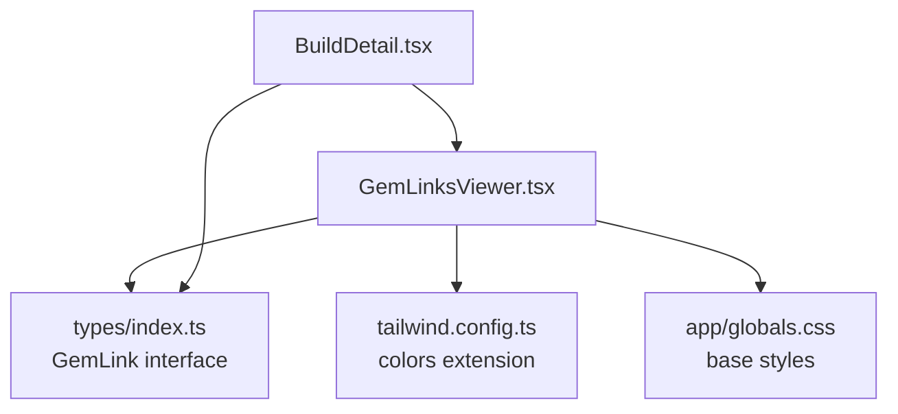
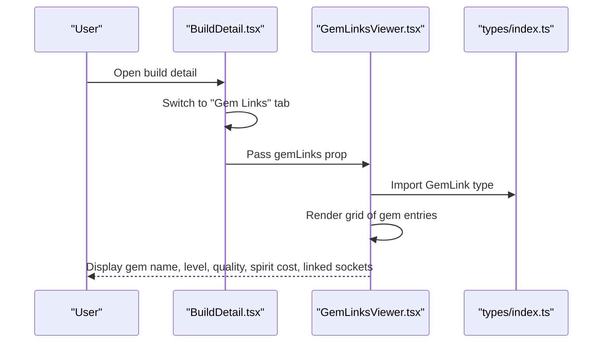
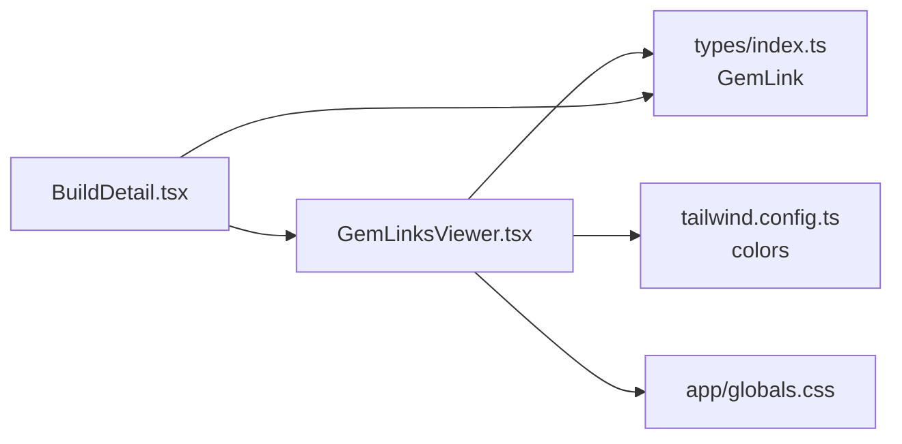

# Gem Links Viewer

<cite>
**Referenced Files in This Document**
- [GemLinksViewer.tsx](file://components/builds/GemLinksViewer.tsx)
- [BuildDetail.tsx](file://components/builds/BuildDetail.tsx)
- [index.ts](file://types/index.ts)
- [tailwind.config.ts](file://tailwind.config.ts)
- [globals.css](file://app/globals.css)
- [IMPLEMENTATION_SUMMARY.md](file://IMPLEMENTATION_SUMMARY.md)
</cite>

## Table of Contents
1. [Introduction](#introduction)
2. [Project Structure](#project-structure)
3. [Core Components](#core-components)
4. [Architecture Overview](#architecture-overview)
5. [Detailed Component Analysis](#detailed-component-analysis)
6. [Dependency Analysis](#dependency-analysis)
7. [Performance Considerations](#performance-considerations)
8. [Troubleshooting Guide](#troubleshooting-guide)
9. [Conclusion](#conclusion)

## Introduction
The Gem Links Viewer renders a build’s linked skill gem configurations in ARPG builds. It displays each gem’s name, level, quality percentage, optional spirit cost, and any linked sockets associated with it. The component is integrated into the build detail page and receives its data from the parent container. It uses a responsive grid layout and Tailwind utility classes for styling, with subtle hover effects and icons to enhance readability.

## Project Structure
The Gem Links Viewer is part of the builds module and is consumed by the build detail page. The data model for gem links is defined centrally in the shared types.

**Diagram sources**
- [BuildDetail.tsx](file://components/builds/BuildDetail.tsx#L177-L183)
- [GemLinksViewer.tsx](file://components/builds/GemLinksViewer.tsx#L1-L65)
- [index.ts](file://types/index.ts#L82-L89)
- [tailwind.config.ts](file://tailwind.config.ts#L1-L14)
- [globals.css](file://app/globals.css#L1-L49)

**Section sources**
- [BuildDetail.tsx](file://components/builds/BuildDetail.tsx#L177-L183)
- [GemLinksViewer.tsx](file://components/builds/GemLinksViewer.tsx#L1-L65)
- [index.ts](file://types/index.ts#L82-L89)
- [tailwind.config.ts](file://tailwind.config.ts#L1-L14)
- [globals.css](file://app/globals.css#L1-L49)

## Core Components
- GemLinksViewer: Renders a list of gem link entries with metadata and linked sockets.
- BuildDetail: Provides the build context and passes gemLinks to the viewer.
- Types: Defines the GemLink interface used by the viewer.

Key responsibilities:
- Present gem identity and stats (name, level, quality, spirit cost).
- Render linked sockets as a tag list.
- Provide responsive layout and hover feedback.
- Integrate with the build detail page via props.

**Section sources**
- [GemLinksViewer.tsx](file://components/builds/GemLinksViewer.tsx#L1-L65)
- [BuildDetail.tsx](file://components/builds/BuildDetail.tsx#L177-L183)
- [index.ts](file://types/index.ts#L82-L89)

## Architecture Overview
The viewer is a presentational component that receives a flat array of gem link entries. The parent component selects the appropriate tab and supplies the data. Styling relies on Tailwind utility classes and a small color extension for game-appropriate hues.

**Diagram sources**
- [BuildDetail.tsx](file://components/builds/BuildDetail.tsx#L177-L183)
- [GemLinksViewer.tsx](file://components/builds/GemLinksViewer.tsx#L1-L65)
- [index.ts](file://types/index.ts#L82-L89)

## Detailed Component Analysis

### Data Input Structure
The viewer expects an array of GemLink objects. Each entry includes:
- id: Unique identifier for the gem entry.
- name: Display name of the gem.
- level: Numeric level of the gem.
- quality: Quality percentage (rendered when greater than zero).
- links: Array of strings representing linked sockets.
- spiritCost: Optional numeric spirit cost indicator.

These fields are mapped directly to UI elements in the viewer.

**Section sources**
- [index.ts](file://types/index.ts#L82-L89)
- [GemLinksViewer.tsx](file://components/builds/GemLinksViewer.tsx#L27-L36)

### Visual Layout and Responsiveness
- Container: Uses a card-like layout with dark backgrounds and borders.
- Header: Title with an icon and gold accent color.
- Grid: Single column on small screens, two columns on medium and larger screens.
- Hover: Subtle border highlight on hover for interactivity.
- Tags: Linked sockets rendered as compact tags with spacing.

Responsive behavior:
- On small screens, the grid collapses to a single column.
- On medium screens and above, the grid becomes two columns.

**Section sources**
- [GemLinksViewer.tsx](file://components/builds/GemLinksViewer.tsx#L12-L17)
- [GemLinksViewer.tsx](file://components/builds/GemLinksViewer.tsx#L19-L24)
- [GemLinksViewer.tsx](file://components/builds/GemLinksViewer.tsx#L41-L59)

### Interaction Patterns
- Hover effects: Cards change border color on hover to indicate interactivity.
- Click-to-expand: Not implemented in the viewer itself; clicking the “Gem Links” tab in the parent switches content.
- Icons: Lucide icons are used for visual cues (package, link, zap).

Note: The viewer does not implement tooltips or modal overlays. Interactions are minimal and rely on hover states and tab navigation.

**Section sources**
- [GemLinksViewer.tsx](file://components/builds/GemLinksViewer.tsx#L21-L24)
- [BuildDetail.tsx](file://components/builds/BuildDetail.tsx#L135-L158)

### Styling and Theming
- Primary color: Gold (#c5a059) for accents and highlights.
- Secondary color: Spirit blue (#7ecce0) for spirit cost emphasis.
- Background: Dark (#050506) body background.
- Cards: Dark card backgrounds with border colors aligned to the theme.
- Tailwind extension: A custom color palette is defined for consistent theming.

Color usage:
- Accent text for titles and highlights.
- Gray tones for secondary information.
- Spirit blue for spirit cost indicators.

**Section sources**
- [tailwind.config.ts](file://tailwind.config.ts#L1-L14)
- [globals.css](file://app/globals.css#L1-L49)
- [GemLinksViewer.tsx](file://components/builds/GemLinksViewer.tsx#L14-L17)
- [GemLinksViewer.tsx](file://components/builds/GemLinksViewer.tsx#L31-L36)
- [IMPLEMENTATION_SUMMARY.md](file://IMPLEMENTATION_SUMMARY.md#L233-L240)

### Accessibility Considerations
- Color contrast: Theme colors are designed to contrast against dark backgrounds. The gold and spirit blue are used for emphasis while maintaining readability.
- Screen reader compatibility: The component uses semantic headings and spans. No ARIA attributes are explicitly added; ensure that any future enhancements include roles and labels where needed.
- Focus visibility: No explicit focus styles are defined in the component; rely on global focus styles from the application.

Recommendations:
- Add ARIA roles and labels for interactive elements if tooltips or modals are introduced.
- Ensure sufficient color contrast for all text and interactive elements.
- Provide keyboard navigation support if expanding details is added.

**Section sources**
- [GemLinksViewer.tsx](file://components/builds/GemLinksViewer.tsx#L14-L17)
- [GemLinksViewer.tsx](file://components/builds/GemLinksViewer.tsx#L27-L36)
- [globals.css](file://app/globals.css#L1-L49)

### Rendering Complex Gem Links
The viewer supports rendering multiple gem entries and their linked sockets. Each entry displays:
- Name
- Level
- Quality (when applicable)
- Spirit cost (when applicable)
- Linked sockets as a tag list

This structure accommodates builds with varying numbers of gem clusters and socket configurations.

**Section sources**
- [GemLinksViewer.tsx](file://components/builds/GemLinksViewer.tsx#L27-L59)
- [index.ts](file://types/index.ts#L82-L89)

### Integration with BuildDetail and Form State
- Data source: The parent component passes gemLinks as a prop.
- Synchronization: The viewer does not manage form state; it is a pure presentation component. Any form state updates would occur in the parent or a separate form controller.

**Section sources**
- [BuildDetail.tsx](file://components/builds/BuildDetail.tsx#L177-L183)
- [GemLinksViewer.tsx](file://components/builds/GemLinksViewer.tsx#L1-L10)

## Dependency Analysis
The viewer depends on:
- The GemLink type definition.
- Tailwind configuration for color tokens.
- Global base styles for the dark theme.

**Diagram sources**
- [GemLinksViewer.tsx](file://components/builds/GemLinksViewer.tsx#L1-L10)
- [index.ts](file://types/index.ts#L82-L89)
- [tailwind.config.ts](file://tailwind.config.ts#L1-L14)
- [globals.css](file://app/globals.css#L1-L49)
- [BuildDetail.tsx](file://components/builds/BuildDetail.tsx#L177-L183)

**Section sources**
- [GemLinksViewer.tsx](file://components/builds/GemLinksViewer.tsx#L1-L10)
- [index.ts](file://types/index.ts#L82-L89)
- [tailwind.config.ts](file://tailwind.config.ts#L1-L14)
- [globals.css](file://app/globals.css#L1-L49)
- [BuildDetail.tsx](file://components/builds/BuildDetail.tsx#L177-L183)

## Performance Considerations
- Rendering scale: The component maps over the gemLinks array and renders a card per entry. For typical builds, this is lightweight.
- Re-renders: Since the viewer is a presentational component, it will re-render whenever the parent passes new props. To minimize unnecessary re-renders:
  - Memoize the gemLinks prop upstream if it is computed.
  - Use stable keys (preferably ids) for list items.
  - Avoid passing anonymous functions or new arrays on each render.
- Virtualization: Not applicable for small lists; consider virtualization only if many gem clusters are expected.
- CSS: Keep styles scoped and avoid heavy animations during scroll.

[No sources needed since this section provides general guidance]

## Troubleshooting Guide
- Mobile layout issues:
  - Symptom: Two-column layout does not collapse on small screens.
  - Cause: Missing responsive breakpoint or conflicting styles.
  - Fix: Ensure the grid classes apply the intended breakpoints and that no overriding styles interfere.
- Missing data:
  - Symptom: No gem entries displayed.
  - Cause: gemLinks prop is undefined or empty.
  - Fix: Verify the parent passes a non-empty array and that the tab selection logic is correct.
- Color contrast problems:
  - Symptom: Text hard to read in dark theme.
  - Cause: Incorrect color usage or missing theme tokens.
  - Fix: Use the established theme colors and verify Tailwind color extensions.
- Spirit cost visibility:
  - Symptom: Spirit cost not shown.
  - Cause: spiritCost is not provided or falsy.
  - Fix: Ensure the field is populated when applicable.
- Hover effects:
  - Symptom: Hover border not visible.
  - Cause: Overridden styles or insufficient contrast.
  - Fix: Confirm hover styles and theme colors are applied.

**Section sources**
- [GemLinksViewer.tsx](file://components/builds/GemLinksViewer.tsx#L19-L24)
- [GemLinksViewer.tsx](file://components/builds/GemLinksViewer.tsx#L31-L36)
- [GemLinksViewer.tsx](file://components/builds/GemLinksViewer.tsx#L41-L59)
- [BuildDetail.tsx](file://components/builds/BuildDetail.tsx#L177-L183)

## Conclusion
The Gem Links Viewer provides a clean, responsive presentation of linked skill gem configurations. It focuses on essential information—gem identity, level, quality, spirit cost, and linked sockets—while leveraging a cohesive dark theme and subtle hover feedback. Its simplicity makes it easy to maintain and extend. Future enhancements could include tooltips, click-to-expand details, and improved accessibility features, while keeping performance and responsiveness in mind.