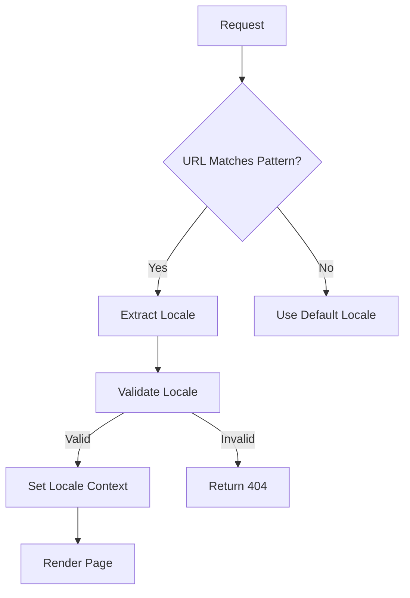
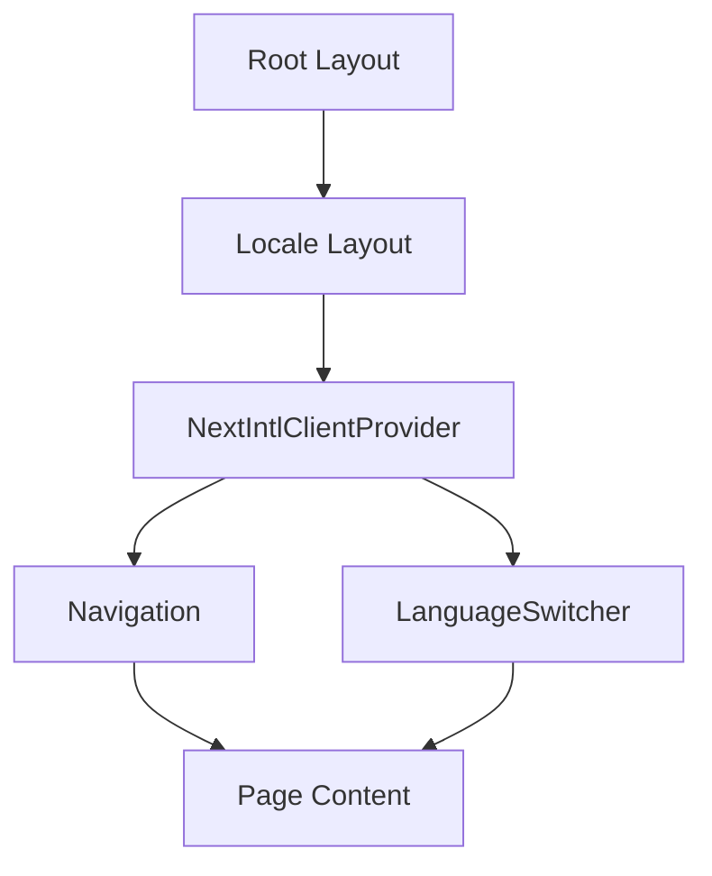

# Global Components

<cite>
**Referenced Files in This Document**   
- [Navigation.tsx](file://components/Navigation.tsx)
- [LanguageSwitcher.tsx](file://components/LanguageSwitcher.tsx)
- [i18n.ts](file://i18n.ts)
- [middleware.ts](file://middleware.ts)
- [layout.tsx](file://app/[locale]/layout.tsx)
- [en.json](file://messages/en.json)
- [ar.json](file://messages/ar.json)
</cite>

## Table of Contents
1. [Introduction](#introduction)
2. [Navigation Component](#navigation-component)
3. [LanguageSwitcher Component](#languageswitcher-component)
4. [Internationalization Configuration](#internationalization-configuration)
5. [Layout Integration](#layout-integration)
6. [Accessibility Considerations](#accessibility-considerations)
7. [Performance Implications](#performance-implications)
8. [Extension Guidelines](#extension-guidelines)
9. [Common Issues and Troubleshooting](#common-issues-and-troubleshooting)
10. [Conclusion](#conclusion)

## Introduction
The Prometheus-Planner V2 application features two critical global UI components: Navigation and LanguageSwitcher. These components provide essential functionality for user interaction, navigation, and multilingual support across the application. The Navigation component serves as the primary means of site navigation with responsive design and active link highlighting, while the LanguageSwitcher enables seamless switching between English and Arabic locales, including RTL/LTR layout adjustments. Both components are implemented as client components to handle interactive functionality and are integrated at the layout level to ensure consistent availability across all pages.

## Navigation Component

The Navigation component provides the primary navigation interface for the Prometheus-Planner V2 application. Implemented as a sticky header, it remains visible during scrolling to ensure constant access to key application sections.

### Responsive Design with Tailwind CSS
The navigation employs a mobile-first responsive design strategy using Tailwind CSS. On smaller screens (below the 'lg' breakpoint), the main navigation links are hidden, displaying only the logo, profile, settings, and language switcher icons. On larger screens (lg and above), the full navigation menu appears as a horizontal bar with text labels and icons.

The component uses Tailwind's utility classes for responsive behavior:
- `hidden lg:flex` on the nav element to hide the navigation links on small screens
- `max-w-[1800px] mx-auto` to constrain the width and center the content
- `flex justify-between items-center` for layout alignment
- Various padding and margin utilities for spacing

### Dynamic Active Link Highlighting
The Navigation component implements dynamic active link highlighting based on the current route. It uses Next.js's `usePathname` hook to obtain the current URL path and compares it against each navigation item's href property.

The active state detection logic handles both exact matches and path prefixes:
```typescript
const isActive = pathname === item.href || pathname.startsWith(item.href + '/');
```

When a link is active, it receives distinct styling with a gold background (`bg-[#c5a059]`) and black text, while inactive links display in gray with hover effects that highlight in gold.

### Integration with Next.js App Router
The Navigation component is tightly integrated with the Next.js App Router system. It uses several Next.js navigation hooks:
- `usePathname` to access the current route
- `Link` component for client-side navigation
- Locale-aware routing through the `[locale]` parameter

The navigation items are defined as an array of objects containing href, label, and icon properties. Labels are localized using the `useTranslations` hook from next-intl, which retrieves the appropriate text from the message files based on the current locale.

### Accessibility Features
The navigation includes several accessibility features:
- Semantic HTML structure with appropriate heading levels
- Sufficient color contrast between text and background
- Keyboard navigable links
- Icon labels with text alternatives
- Focus states for interactive elements

The component also includes proper ARIA attributes and roles where appropriate, ensuring compatibility with screen readers and other assistive technologies.

**Section sources**
- [Navigation.tsx](file://components/Navigation.tsx#L20-L98)

## LanguageSwitcher Component

The LanguageSwitcher component enables users to switch between available languages (English and Arabic) and manages the associated layout changes for RTL support.

### Multilingual Support Implementation
The component provides a dropdown interface for language selection, displaying both flag emojis and language names. It supports two languages:
- English (en) with US flag emoji (🇺🇸)
- Arabic (ar) with Oman flag emoji (🇴🇲)

The language selection state is managed using React's `useState` hook for the dropdown open/closed state, while the current locale is obtained from next-intl's `useLocale` hook.

### RTL/LTR Layout Switching
When the user selects Arabic, the application switches to RTL (right-to-left) layout mode. This is accomplished through:
1. Setting the `dir` attribute on the HTML element in the layout
2. Adjusting component positioning and text alignment
3. Reversing the natural reading order of content

The LanguageSwitcher itself adapts its positioning in RTL mode, with the dropdown menu appearing on the left side of the button instead of the right.

### Locale Persistence and Routing
The component handles locale changes by:
1. Capturing the current pathname
2. Replacing the current locale segment with the new locale
3. Using the Next.js router to navigate to the new URL

This ensures that users remain on the same page content when switching languages, preserving their navigation context.

The implementation uses Next.js navigation hooks:
- `useRouter` for programmatic navigation
- `usePathname` to obtain the current route
- `useLocale` to determine the current language

### User Interface Design
The LanguageSwitcher features a clean, minimalist design that matches the application's overall aesthetic:
- Dark background (`bg-[#141417]`) with subtle border (`border-[#3d3d43]`)
- Gold hover effects (`hover:text-[#c5a059]`)
- Responsive display that shows only the flag on small screens
- Dropdown menu with hover states and visual feedback for the current language

The dropdown is implemented as a controlled component with proper event handling for both mouse and keyboard interactions.

**Section sources**
- [LanguageSwitcher.tsx](file://components/LanguageSwitcher.tsx#L8-L64)

## Internationalization Configuration

The internationalization system in Prometheus-Planner V2 is configured using next-intl, providing comprehensive support for multiple languages and locale-specific content.

### i18n.ts Configuration
The core internationalization configuration is defined in `i18n.ts`, which exports:
- `locales`: An array of supported locales ['en', 'ar']
- `defaultLocale`: The fallback locale ('en')
- A request configuration function that validates locales and loads message files

The configuration ensures that only valid locales are accepted, redirecting invalid requests to a 404 page using Next.js's `notFound()` function.

### Message Structure
Localization messages are stored in JSON files within the `messages/` directory:
- `en.json`: English translations
- `ar.json`: Arabic translations

Each file contains a hierarchical structure of message keys organized by functional areas:
- `common`: Shared terminology across the application
- `nav`: Navigation labels
- Specific feature areas (builds, database, ai, etc.)

This structure allows for organized, maintainable translation files that can be easily extended with new languages or updated with new content.

### Middleware Integration
The internationalization system is integrated with Next.js middleware to handle locale detection and routing. The middleware configuration:
- Defines the supported locales
- Sets the default locale
- Specifies the URL pattern matcher for internationalized routes

The matcher configuration `['/', '/(ar|en)/:path*']` ensures that both the root path and locale-prefixed paths are handled appropriately.



**Diagram sources**
- [i18n.ts](file://i18n.ts#L1-L17)
- [middleware.ts](file://middleware.ts#L1-L16)

**Section sources**
- [i18n.ts](file://i18n.ts#L1-L17)
- [middleware.ts](file://middleware.ts#L1-L16)

## Layout Integration

The Navigation and LanguageSwitcher components are integrated into the application's layout structure to ensure consistent availability across all pages.

### Root Layout Structure
The application uses a nested layout approach with:
- A root layout at `app/layout.tsx` that provides basic HTML structure
- A locale-specific layout at `app/[locale]/layout.tsx` that wraps content with internationalization providers

The locale layout is responsible for:
- Setting the HTML `lang` and `dir` attributes
- Providing the NextIntlClientProvider to make translations available to client components
- Rendering the Navigation component

### Component Hierarchy
The component hierarchy ensures proper data flow and context availability:


This structure ensures that both global components have access to the necessary internationalization context while being available on every page.

### HTML Direction Management
The layout dynamically sets the `dir` attribute based on the current locale:
```typescript
const dir = locale === 'ar' ? 'rtl' : 'ltr';
```

This affects text alignment, component positioning, and the natural reading order of content, providing proper RTL support for Arabic users.

**Section sources**
- [layout.tsx](file://app/[locale]/layout.tsx#L1-L49)

## Accessibility Considerations

The Navigation and LanguageSwitcher components incorporate several accessibility features to ensure usability for all users, including those with disabilities.

### Keyboard Navigation
Both components support full keyboard navigation:
- Tab navigation between interactive elements
- Enter/Space to activate buttons and links
- Escape to close the language dropdown
- Arrow keys for dropdown navigation

The LanguageSwitcher implements proper focus management, ensuring that keyboard users can navigate the dropdown menu and that focus returns appropriately when the menu is closed.

### Screen Reader Support
The components include appropriate ARIA attributes and semantic HTML to support screen readers:
- Proper heading hierarchy
- Descriptive link and button text
- Icon labels with text alternatives
- Status messages for dynamic content changes

The navigation links include descriptive text that clearly indicates their destination, and the language switcher provides clear labels for each language option.

### Color Contrast and Visual Design
The components maintain sufficient color contrast between text and background elements:
- Gold text (`#c5a059`) on dark backgrounds provides adequate contrast
- Hover states are visually distinct
- Active states are clearly indicated
- Focus rings are visible for keyboard navigation

The design follows WCAG guidelines for color contrast, ensuring readability for users with visual impairments.

### Responsive Behavior
The components adapt to different screen sizes and input methods:
- Touch-friendly tap targets
- Responsive layouts that work on mobile devices
- Appropriate spacing and sizing for different viewport sizes

The navigation collapses on small screens to prioritize essential controls, while the language switcher adjusts its display to show only essential information on narrow viewports.

**Section sources**
- [Navigation.tsx](file://components/Navigation.tsx#L1-L98)
- [LanguageSwitcher.tsx](file://components/LanguageSwitcher.tsx#L1-L64)

## Performance Implications

The implementation of global components in Prometheus-Planner V2 has several performance considerations related to server rendering, client hydration, and resource loading.

### Server Component Strategy
The application follows a strategic approach to component rendering:
- Layouts are server components where possible
- Global UI components are client components due to interactivity
- Data fetching is optimized at the server level

This hybrid approach minimizes the amount of client-side JavaScript while enabling interactive features where needed.

### Hydration Overhead
As client components, both Navigation and LanguageSwitcher contribute to the hydration overhead on the client side. However, their implementation is optimized to minimize this impact:
- Minimal state management
- Efficient event handling
- Lightweight component structure

The components do not perform expensive computations during rendering, and their event handlers are simple and focused.

### Resource Loading
The components rely on several external resources:
- Lucide React icons
- Next.js navigation utilities
- next-intl internationalization libraries

These dependencies are bundled and optimized during the build process, with tree-shaking to eliminate unused code.

### Caching and Reuse
The components benefit from Next.js's built-in caching mechanisms:
- Static generation where appropriate
- Client-side routing to avoid full page reloads
- Message file caching for translations

The navigation state is preserved during client-side navigation, reducing the need for re-rendering and improving perceived performance.

**Section sources**
- [Navigation.tsx](file://components/Navigation.tsx#L1-L98)
- [LanguageSwitcher.tsx](file://components/LanguageSwitcher.tsx#L1-L64)

## Extension Guidelines

The Navigation and LanguageSwitcher components are designed to be extensible, allowing for the addition of new features and functionality.

### Adding New Navigation Routes
To add a new route to the navigation:
1. Add the route to the `navItems` array in Navigation.tsx
2. Include the appropriate label key in the translation files
3. Add the corresponding page in the app directory structure

For example, to add a "Forum" link:
```typescript
{ href: `/${locale}/forum`, label: t('forum'), icon: MessageCircle }
```

And add the translation:
```json
// en.json
"nav": {
  "forum": "Forum"
}

// ar.json  
"nav": {
  "forum": "المنتدى"
}
```

### Adding Additional Languages
To add a new language:
1. Add the locale code to the `locales` array in i18n.ts
2. Create a new message file in the messages directory
3. Add language metadata to the LanguageSwitcher component
4. Update the middleware configuration if needed

For example, to add French support:
```typescript
// i18n.ts
export const locales = ['en', 'ar', 'fr'] as const;

// LanguageSwitcher.tsx
{ code: 'fr', name: 'Français', flag: '🇫🇷' }
```

### Customizing Visual Design
The components can be customized through:
- Tailwind CSS utility classes
- CSS variables defined in globals.css
- Prop-based configuration (if extended to support props)

Any visual changes should maintain consistency with the application's overall design language and color scheme.

**Section sources**
- [Navigation.tsx](file://components/Navigation.tsx#L1-L98)
- [LanguageSwitcher.tsx](file://components/LanguageSwitcher.tsx#L1-L64)
- [i18n.ts](file://i18n.ts#L1-L17)

## Common Issues and Troubleshooting

Several common issues may arise when working with the Navigation and LanguageSwitcher components, particularly related to locale persistence and layout rendering.

### Locale Persistence Bugs
Issue: Language selection does not persist across page refreshes or sessions.

Solution: Ensure that the middleware is properly configured and that the locale is being correctly extracted from the URL. Verify that the `generateStaticParams` function in the layout includes all supported locales.

```typescript
export function generateStaticParams() {
  return locales.map((locale) => ({ locale }));
}
```

### Layout Shifts During Language Switching
Issue: Content jumps or reflows when switching between LTR and RTL layouts.

Solution: Ensure that the `dir` attribute is set early in the rendering process and that CSS rules account for both LTR and RTL layouts. Use CSS logical properties where possible to handle directionality automatically.

### Missing Translation Keys
Issue: Text appears as the translation key rather than the translated value.

Solution: Verify that the message files contain the required keys and that the `useTranslations` hook is using the correct namespace. Check for typos in key names and ensure that new keys are added to all language files.

### Navigation Active State Issues
Issue: The wrong navigation link appears active or no link is highlighted.

Solution: Check the active state logic in the Navigation component and ensure that the pathname comparison accounts for both exact matches and path prefixes. Verify that the href values include the locale prefix.

### LanguageSwitcher Dropdown Not Closing
Issue: The language dropdown remains open after selection or when clicking outside.

Solution: Ensure that the click handler on the overlay element properly closes the dropdown and that event propagation is correctly managed. Verify that the state update is functioning as expected.

**Section sources**
- [Navigation.tsx](file://components/Navigation.tsx#L1-L98)
- [LanguageSwitcher.tsx](file://components/LanguageSwitcher.tsx#L1-L64)
- [i18n.ts](file://i18n.ts#L1-L17)

## Conclusion
The Navigation and LanguageSwitcher components are essential elements of the Prometheus-Planner V2 application, providing critical functionality for user interaction and multilingual support. Their implementation demonstrates effective use of Next.js features, Tailwind CSS for responsive design, and next-intl for internationalization. The components are well-structured, accessible, and performant, with clear extension points for future development. By following the documented patterns and guidelines, developers can maintain and enhance these components while ensuring consistency across the application.