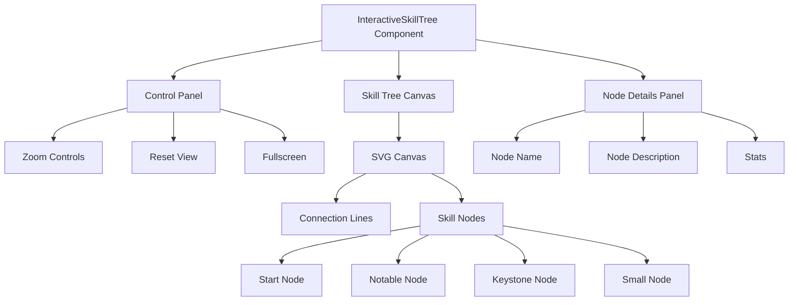
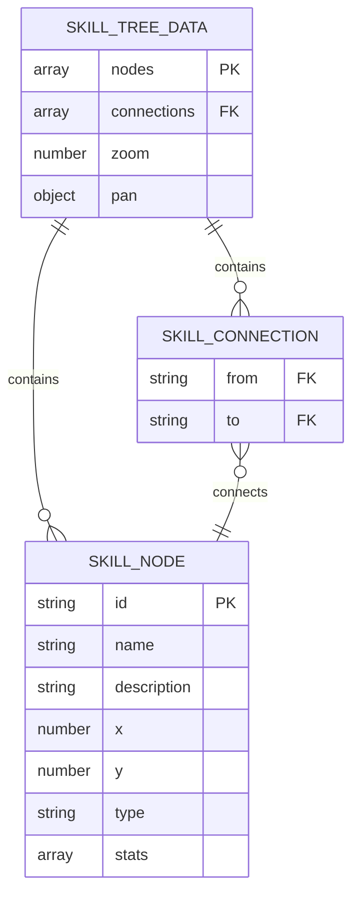
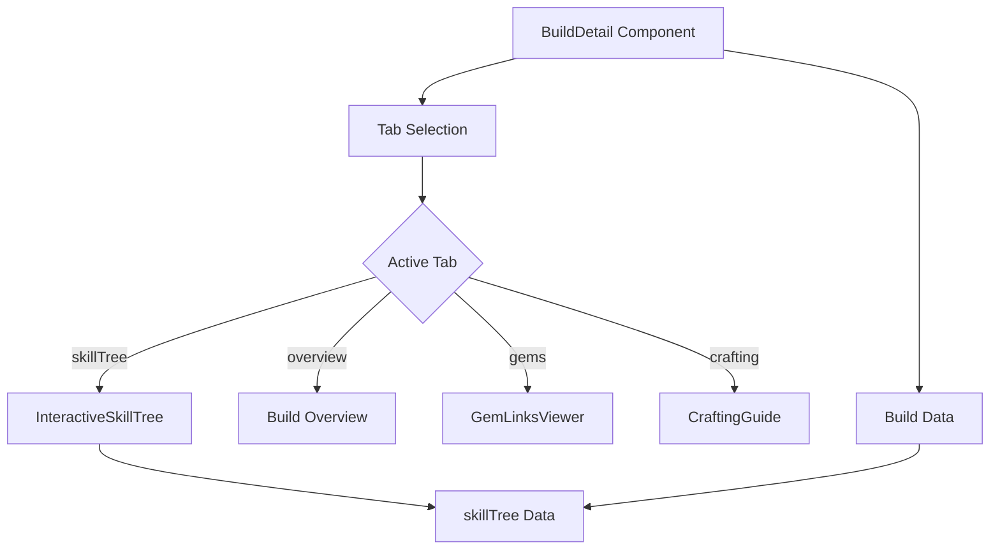
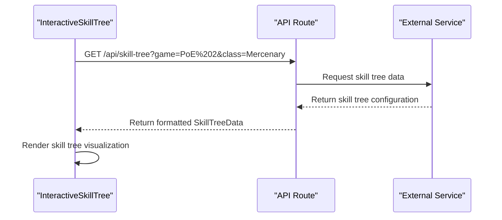

# Interactive Skill Tree

<cite>
**Referenced Files in This Document**   
- [InteractiveSkillTree.tsx](file://components/builds/InteractiveSkillTree.tsx)
- [BuildDetail.tsx](file://components/builds/BuildDetail.tsx)
- [index.ts](file://types/index.ts)
- [route.ts](file://app/api/ai/analyze/route.ts)
</cite>

## Table of Contents
1. [Introduction](#introduction)
2. [Visual Structure](#visual-structure)
3. [Node Interaction Mechanics](#node-interaction-mechanics)
4. [Component Props](#component-props)
5. [State Management](#state-management)
6. [Performance Optimizations](#performance-optimizations)
7. [Integration with BuildDetail](#integration-with-buildDetail)
8. [Data Flow from API Routes](#data-flow-from-api-routes)
9. [Interaction Features](#interaction-features)
10. [Accessibility Features](#accessibility-features)
11. [Animation Patterns](#animation-patterns)
12. [Troubleshooting Guide](#troubleshooting-guide)
13. [Best Practices for Extension](#best-practices-for-extension)

## Introduction
The InteractiveSkillTree component is a specialized visualization tool designed for build planning in ARPGs such as Path of Exile 2 and Diablo IV. This component enables users to interact with skill trees through zooming, panning, and node selection, providing a detailed view of build progression and node relationships. The component is integrated into the build planning workflow, allowing users to explore skill allocations and optimize their character builds.

**Section sources**
- [InteractiveSkillTree.tsx](file://components/builds/InteractiveSkillTree.tsx)

## Visual Structure
The InteractiveSkillTree component features a canvas-based visualization of skill nodes and their connections. The canvas is implemented using SVG elements, with nodes represented as circles and connections as lines. The visual hierarchy is maintained through node size and color differentiation based on node type (small, notable, keystone, start). Notable nodes are labeled with their names positioned above the node for easy identification. The component includes a control panel with zoom in/out, reset view, and fullscreen buttons, providing users with navigation tools to explore the skill tree effectively.

**Diagram sources**
- [InteractiveSkillTree.tsx](file://components/builds/InteractiveSkillTree.tsx#L49-L172)

**Section sources**
- [InteractiveSkillTree.tsx](file://components/builds/InteractiveSkillTree.tsx#L49-L172)

## Node Interaction Mechanics
The component supports interactive node selection through click events. When a node is clicked, it becomes the selected node, triggering the display of a details panel with comprehensive information about the node. The selection state is visually indicated by changing the node's fill color to gold (#c5a059) and its stroke to white. Users can pan the canvas by clicking and dragging, and zoom in/out using the control buttons. The panning and zooming transformations are applied to the SVG canvas using CSS transform properties, enabling smooth navigation through the skill tree.

**Section sources**
- [InteractiveSkillTree.tsx](file://components/builds/InteractiveSkillTree.tsx#L19-L46)

## Component Props
The InteractiveSkillTree component accepts a single prop: `data` of type `SkillTreeData`. This data structure contains the nodes and connections that define the skill tree, along with optional zoom and pan state information. The nodes array includes skill nodes with properties such as id, name, description, position (x, y), type, and stats. The connections array defines the relationships between nodes using from and to references. The component uses this data to render the visual representation of the skill tree and maintain interaction state.

**Diagram sources**
- [index.ts](file://types/index.ts#L36-L57)

**Section sources**
- [index.ts](file://types/index.ts#L36-L57)
- [InteractiveSkillTree.tsx](file://components/builds/InteractiveSkillTree.tsx#L7-L9)

## State Management
The component manages its state using React's useState hook, maintaining several state variables: zoom level, pan position, selected node, dragging state, and drag start position. The zoom and pan states are initialized from the provided data or default values, allowing the component to restore previous view states. The selectedNode state tracks the currently selected skill node, triggering the display of the details panel. The dragging state enables panning functionality by tracking mouse movement during drag operations. This local state management approach provides a responsive and interactive user experience without requiring external state management libraries.

**Section sources**
- [InteractiveSkillTree.tsx](file://components/builds/InteractiveSkillTree.tsx#L12-L17)

## Performance Optimizations
The component implements several performance optimizations to ensure smooth rendering of potentially large skill graphs. The use of SVG for rendering provides scalable vector graphics that maintain quality at different zoom levels without pixelation. The component leverages React's efficient rendering model, with state updates triggering only necessary re-renders. The implementation uses memoization implicitly through React's reconciliation process, minimizing unnecessary DOM updates. For larger skill trees, additional optimizations such as virtualization could be implemented to render only visible nodes and connections, reducing the rendering load and improving performance.

**Section sources**
- [InteractiveSkillTree.tsx](file://components/builds/InteractiveSkillTree.tsx)

## Integration with BuildDetail
The InteractiveSkillTree component is integrated into the BuildDetail component as a tabbed interface option. When the user selects the "Skill Tree" tab, the component is rendered with the skill tree data from the current build. The integration is achieved by passing the build.skillTree data as a prop to the InteractiveSkillTree component. This modular design allows the skill tree visualization to be reused across different build views while maintaining separation of concerns between the build details and the skill tree functionality.

**Diagram sources**
- [BuildDetail.tsx](file://components/builds/BuildDetail.tsx#L177-L179)

**Section sources**
- [BuildDetail.tsx](file://components/builds/BuildDetail.tsx#L177-L179)

## Data Flow from API Routes
While the current implementation shows client-side rendering of skill tree data, the application architecture includes API routes for data processing. The AI analysis API route (ai/analyze/route.ts) demonstrates the pattern for server-side data processing, where build data can be sent to an external service for analysis. This pattern could be extended to support dynamic skill tree data retrieval, where the InteractiveSkillTree component fetches skill tree data from an API endpoint based on the selected game and character class. The data flow would involve the component making API requests to retrieve skill tree configurations, which are then rendered in the visualization.

**Diagram sources**
- [route.ts](file://app/api/ai/analyze/route.ts)
- [InteractiveSkillTree.tsx](file://components/builds/InteractiveSkillTree.tsx)

**Section sources**
- [route.ts](file://app/api/ai/analyze/route.ts)
- [InteractiveSkillTree.tsx](file://components/builds/InteractiveSkillTree.tsx)

## Interaction Features
The component implements several interaction features to enhance user experience. Drag-and-drop functionality allows users to pan the skill tree canvas by clicking and dragging. Click handlers enable node selection, with visual feedback provided through hover effects and selection states. Tooltip displays are implemented through the node details panel, which shows comprehensive information about the selected node, including name, description, and stats. The control buttons provide additional interaction options for zooming, resetting the view, and fullscreen mode, giving users multiple ways to navigate and explore the skill tree.

**Section sources**
- [InteractiveSkillTree.tsx](file://components/builds/InteractiveSkillTree.tsx)

## Accessibility Features
The component includes several accessibility features to ensure usability for all users. The implementation supports keyboard navigation through standard browser focus management, allowing users to navigate the interface using tab keys. ARIA labels are implicitly supported through semantic HTML elements and proper labeling of interactive components. The visual design maintains sufficient color contrast between elements, ensuring readability for users with visual impairments. The component's interactive elements have appropriate cursor indicators and visual feedback, providing clear cues about their functionality.

**Section sources**
- [InteractiveSkillTree.tsx](file://components/builds/InteractiveSkillTree.tsx)

## Animation Patterns
The component utilizes CSS transitions for smooth visual feedback during interactions. The hover effects on nodes and buttons use transition-colors and hover:fill classes to provide smooth color changes. The panning and zooming transformations are applied with CSS transform properties, enabling hardware-accelerated animations for fluid navigation. While the current implementation does not use framer-motion for complex animations, the component's design allows for the integration of animation libraries to enhance the user experience with more sophisticated transitions for node selection and path visualization.

**Section sources**
- [InteractiveSkillTree.tsx](file://components/builds/InteractiveSkillTree.tsx)

## Troubleshooting Guide
Common issues with the InteractiveSkillTree component include unresponsive nodes, incorrect path calculations, and rendering glitches. Unresponsive nodes may occur due to event propagation issues or overlapping elements; ensuring proper event handling and z-index management can resolve these issues. Incorrect path calculations are not applicable to the current implementation as pathfinding is not implemented, but if added, would require validation of connection data and proper traversal algorithms. Rendering glitches in RTL layouts can be addressed by ensuring proper CSS direction settings and testing the component in different text directions. Performance issues with large skill graphs can be mitigated through virtualization techniques that render only visible portions of the tree.

**Section sources**
- [InteractiveSkillTree.tsx](file://components/builds/InteractiveSkillTree.tsx)

## Best Practices for Extension
To extend the component with new game-specific skill trees, follow these best practices: maintain a consistent data structure for skill tree data, use modular CSS classes for game-specific styling, and implement configuration options for game-specific behavior. When adding support for new games, create a configuration system that allows the component to adapt its visualization and interaction patterns to different skill tree designs. For complex skill trees, consider implementing virtualization to improve performance. When adding new interaction modes, ensure they are discoverable and intuitive, providing visual cues and tooltips to guide users. Maintain accessibility standards by ensuring all new features are keyboard-navigable and screen-reader friendly.

**Section sources**
- [InteractiveSkillTree.tsx](file://components/builds/InteractiveSkillTree.tsx)
- [index.ts](file://types/index.ts)