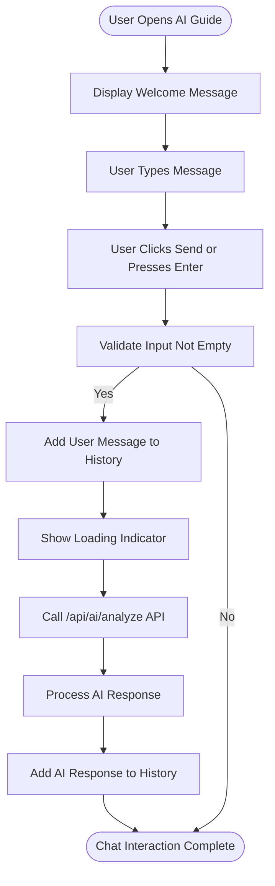
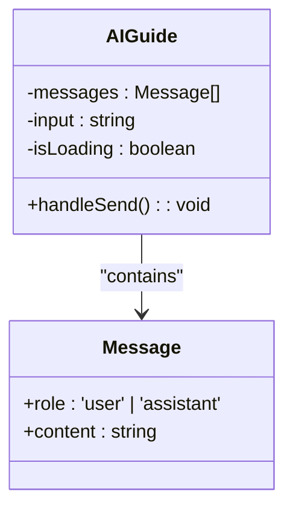
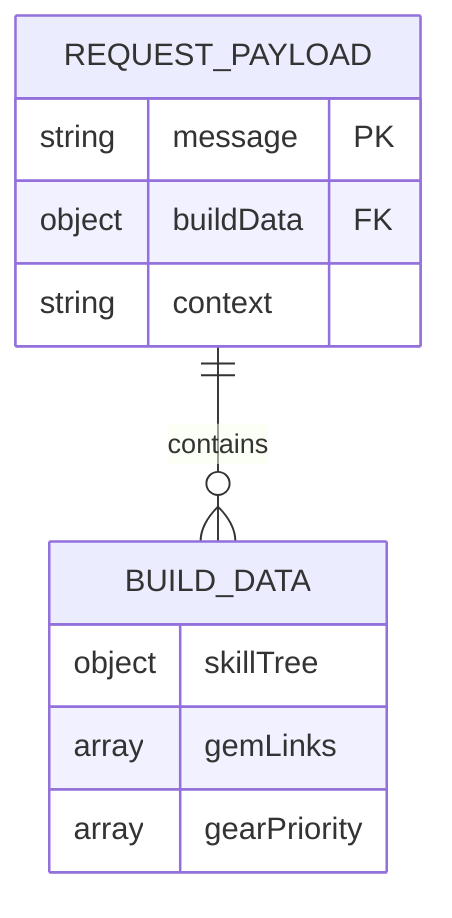
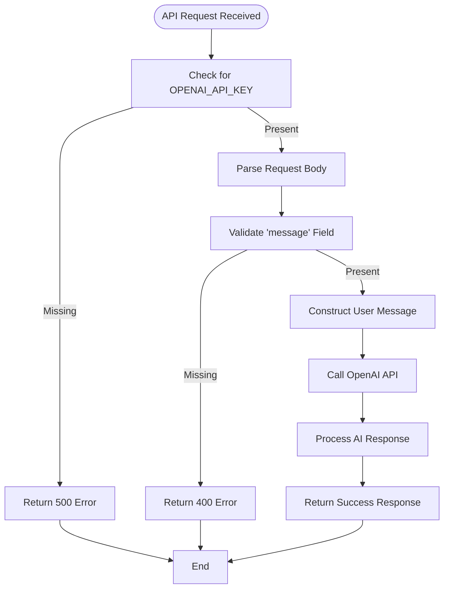

# AI Integration

<cite>
**Referenced Files in This Document**   
- [AIGuide.tsx](file://components/ai/AIGuide.tsx)
- [route.ts](file://app/api/ai/analyze/route.ts)
- [page.tsx](file://app/[locale]/ai/page.tsx)
- [en.json](file://messages/en.json)
- [index.ts](file://types/index.ts)
- [DEPLOYMENT_GUIDE.md](file://DEPLOYMENT_GUIDE.md)
- [page.tsx](file://app/[locale]/page.tsx)
</cite>

## Table of Contents
1. [Introduction](#introduction)
2. [AI Guide Interface Implementation](#ai-guide-interface-implementation)
3. [API Endpoint for Build Analysis](#api-endpoint-for-build-analysis)
4. [Integration with Environment Variables and Rate Limiting](#integration-with-environment-variables-and-rate-limiting)
5. [Error Handling and Debugging Strategies](#error-handling-and-debugging-strategies)
6. [Performance Implications and Caching Approaches](#performance-implications-and-caching-approaches)
7. [Conclusion](#conclusion)

## Introduction
The AI Integration feature in the Prometheus ARPG Build Planner provides users with expert-level advice on their builds for games like Path of Exile 2 and Diablo IV. This document details the implementation of the AI Guide interface, the `/api/ai/analyze` API endpoint, and related components that enable users to receive optimization suggestions and meta recommendations. The system leverages OpenAI's GPT-4o model to analyze build configurations and provide actionable insights.

**Section sources**
- [AIGuide.tsx](file://components/ai/AIGuide.tsx#L1-L131)
- [route.ts](file://app/api/ai/analyze/route.ts#L1-L92)

## AI Guide Interface Implementation

### Chat Interaction Patterns
The AI Guide interface allows users to interact with an AI assistant through a chat-based interface. Users can ask questions about their builds, and the AI provides responses based on the current build context. The chat interface is implemented in the `AIGuide.tsx` component, which manages the state of messages, user input, and loading status.

The chat interaction begins with a welcome message from the AI, and users can send messages by typing in the input field and pressing the "Send" button or the Enter key. Each user message is added to the message history, and the AI responds with a simulated response in the development environment. In production, this would be replaced with a call to the `/api/ai/analyze` endpoint.

**Diagram sources**
- [AIGuide.tsx](file://components/ai/AIGuide.tsx#L15-L34)

**Section sources**
- [AIGuide.tsx](file://components/ai/AIGuide.tsx#L15-L34)

### Message History Management
The message history is managed using React's `useState` hook, which stores an array of message objects. Each message object contains a `role` (either 'user' or 'assistant') and a `content` string. The initial state includes a welcome message from the AI, which is retrieved from the internationalization file using the `useTranslations` hook.

When a user sends a message, it is added to the message history using the `setMessages` function, which updates the state by appending the new message to the existing array. The input field is then cleared, and the loading indicator is shown while waiting for the AI response.

**Diagram sources**
- [AIGuide.tsx](file://components/ai/AIGuide.tsx#L9-L13)

**Section sources**
- [AIGuide.tsx](file://components/ai/AIGuide.tsx#L9-L13)

### Simulated Response Handling
In the development environment, the AI response is simulated using a `setTimeout` function that randomly selects a response from a predefined array of suggestions. This allows developers to test the UI without making actual API calls. The simulated response is added to the message history, and the loading indicator is hidden.

In production, the `handleSend` function would be modified to make a POST request to the `/api/ai/analyze` endpoint with the user's message and build data. The response from the API would then be processed and added to the message history.

**Section sources**
- [AIGuide.tsx](file://components/ai/AIGuide.tsx#L23-L33)

## API Endpoint for Build Analysis

### Request Payload Structure
The `/api/ai/analyze` endpoint accepts a POST request with a JSON payload containing the following fields:
- `message`: The user's question or request for analysis.
- `buildData`: Optional build context data, which includes skill trees, gear, and gem links.
- `context`: Optional additional context to provide to the AI.

The request payload is parsed using `request.json()`, and the `message` field is validated to ensure it is not empty. If the `message` field is missing, the endpoint returns a 400 error.

**Diagram sources**
- [route.ts](file://app/api/ai/analyze/route.ts#L39-L46)

**Section sources**
- [route.ts](file://app/api/ai/analyze/route.ts#L39-L46)

### Prompt Engineering Strategies
The AI model is guided by a system prompt defined in the `SYSTEM_PROMPT` constant. This prompt establishes the AI's role as an expert ARPG build advisor specializing in Path of Exile 2 and Diablo IV. The prompt outlines the AI's key responsibilities, including analyzing build configurations, providing optimization suggestions, identifying weaknesses, and recommending gear priorities.

The user message is constructed by combining the `message`, `buildData`, and `context` fields into a single string. If `buildData` is provided, it is included in the message as a JSON string, followed by the user's question. This ensures that the AI has access to the full context of the build when generating its response.

**Diagram sources**
- [route.ts](file://app/api/ai/analyze/route.ts#L31-L55)

**Section sources**
- [route.ts](file://app/api/ai/analyze/route.ts#L31-L55)

### Response Parsing
The response from the OpenAI API is parsed to extract the AI's message, which is then returned to the client in a JSON response. The response includes the AI's message, the model used (`gpt-4o`), and usage statistics from the API call.

If the AI does not generate a response, a default message is returned. Errors from the OpenAI API are caught and returned with appropriate status codes. For example, if the API key is not configured, a 500 error is returned. If the request is invalid, a 400 error is returned.

**Section sources**
- [route.ts](file://app/api/ai/analyze/route.ts#L68-L74)

## Integration with Environment Variables and Rate Limiting

### Environment Variables
The OpenAI API key is stored in the `OPENAI_API_KEY` environment variable, which is accessed using `process.env.OPENAI_API_KEY`. This ensures that the API key is not hardcoded in the source code and can be securely managed in the deployment environment.

The `DEPLOYMENT_GUIDE.md` file provides instructions for setting up the environment variables in Vercel, including adding the `OPENAI_API_KEY` to the environment variables for all environments (Production, Preview, Development).

**Section sources**
- [DEPLOYMENT_GUIDE.md](file://DEPLOYMENT_GUIDE.md#L17-L32)

### Rate Limiting Considerations
While the current implementation does not include explicit rate limiting, the use of environment variables and the separation of API key management provide a foundation for implementing rate limiting in the future. For example, rate limiting could be implemented at the API gateway level or using a middleware function in the Next.js application.

## Error Handling and Debugging Strategies

### Common Issues
Common issues that may arise when using the AI integration include:
- **API timeouts**: The OpenAI API may take longer than expected to respond, causing the client to time out.
- **Malformed responses**: The AI may generate a response that is not in the expected format, causing parsing errors.
- **Irrelevant suggestions**: The AI may provide suggestions that are not relevant to the user's build or question.

### Debugging Strategies
To debug issues with the AI integration, developers should:
1. Check the console for error messages.
2. Review Vercel deployment logs.
3. Verify that the environment variables are correctly configured.
4. Check the OpenAI API status for any outages or issues.

The `DEPLOYMENT_GUIDE.md` file provides a checklist for troubleshooting issues, including verifying the environment variables and checking the OpenAI API status.

**Section sources**
- [DEPLOYMENT_GUIDE.md](file://DEPLOYMENT_GUIDE.md#L147-L152)

## Performance Implications and Caching Approaches

### AI Latency
The performance of the AI integration is heavily dependent on the latency of the OpenAI API. The current implementation uses a loading indicator to provide feedback to the user while waiting for the AI response. However, long response times may impact the user experience.

### Caching Approaches
To improve performance, caching approaches could be implemented to store frequently requested AI responses. For example, responses to common questions could be cached on the server or in the client's browser. This would reduce the number of API calls to OpenAI and improve response times.

Additionally, the AI response could be streamed to the client as it is generated, providing a more interactive experience. This would require modifying the API endpoint to support streaming responses and updating the client to handle the streamed data.

**Section sources**
- [AIGuide.tsx](file://components/ai/AIGuide.tsx#L65-L74)
- [route.ts](file://app/api/ai/analyze/route.ts#L58-L66)

## Conclusion
The AI Integration feature in the Prometheus ARPG Build Planner provides a powerful tool for users to receive expert advice on their builds. The implementation includes a chat-based interface for interacting with the AI, an API endpoint for analyzing builds using OpenAI's GPT-4o model, and integration with environment variables for secure API key management. While the current implementation provides a solid foundation, there are opportunities for improvement, including implementing rate limiting, caching responses, and streaming AI responses to improve performance.