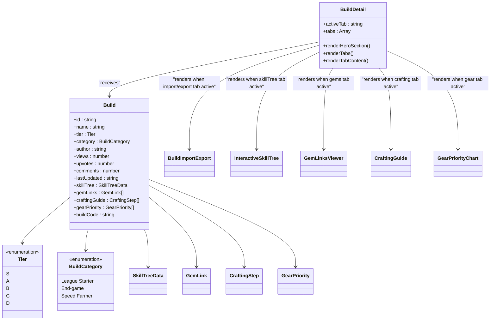
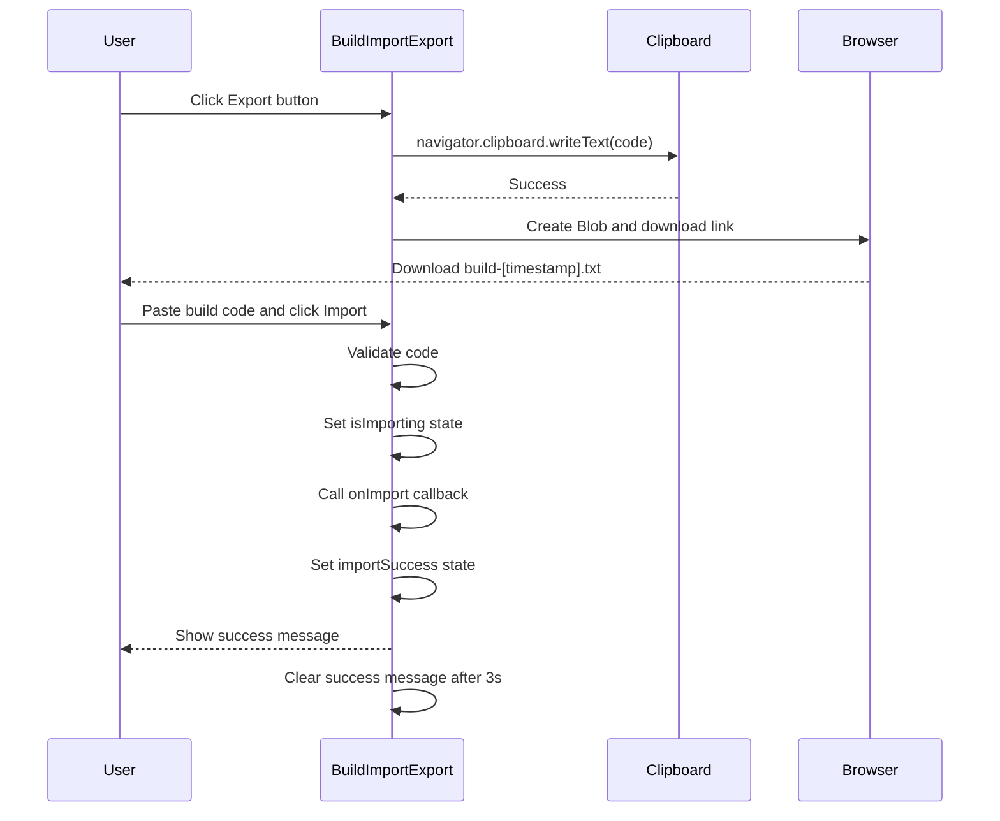

# Build System

<cite>
**Referenced Files in This Document**   
- [BuildDetail.tsx](file://components/builds/BuildDetail.tsx)
- [BuildList.tsx](file://components/builds/BuildList.tsx)
- [BuildImportExport.tsx](file://components/builds/BuildImportExport.tsx)
- [InteractiveSkillTree.tsx](file://components/builds/InteractiveSkillTree.tsx)
- [GemLinksViewer.tsx](file://components/builds/GemLinksViewer.tsx)
- [CraftingGuide.tsx](file://components/builds/CraftingGuide.tsx)
- [GearPriorityChart.tsx](file://components/builds/GearPriorityChart.tsx)
- [index.ts](file://types/index.ts)
- [PROJECT_STATUS.md](file://PROJECT_STATUS.md)
- [DEPLOYMENT_GUIDE.md](file://DEPLOYMENT_GUIDE.md)
</cite>

## Table of Contents
1. [Introduction](#introduction)
2. [Project Structure](#project-structure)
3. [Core Components](#core-components)
4. [Architecture Overview](#architecture-overview)
5. [Detailed Component Analysis](#detailed-component-analysis)
6. [Dependency Analysis](#dependency-analysis)
7. [Performance Considerations](#performance-considerations)
8. [Troubleshooting Guide](#troubleshooting-guide)
9. [Conclusion](#conclusion)

## Introduction
The Build System is a central feature of the Prometheus Planner application, designed to help players of Path of Exile 2 and Diablo IV create, view, and manage character builds. The system supports detailed build specifications including skill trees, gem links, crafting guides, gear priorities, and leveling paths. It features a tier rating system (S+ to D), activity-specific categorization (e.g., bossing, farming), and robust import/export functionality using encoded strings for easy sharing. The system is built with React and Next.js, using TypeScript for type safety and Zustand for future state management scalability.

## Project Structure
The Build System is organized within the `components/builds` directory, with dedicated components for each aspect of build visualization and management. The system integrates with the app's routing through the `app/[locale]/builds` pages, supporting internationalization. Build data is structured using types defined in `types/index.ts`, ensuring consistency across the application.

```mermaid
graph TB
subgraph "Build Components"
BuildList["BuildList.tsx"]
BuildDetail["BuildDetail.tsx"]
BuildImportExport["BuildImportExport.tsx"]
InteractiveSkillTree["InteractiveSkillTree.tsx"]
GemLinksViewer["GemLinksViewer.tsx"]
CraftingGuide["CraftingGuide.tsx"]
GearPriorityChart["GearPriorityChart.tsx"]
end
subgraph "Data & Types"
Types["types/index.ts"]
end
BuildList --> BuildDetail
BuildDetail --> BuildImportExport
BuildDetail --> InteractiveSkillTree
BuildDetail --> GemLinksViewer
BuildDetail --> CraftingGuide
BuildDetail --> GearPriorityChart
BuildList --> Types
BuildDetail --> Types
style BuildList fill:#141417,stroke:#3d3d43
style BuildDetail fill:#141417,stroke:#3d3d43
style BuildImportExport fill:#141417,stroke:#3d3d43
style InteractiveSkillTree fill:#141417,stroke:#3d3d43
style GemLinksViewer fill:#141417,stroke:#3d3d43
style CraftingGuide fill:#141417,stroke:#3d3d43
style GearPriorityChart fill:#141417,stroke:#3d3d43
style Types fill:#0c0c0e,stroke:#3d3d43
```

**Diagram sources**
- [BuildList.tsx](file://components/builds/BuildList.tsx)
- [BuildDetail.tsx](file://components/builds/BuildDetail.tsx)
- [BuildImportExport.tsx](file://components/builds/BuildImportExport.tsx)
- [InteractiveSkillTree.tsx](file://components/builds/InteractiveSkillTree.tsx)
- [GemLinksViewer.tsx](file://components/builds/GemLinksViewer.tsx)
- [CraftingGuide.tsx](file://components/builds/CraftingGuide.tsx)
- [GearPriorityChart.tsx](file://components/builds/GearPriorityChart.tsx)
- [index.ts](file://types/index.ts)

**Section sources**
- [BuildList.tsx](file://components/builds/BuildList.tsx)
- [BuildDetail.tsx](file://components/builds/BuildDetail.tsx)
- [index.ts](file://types/index.ts)

## Core Components
The Build System consists of two primary components: BuildList and BuildDetail. BuildList provides a filtered, categorized view of available builds, while BuildDetail offers an in-depth exploration of a specific build's components. The system uses a tier rating system (S to D) to indicate build effectiveness, with S-tier builds being optimal for specific activities. Build data is structured using the Build interface defined in types/index.ts, which includes comprehensive metadata such as author information, view counts, and performance metrics.

**Section sources**
- [BuildList.tsx](file://components/builds/BuildList.tsx)
- [BuildDetail.tsx](file://components/builds/BuildDetail.tsx)
- [index.ts](file://types/index.ts)

## Architecture Overview
The Build System follows a component-based architecture with clear separation of concerns. The BuildDetail component serves as the main container, orchestrating various specialized components for different aspects of build visualization. Data flows from the parent BuildDetail component to child components through props, with state managed locally within each component using React's useState hook. The system is designed to integrate with Zustand for global state management when needed, as indicated in the PROJECT_STATUS.md file.

```mermaid
graph TD
BuildDetail --> BuildImportExport
BuildDetail --> InteractiveSkillTree
BuildDetail --> GemLinksViewer
BuildDetail --> CraftingGuide
BuildDetail --> GearPriorityChart
BuildDetail --> BuildList
BuildDetail --> Types
BuildImportExport --> Clipboard["navigator.clipboard"]
BuildImportExport --> FileDownload["Blob URL.createObjectURL"]
style BuildDetail fill:#141417,stroke:#3d3d43
style BuildImportExport fill:#141417,stroke:#3d3d43
style InteractiveSkillTree fill:#141417,stroke:#3d3d43
style GemLinksViewer fill:#141417,stroke:#3d3d43
style CraftingGuide fill:#141417,stroke:#3d3d43
style GearPriorityChart fill:#141417,stroke:#3d3d43
style Clipboard fill:#0c0c0e,stroke:#3d3d43
style FileDownload fill:#0c0c0e,stroke:#3d3d43
```

**Diagram sources**
- [BuildDetail.tsx](file://components/builds/BuildDetail.tsx)
- [BuildImportExport.tsx](file://components/builds/BuildImportExport.tsx)
- [InteractiveSkillTree.tsx](file://components/builds/InteractiveSkillTree.tsx)
- [GemLinksViewer.tsx](file://components/builds/GemLinksViewer.tsx)
- [CraftingGuide.tsx](file://components/builds/CraftingGuide.tsx)
- [GearPriorityChart.tsx](file://components/builds/GearPriorityChart.tsx)

## Detailed Component Analysis

### BuildDetail Analysis
The BuildDetail component serves as the primary interface for viewing a complete build. It implements a tabbed navigation system that allows users to explore different aspects of the build without page reloads. The component receives a Build object as a prop and renders appropriate child components based on the active tab. It displays key build information including tier rating, category, author, and engagement metrics (views, upvotes, comments).

**Diagram sources**
- [BuildDetail.tsx](file://components/builds/BuildDetail.tsx)
- [index.ts](file://types/index.ts)

**Section sources**
- [BuildDetail.tsx](file://components/builds/BuildDetail.tsx)
- [index.ts](file://types/index.ts)

### BuildList Analysis
The BuildList component provides a filtered, categorized view of available builds. It implements a filtering system that allows users to narrow builds by tier, category, and game. The component uses React state to manage filter selections and applies them to a list of builds. Each build is displayed as a card with key information including tier rating, category, name, description, and engagement metrics. The component supports responsive design with different grid layouts for various screen sizes.

```mermaid
flowchart TD
Start([Component Mount]) --> InitializeState["Initialize filter states"]
InitializeState --> RenderFilters["Render tier, category, and game filters"]
RenderFilters --> ApplyFilters["Apply filters to build list"]
ApplyFilters --> RenderGrid["Render build grid"]
RenderGrid --> DisplayBuilds["Display build cards"]
DisplayBuilds --> HandleClick["Handle card click"]
HandleClick --> Navigate["Navigate to /builds/[id]"]
subgraph "Filter Logic"
ApplyFilters --> FilterByTier{"Filter by tier?"}
FilterByTier --> |Yes| ApplyTierFilter["Apply tier filter"]
FilterByTier --> |No| Continue1
ApplyTierFilter --> Continue1
Continue1 --> FilterByCategory{"Filter by category?"}
FilterByCategory --> |Yes| ApplyCategoryFilter["Apply category filter"]
FilterByCategory --> |No| Continue2
ApplyCategoryFilter --> Continue2
Continue2 --> FilterByGame{"Filter by game?"}
FilterByGame --> |Yes| ApplyGameFilter["Apply game filter"]
FilterByGame --> |No| Continue3
ApplyGameFilter --> Continue3
end
style Start fill:#141417,stroke:#3d3d43
style InitializeState fill:#141417,stroke:#3d3d43
style RenderFilters fill:#141417,stroke:#3d3d43
style ApplyFilters fill:#141417,stroke:#3d3d43
style RenderGrid fill:#141417,stroke:#3d3d43
style DisplayBuilds fill:#141417,stroke:#3d3d43
style HandleClick fill:#141417,stroke:#3d3d43
style Navigate fill:#141417,stroke:#3d3d43
style FilterByTier fill:#0c0c0e,stroke:#3d3d43
style ApplyTierFilter fill:#141417,stroke:#3d3d43
style Continue1 fill:#141417,stroke:#3d3d43
style FilterByCategory fill:#0c0c0e,stroke:#3d3d43
style ApplyCategoryFilter fill:#141417,stroke:#3d3d43
style Continue2 fill:#141417,stroke:#3d3d43
style FilterByGame fill:#0c0c0e,stroke:#3d3d43
style ApplyGameFilter fill:#141417,stroke:#3d3d43
style Continue3 fill:#141417,stroke:#3d3d43
```

**Diagram sources**
- [BuildList.tsx](file://components/builds/BuildList.tsx)

**Section sources**
- [BuildList.tsx](file://components/builds/BuildList.tsx)

### BuildImportExport Analysis
The BuildImportExport component handles the import and export of build data through encoded strings. The export functionality copies the build code to the clipboard and creates a downloadable text file. The import functionality processes pasted build codes and triggers the import process. The component provides visual feedback for successful imports and handles the import process asynchronously.

**Diagram sources**
- [BuildImportExport.tsx](file://components/builds/BuildImportExport.tsx)

**Section sources**
- [BuildImportExport.tsx](file://components/builds/BuildImportExport.tsx)

## Dependency Analysis
The Build System components have well-defined dependencies and relationships. The BuildDetail component depends on several specialized visualization components, each responsible for a specific aspect of build data. All components depend on the type definitions in types/index.ts for data structure consistency. The system is designed to work with the app's internationalization system through the useTranslations hook. The PROJECT_STATUS.md file indicates that Zustand is available for global state management when needed, though the current implementation uses React's useState for local component state.

```mermaid
graph TD
BuildDetail --> BuildImportExport
BuildDetail --> InteractiveSkillTree
BuildDetail --> GemLinksViewer
BuildDetail --> CraftingGuide
BuildDetail --> GearPriorityChart
BuildDetail --> Types
BuildList --> Types
BuildImportExport --> Types
InteractiveSkillTree --> Types
GemLinksViewer --> Types
CraftingGuide --> Types
GearPriorityChart --> Types
BuildDetail --> NextIntl["useTranslations"]
BuildList --> NextIntl
BuildImportExport --> Lucide["lucide-react"]
BuildDetail --> Lucide
BuildList --> Lucide
BuildDetail --> Clsx["clsx"]
style BuildDetail fill:#141417,stroke:#3d3d43
style BuildImportExport fill:#141417,stroke:#3d3d43
style InteractiveSkillTree fill:#141417,stroke:#3d3d43
style GemLinksViewer fill:#141417,stroke:#3d3d43
style CraftingGuide fill:#141417,stroke:#3d3d43
style GearPriorityChart fill:#141417,stroke:#3d3d43
style Types fill:#0c0c0e,stroke:#3d3d43
style NextIntl fill:#0c0c0e,stroke:#3d3d43
style Lucide fill:#0c0c0e,stroke:#3d3d43
style Clsx fill:#0c0c0e,stroke:#3d3d43
```

**Diagram sources**
- [BuildDetail.tsx](file://components/builds/BuildDetail.tsx)
- [BuildList.tsx](file://components/builds/BuildList.tsx)
- [BuildImportExport.tsx](file://components/builds/BuildImportExport.tsx)
- [InteractiveSkillTree.tsx](file://components/builds/InteractiveSkillTree.tsx)
- [GemLinksViewer.tsx](file://components/builds/GemLinksViewer.tsx)
- [CraftingGuide.tsx](file://components/builds/CraftingGuide.tsx)
- [GearPriorityChart.tsx](file://components/builds/GearPriorityChart.tsx)
- [index.ts](file://types/index.ts)

**Section sources**
- [BuildDetail.tsx](file://components/builds/BuildDetail.tsx)
- [BuildList.tsx](file://components/builds/BuildList.tsx)
- [BuildImportExport.tsx](file://components/builds/BuildImportExport.tsx)
- [index.ts](file://types/index.ts)

## Performance Considerations
The Build System is designed with performance in mind, particularly for handling complex build visualizations. The InteractiveSkillTree component uses SVG for rendering skill nodes and connections, which provides good performance for large graphs. The component implements panning and zooming with CSS transforms for smooth interaction. For large skill trees, virtualization could be implemented to render only visible nodes. The BuildList component uses responsive grid layouts to optimize display on different screen sizes. The system currently uses mock data, but when integrated with a real API, caching strategies and pagination should be implemented to handle large numbers of builds efficiently.

## Troubleshooting Guide
Common issues with the Build System include corrupted build codes, missing dependencies, and rendering performance issues with large skill trees. Corrupted build codes can be addressed by implementing validation and error handling in the import process. Missing dependencies can be prevented by ensuring all required packages are included in package.json and properly installed. For rendering performance issues with large skill trees, consider implementing virtualization to render only visible nodes, or using a canvas-based rendering approach for better performance with large numbers of elements. The system should also implement proper error boundaries to handle unexpected errors gracefully.

**Section sources**
- [BuildImportExport.tsx](file://components/builds/BuildImportExport.tsx)
- [InteractiveSkillTree.tsx](file://components/builds/InteractiveSkillTree.tsx)
- [PROJECT_STATUS.md](file://PROJECT_STATUS.md)

## Conclusion
The Build System provides a comprehensive solution for creating, viewing, and managing character builds in Path of Exile 2 and Diablo IV. Its component-based architecture allows for modular development and easy maintenance. The system's tier rating system and categorization logic help users quickly identify optimal builds for their needs. The import/export functionality enables easy sharing of builds between players. With its robust data structure and planned integration with Zustand for global state management, the system is well-positioned to support future enhancements such as build comparison, real-time collaboration, and AI-powered build recommendations.