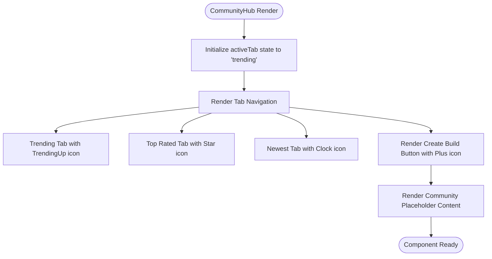
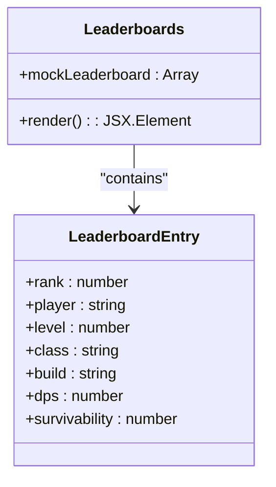
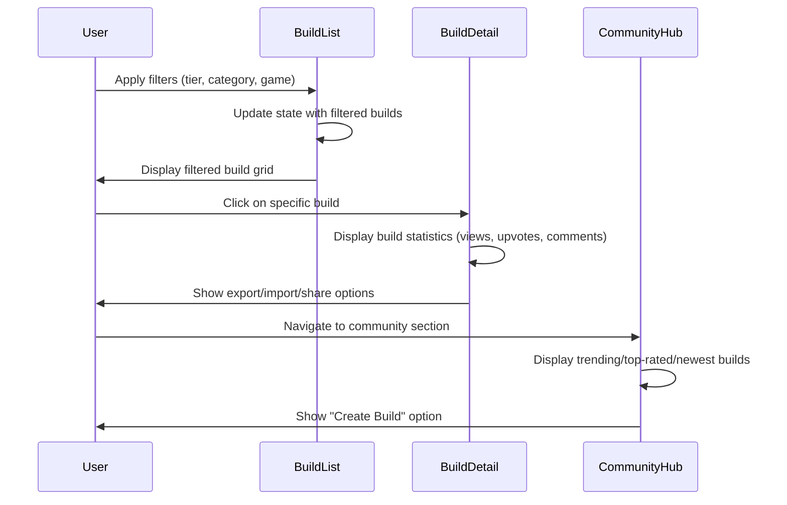
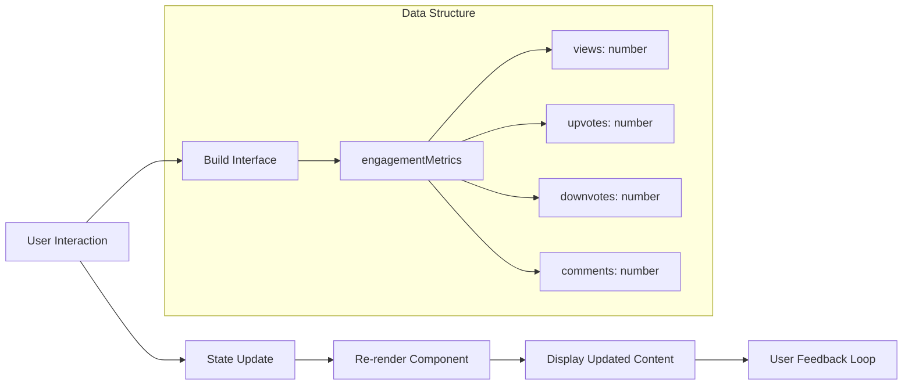
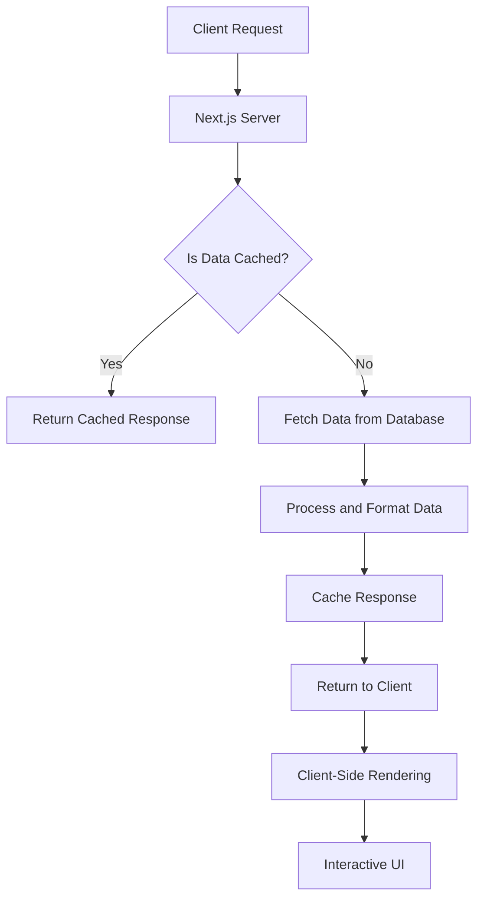
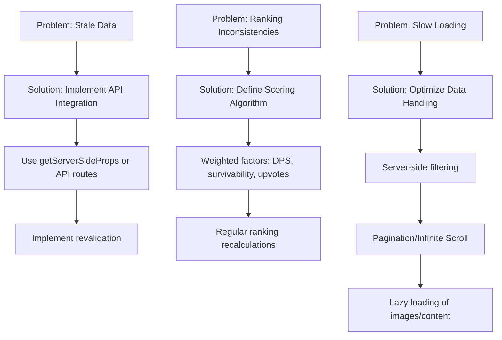
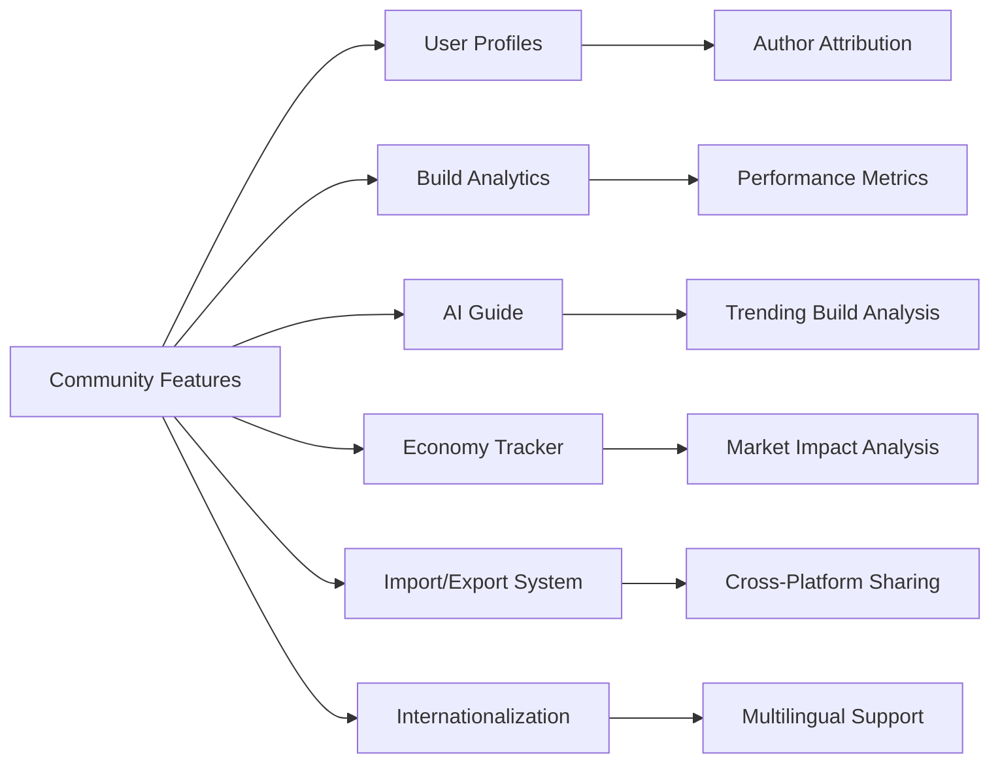

# Community Features

<cite>
**Referenced Files in This Document**   
- [CommunityHub.tsx](file://components/community/CommunityHub.tsx)
- [Leaderboards.tsx](file://components/leaderboards/Leaderboards.tsx)
- [BuildDetail.tsx](file://components/builds/BuildDetail.tsx)
- [BuildList.tsx](file://components/builds/BuildList.tsx)
- [index.ts](file://types/index.ts)
- [en.json](file://messages/en.json)
- [community/page.tsx](file://app/[locale]/community/page.tsx)
- [leaderboards/page.tsx](file://app/[locale]/leaderboards/page.tsx)
</cite>

## Table of Contents
1. [Introduction](#introduction)
2. [CommunityHub Component](#communityhub-component)
3. [Leaderboards Implementation](#leaderboards-implementation)
4. [User Engagement Features](#user-engagement-features)
5. [Data Flow and State Management](#data-flow-and-state-management)
6. [Performance and Scalability](#performance-and-scalability)
7. [Common Issues and Solutions](#common-issues-and-solutions)
8. [Community Participation Strategies](#community-participation-strategies)
9. [Integration Points](#integration-points)

## Introduction
The Prometheus Planner application includes community features designed to foster user engagement through build sharing, voting, and social interaction. The system centers around two main components: the CommunityHub for user-generated content discovery and the Leaderboards for showcasing top-performing builds. These features enable players to share their strategies, discover popular builds, and compare performance metrics across the community. The implementation leverages React's client-side rendering with Next.js for optimal user experience and internationalization support.

## CommunityHub Component

The CommunityHub component serves as the central interface for community interaction, providing tabbed navigation for different content views including trending, top-rated, and newest builds. The component implements client-side state management using React's useState hook to track the active tab selection. Internationalization is handled through next-intl, allowing dynamic translation of UI elements based on user preferences.

**Diagram sources**
- [CommunityHub.tsx](file://components/community/CommunityHub.tsx#L7-L78)

**Section sources**
- [CommunityHub.tsx](file://components/community/CommunityHub.tsx#L1-L78)
- [en.json](file://messages/en.json#L89-L99)
- [community/page.tsx](file://app/[locale]/community/page.tsx#L1-L20)

## Leaderboards Implementation

The Leaderboards component displays top-performing player builds with ranking information, including player name, level, class, build type, DPS, and survivability metrics. The implementation uses a mock data structure that would be replaced with actual API data in production. The visual design includes special icons for top three positions (Trophy for rank 1, Medal for ranks 2-3) and a percentage-based progress bar for survivability visualization.

**Diagram sources**
- [Leaderboards.tsx](file://components/leaderboards/Leaderboards.tsx#L5-L64)
- [leaderboards/page.tsx](file://app/[locale]/leaderboards/page.tsx#L1-L20)

**Section sources**
- [Leaderboards.tsx](file://components/leaderboards/Leaderboards.tsx#L1-L64)
- [index.ts](file://types/index.ts#L9-L34)

## User Engagement Features

The application facilitates user engagement through multiple interactive features centered around build sharing and social feedback mechanisms. The BuildDetail component implements key engagement metrics including view tracking, upvoting, and comment counting, which are displayed prominently alongside each build. These metrics are integrated into the user interface with appropriate icons (Eye for views, ThumbsUp for upvotes, MessageCircle for comments).

The BuildList component enhances discoverability through comprehensive filtering options by tier (S, A, B, C, D), category (League Starter, End-game, Speed Farmer), and game (PoE 2, Diablo IV). This filtering system enables users to quickly find builds that match their interests and playstyle preferences.

**Diagram sources**
- [BuildDetail.tsx](file://components/builds/BuildDetail.tsx#L70-L86)
- [BuildList.tsx](file://components/builds/BuildList.tsx#L104-L199)

**Section sources**
- [BuildDetail.tsx](file://components/builds/BuildDetail.tsx#L1-L225)
- [BuildList.tsx](file://components/builds/BuildList.tsx#L1-L265)
- [index.ts](file://types/index.ts#L115-L135)

## Data Flow and State Management

The community features implement a client-side state management approach using React's built-in useState hook for managing UI state such as active tabs and filter selections. The data flow follows a unidirectional pattern where state changes trigger component re-renders to reflect updated content. The application uses TypeScript interfaces to define the structure of build data, ensuring type safety throughout the component hierarchy.

The Build type definition includes comprehensive properties for community engagement metrics such as views, upvotes, downvotes, and comments, which are displayed in both the BuildList and BuildDetail components. These metrics are formatted using locale-specific number formatting (toLocaleString) for improved readability.

**Diagram sources**
- [index.ts](file://types/index.ts#L9-L34)
- [BuildDetail.tsx](file://components/builds/BuildDetail.tsx#L10-L20)

**Section sources**
- [index.ts](file://types/index.ts#L1-L136)
- [BuildDetail.tsx](file://components/builds/BuildDetail.tsx#L1-L225)

## Performance and Scalability

The community features are designed with performance and scalability considerations, leveraging React's efficient rendering model and Next.js optimization capabilities. The application targets high performance metrics as documented in the DEPLOYMENT_GUIDE.md, including a PageSpeed score target of 90+ and First Contentful Paint under 1.8 seconds.

The component architecture supports unlimited builds per class with comprehensive metadata, enabling scalability as the community grows. The filtering system in BuildList implements client-side filtering of mock data, which would be optimized in production through server-side filtering and pagination to handle large datasets efficiently.

**Diagram sources**
- [DEPLOYMENT_GUIDE.md](file://DEPLOYMENT_GUIDE.md#L105-L111)
- [BuildList.tsx](file://components/builds/BuildList.tsx#L92-L97)

## Common Issues and Solutions

### Stale Leaderboard Data
The current implementation uses mock data in the Leaderboards component, which could lead to stale information in a production environment. This would be resolved by implementing API integration with real-time data fetching and caching strategies using Next.js revalidation.

### Ranking Inconsistencies
Without a defined ranking algorithm, there's potential for inconsistent sorting of leaderboard entries. The solution involves implementing a comprehensive scoring system that considers multiple factors such as DPS, survivability, upvotes, and recency of updates.

### Slow Loading Times
With a growing number of community builds, the client-side filtering in BuildList could impact performance. This would be addressed by implementing server-side filtering, pagination, and infinite scrolling to limit the amount of data processed at once.

**Section sources**
- [Leaderboards.tsx](file://components/leaderboards/Leaderboards.tsx#L5-L9)
- [BuildList.tsx](file://components/builds/BuildList.tsx#L92-L97)

## Community Participation Strategies

The application encourages community participation through several design elements. The prominent "Create Build" button in the CommunityHub provides a clear call-to-action for users to contribute their own builds. The tier system (S, A, B, C, D) creates a gamified element that motivates users to optimize their builds for higher ratings.

Social features such as upvoting, commenting, and sharing are integrated throughout the build viewing experience, fostering interaction between community members. The filtering and sorting options enable users to discover content that matches their interests, increasing engagement with the platform.

The internationalization system supports multiple languages (English, Arabic), making the platform accessible to a broader audience and encouraging participation from diverse player communities.

**Section sources**
- [CommunityHub.tsx](file://components/community/CommunityHub.tsx#L57-L62)
- [en.json](file://messages/en.json#L89-L99)
- [BuildDetail.tsx](file://components/builds/BuildDetail.tsx#L91-L102)

## Integration Points

The community features integrate with several other components and systems within the application. User profiles are linked from build author information, allowing community members to explore other builds by the same creator. The build analytics system tracks views, upvotes, and comments, providing valuable feedback to creators.

The AI Guide component could potentially leverage community data to provide recommendations based on popular builds and trending strategies. The economy tracker might integrate with community features to analyze the impact of popular builds on in-game item prices and market trends.

The import/export functionality enables sharing of builds across platforms, extending the community reach beyond the immediate application user base.

**Diagram sources**
- [BuildDetail.tsx](file://components/builds/BuildDetail.tsx#L113-L128)
- [index.ts](file://types/index.ts#L115-L123)

**Section sources**
- [BuildDetail.tsx](file://components/builds/BuildDetail.tsx#L1-L225)
- [index.ts](file://types/index.ts#L115-L135)