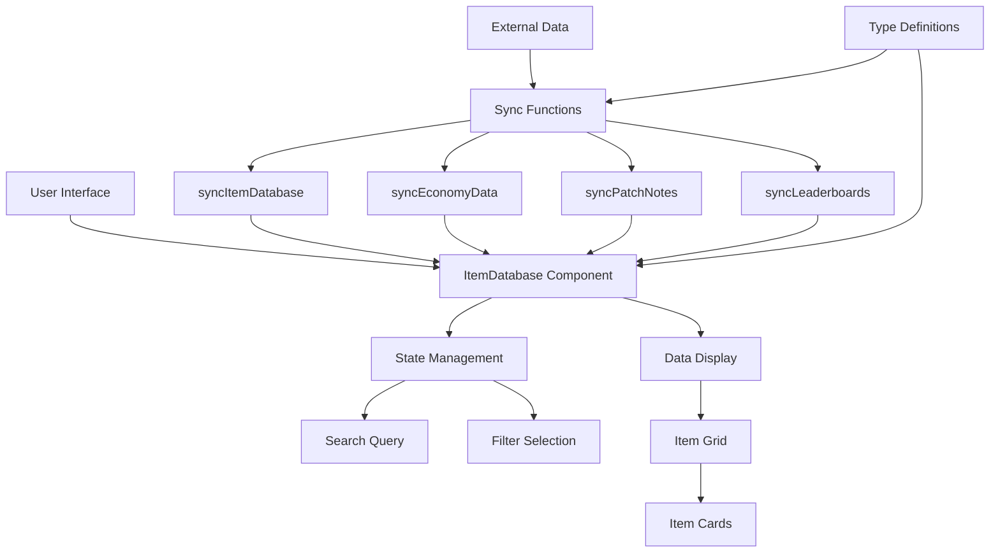
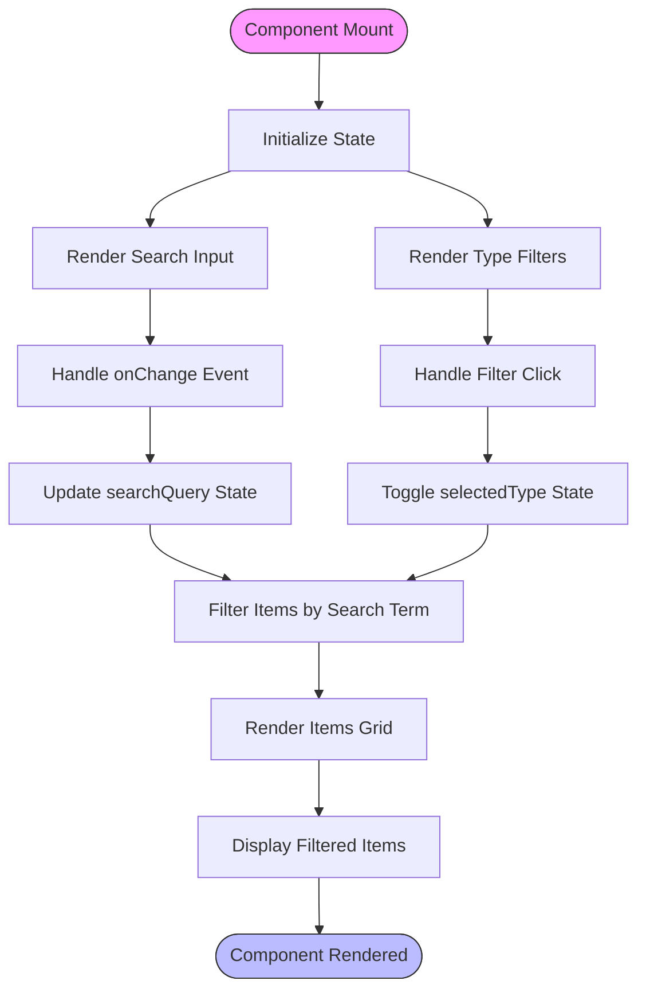
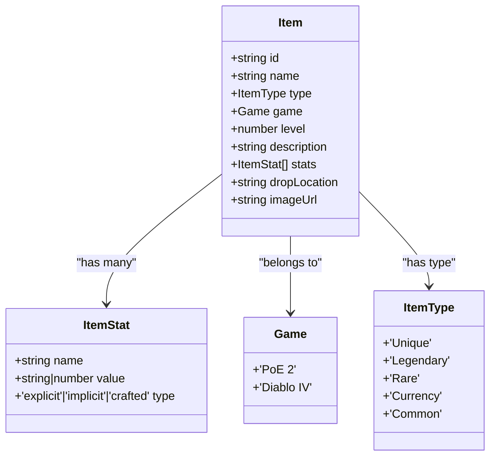
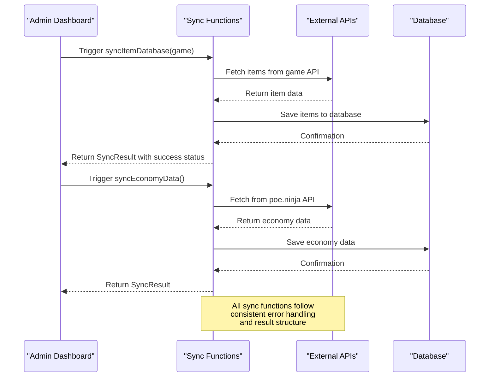

# Item Database

<cite>
**Referenced Files in This Document**   
- [ItemDatabase.tsx](file://components/database/ItemDatabase.tsx)
- [sync.ts](file://lib/api/sync.ts)
- [index.ts](file://types/index.ts)
- [page.tsx](file://app/[locale]/database/page.tsx)
- [IMPLEMENTATION_SUMMARY.md](file://IMPLEMENTATION_SUMMARY.md)
- [README.md](file://README.md)
</cite>

## Table of Contents
1. [Introduction](#introduction)
2. [Project Structure](#project-structure)
3. [Core Components](#core-components)
4. [Architecture Overview](#architecture-overview)
5. [Detailed Component Analysis](#detailed-component-analysis)
6. [Dependency Analysis](#dependency-analysis)
7. [Performance Considerations](#performance-considerations)
8. [Troubleshooting Guide](#troubleshooting-guide)
9. [Conclusion](#conclusion)

## Introduction
The Item Database feature provides a comprehensive, searchable repository of in-game items for Path of Exile 2 and Diablo IV. It supports advanced search, filtering, and sorting capabilities to help players quickly find relevant gear. The system is designed with scalability in mind, supporting multiple game versions, item types, and complex stat structures. Data is synchronized from external sources through automated sync functions, ensuring freshness and accuracy. The UI is optimized for both desktop and mobile use, with responsive design and intuitive interaction patterns.

## Project Structure
The Item Database feature is organized within the Next.js App Router structure, following locale-based routing patterns. The core component resides in the components directory, while the page-level integration occurs in the app directory. Type definitions are centralized for consistency across the application.

```mermaid
graph TB
subgraph "App Routing"
A[app/[locale]/database/page.tsx] --> B[ItemDatabase Component]
end
subgraph "Components"
B --> C[components/database/ItemDatabase.tsx]
end
subgraph "Data Layer"
D[types/index.ts] --> B
E[lib/api/sync.ts] --> B
end
subgraph "Configuration"
F[IMPLEMENTATION_SUMMARY.md]
G[README.md]
end
```

**Diagram sources**
- [page.tsx](file://app/[locale]/database/page.tsx)
- [ItemDatabase.tsx](file://components/database/ItemDatabase.tsx)
- [index.ts](file://types/index.ts)
- [sync.ts](file://lib/api/sync.ts)

**Section sources**
- [page.tsx](file://app/[locale]/database/page.tsx)
- [ItemDatabase.tsx](file://components/database/ItemDatabase.tsx)

## Core Components
The ItemDatabase component implements search and filtering functionality using React state management. It supports filtering by item type (Unique, Legendary, Rare, Currency) and provides full-text search across item names. The component is designed to work with the internationalization system through next-intl, supporting both English and Arabic locales. The UI presents items in a responsive grid layout that adapts to different screen sizes, with hover effects and visual feedback for user interactions.

**Section sources**
- [ItemDatabase.tsx](file://components/database/ItemDatabase.tsx#L35-L111)

## Architecture Overview
The Item Database architecture follows a client-side component model with potential for server-side data integration. The current implementation uses mock data, but is structured to support API integration through the sync functions in lib/api/sync.ts. The system is designed with separation of concerns, where the UI component handles presentation and user interaction, while external modules manage data synchronization and type definitions.



**Diagram sources**
- [ItemDatabase.tsx](file://components/database/ItemDatabase.tsx)
- [sync.ts](file://lib/api/sync.ts)
- [index.ts](file://types/index.ts)

## Detailed Component Analysis

### Item Database Component Analysis
The ItemDatabase component implements a client-side search and filtering system using React's useState hook to manage search queries and filter selections. The component renders a search input field with a magnifying glass icon and filter buttons for different item types. Results are displayed in a responsive grid that adjusts column count based on screen width.



**Diagram sources**
- [ItemDatabase.tsx](file://components/database/ItemDatabase.tsx#L35-L111)

**Section sources**
- [ItemDatabase.tsx](file://components/database/ItemDatabase.tsx#L35-L111)

### Data Structure Analysis
The item data structure is defined in the types system with comprehensive type safety. Each item includes basic metadata (id, name, type, game, level, description) as well as structured stats with explicit typing for different stat categories. This design allows for flexible representation of various item properties while maintaining type safety across the application.



**Diagram sources**
- [index.ts](file://types/index.ts#L97-L113)

**Section sources**
- [index.ts](file://types/index.ts#L1-L136)

### Data Synchronization Analysis
The data synchronization system is designed to maintain fresh item data through automated sync processes. The sync functions are structured to handle different data categories (item database, economy data, patch notes, leaderboards) with consistent result interfaces. Although currently implemented as stubs, the functions follow a pattern that would support actual API integration with error handling and timestamp tracking.



**Diagram sources**
- [sync.ts](file://lib/api/sync.ts#L18-L98)
- [AdminDashboard.tsx](file://components/admin/AdminDashboard.tsx#L143-L193)

**Section sources**
- [sync.ts](file://lib/api/sync.ts#L1-L98)

## Dependency Analysis
The Item Database feature depends on several core modules within the application. The component relies on the internationalization system (next-intl) for localized text, the type system for data structure definitions, and the API sync module for data freshness. The UI components depend on Tailwind CSS for styling and Lucide React for icons. The architecture is designed to minimize coupling while maintaining functionality.

```mermaid
graph TD
A[ItemDatabase] --> B[next-intl]
A --> C[Tailwind CSS]
A --> D[Lucide React]
A --> E[Type Definitions]
A --> F[Sync Functions]
E --> G[ItemType]
E --> H[Game]
F --> I[syncItemDatabase]
F --> J[syncEconomyData]
F --> K[syncPatchNotes]
F --> L[syncLeaderboards]
style A fill:#c5a059,stroke:#333
style B fill:#141417,stroke:#3d3d43
style C fill:#141417,stroke:#3d3d43
style D fill:#141417,stroke:#3d3d43
style E fill:#141417,stroke:#3d3d43
style F fill:#141417,stroke:#3d3d43
```



**Diagram sources**
- [ItemDatabase.tsx](file://components/database/ItemDatabase.tsx)
- [index.ts](file://types/index.ts)
- [sync.ts](file://lib/api/sync.ts)

**Section sources**
- [ItemDatabase.tsx](file://components/database/ItemDatabase.tsx)
- [index.ts](file://types/index.ts)
- [sync.ts](file://lib/api/sync.ts)

## Performance Considerations
The current implementation uses client-side filtering which may impact performance with large datasets. For optimal performance with extensive item collections, consider implementing server-side filtering, pagination, or virtualized rendering. The search functionality performs case-insensitive matching on item names, which is efficient for moderate dataset sizes. The component's re-renders are optimized through React's state management, but could benefit from memoization for larger datasets.

## Troubleshooting Guide
Common issues with the Item Database feature include slow search response, missing items, and incorrect stat calculations. For slow search response, verify dataset size and consider implementing debouncing or server-side search. For missing items, check the data synchronization status and verify that the sync process completed successfully. For incorrect stat calculations, validate the item data structure and ensure proper type handling in the rendering logic. The admin dashboard provides sync controls and status information to help diagnose data freshness issues.

**Section sources**
- [sync.ts](file://lib/api/sync.ts#L18-L98)
- [AdminDashboard.tsx](file://components/admin/AdminDashboard.tsx#L143-L193)

## Conclusion
The Item Database feature provides a robust foundation for managing and displaying in-game items across multiple ARPG titles. The architecture supports extensibility for additional games and item types, with a clear path for integrating real data sources. The UI design prioritizes usability with intuitive search and filtering controls, while the underlying code maintains separation of concerns and type safety. Future enhancements could include advanced filtering by stats, crafting modifiers, and rarity, as well as improved performance optimizations for large datasets.