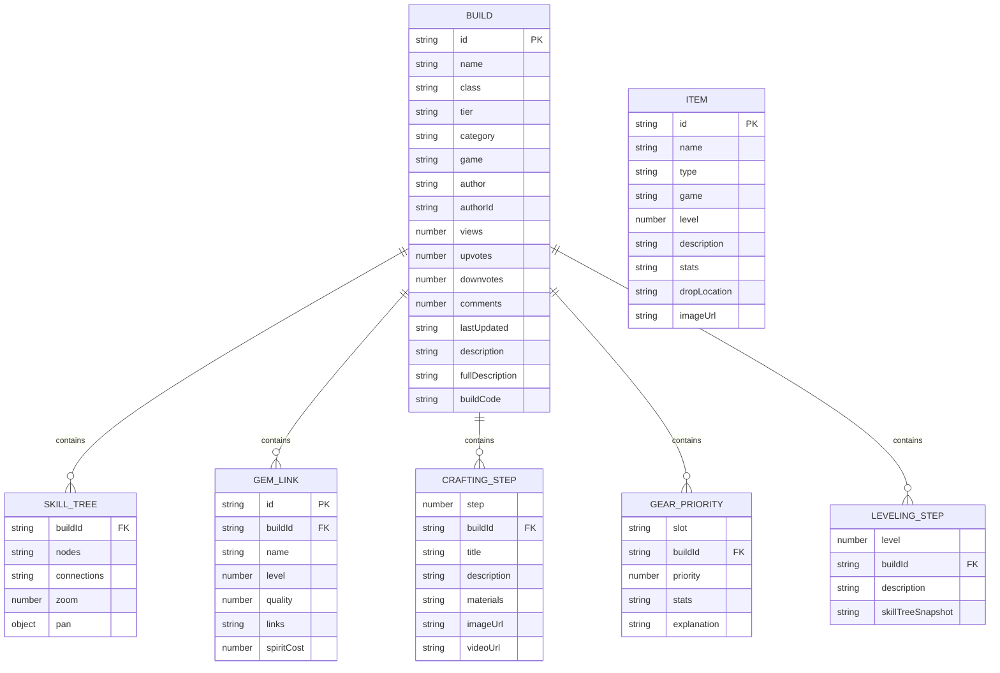
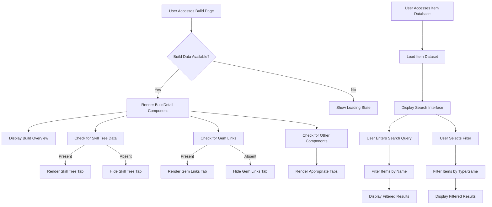

# Data Models

<cite>
**Referenced Files in This Document**   
- [types/index.ts](file://types/index.ts)
- [components/builds/BuildDetail.tsx](file://components/builds/BuildDetail.tsx)
- [components/database/ItemDatabase.tsx](file://components/database/ItemDatabase.tsx)
- [app/[locale]/builds/[id]/page.tsx](file://app/[locale]/builds/[id]/page.tsx)
</cite>

## Table of Contents
1. [Introduction](#introduction)
2. [Build Model](#build-model)
3. [Item Model](#item-model)
4. [Entity Relationships](#entity-relationships)
5. [Data Validation and Business Rules](#data-validation-and-business-rules)
6. [Sample Data Instances](#sample-data-instances)
7. [Data Access Patterns](#data-access-patterns)
8. [Performance Considerations](#performance-considerations)

## Introduction
The Prometheus-Planner V2 application features a comprehensive data modeling system centered around two core entities: Build and Item. These models represent the fundamental data structures that power the build planning and item database functionality for players of Path of Exile 2 and Diablo IV. The Build model captures complete character configurations including skill trees, gem links, and crafting guides, while the Item model represents individual in-game items with their stats and properties. This documentation provides a detailed analysis of these core data models, their fields, relationships, and usage patterns within the application.

## Build Model
The Build model represents a complete character configuration in the Prometheus-Planner V2 application. It contains comprehensive information about a player's character build, including metadata, performance ratings, and detailed gameplay components.

### Core Properties
The Build interface defines the essential characteristics of a character build:

- **id**: Unique identifier for the build (string)
- **name**: Display name of the build (string)
- **class**: Character class associated with the build (string)
- **tier**: Performance rating using the S, A, B, C, D scale (Tier type)
- **category**: Classification of the build's purpose (BuildCategory type: 'League Starter', 'End-game', 'Speed Farmer')
- **game**: Target game for the build (Game type: 'PoE 2' or 'Diablo IV')
- **author**: Display name of the build creator (string)
- **authorId**: Unique identifier for the author (string)
- **views**: Count of how many times the build has been viewed (number)
- **upvotes/downvotes**: Community rating system (number)
- **comments**: Count of comments on the build (number)
- **lastUpdated**: Timestamp of the last modification (string)
- **description**: Brief summary of the build (string)
- **fullDescription**: Detailed explanation of the build strategy (optional string)
- **tags**: Array of keywords for search and filtering (string[])
- **buildCode**: Exportable string representing the build configuration (optional string)
- **seoMeta**: Search engine optimization metadata (optional SEOMeta object)

**Section sources**
- [types/index.ts](file://types/index.ts#L9-L34)

### Associated Data Components
The Build model includes several complex nested objects that represent specific aspects of a character configuration:

#### Skill Tree Data
The skillTree property contains an interactive representation of the character's skill tree progression:

- **nodes**: Array of SkillNode objects representing individual skill points
  - id: Unique identifier
  - name: Skill name
  - description: Skill functionality
  - x/y: Position coordinates
  - type: Classification (small, notable, keystone, start)
  - stats: Array of stat modifications
  - imageUrl: Visual representation
- **connections**: Array of SkillConnection objects defining relationships between nodes
  - from: Source node ID
  - to: Target node ID
- **zoom/pan**: Viewport settings for the interactive skill tree

#### Gem Links
The gemLinks property contains an array of GemLink objects representing skill gem configurations:

- **id**: Unique identifier
- **name**: Gem combination name
- **level**: Required character level
- **quality**: Gem quality percentage
- **links**: Array of support gems in the link
- **spiritCost**: Resource cost (optional)

#### Crafting Guide
The craftingGuide property contains step-by-step instructions for creating optimal gear:

- **step**: Sequential number
- **title**: Step name
- **description**: Detailed instructions
- **materials**: Required crafting components
- **imageUrl**: Visual reference (optional)
- **videoUrl**: Tutorial video (optional)

#### Gear Priority
The gearPriority property defines the importance and requirements for each equipment slot:

- **slot**: Equipment location (e.g., Weapon, Helmet)
- **priority**: Ranking from 1-10 indicating importance
- **stats**: Desired stat modifiers
- **explanation**: Rationale for the priority assignment

#### Leveling Guide
The levelingGuide property provides progression milestones:

- **level**: Character level target
- **description**: Strategy and objectives
- **skillTreeSnapshot**: Reference to skill tree state (optional)

**Section sources**
- [types/index.ts](file://types/index.ts#L25-L32)
- [types/index.ts](file://types/index.ts#L36-L95)

## Item Model
The Item model represents individual in-game items within the Prometheus-Planner V2 application. It captures the essential properties and statistics of equipment, currency, and other game items.

### Core Properties
The Item interface defines the fundamental characteristics of an in-game item:

- **id**: Unique identifier for the item (string)
- **name**: Display name of the item (string)
- **type**: Classification of the item (ItemType: 'Unique', 'Legendary', 'Rare', 'Currency', 'Common')
- **game**: Target game for the item (Game: 'PoE 2' or 'Diablo IV')
- **level**: Minimum character level requirement (number)
- **description**: Functional description of the item (string)
- **stats**: Array of ItemStat objects representing the item's modifiers
- **dropLocation**: Where the item can be obtained (optional string)
- **imageUrl**: Visual representation (optional string)

**Section sources**
- [types/index.ts](file://types/index.ts#L97-L107)

### Item Statistics
The ItemStat interface defines the structure of individual stat modifiers on an item:

- **name**: Descriptive name of the stat (string)
- **value**: Numerical or textual value of the stat (string | number)
- **type**: Origin of the stat (explicit, implicit, crafted)

This structure allows for flexible representation of various stat types, distinguishing between base properties (implicit), rolled modifiers (explicit), and player-applied enhancements (crafted).

**Section sources**
- [types/index.ts](file://types/index.ts#L109-L113)

## Entity Relationships
The data models in Prometheus-Planner V2 establish several important relationships between entities that reflect the gameplay mechanics and user experience requirements.

### Build-Item Relationship
While not directly implemented as a foreign key relationship in the current schema, the conceptual relationship between builds and items is fundamental to the application's purpose. A Build entity implicitly references multiple Item entities through its gearPriority property, which specifies the desired items for each equipment slot. This one-to-many relationship allows a single build to recommend multiple items across different gear slots, creating a comprehensive equipment guide.

### Build-Component Relationships
The Build model has several one-to-many relationships with its component entities:

- **Build → SkillNode**: One build contains many skill tree nodes
- **Build → GemLink**: One build contains many gem link configurations
- **Build → CraftingStep**: One build contains many crafting steps
- **Build → GearPriority**: One build contains many gear priority entries
- **Build → LevelingStep**: One build contains many leveling milestones

These relationships enable the build entity to serve as a container for all aspects of a character configuration, providing a complete picture of the recommended playstyle.

### Hierarchical Structure
The data model follows a hierarchical organization where the Build entity serves as the root, with various specialized components branching from it. This structure reflects the natural organization of build planning, where the overall concept (the build) encompasses specific implementation details (gems, skills, gear).



**Diagram sources**
- [types/index.ts](file://types/index.ts#L9-L95)

## Data Validation and Business Rules
The application implements several data validation rules and business logic patterns to ensure data integrity and provide meaningful user experiences.

### Type Safety and Constraints
The TypeScript interfaces enforce strict type checking for all properties, preventing invalid data assignments. Key constraints include:

- **Tier ratings**: Restricted to S, A, B, C, D values only
- **Build categories**: Limited to predefined categories (League Starter, End-game, Speed Farmer)
- **Item types**: Constrained to specific classifications (Unique, Legendary, Rare, Currency, Common)
- **Priority values**: Gear priority uses a 1-10 scale
- **Required fields**: Core properties like id, name, and description are mandatory

### Business Logic
The application incorporates several business rules that govern how data is presented and interpreted:

- **Tier-based visual styling**: The UI applies gradient backgrounds based on tier ratings (S-tier = yellow-orange, A-tier = green-emerald, etc.)
- **Conditional rendering**: Components only render when their associated data is present (e.g., Skill Tree tab only appears if skillTree data exists)
- **Data formatting**: Numbers are formatted with locale-specific separators for views and upvotes
- **Search and filtering**: Items and builds can be filtered by type, game, tier, and category

Although Zod schema validation was not found in the codebase, the TypeScript interfaces provide compile-time type safety, and the component logic includes runtime checks to handle optional properties gracefully.

**Section sources**
- [types/index.ts](file://types/index.ts#L3-L8)
- [components/builds/BuildDetail.tsx](file://components/builds/BuildDetail.tsx#L45-L50)
- [components/builds/BuildList.tsx](file://components/builds/BuildList.tsx#L78-L84)

## Sample Data Instances
The following examples demonstrate valid instances of the core data models as they appear in the application.

### Sample Build Instance
```json
{
  "id": "1",
  "name": "Lightning Spear Mercenary",
  "class": "Mercenary",
  "tier": "S",
  "category": "League Starter",
  "game": "PoE 2",
  "author": "ProGamer123",
  "authorId": "user1",
  "views": 12500,
  "upvotes": 892,
  "downvotes": 45,
  "comments": 123,
  "lastUpdated": "2 days ago",
  "description": "High DPS lightning build focused on spear attacks",
  "fullDescription": "This Lightning Spear Mercenary build is perfect for league start...",
  "skillTree": {
    "nodes": [
      {
        "id": "start",
        "name": "Mercenary Origin",
        "description": "Starting point",
        "x": 400,
        "y": 300,
        "type": "start"
      }
    ],
    "connections": [
      {
        "from": "start",
        "to": "life1"
      }
    ]
  },
  "gemLinks": [
    {
      "id": "main",
      "name": "Lightning Spear",
      "level": 20,
      "quality": 20,
      "spiritCost": 25,
      "links": ["Added Lightning Damage", "Faster Attacks", "Elemental Focus"]
    }
  ],
  "craftingGuide": [
    {
      "step": 1,
      "title": "Craft the Base Weapon",
      "description": "Start with a high item level spear base...",
      "materials": ["High-level Spear Base", "Essence of Wrath", "Orb of Alchemy"]
    }
  ],
  "gearPriority": [
    {
      "slot": "Weapon",
      "priority": 10,
      "stats": ["Lightning Damage", "Attack Speed", "Critical Strike Chance"],
      "explanation": "Weapon is the most important slot..."
    }
  ],
  "levelingGuide": [
    {
      "level": 20,
      "description": "Focus on life nodes and basic damage increases..."
    }
  ],
  "tags": ["lightning", "spear", "mercenary", "league-starter"],
  "buildCode": "POE2_BUILD_CODE_HERE",
  "seoMeta": {
    "title": "Lightning Spear Mercenary Build Guide - PoE 2",
    "description": "Best Lightning Spear Mercenary build for Path of Exile 2...",
    "keywords": ["poe2", "mercenary", "lightning", "spear", "build", "guide"]
  }
}
```

### Sample Item Instance
```json
{
  "id": "1",
  "name": "Shavronne's Wrappings",
  "type": "Unique",
  "game": "PoE 2",
  "level": 68,
  "description": "Energy Shield based unique chest",
  "stats": [
    {
      "name": "Energy Shield",
      "value": "+150",
      "type": "explicit"
    },
    {
      "name": "Fire Resistance",
      "value": "+20%",
      "type": "implicit"
    }
  ],
  "dropLocation": "Shavronne's Spire",
  "imageUrl": "/images/items/shavronnes-wrappings.png"
}
```

**Section sources**
- [app/[locale]/builds/[id]/page.tsx](file://app/[locale]/builds/[id]/page.tsx#L6-L87)
- [components/database/ItemDatabase.tsx](file://components/database/ItemDatabase.tsx#L9-L32)

## Data Access Patterns
The application implements specific patterns for accessing and displaying data that optimize the user experience and performance.

### Build Data Access
Builds are accessed through the BuildDetail component, which receives a fully populated Build object as a prop. The component implements a tabbed interface that conditionally renders different aspects of the build based on available data:

- **Overview**: Always displayed with basic build information
- **Skill Tree**: Rendered only if skillTree data is present
- **Gem Links**: Displayed when gemLinks array exists
- **Crafting Guide**: Shown if craftingGuide is provided
- **Gear Priority**: Appears when gearPriority data is available
- **Leveling Guide**: Rendered when levelingGuide exists
- **Import/Export**: Always available for build code operations

The component uses React state to manage the active tab, allowing users to navigate between different aspects of the build without reloading.

### Item Data Access
Items are accessed through the ItemDatabase component, which implements client-side filtering of a dataset. The component provides:

- **Search functionality**: Filters items by name using case-insensitive matching
- **Type filtering**: Allows users to filter by item type (Unique, Legendary, etc.)
- **Game filtering**: Separates items by target game (PoE 2, Diablo IV)
- **Grid display**: Presents items in a responsive grid layout

The data access pattern uses in-memory filtering of a dataset, which is suitable for smaller collections but may require server-side implementation for larger databases in production.



**Diagram sources**
- [components/builds/BuildDetail.tsx](file://components/builds/BuildDetail.tsx#L22-L224)
- [components/database/ItemDatabase.tsx](file://components/database/ItemDatabase.tsx#L37-L48)

## Performance Considerations
The application's data models and access patterns have several performance implications that should be considered for optimal user experience.

### Large Build Configurations
Builds containing extensive skill tree data or numerous gem links can result in large payload sizes. The current implementation loads the entire build object at once, which may impact loading times for complex builds. Potential optimizations include:

- **Lazy loading**: Load core build data first, then fetch detailed components on demand
- **Pagination**: Implement pagination for lengthy crafting or leveling guides
- **Data compression**: Compress skill tree and gem link data in storage
- **Caching**: Implement client-side caching of frequently accessed builds

### Client-Side Filtering
The ItemDatabase component performs filtering on the client side, which is efficient for small datasets but may become problematic as the item collection grows. For larger databases, server-side filtering with API endpoints would provide better performance and reduce initial payload size.

### Image Optimization
The models include imageUrl properties for visual representation, but the current implementation does not specify image optimization strategies. Implementing responsive images with appropriate sizing and modern formats (WebP, AVIF) would improve loading performance.

### State Management
The current implementation uses local component state for UI controls, which is appropriate for the current scope. As the application scales, a more comprehensive state management solution might be beneficial for sharing data across components and reducing re-renders.

**Section sources**
- [components/builds/BuildDetail.tsx](file://components/builds/BuildDetail.tsx)
- [components/database/ItemDatabase.tsx](file://components/database/ItemDatabase.tsx)
- [DEPLOYMENT_GUIDE.md](file://DEPLOYMENT_GUIDE.md#L76-L83)