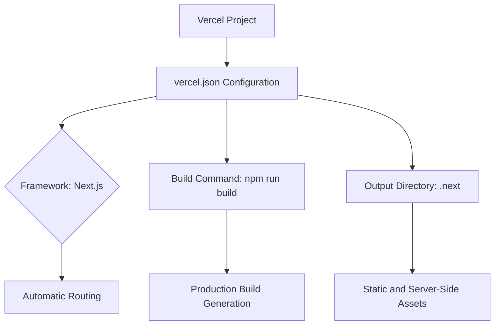
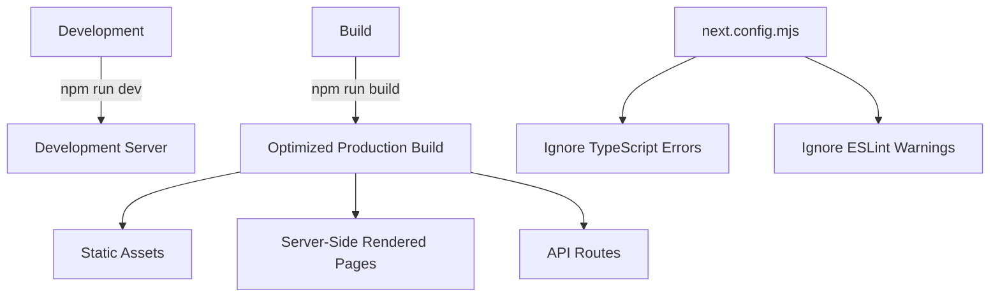
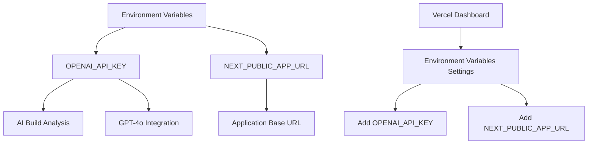
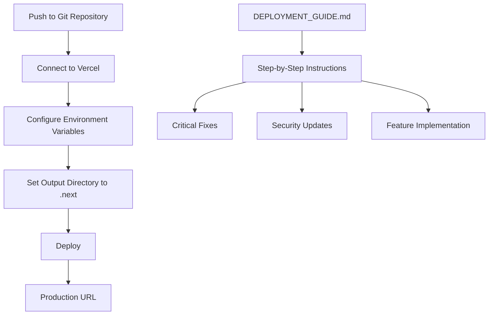
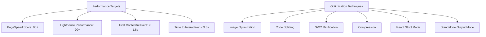
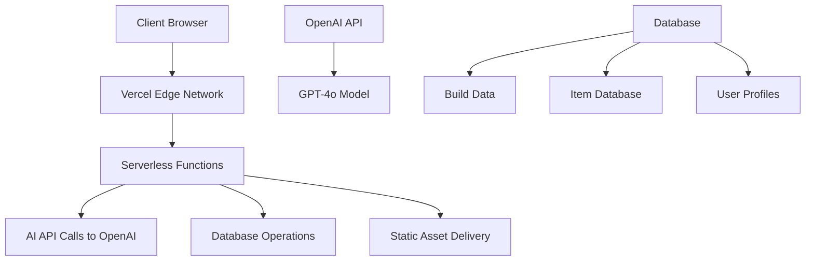
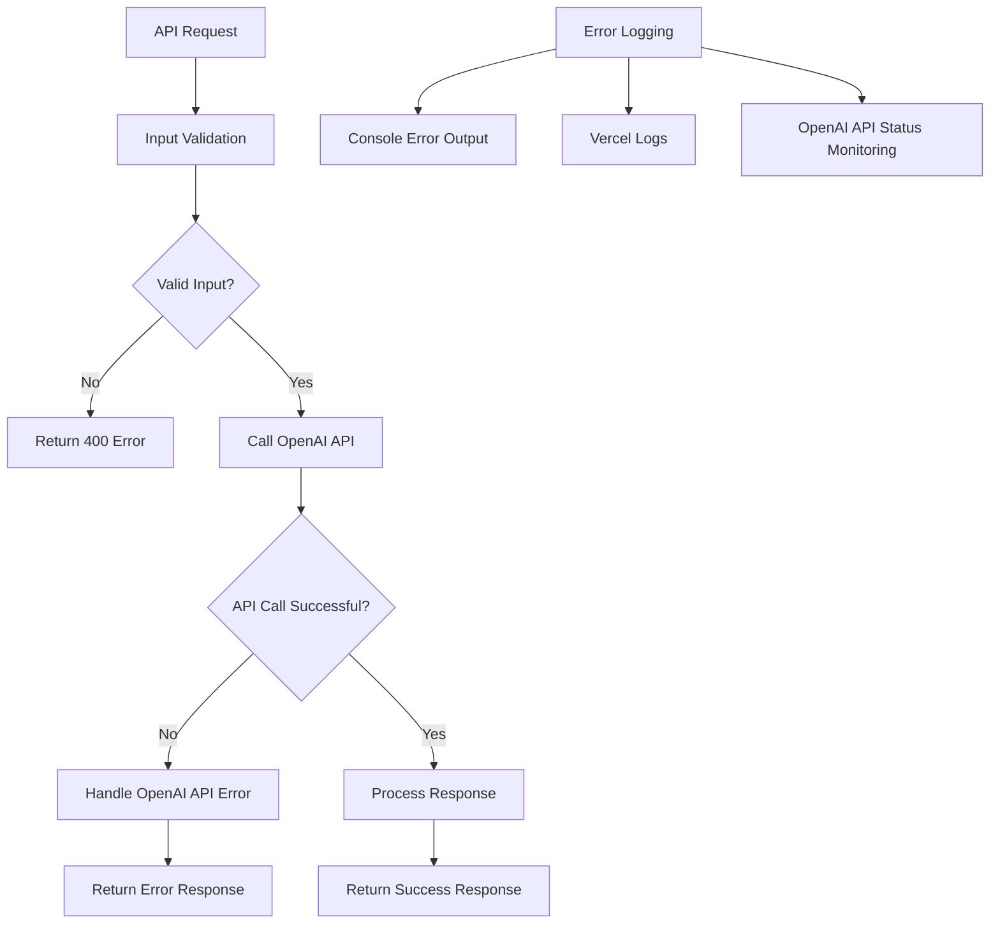
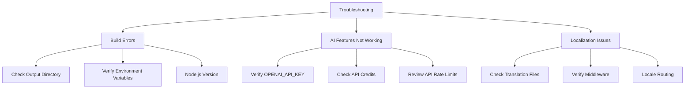
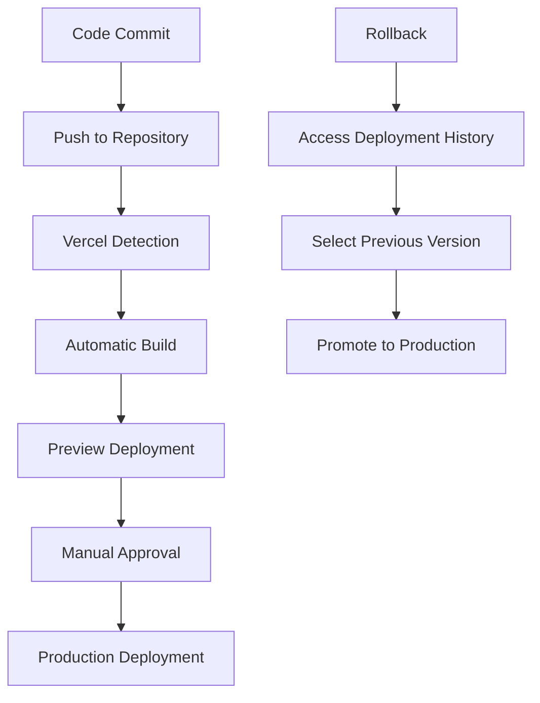
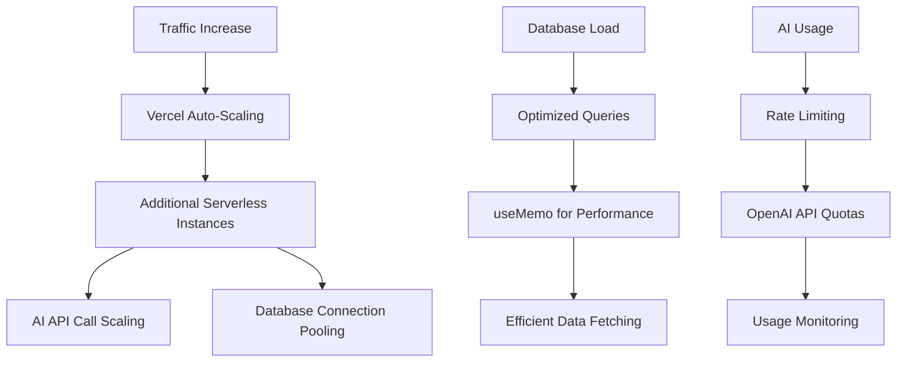

# Deployment

<cite>
**Referenced Files in This Document**   
- [vercel.json](file://vercel.json)
- [package.json](file://package.json)
- [next.config.mjs](file://next.config.mjs)
- [DEPLOYMENT_GUIDE.md](file://DEPLOYMENT_GUIDE.md)
- [app/api/ai/analyze/route.ts](file://app/api/ai/analyze/route.ts)
- [middleware.ts](file://middleware.ts)
- [i18n.ts](file://i18n.ts)
</cite>

## Table of Contents
1. [Vercel Configuration](#vercel-configuration)
2. [Build Process and Optimization](#build-process-and-optimization)
3. [Environment Variables](#environment-variables)
4. [Step-by-Step Deployment Instructions](#step-by-step-deployment-instructions)
5. [Performance Optimization](#performance-optimization)
6. [Deployment Topology and Infrastructure](#deployment-topology-and-infrastructure)
7. [Monitoring and Logging](#monitoring-and-logging)
8. [Troubleshooting Common Issues](#troubleshooting-common-issues)
9. [CI/CD Workflow and Rollback](#cicd-workflow-and-rollback)
10. [Scaling Considerations](#scaling-considerations)

## Vercel Configuration

The Vercel deployment is configured through the `vercel.json` file, which specifies the deployment version, framework, and build command. The configuration ensures compatibility with the Next.js 15 framework and defines the build process for production deployment.

**Diagram sources**
- [vercel.json](file://vercel.json#L1-L6)

**Section sources**
- [vercel.json](file://vercel.json#L1-L6)
- [DEPLOYMENT_GUIDE.md](file://DEPLOYMENT_GUIDE.md#L5-L13)

## Build Process and Optimization

The build process is defined in the `package.json` scripts, which include development, build, and production start commands. The `next.config.mjs` file contains production optimizations such as ignoring TypeScript build errors and ESLint warnings during the build process.

**Diagram sources**
- [package.json](file://package.json#L6-L8)
- [next.config.mjs](file://next.config.mjs#L1-L6)

**Section sources**
- [package.json](file://package.json#L6-L8)
- [next.config.mjs](file://next.config.mjs#L1-L6)
- [DEPLOYMENT_GUIDE.md](file://DEPLOYMENT_GUIDE.md#L92-L96)

## Environment Variables

The application requires specific environment variables for production deployment, primarily the `OPENAI_API_KEY` for AI functionality. The `DEPLOYMENT_GUIDE.md` provides instructions for setting up these variables in Vercel's environment configuration.

**Diagram sources**
- [DEPLOYMENT_GUIDE.md](file://DEPLOYMENT_GUIDE.md#L22-L31)

**Section sources**
- [DEPLOYMENT_GUIDE.md](file://DEPLOYMENT_GUIDE.md#L17-L32)

## Step-by-Step Deployment Instructions

The deployment process to Vercel involves several key steps: repository connection, environment configuration, output directory setup, and deployment initiation. The `DEPLOYMENT_GUIDE.md` provides detailed instructions for each step.

**Diagram sources**
- [DEPLOYMENT_GUIDE.md](file://DEPLOYMENT_GUIDE.md#L98-L103)

**Section sources**
- [DEPLOYMENT_GUIDE.md](file://DEPLOYMENT_GUIDE.md#L98-L103)

## Performance Optimization

The application implements several performance optimizations to achieve high PageSpeed and Lighthouse scores. These include image optimization, code splitting, SWC minification, compression, and React Strict Mode as documented in the deployment guide.

**Diagram sources**
- [DEPLOYMENT_GUIDE.md](file://DEPLOYMENT_GUIDE.md#L106-L111)
- [DEPLOYMENT_GUIDE.md](file://DEPLOYMENT_GUIDE.md#L77-L82)

**Section sources**
- [DEPLOYMENT_GUIDE.md](file://DEPLOYMENT_GUIDE.md#L77-L82)
- [DEPLOYMENT_GUIDE.md](file://DEPLOYMENT_GUIDE.md#L106-L111)

## Deployment Topology and Infrastructure

The deployment topology leverages Vercel's serverless infrastructure to handle AI API calls and database operations efficiently. The application is designed to scale automatically based on traffic patterns and resource demands.

**Diagram sources**
- [app/api/ai/analyze/route.ts](file://app/api/ai/analyze/route.ts#L5-L6)
- [DEPLOYMENT_GUIDE.md](file://DEPLOYMENT_GUIDE.md#L53-L56)

**Section sources**
- [app/api/ai/analyze/route.ts](file://app/api/ai/analyze/route.ts#L5-L6)
- [DEPLOYMENT_GUIDE.md](file://DEPLOYMENT_GUIDE.md#L53-L56)

## Monitoring and Logging

The application includes comprehensive error handling and logging mechanisms, particularly for the AI integration. The API routes include detailed error handling for OpenAI API errors and internal server issues.

**Diagram sources**
- [app/api/ai/analyze/route.ts](file://app/api/ai/analyze/route.ts#L31-L91)

**Section sources**
- [app/api/ai/analyze/route.ts](file://app/api/ai/analyze/route.ts#L31-L91)
- [DEPLOYMENT_GUIDE.md](file://DEPLOYMENT_GUIDE.md#L147-L152)

## Troubleshooting Common Issues

Common deployment issues include build errors, AI feature failures, and localization problems. The deployment guide provides specific troubleshooting steps for each category of issues.

**Diagram sources**
- [DEPLOYMENT_GUIDE.md](file://DEPLOYMENT_GUIDE.md#L130-L144)

**Section sources**
- [DEPLOYMENT_GUIDE.md](file://DEPLOYMENT_GUIDE.md#L130-L144)

## CI/CD Workflow and Rollback

The deployment process follows a CI/CD workflow where code pushes to the Git repository trigger automatic deployments on Vercel. The platform provides built-in rollback capabilities through deployment history and preview deployments.

**Section sources**
- [DEPLOYMENT_GUIDE.md](file://DEPLOYMENT_GUIDE.md#L98-L103)

## Scaling Considerations

The application is designed to handle increased traffic and database load through Vercel's auto-scaling infrastructure. The serverless architecture ensures that AI API calls and database operations can scale independently based on demand.

**Section sources**
- [DEPLOYMENT_GUIDE.md](file://DEPLOYMENT_GUIDE.md#L74-L75)
- [components/database/ItemDatabase.tsx](file://components/database/ItemDatabase.tsx#L35-L53)
- [lib/api/sync.ts](file://lib/api/sync.ts#L1-L99)