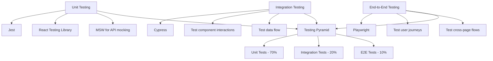
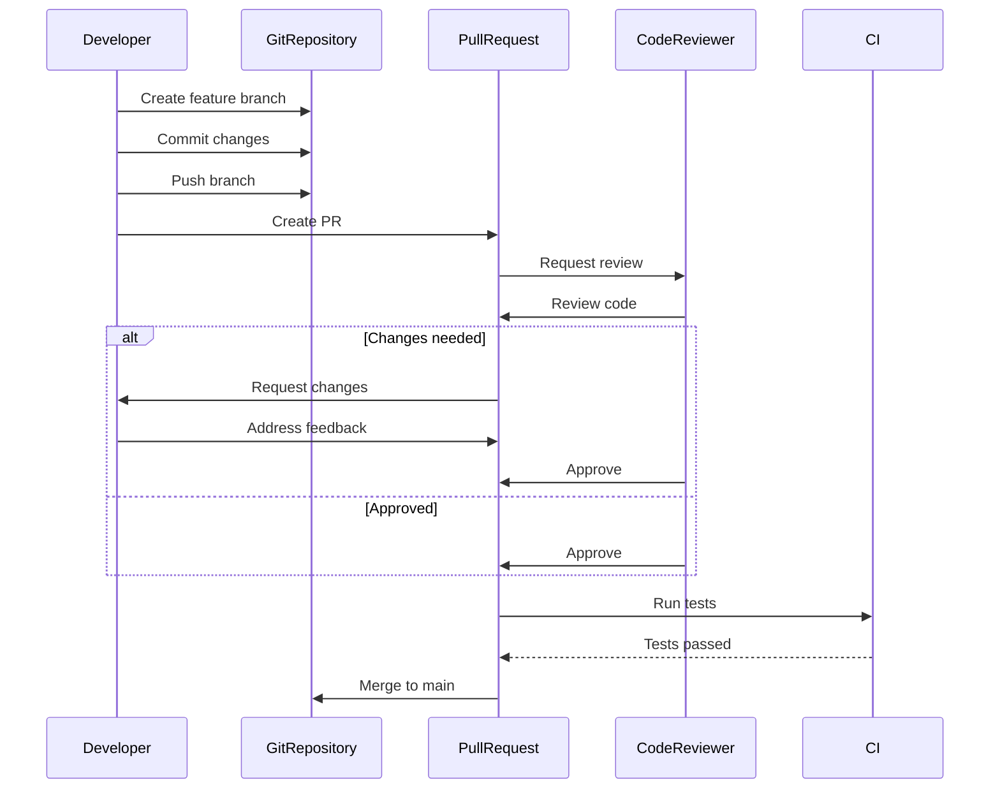
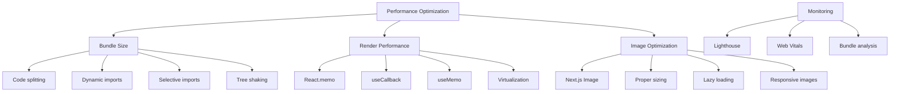
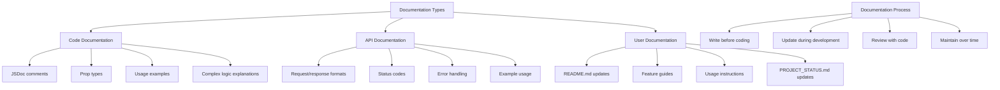
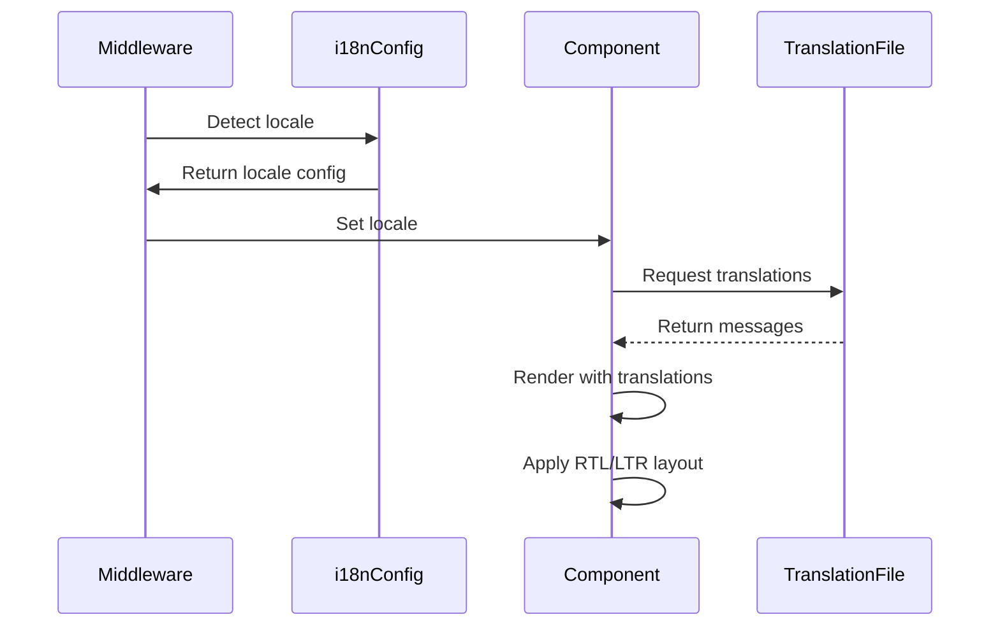
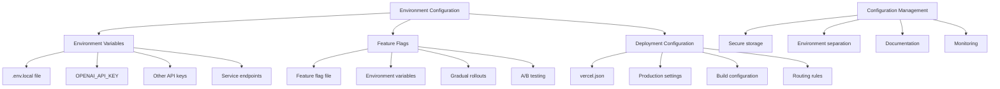

# Development Guidelines

<cite>
**Referenced Files in This Document**   
- [PROJECT_STATUS.md](file://PROJECT_STATUS.md)
- [README.md](file://README.md)
- [package.json](file://package.json)
- [tsconfig.json](file://tsconfig.json)
- [tailwind.config.ts](file://tailwind.config.ts)
- [i18n.ts](file://i18n.ts)
- [middleware.ts](file://middleware.ts)
- [Navigation.tsx](file://components/Navigation.tsx)
- [LanguageSwitcher.tsx](file://components/LanguageSwitcher.tsx)
- [InteractiveSkillTree.tsx](file://components/builds/InteractiveSkillTree.tsx)
- [AIGuide.tsx](file://components/ai/AIGuide.tsx)
- [index.ts](file://types/index.ts)
- [route.ts](file://app/api/ai/analyze/route.ts)
- [utils.ts](file://lib/utils.ts)
- [seo.ts](file://lib/seo.ts)
- [en.json](file://messages/en.json)
</cite>

## Table of Contents
1. [Introduction](#introduction)
2. [Code Structure Conventions](#code-structure-conventions)
3. [Component Development Guidelines](#component-development-guidelines)
4. [Testing Strategy](#testing-strategy)
5. [Contribution Process](#contribution-process)
6. [Coding Standards](#coding-standards)
7. [Performance Optimization Practices](#performance-optimization-practices)
8. [Documentation Requirements](#documentation-requirements)
9. [Internationalization System](#internationalization-system)
10. [Environment Configuration and Feature Flags](#environment-configuration-and-feature-flags)

## Introduction
This document provides comprehensive development guidelines for contributing to Prometheus-Planner V2, a premium web platform for Path of Exile 2 and Diablo IV build planning. The guidelines cover code structure conventions, component development patterns, testing strategies, contribution processes, coding standards, performance optimization, documentation requirements, internationalization practices, and environment configuration. Developers should reference PROJECT_STATUS.md for current implementation completeness and prioritization of upcoming features.

**Section sources**
- [README.md](file://README.md#L1-L144)
- [PROJECT_STATUS.md](file://PROJECT_STATUS.md#L1-L154)

## Code Structure Conventions
The project follows a structured directory organization based on Next.js App Router conventions with locale-based routing. The core structure includes app/ for pages and routing, components/ for reusable UI components, lib/ for utility functions, messages/ for translation files, and types/ for TypeScript interfaces.

File naming follows PascalCase for React components (e.g., InteractiveSkillTree.tsx) and camelCase for utility functions (e.g., formatNumber). Directory organization is feature-based, with components grouped by functionality (builds, database, ai, etc.). The app directory uses dynamic routing with [locale] parameter to support internationalization.

TypeScript types are centrally defined in types/index.ts with clear interfaces for core entities like Build, SkillTreeData, and Item. The project uses path aliases with @/* mapping to the root directory for cleaner imports.

```mermaid
graph TB
A[Root Directory] --> B[app/]
A --> C[components/]
A --> D[lib/]
A --> E[messages/]
A --> F[types/]
B --> B1[[locale]/]
B --> B2[api/]
B --> B3[globals.css]
C --> C1[builds/]
C --> C2[ai/]
C --> C3[database/]
D --> D1[api/]
D --> D2[seo.ts]
D --> D3[utils.ts]
E --> E1[en.json]
E --> E2[ar.json]
F --> F1[index.ts]
```

**Diagram sources**
- [project_structure](file://#L1-L50)
- [tsconfig.json](file://tsconfig.json#L22-L23)

**Section sources**
- [project_structure](file://#L1-L50)
- [tsconfig.json](file://tsconfig.json#L22-L23)
- [types/index.ts](file://types/index.ts#L1-L136)

## Component Development Guidelines
When developing new components for the components/ directory, follow the existing architecture patterns. Components should be organized in feature-specific subdirectories (e.g., components/builds/ for build-related components). All components should be client components when they require interactivity, using 'use client' directive.

New components should follow the atomic design pattern, with clear separation between presentational and container components. For complex features like the AI integration or skill tree visualization, create dedicated subdirectories within components/ to maintain organization.

The InteractiveSkillTree component demonstrates the pattern for complex interactive components, using React state for zoom, pan, and selection controls. Similarly, the AIGuide component shows the pattern for AI-powered features with message history and loading states.

```mermaid
classDiagram
class InteractiveSkillTree {
+data : SkillTreeData
-zoom : number
-pan : {x : number, y : number}
-selectedNode : SkillNode | null
-isDragging : boolean
-dragStart : {x : number, y : number}
+handleZoom(delta : number)
+handleMouseDown(e : MouseEvent)
+handleMouseMove(e : MouseEvent)
+handleMouseUp()
+resetView()
}
class AIGuide {
-messages : Array<{role : 'user' | 'assistant', content : string}>
-input : string
-isLoading : boolean
+handleSend()
}
class Navigation {
-t : TFunction
-locale : string
-pathname : string
-isRTL : boolean
}
class LanguageSwitcher {
-locale : string
-router : Router
-pathname : string
-isOpen : boolean
+switchLocale(newLocale : string)
}
InteractiveSkillTree --> SkillTreeData : "uses"
AIGuide --> "next-intl" : "uses"
Navigation --> "next-intl" : "uses"
LanguageSwitcher --> "next/navigation" : "uses"
```

**Diagram sources**
- [InteractiveSkillTree.tsx](file://components/builds/InteractiveSkillTree.tsx#L7-L173)
- [AIGuide.tsx](file://components/ai/AIGuide.tsx#L7-L131)
- [Navigation.tsx](file://components/Navigation.tsx#L20-L99)
- [LanguageSwitcher.tsx](file://components/LanguageSwitcher.tsx#L8-L65)

**Section sources**
- [InteractiveSkillTree.tsx](file://components/builds/InteractiveSkillTree.tsx#L1-L173)
- [AIGuide.tsx](file://components/ai/AIGuide.tsx#L1-L131)
- [types/index.ts](file://types/index.ts#L36-L57)

## Testing Strategy
The project currently has technical debt in testing (as noted in PROJECT_STATUS.md), with unit tests, integration tests, and E2E tests marked as pending. When implementing the testing strategy, follow these guidelines:

For unit tests, use Jest with React Testing Library to test individual components in isolation. Focus on testing component rendering, user interactions, and state changes. For complex features like the AI integration, mock the OpenAI API calls using MSW (Mock Service Worker) to test the UI behavior without making actual API calls.

For integration tests, test component combinations and data flow between components. The skill tree visualization would require integration tests to verify that zoom, pan, and node selection work correctly together. Use Cypress for integration testing of complex user flows.

For end-to-end tests, use Playwright to test complete user journeys across multiple pages. Key E2E test cases should include: user navigating through build selection, interacting with the skill tree, using the AI guide, and switching between languages.



**Diagram sources**
- [PROJECT_STATUS.md](file://PROJECT_STATUS.md#L81-L82)
- [route.ts](file://app/api/ai/analyze/route.ts#L1-L92)

**Section sources**
- [PROJECT_STATUS.md](file://PROJECT_STATUS.md#L81-L82)
- [route.ts](file://app/api/ai/analyze/route.ts#L1-L92)

## Contribution Process
The contribution process follows a standard Git workflow with feature branches, pull requests, and code reviews. Create feature branches from main with descriptive names following the pattern feature/[feature-name] or fix/[issue-description]. For bug fixes, use the pattern fix/[component]-[issue].

Pull requests should include a clear description of the changes, reference to related issues, and screenshots for UI changes. Each PR should focus on a single feature or bug fix to facilitate code review. Reference PROJECT_STATUS.md to ensure alignment with current priorities.

Code review guidelines require reviewers to check for code quality, adherence to coding standards, proper TypeScript typing, accessibility considerations, and performance implications. Reviewers should also verify that new features include appropriate documentation and, when applicable, tests.



**Diagram sources**
- [PROJECT_STATUS.md](file://PROJECT_STATUS.md#L83-L84)
- [README.md](file://README.md#L137-L139)

**Section sources**
- [PROJECT_STATUS.md](file://PROJECT_STATUS.md#L83-L84)
- [README.md](file://README.md#L137-L139)

## Coding Standards
Follow these coding standards for TypeScript, React, and Tailwind CSS usage throughout the codebase.

For TypeScript, use strict mode as configured in tsconfig.json. Define clear interfaces for all data structures in types/index.ts. Use union types for finite sets of values (e.g., Tier = 'S' | 'A' | 'B' | 'C' | 'D'). Prefer interfaces over type aliases for object shapes.

For React, use functional components with hooks. Follow the React team's recommended practices for state management. Use Zustand for global state when needed, as it's already included in package.json. For form handling, use react-hook-form with Zod for validation.

For Tailwind CSS, follow the project's dark gaming theme using the custom colors defined in tailwind.config.ts (poe.black, poe.gold, poe.spirit, poe.border). Use the cn utility function from lib/utils.ts for conditional class merging. Avoid custom CSS in favor of Tailwind classes, except for complex animations that require @keyframes.

```mermaid
classDiagram
class TypeScript {
+Strict mode enabled
+Interfaces for data structures
+Union types for enums
+Path aliases with @/*
}
class React {
+Functional components
+Hooks for state
+Zustand for global state
+react-hook-form for forms
+Zod for validation
}
class TailwindCSS {
+Dark gaming theme
+Custom colors : poe.black, poe.gold, etc.
+cn utility for class merging
+Responsive design
+RTL support
}
TypeScript --> "tsconfig.json" : "configuration"
React --> "package.json" : "dependencies"
TailwindCSS --> "tailwind.config.ts" : "theme"
TailwindCSS --> "utils.ts" : "cn function"
```

**Diagram sources**
- [tsconfig.json](file://tsconfig.json#L7-L8)
- [package.json](file://package.json#L11-L23)
- [tailwind.config.ts](file://tailwind.config.ts#L6-L8)
- [utils.ts](file://lib/utils.ts#L4-L6)

**Section sources**
- [tsconfig.json](file://tsconfig.json#L1-L28)
- [package.json](file://package.json#L1-L35)
- [tailwind.config.ts](file://tailwind.config.ts#L1-L14)
- [utils.ts](file://lib/utils.ts#L1-L20)

## Performance Optimization Practices
Follow these performance optimization practices to maintain the application's high-performance goals as stated in the README.md (90+ PageSpeed score target).

For bundle size optimization, use Next.js built-in code splitting and dynamic imports for heavy components. The project already uses this pattern with client components. Import libraries selectively rather than importing entire packages. Use tree-shakable imports from libraries like Lucide React.

For render performance, implement React.memo for components that render frequently with the same props. Use useCallback and useMemo to prevent unnecessary re-renders in complex components like InteractiveSkillTree. For the skill tree visualization, consider virtualizing nodes that are off-screen to improve performance with large skill trees.

For image optimization, use Next.js Image component with appropriate sizing and lazy loading. The project should implement this for build thumbnails, item icons, and gameplay preview images.



**Diagram sources**
- [README.md](file://README.md#L18-L19)
- [InteractiveSkillTree.tsx](file://components/builds/InteractiveSkillTree.tsx#L1-L173)

**Section sources**
- [README.md](file://README.md#L18-L19)
- [InteractiveSkillTree.tsx](file://components/builds/InteractiveSkillTree.tsx#L1-L173)

## Documentation Requirements
All new features must include comprehensive documentation following these requirements.

For component documentation, add JSDoc comments to all exported functions and components, describing props, return values, and usage examples. Document complex logic and algorithms within the code using clear comments.

For API documentation, document all API routes in a dedicated API.md file, including request/response formats, status codes, and example usage. The AI analysis API (app/api/ai/analyze/route.ts) serves as a model for proper API documentation with clear request body structure and error handling.

For user-facing documentation, update the README.md with new features and usage instructions. When implementing features marked as in-progress in PROJECT_STATUS.md, update the status accordingly.



**Diagram sources**
- [route.ts](file://app/api/ai/analyze/route.ts#L1-L92)
- [README.md](file://README.md#L101-L136)
- [PROJECT_STATUS.md](file://PROJECT_STATUS.md#L42-L87)

**Section sources**
- [route.ts](file://app/api/ai/analyze/route.ts#L1-L92)
- [README.md](file://README.md#L101-L136)
- [PROJECT_STATUS.md](file://PROJECT_STATUS.md#L42-L87)

## Internationalization System
The internationalization system is built on next-intl with support for English (en) and Arabic (ar) locales. All user-facing text must be internationalized using the translation system.

To add new features with internationalization support, first identify all user-facing strings and add them to the messages/en.json and messages/ar.json files under appropriate namespaces (e.g., "ai", "builds", "common"). Use descriptive keys that reflect the content and context.

In components, use the useTranslations hook from next-intl to access translations. The Navigation and AIGuide components demonstrate this pattern. For dynamic content, use parameterized messages with placeholders.

The system supports RTL (right-to-left) layout for Arabic, which is automatically handled by the locale detection in middleware.ts. When creating new components, ensure they work correctly in both LTR and RTL layouts by using logical CSS properties (e.g., margin-inline-start instead of margin-left).



**Diagram sources**
- [i18n.ts](file://i18n.ts#L1-L17)
- [middleware.ts](file://middleware.ts#L1-L16)
- [en.json](file://messages/en.json#L1-L121)
- [Navigation.tsx](file://components/Navigation.tsx#L3-L25)

**Section sources**
- [i18n.ts](file://i18n.ts#L1-L17)
- [middleware.ts](file://middleware.ts#L1-L16)
- [messages/en.json](file://messages/en.json#L1-L121)
- [Navigation.tsx](file://components/Navigation.tsx#L1-L99)

## Environment Configuration and Feature Flags
Environment configuration is managed through environment variables and feature flags to support different deployment environments and gradual feature rollouts.

The project requires an OPENAI_API_KEY environment variable for AI functionality, as shown in the README.md installation instructions. Create a .env.local file for development with this variable. Other environment-specific configuration should follow the same pattern.

For feature flags, use a configuration file or environment variables to enable/disable features in development, staging, and production environments. This is particularly important for features marked as "In Progress" in PROJECT_STATUS.md, such as user authentication and build comparison tools.

The deployment configuration is managed through vercel.json, which should include environment-specific settings for production deployment on Vercel.



**Diagram sources**
- [README.md](file://README.md#L42-L47)
- [vercel.json](file://vercel.json)
- [PROJECT_STATUS.md](file://PROJECT_STATUS.md#L45-L67)

**Section sources**
- [README.md](file://README.md#L42-L47)
- [PROJECT_STATUS.md](file://PROJECT_STATUS.md#L45-L67)