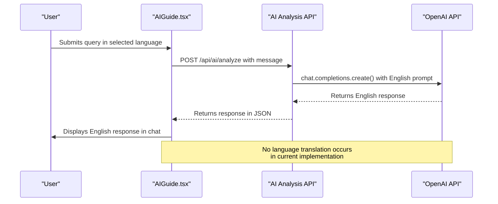
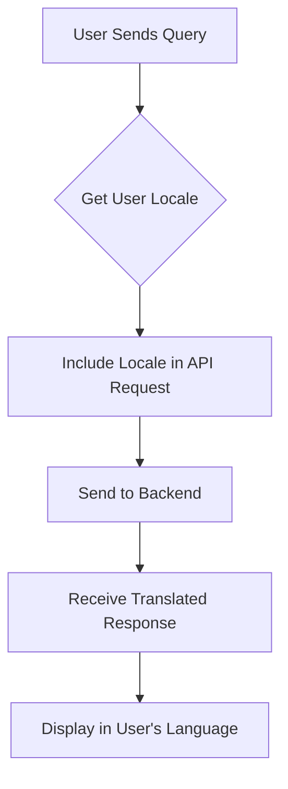
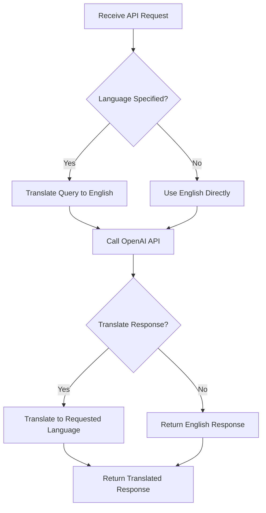
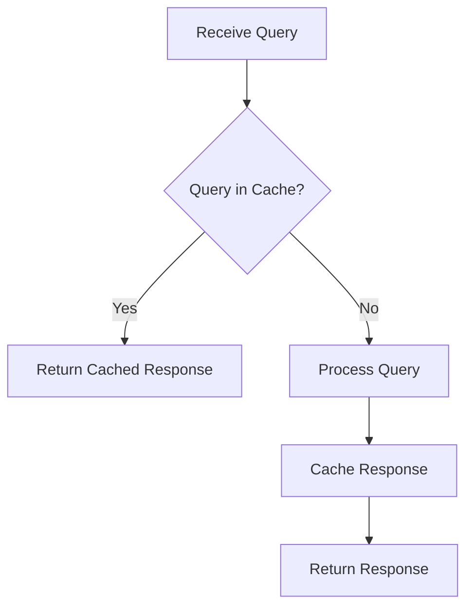

# Dynamic Content and AI Response Localization

<cite>
**Referenced Files in This Document**   
- [AIGuide.tsx](file://components/ai/AIGuide.tsx)
- [route.ts](file://app/api/ai/analyze/route.ts)
- [i18n.ts](file://i18n.ts)
- [en.json](file://messages/en.json)
- [ar.json](file://messages/ar.json)
- [LanguageSwitcher.tsx](file://components/LanguageSwitcher.tsx)
- [layout.tsx](file://app/[locale]/layout.tsx)
</cite>

## Table of Contents
1. [Introduction](#introduction)
2. [Current Implementation of AI Response Localization](#current-implementation-of-ai-response-localization)
3. [Limitations of English-Only AI Responses](#limitations-of-english-only-ai-responses)
4. [Integration Between AIGuide.tsx and Backend AI Endpoint](#integration-between-aiguidejsx-and-backend-ai-endpoint)
5. [Potential Strategies for Multilingual AI Support](#potential-strategies-for-multilingual-ai-support)
6. [Challenges in Translating Technical Game Terminology](#challenges-in-translating-technical-game-terminology)
7. [Implementation Examples for Language Hints and Post-Processing](#implementation-examples-for-language-hints-and-post-processing)
8. [Latency Implications and Caching Strategies](#latency-implications-and-caching-strategies)
9. [Guidelines for Future Enhancement of Multilingual AI Support](#guidelines-for-future-enhancement-of-multilingual-ai-support)
10. [Conclusion](#conclusion)

## Introduction
The Prometheus-Planner V2 application provides AI-powered guidance for ARPG players, specifically for Path of Exile 2 and Diablo IV. The application supports bilingual localization (English and Arabic) with full RTL/LTR layout support. However, while the UI elements are fully localized through the next-intl framework, the AI-generated responses from the OpenAI API currently present a localization challenge. This document analyzes the current implementation, identifies limitations, and proposes strategies for enhancing multilingual support for dynamic AI-generated content.

## Current Implementation of AI Response Localization
The current implementation of AI response localization in Prometheus-Planner V2 follows a hybrid approach where static UI elements are fully localized, but dynamic AI-generated content remains in English regardless of the selected UI language.

The application uses the next-intl library for internationalization, supporting two locales: English (en) and Arabic (ar). The i18n configuration in `i18n.ts` defines these locales and sets English as the default. Translation files `en.json` and `ar.json` contain complete translations for all static UI elements, including navigation, buttons, and labels.

However, AI-generated responses from the OpenAI API are currently generated exclusively in English. The `AIGuide.tsx` component renders the AI chat interface and uses localized strings for UI elements like the welcome message (`t('welcome')`) and input placeholder (`t('askQuestion')`), but the actual AI responses received from the backend are not translated.

The backend AI analysis endpoint at `app/api/ai/analyze/route.ts` processes user queries and forwards them to the OpenAI API without any language translation. The OpenAI model (gpt-4o) generates responses in English based on the system prompt and user input, regardless of the client's selected language.

**Section sources**
- [i18n.ts](file://i18n.ts#L4-L5)
- [en.json](file://messages/en.json)
- [ar.json](file://messages/ar.json)
- [AIGuide.tsx](file://components/ai/AIGuide.tsx#L8-L10)
- [route.ts](file://app/api/ai/analyze/route.ts#L9-L26)

## Limitations of English-Only AI Responses
The current approach of generating AI responses exclusively in English presents several significant limitations for non-English speaking users:

1. **User Experience Fragmentation**: Users experience a disjointed interface where static elements are localized in their preferred language (e.g., Arabic) but dynamic AI responses appear in English, creating cognitive dissonance and reducing immersion.

2. **Accessibility Barriers**: Non-English speakers, particularly those with limited English proficiency, face difficulties understanding technical game terminology and strategic advice provided by the AI, limiting the tool's effectiveness for a significant portion of the user base.

3. **Inconsistent Localization**: The application's claim of bilingual support is undermined by the English-only AI responses, making the localization effort incomplete and potentially misleading to users.

4. **Reduced Engagement**: Users may be less likely to engage with the AI guide feature if they cannot fully understand the responses, leading to lower feature adoption and reduced user satisfaction.

5. **Cultural Context Gaps**: Game-specific terminology and meta-strategies may not translate well without proper contextual adaptation, potentially leading to misunderstandings or misinterpretations of the AI's advice.

These limitations highlight the need for a comprehensive solution to localize dynamic AI-generated content to match the user's selected interface language.

**Section sources**
- [AIGuide.tsx](file://components/ai/AIGuide.tsx#L26-L29)
- [route.ts](file://app/api/ai/analyze/route.ts#L58-L66)
- [en.json](file://messages/en.json#L84)
- [ar.json](file://messages/ar.json#L84)

## Integration Between AIGuide.tsx and Backend AI Endpoint
The integration between the frontend `AIGuide.tsx` component and the backend AI analysis endpoint follows a standard client-server pattern with React state management and Next.js API routes.

The `AIGuide.tsx` component manages the chat interface state using React hooks (`useState` for messages, input, and loading state). When a user submits a query, the `handleSend` function captures the input text and adds it to the messages state. Currently, the implementation includes a simulation of AI responses with hardcoded English text, but this would be replaced with actual API calls in the production implementation.

The backend endpoint at `app/api/ai/analyze/route.ts` receives the user query via a POST request containing the message, build data, and context. The endpoint validates the presence of an OpenAI API key and the message content before proceeding. It then constructs a user message that may include build context and additional context information, and sends this to the OpenAI API as part of a chat completion request.

The system prompt defined in the backend establishes the AI's role as an expert ARPG build advisor, providing specific instructions on the type of advice to generate. The OpenAI API returns a response in English, which is then forwarded back to the frontend as a JSON response containing the AI's reply.

This integration currently lacks language awareness, with no consideration for the user's selected language in either the request to or response from the AI model.



**Diagram sources**
- [AIGuide.tsx](file://components/ai/AIGuide.tsx#L15-L34)
- [route.ts](file://app/api/ai/analyze/route.ts#L28-L74)

**Section sources**
- [AIGuide.tsx](file://components/ai/AIGuide.tsx)
- [route.ts](file://app/api/ai/analyze/route.ts)

## Potential Strategies for Multilingual AI Support
To address the limitations of English-only AI responses, several potential strategies can be implemented to provide multilingual AI support:

### Strategy 1: Pre-Processing with Language Translation
Translate user queries from the selected language to English before sending them to the OpenAI API, and translate the AI's English responses back to the user's language. This approach maintains the current AI model's effectiveness while providing localized output.

### Strategy 2: Prompt Engineering with Language Hints
Modify the system prompt to include language-specific instructions, asking the AI model to generate responses in the user's selected language. This leverages the multilingual capabilities of modern LLMs like GPT-4o.

### Strategy 3: Multi-Model Approach
Maintain separate AI models or fine-tuned versions for different languages, each specialized in providing game strategy advice in a specific language with culturally appropriate terminology.

### Strategy 4: Hybrid Translation with Post-Editing
Use automated translation for initial localization, combined with rule-based post-editing to ensure accurate translation of game-specific terminology and mechanics.

### Strategy 5: Language-Aware Caching
Implement a caching layer that stores previously generated responses in multiple languages, reducing the need for repeated translation or AI generation for common queries.

The most practical initial approach would be a combination of Strategy 1 (pre-processing translation) and Strategy 2 (prompt engineering), as these can be implemented with minimal changes to the existing architecture while providing immediate improvements in multilingual support.

**Section sources**
- [AIGuide.tsx](file://components/ai/AIGuide.tsx)
- [route.ts](file://app/api/ai/analyze/route.ts)
- [i18n.ts](file://i18n.ts)

## Challenges in Translating Technical Game Terminology
Translating AI-generated responses for an ARPG build planner presents unique challenges related to technical game terminology and context preservation:

1. **Game-Specific Jargon**: Terms like "critical strike chance," "life and resistances," and "skill tree pathing" have precise meanings in ARPGs that may not have direct equivalents in other languages, requiring careful translation to maintain accuracy.

2. **Proper Nouns and Brand Names**: Game titles (Path of Exile 2, Diablo IV), skill names, item types, and class names should typically remain in English or use officially localized versions rather than direct translation.

3. **Numerical and Statistical Expressions**: Damage calculations, stat values, and probability percentages must be preserved exactly during translation to avoid misrepresentation of game mechanics.

4. **Contextual Consistency**: Strategic advice often references previous interactions or specific build configurations, requiring translation systems to maintain context across multiple exchanges.

5. **Cultural Adaptation**: Some game mechanics or meta-strategies may be more relevant to certain regions or player communities, requiring adaptation beyond simple translation.

6. **Abbreviations and Acronyms**: Terms like "DPS" (damage per second), "AoE" (area of effect), and "CC" (crowd control) are widely understood in English but may require explanation or adaptation in other languages.

7. **Dynamic Content Generation**: The AI generates responses based on complex build data and context, making it challenging to pre-translate or cache responses for all possible combinations.

These challenges necessitate a sophisticated approach to translation that goes beyond simple text replacement, requiring domain-specific knowledge of ARPG mechanics and player communities.

**Section sources**
- [route.ts](file://app/api/ai/analyze/route.ts#L10-L26)
- [AIGuide.tsx](file://components/ai/AIGuide.tsx#L26-L29)
- [en.json](file://messages/en.json)

## Implementation Examples for Language Hints and Post-Processing
To implement multilingual AI support, specific code modifications can be made to both the frontend and backend components:

### Frontend Implementation (AIGuide.tsx)
The `AIGuide.tsx` component can be enhanced to include the user's language preference in API requests:



**Diagram sources**
- [AIGuide.tsx](file://components/ai/AIGuide.tsx)

### Backend Implementation (route.ts)
The backend endpoint can be modified to handle language translation:



**Diagram sources**
- [route.ts](file://app/api/ai/analyze/route.ts)

### Language Hint Implementation
The system prompt can be modified to include language hints based on the user's preference:

```
You are an expert ARPG build advisor... [original prompt]

Additional Instructions:
- Respond in [user's language] as specified by the user
- Keep game-specific terms like skill names and item types in English
- Use localized units and number formats appropriate for the target language
- Maintain a helpful, expert tone consistent with the original prompt
```

This approach allows the AI model to generate responses directly in the user's preferred language when it has sufficient capability, falling back to translation when necessary.

**Section sources**
- [AIGuide.tsx](file://components/ai/AIGuide.tsx)
- [route.ts](file://app/api/ai/analyze/route.ts)

## Latency Implications and Caching Strategies
Implementing multilingual AI support introduces additional latency considerations that must be addressed through appropriate caching strategies:

### Latency Implications
1. **Translation Overhead**: Each translation step (query translation and response translation) adds approximately 200-500ms of latency, potentially doubling the response time for AI queries.

2. **Network Round Trips**: Additional API calls to translation services increase network latency, particularly for users in regions with higher network latency to the service endpoints.

3. **Processing Complexity**: Language detection, translation, and post-processing add computational overhead on both client and server sides.

4. **Error Propagation**: Additional steps increase the potential for errors, requiring robust error handling and fallback mechanisms.

### Caching Strategies
To mitigate latency, several caching strategies can be implemented:

#### Response Caching
Cache AI responses by query hash and language, serving identical queries from cache:


**Diagram sources**
- [route.ts](file://app/api/ai/analyze/route.ts)

#### Preemptive Caching
Identify common queries (e.g., "analyze build," "optimize gear") and pre-generate responses in all supported languages during off-peak hours.

#### Tiered Caching
Implement a multi-level caching strategy:
- **Level 1**: In-memory cache for frequently accessed responses (short TTL)
- **Level 2**: Redis cache for less frequent responses (medium TTL)
- **Level 3**: Database storage for historical responses (long TTL)

#### Cache Invalidation
Implement intelligent cache invalidation based on:
- Game patch notes and meta changes
- User feedback on response accuracy
- Time-based expiration (e.g., 24 hours for general advice, 7 days for meta-specific advice)

These strategies can significantly reduce latency for common queries while maintaining freshness of content.

**Section sources**
- [route.ts](file://app/api/ai/analyze/route.ts)
- [AIGuide.tsx](file://components/ai/AIGuide.tsx)

## Guidelines for Future Enhancement of Multilingual AI Support
To systematically improve multilingual AI support in Prometheus-Planner V2, the following guidelines should be followed:

### 1. Prioritize Language Support
- Focus initially on the two supported languages (English and Arabic)
- Use Arabic as the primary test case for RTL language support and cultural adaptation
- Gradually expand to additional languages based on user demand

### 2. Implement Fallback Mechanisms
- **Primary**: Attempt direct generation in the target language using language-aware prompts
- **Secondary**: Fall back to translation if direct generation is not available or of poor quality
- **Tertiary**: Provide English responses with a clear indication when translation is unavailable

### 3. Maintain Terminology Consistency
- Create a glossary of game-specific terms that should remain in English
- Standardize translations for common game mechanics and statistics
- Implement a review process for translated content to ensure accuracy

### 4. Monitor Quality and Performance
- Implement logging to track translation success rates and latency
- Collect user feedback on translation quality through in-app surveys
- Monitor cache hit rates and adjust caching strategies accordingly

### 5. Optimize for Mobile Users
- Consider data usage implications of additional translation requests
- Implement offline capabilities for cached responses
- Optimize payload sizes for mobile networks

### 6. Ensure Accessibility
- Maintain proper text-to-speech compatibility for translated content
- Ensure color contrast and text sizing meet accessibility standards in all languages
- Support screen readers with appropriate language tagging

### 7. Plan for Scalability
- Design the translation system to easily add new languages
- Use configurable language settings rather than hard-coded values
- Separate translation logic from core AI functionality for easier maintenance

Following these guidelines will ensure a systematic and user-centered approach to enhancing multilingual AI support.

**Section sources**
- [i18n.ts](file://i18n.ts)
- [AIGuide.tsx](file://components/ai/AIGuide.tsx)
- [route.ts](file://app/api/ai/analyze/route.ts)

## Conclusion
The current implementation of AI response localization in Prometheus-Planner V2 successfully provides a bilingual interface for static content but falls short in localizing dynamic AI-generated responses. While the application effectively uses next-intl for UI localization, the AI responses from the OpenAI API remain in English regardless of the user's selected language, creating a fragmented user experience.

To address this limitation, a multi-faceted approach combining prompt engineering, external translation services, and strategic caching can be implemented. The integration between the `AIGuide.tsx` frontend component and the backend AI analysis endpoint provides a solid foundation that can be extended to support multilingual responses with minimal architectural changes.

Key challenges in translating technical game terminology require careful consideration of context preservation, terminology consistency, and cultural adaptation. By implementing the recommended strategies and following the guidelines for future enhancement, Prometheus-Planner V2 can provide a truly localized AI experience that maintains the quality of strategic advice while making it accessible to non-English speaking users.

The latency implications of additional translation steps can be mitigated through effective caching strategies, ensuring that performance remains acceptable even with the added complexity of multilingual support. As the application evolves, this foundation will enable the addition of more languages and more sophisticated localization features, ultimately providing a seamless and immersive experience for players worldwide.