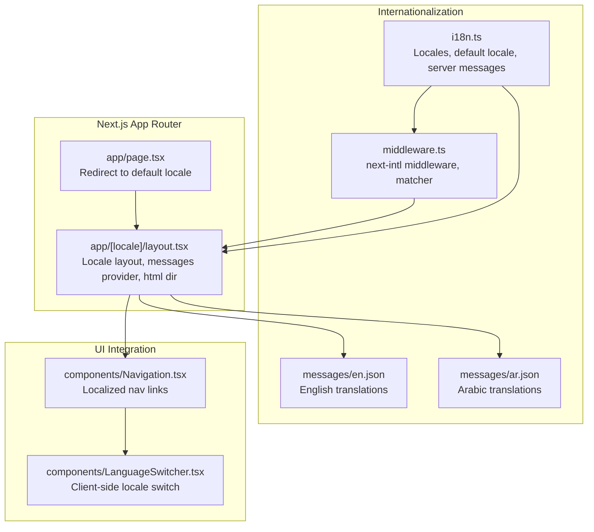
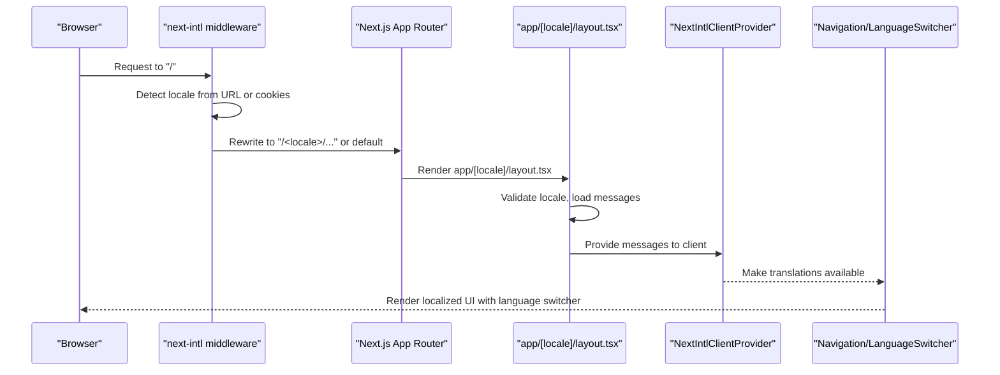
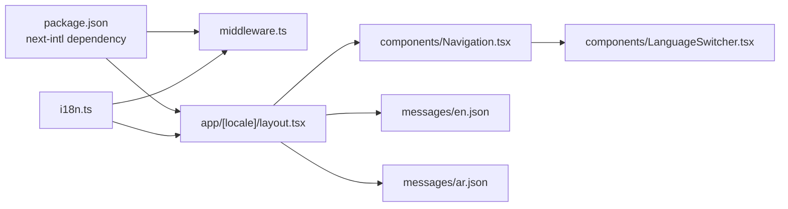

# Internationalization Configuration

<cite>
**Referenced Files in This Document**
- [i18n.ts](file://i18n.ts)
- [middleware.ts](file://middleware.ts)
- [app/[locale]/layout.tsx](file://app/[locale]/layout.tsx)
- [app/page.tsx](file://app/page.tsx)
- [components/LanguageSwitcher.tsx](file://components/LanguageSwitcher.tsx)
- [components/Navigation.tsx](file://components/Navigation.tsx)
- [messages/en.json](file://messages/en.json)
- [messages/ar.json](file://messages/ar.json)
- [README.md](file://README.md)
- [package.json](file://package.json)
</cite>

## Table of Contents
1. [Introduction](#introduction)
2. [Project Structure](#project-structure)
3. [Core Components](#core-components)
4. [Architecture Overview](#architecture-overview)
5. [Detailed Component Analysis](#detailed-component-analysis)
6. [Dependency Analysis](#dependency-analysis)
7. [Performance Considerations](#performance-considerations)
8. [Security Considerations](#security-considerations)
9. [Troubleshooting Guide](#troubleshooting-guide)
10. [Conclusion](#conclusion)

## Introduction
This document explains the internationalization configuration for Prometheus-Planner V2, focusing on how next-intl is set up and initialized, how locales are detected and enforced, and how Next.js App Router integrates with next-intl middleware for seamless language switching. It covers locale detection, default locale, supported locales (en, ar), middleware-based routing interception, URL rewriting, and cookie-based locale persistence. It also provides best practices for tree-shaking unused translations, optimizing server-side rendering for multiple locales, and troubleshooting common routing issues.

## Project Structure
The internationalization setup centers around three key areas:
- i18n.ts defines supported locales, default locale, and server-side message loading.
- middleware.ts configures next-intl middleware with locale lists and a default locale, and sets a matcher to restrict internationalized pathnames.
- app/[locale]/layout.tsx provides the locale-aware layout, validates locales, injects messages via NextIntlClientProvider, and sets HTML directionality based on locale.
- app/page.tsx performs initial redirection to the default locale.
- components/LanguageSwitcher.tsx and components/Navigation.tsx enable client-side language switching and render localized navigation links.

**Diagram sources**
- [app/page.tsx](file://app/page.tsx#L1-L7)
- [app/[locale]/layout.tsx](file://app/[locale]/layout.tsx#L1-L49)
- [i18n.ts](file://i18n.ts#L1-L17)
- [middleware.ts](file://middleware.ts#L1-L16)
- [messages/en.json](file://messages/en.json#L1-L121)
- [messages/ar.json](file://messages/ar.json#L1-L121)
- [components/Navigation.tsx](file://components/Navigation.tsx#L1-L99)
- [components/LanguageSwitcher.tsx](file://components/LanguageSwitcher.tsx#L1-L65)

**Section sources**
- [README.md](file://README.md#L57-L64)
- [package.json](file://package.json#L10-L24)

## Core Components
- i18n.ts
  - Declares supported locales and default locale.
  - Uses next-intl server configuration to load translation messages per locale and validates incoming locale parameters.
- middleware.ts
  - Creates next-intl middleware with supported locales and default locale.
  - Defines a matcher that only applies to internationalized pathnames (root and paths prefixed with /en or /ar).
- app/[locale]/layout.tsx
  - Validates locale and throws a 404 for invalid locales.
  - Loads messages via next-intl server utilities and passes them to NextIntlClientProvider.
  - Sets HTML lang and dir attributes based on locale (LTR for en, RTL for ar).
  - Renders Navigation and child pages.
- app/page.tsx
  - Redirects unlocalized root requests to the default locale.
- components/LanguageSwitcher.tsx
  - Reads current locale via next-intl client hook.
  - Switches locale by rewriting the pathname and navigating to the new URL.
- components/Navigation.tsx
  - Uses next-intl client hooks to translate navigation labels.
  - Builds locale-aware navigation links and toggles RTL styling.

**Section sources**
- [i18n.ts](file://i18n.ts#L1-L17)
- [middleware.ts](file://middleware.ts#L1-L16)
- [app/[locale]/layout.tsx](file://app/[locale]/layout.tsx#L1-L49)
- [app/page.tsx](file://app/page.tsx#L1-L7)
- [components/LanguageSwitcher.tsx](file://components/LanguageSwitcher.tsx#L1-L65)
- [components/Navigation.tsx](file://components/Navigation.tsx#L1-L99)

## Architecture Overview
The internationalization pipeline integrates Next.js App Router with next-intl middleware and client/server providers:

**Diagram sources**
- [middleware.ts](file://middleware.ts#L1-L16)
- [app/[locale]/layout.tsx](file://app/[locale]/layout.tsx#L1-L49)
- [components/Navigation.tsx](file://components/Navigation.tsx#L1-L99)
- [components/LanguageSwitcher.tsx](file://components/LanguageSwitcher.tsx#L1-L65)

## Detailed Component Analysis

### i18n.ts: Locale Definition and Server Configuration
- Supported locales and default locale are declared centrally.
- next-intl server configuration loads messages from the messages directory based on the locale and validates the locale parameter to prevent invalid values.

Key behaviors:
- Locale validation prevents unauthorized or malformed locales from proceeding.
- Dynamic import ensures only the relevant translation file is loaded per request.

**Section sources**
- [i18n.ts](file://i18n.ts#L1-L17)

### middleware.ts: Routing Interception and Matcher
- next-intl middleware is configured with supported locales and default locale.
- The matcher restricts middleware application to:
  - Root path "/" and
  - Paths that start with "/(ar|en)/" followed by optional path segments.

Implications:
- Non-matching paths bypass next-intl middleware.
- Ensures clean separation between internationalized and non-internationalized routes.

**Section sources**
- [middleware.ts](file://middleware.ts#L1-L16)

### app/[locale]/layout.tsx: Locale-Aware Layout and Message Provider
- Validates locale and triggers a 404 for unsupported locales.
- Loads messages server-side and passes them to NextIntlClientProvider for client consumption.
- Sets HTML lang and dir attributes dynamically based on locale (LTR for en, RTL for ar).
- Wraps children with Navigation and main content area.

Integration with App Router:
- The [locale] dynamic segment aligns with the matcher and i18n configuration.
- generateStaticParams ensures static generation for supported locales.

**Section sources**
- [app/[locale]/layout.tsx](file://app/[locale]/layout.tsx#L1-L49)

### app/page.tsx: Initial Redirection to Default Locale
- Redirects unlocalized root requests to the default locale, ensuring consistent locale routing for new visitors.

**Section sources**
- [app/page.tsx](file://app/page.tsx#L1-L7)

### components/LanguageSwitcher.tsx: Client-Side Locale Switching
- Uses next-intl client hooks to read the current locale.
- Rewrites the current pathname by replacing the locale segment and navigates to the new URL.
- Provides a dropdown interface to select among supported locales.

Routing behavior:
- Preserves the rest of the URL during locale change.
- Maintains state across navigation by relying on URL rewriting.

**Section sources**
- [components/LanguageSwitcher.tsx](file://components/LanguageSwitcher.tsx#L1-L65)

### components/Navigation.tsx: Localized Navigation and RTL Awareness
- Uses next-intl client hooks to translate navigation labels.
- Builds locale-aware links by prefixing paths with the current locale.
- Applies RTL styling when the locale is Arabic.

**Section sources**
- [components/Navigation.tsx](file://components/Navigation.tsx#L1-L99)

### Translation Files: messages/en.json and messages/ar.json
- Provide structured translation keys for common UI elements, navigation, and feature-specific labels.
- Arabic translations include RTL-friendly content and region-specific phrasing.

Best practice alignment:
- Centralized translation files enable easy maintenance and future expansion.

**Section sources**
- [messages/en.json](file://messages/en.json#L1-L121)
- [messages/ar.json](file://messages/ar.json#L1-L121)

## Dependency Analysis
- i18n.ts depends on next-intl server utilities for locale validation and message loading.
- middleware.ts depends on i18n.ts for locales and default locale, and on next-intl middleware factory.
- app/[locale]/layout.tsx depends on i18n.ts for locale validation and on next-intl server utilities for message loading.
- components/LanguageSwitcher.tsx and components/Navigation.tsx depend on next-intl client hooks for locale and translations.
- package.json declares next-intl as a runtime dependency.

**Diagram sources**
- [package.json](file://package.json#L10-L24)
- [i18n.ts](file://i18n.ts#L1-L17)
- [middleware.ts](file://middleware.ts#L1-L16)
- [app/[locale]/layout.tsx](file://app/[locale]/layout.tsx#L1-L49)
- [components/Navigation.tsx](file://components/Navigation.tsx#L1-L99)
- [components/LanguageSwitcher.tsx](file://components/LanguageSwitcher.tsx#L1-L65)
- [messages/en.json](file://messages/en.json#L1-L121)
- [messages/ar.json](file://messages/ar.json#L1-L121)

**Section sources**
- [package.json](file://package.json#L10-L24)
- [i18n.ts](file://i18n.ts#L1-L17)
- [middleware.ts](file://middleware.ts#L1-L16)
- [app/[locale]/layout.tsx](file://app/[locale]/layout.tsx#L1-L49)
- [components/Navigation.tsx](file://components/Navigation.tsx#L1-L99)
- [components/LanguageSwitcher.tsx](file://components/LanguageSwitcher.tsx#L1-L65)
- [messages/en.json](file://messages/en.json#L1-L121)
- [messages/ar.json](file://messages/ar.json#L1-L121)

## Performance Considerations
- Tree-shaking unused translations:
  - Keep translation keys scoped to feature namespaces (e.g., common, nav, builds) to minimize client payload.
  - Avoid importing entire translation files client-side; rely on NextIntlClientProvider to supply only the messages needed for the current page.
- Server-side rendering for multiple locales:
  - Use generateStaticParams in the locale layout to pre-render pages for each supported locale, reducing server load and improving initial load times.
  - Ensure translation files remain small and focused to reduce server-side message processing overhead.
- Middleware performance:
  - The matcher limits middleware execution to internationalized paths, minimizing overhead on non-localized routes.
- Client navigation:
  - LanguageSwitcher rewrites URLs client-side, avoiding full page reloads for locale changes.

[No sources needed since this section provides general guidance]

## Security Considerations
- Locale injection prevention:
  - Locale validation in both middleware and the locale layout rejects invalid locales, preventing path traversal or injection attacks via malformed locale segments.
- Cookie-based locale persistence:
  - next-intl middleware persists locale preferences via cookies; ensure secure cookie policies and consider SameSite and Secure flags in production environments.
- URL rewriting safety:
  - LanguageSwitcher replaces only the locale segment in the pathname, preserving the rest of the URL and preventing unintended path manipulation.

**Section sources**
- [middleware.ts](file://middleware.ts#L1-L16)
- [app/[locale]/layout.tsx](file://app/[locale]/layout.tsx#L1-L49)
- [components/LanguageSwitcher.tsx](file://components/LanguageSwitcher.tsx#L1-L65)

## Troubleshooting Guide
Common issues and resolutions:

- Infinite redirects
  - Symptom: Browser loops between root and default locale.
  - Cause: Misconfigured matcher or conflicting redirects.
  - Resolution: Verify middleware matcher targets only intended paths and that app/page.tsx redirects to the default locale only when necessary.

- Lost locale state after navigation
  - Symptom: Locale resets unexpectedly after clicking links.
  - Cause: Links not prefixed with the current locale.
  - Resolution: Ensure Navigation constructs links with the current locale prefix and LanguageSwitcher rewrites the locale segment in the pathname.

- 404 on unknown locales
  - Symptom: Requests to unsupported locales return 404.
  - Cause: Locale validation fails.
  - Resolution: Confirm the requested locale is included in supported locales and that generateStaticParams includes all locales.

- Mixed LTR/RTL layout
  - Symptom: Text direction incorrect after switching languages.
  - Cause: HTML dir attribute not updated.
  - Resolution: Ensure app/[locale]/layout.tsx sets dir based on locale and that Navigation reflects RTL styling when appropriate.

- Middleware not applying to routes
  - Symptom: Internationalization not enforced on certain paths.
  - Cause: Matcher excludes non-internationalized paths.
  - Resolution: Confirm matcher includes desired paths and that the locale layout wraps all internationalized pages.

**Section sources**
- [middleware.ts](file://middleware.ts#L1-L16)
- [app/[locale]/layout.tsx](file://app/[locale]/layout.tsx#L1-L49)
- [components/Navigation.tsx](file://components/Navigation.tsx#L1-L99)
- [components/LanguageSwitcher.tsx](file://components/LanguageSwitcher.tsx#L1-L65)
- [app/page.tsx](file://app/page.tsx#L1-L7)

## Conclusion
Prometheus-Planner V2’s internationalization is built on a clear, modular architecture:
- i18n.ts centralizes locale definitions and server-side message loading.
- middleware.ts enforces locale routing and preserves non-internationalized paths.
- app/[locale]/layout.tsx validates locales, injects messages, and manages HTML directionality.
- components/LanguageSwitcher.tsx and components/Navigation.tsx deliver a seamless client-side language switching experience.

Adhering to the best practices outlined here—tree-shaking unused translations, leveraging generateStaticParams for SSR, and securing locale persistence—will ensure a robust, performant, and maintainable internationalization system.

[No sources needed since this section summarizes without analyzing specific files]