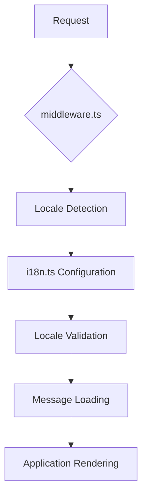
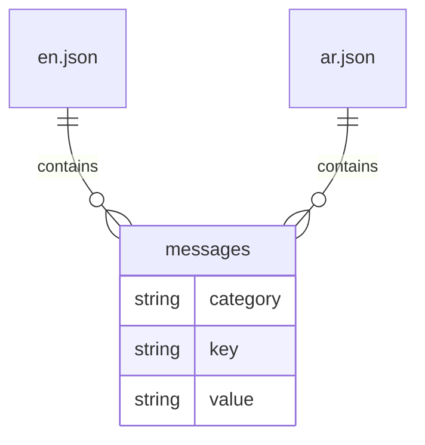
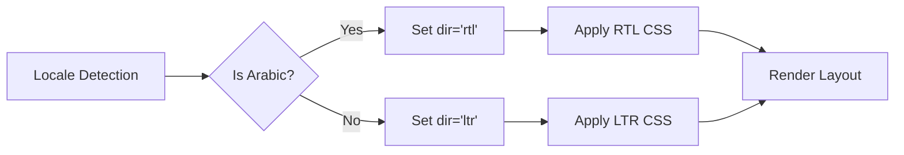
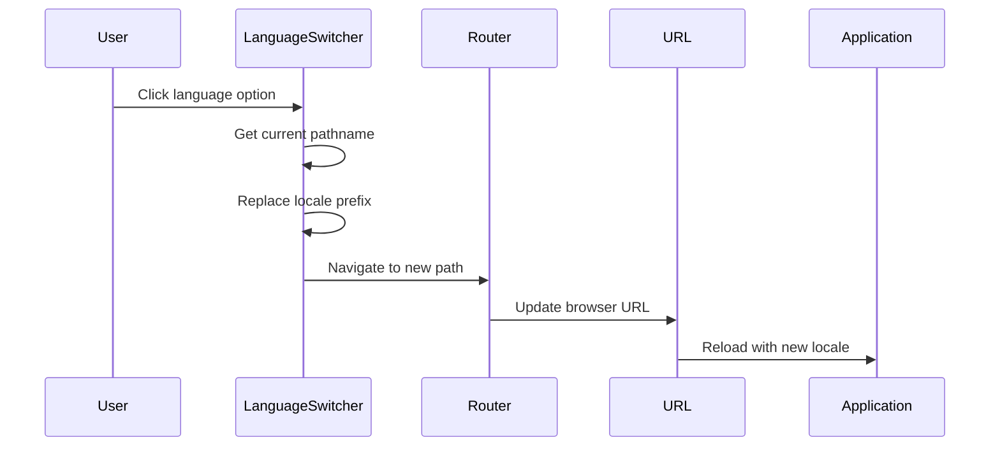
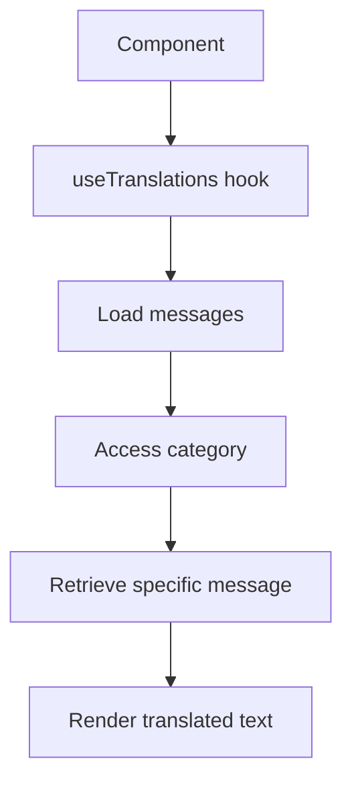
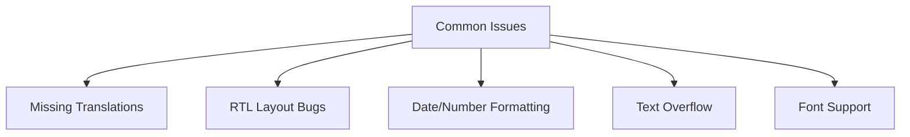

# Internationalization

<cite>
**Referenced Files in This Document**   
- [i18n.ts](file://i18n.ts)
- [middleware.ts](file://middleware.ts)
- [messages/en.json](file://messages/en.json)
- [messages/ar.json](file://messages/ar.json)
- [components/LanguageSwitcher.tsx](file://components/LanguageSwitcher.tsx)
- [app/[locale]/layout.tsx](file://app/[locale]/layout.tsx)
- [app/globals.css](file://app/globals.css)
- [components/Navigation.tsx](file://components/Navigation.tsx)
</cite>

## Table of Contents
1. [Introduction](#introduction)
2. [Core Internationalization Configuration](#core-internationalization-configuration)
3. [Translation File Structure](#translation-file-structure)
4. [RTL/LTR Implementation](#rtl-ltr-implementation)
5. [Language Switching Mechanism](#language-switching-mechanism)
6. [Text Localization in Components](#text-localization-in-components)
7. [Common Internationalization Issues](#common-internationalization-issues)
8. [Adding New Languages](#adding-new-languages)
9. [Performance Considerations](#performance-considerations)
10. [Dynamic Content Handling](#dynamic-content-handling)
11. [Testing Strategies](#testing-strategies)

## Introduction
The Prometheus-Planner V2 application implements a comprehensive internationalization system using next-intl to support both English (LTR) and Arabic (RTL) languages. The system is designed to provide a seamless multilingual experience for players of Path of Exile 2 and Diablo IV, with full RTL support for Arabic localization. This documentation details the implementation architecture, configuration, and best practices for maintaining and extending the internationalization system.

## Core Internationalization Configuration

The internationalization system is configured through two primary files: `i18n.ts` and `middleware.ts`. These files work together to define supported locales, handle locale routing, and provide translation messages to the application.



**Diagram sources**
- [i18n.ts](file://i18n.ts#L1-L16)
- [middleware.ts](file://middleware.ts#L1-L15)

**Section sources**
- [i18n.ts](file://i18n.ts#L1-L16)
- [middleware.ts](file://middleware.ts#L1-L15)

The `i18n.ts` file defines the supported locales and default locale:

```typescript
export const locales = ['en', 'ar'] as const;
export type Locale = (typeof locales)[number];
export const defaultLocale: Locale = 'en';
```

The middleware configuration in `middleware.ts` handles locale routing and applies the appropriate locale based on the URL path, supporting both root-level access and locale-prefixed routes.

## Translation File Structure

The application uses JSON-based message files stored in the `messages/` directory. Each language has its own JSON file (`en.json` and `ar.json`) containing all translatable strings organized by functional areas.



**Diagram sources**
- [messages/en.json](file://messages/en.json#L1-L121)
- [messages/ar.json](file://messages/ar.json#L1-L121)

The translation files follow a hierarchical structure with top-level categories that correspond to different sections of the application:

- **common**: Shared strings used throughout the application (buttons, labels, status messages)
- **nav**: Navigation menu items and labels
- **builds**: Build guide related terminology
- **database**: Item database functionality
- **ai**: AI assistant features
- **community**: Community features
- **leaderboards**: Leaderboard terminology
- **economy**: Economic tracking terms

Each message key follows a consistent naming convention using lowercase letters and underscores, making it easy to locate and understand the purpose of each translation.

**Section sources**
- [messages/en.json](file://messages/en.json#L1-L121)
- [messages/ar.json](file://messages/ar.json#L1-L121)

## RTL/LTR Implementation

The application fully supports RTL (Right-to-Left) layout for Arabic content while maintaining LTR (Left-to-Right) for English. This is achieved through a combination of HTML attributes, CSS rules, and layout adjustments.



**Diagram sources**
- [app/[locale]/layout.tsx](file://app/[locale]/layout.tsx#L35-L37)
- [app/globals.css](file://app/globals.css#L11-L18)

The locale-specific layout component in `app/[locale]/layout.tsx` determines the text direction based on the current locale:

```typescript
const dir = locale === 'ar' ? 'rtl' : 'ltr';
return <html lang={locale} dir={dir}>...</html>;
```

CSS adjustments for RTL support are implemented in `app/globals.css`, which includes specific rules for RTL directionality. The application uses Tailwind CSS with direction-aware utilities to ensure proper layout flipping for Arabic content, including proper alignment of navigation elements, text, and UI components.

**Section sources**
- [app/[locale]/layout.tsx](file://app/[locale]/layout.tsx#L1-L48)
- [app/globals.css](file://app/globals.css#L1-L49)

## Language Switching Mechanism

The language switching functionality is implemented through the `LanguageSwitcher` component, which allows users to toggle between English and Arabic locales. The switcher preserves the current route while changing the locale prefix in the URL.



**Diagram sources**
- [components/LanguageSwitcher.tsx](file://components/LanguageSwitcher.tsx#L1-L64)
- [app/[locale]/layout.tsx](file://app/[locale]/layout.tsx#L8-L10)

The `LanguageSwitcher` component uses Next.js navigation hooks to update the URL path while maintaining the current page context. When a user selects a new language, the component replaces the locale prefix in the current pathname and navigates to the new route, ensuring that users remain on the same content but in their preferred language.

**Section sources**
- [components/LanguageSwitcher.tsx](file://components/LanguageSwitcher.tsx#L1-L64)

## Text Localization in Components

Text localization is implemented using the `useTranslations` hook from next-intl, which provides access to translated messages within React components. The Navigation component demonstrates this pattern by using translations for both navigation items and common labels.



**Diagram sources**
- [components/Navigation.tsx](file://components/Navigation.tsx#L3-L4)
- [components/Navigation.tsx](file://components/Navigation.tsx#L21-L22)

In the Navigation component, translations are accessed by specifying the message category:

```typescript
const t = useTranslations('nav');
const tCommon = useTranslations('common');
```

This allows components to retrieve specific translated strings using dot notation, ensuring consistency across the application and making it easy to locate and update translations.

**Section sources**
- [components/Navigation.tsx](file://components/Navigation.tsx#L1-L99)

## Common Internationalization Issues

The internationalization system addresses several common issues that arise in multilingual applications:

### Missing Translations
When a translation key is missing in a language file, the application falls back to the English version or displays the key itself as a placeholder. This prevents blank text in the UI while making missing translations immediately visible during testing.

### RTL Layout Bugs
RTL implementation can introduce layout issues such as misaligned text, incorrect icon positioning, and improper spacing. The application addresses this by using direction-aware CSS classes and thoroughly testing RTL layouts.

### Date and Number Formatting
The application currently uses English-US formatting for numbers and dates. For full internationalization, locale-specific formatting should be implemented using the `Intl` API with the appropriate locale parameter.



**Diagram sources**
- [lib/utils.ts](file://lib/utils.ts#L8-L19)

**Section sources**
- [lib/utils.ts](file://lib/utils.ts#L1-L20)

## Adding New Languages

To add a new language to the application, follow these steps:

1. Add the locale code to the `locales` array in `i18n.ts`
2. Create a new JSON file in the `messages/` directory with the appropriate locale code
3. Copy the structure from existing translation files
4. Translate all message values while preserving the key structure
5. Update the LanguageSwitcher component to include the new language option
6. Test the new language thoroughly, paying special attention to text length and layout issues

The system is designed to be extensible, allowing for the addition of new languages without modifying the core internationalization logic. All new languages should follow the same JSON structure and categorization as the existing translation files.

## Performance Considerations

The internationalization system considers several performance aspects:

- **Translation File Loading**: Messages are loaded dynamically based on the current locale, reducing initial bundle size
- **Static Generation**: The `generateStaticParams` function in the locale layout pre-generates pages for all supported locales
- **Client-Side Caching**: Translations are cached after initial load to prevent repeated file imports
- **Tree Shaking**: Unused translations are eliminated during build process

The current implementation loads all messages for the current locale at once, which provides a good balance between performance and simplicity. For larger applications with extensive translation content, consider implementing lazy loading of message namespaces.

## Dynamic Content Handling

Dynamic content, such as AI-generated responses from the OpenAI integration, presents unique challenges for internationalization. The system currently handles this by:

- Generating AI responses in the user's selected language based on locale context
- Using the same translation system for AI-generated UI elements
- Ensuring date and number formatting consistency across dynamic content

For AI-generated content, the application should pass the current locale to the API service so that responses are generated in the appropriate language, rather than translating AI output after generation.

## Testing Strategies

The application employs several testing strategies for internationalization:

- **Visual Regression Testing**: Screenshots of RTL layouts are compared against baselines to detect layout issues
- **Translation Completeness Checks**: Scripts verify that all message keys exist in all language files
- **Manual Testing**: Key user flows are tested in both languages to ensure functionality and layout integrity
- **Automated Tests**: Unit tests verify locale switching and message loading

The deployment guide confirms that RTL support has been tested and is working, with specific attention to layout mirroring and language switching persistence.

**Section sources**
- [DEPLOYMENT_GUIDE.md](file://DEPLOYMENT_GUIDE.md#L46-L50)
- [PROJECT_STATUS.md](file://PROJECT_STATUS.md#L152-L153)