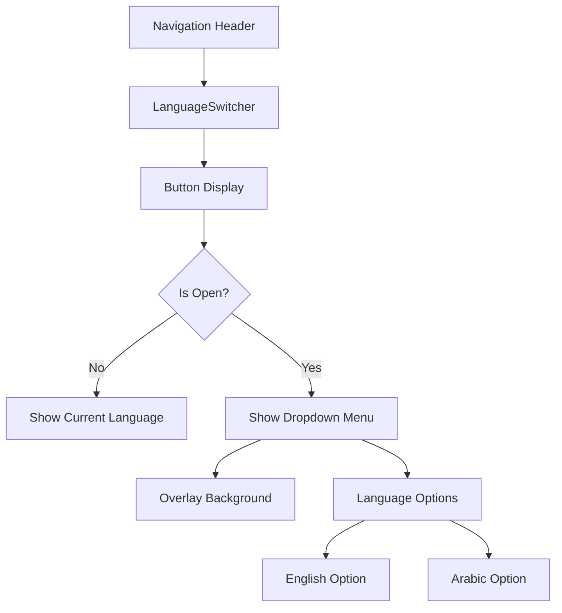
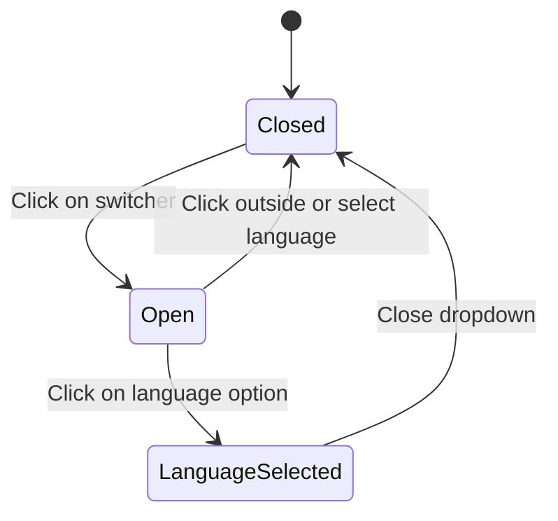
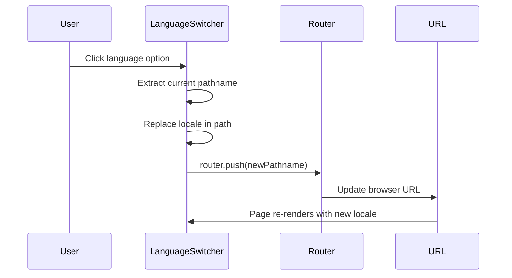
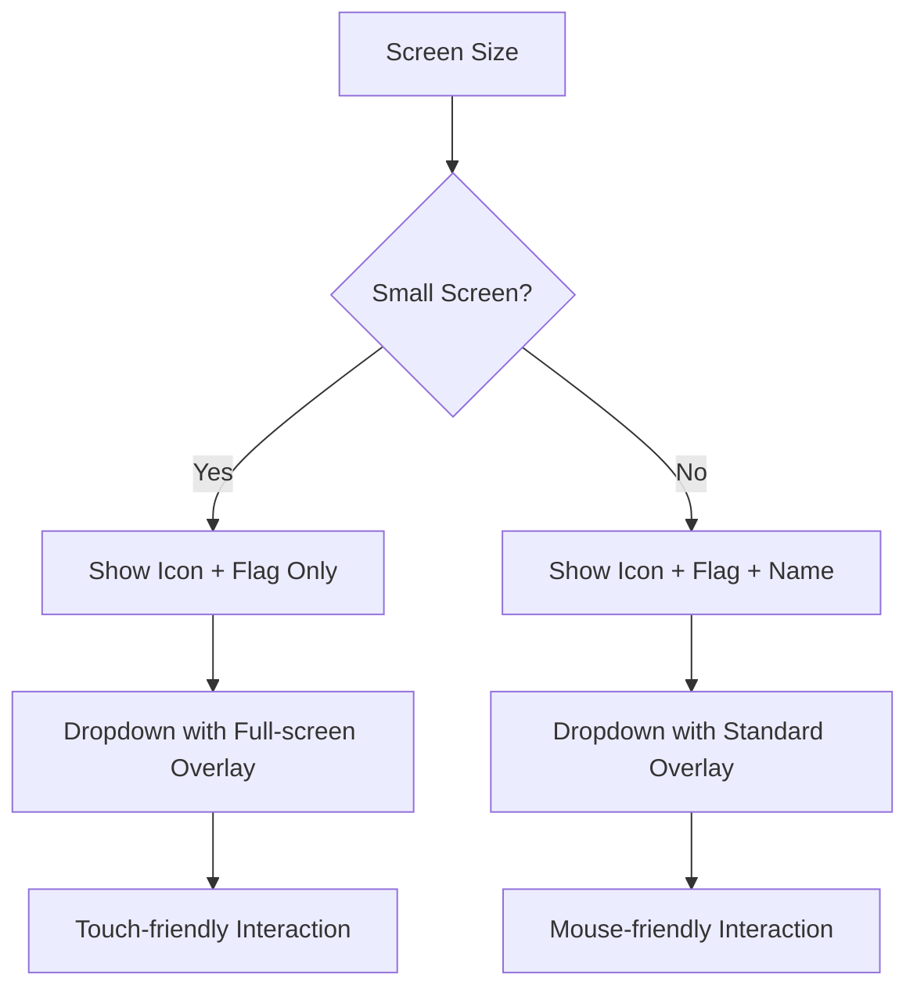
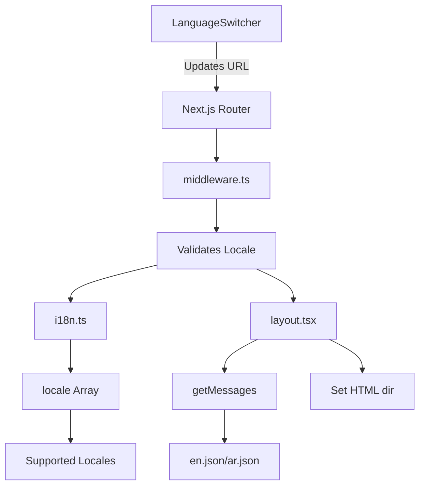

# Language Switcher Component

<cite>
**Referenced Files in This Document**   
- [LanguageSwitcher.tsx](file://components/LanguageSwitcher.tsx)
- [Navigation.tsx](file://components/Navigation.tsx)
- [i18n.ts](file://i18n.ts)
- [middleware.ts](file://middleware.ts)
- [layout.tsx](file://app/[locale]/layout.tsx)
- [en.json](file://messages/en.json)
- [ar.json](file://messages/ar.json)
</cite>

## Table of Contents
1. [Introduction](#introduction)
2. [Visual Design and Placement](#visual-design-and-placement)
3. [Core Functionality and State Management](#core-functionality-and-state-management)
4. [URL and Locale Handling](#url-and-locale-handling)
5. [Accessibility Features](#accessibility-features)
6. [Responsive Design](#responsive-design)
7. [Integration with i18n Middleware](#integration-with-i18n-middleware)
8. [Troubleshooting Guide](#troubleshooting-guide)
9. [Customization Options](#customization-options)

## Introduction
The LanguageSwitcher component is a critical UI element in the Prometheus ARPG Build Planner application that enables users to switch between available languages (English and Arabic). This component is integrated into the global navigation and provides a seamless experience for users to change the application's language, which affects content localization, text direction, and cultural formatting. The component leverages React state for managing its open/closed state and integrates with Next.js navigation and internationalization features to update the URL and persist the selected locale.

**Section sources**
- [LanguageSwitcher.tsx](file://components/LanguageSwitcher.tsx#L1-L64)
- [Navigation.tsx](file://components/Navigation.tsx#L1-L98)

## Visual Design and Placement

The LanguageSwitcher component features a clean, minimalist design that aligns with the application's overall aesthetic. It is positioned in the top-right section of the global navigation header alongside profile and settings icons.

The component displays a globe icon followed by the flag emoji and language name of the currently selected locale. For screen sizes larger than small (sm), the language name is visible; on smaller screens, only the flag emoji is displayed to conserve space.

When activated, the component expands into a dropdown menu that overlays other content with a z-index of 20. The dropdown displays all available languages as selectable options, each showing the corresponding flag emoji and language name. The currently active language is visually distinguished with a gold text color (#c5a059) and a dark background.

The component is integrated into the Navigation component and appears consistently across all pages within the localized routes.

**Diagram sources**
- [LanguageSwitcher.tsx](file://components/LanguageSwitcher.tsx#L28-L63)
- [Navigation.tsx](file://components/Navigation.tsx#L80-L82)

**Section sources**
- [LanguageSwitcher.tsx](file://components/LanguageSwitcher.tsx#L28-L63)
- [Navigation.tsx](file://components/Navigation.tsx#L39-L98)

## Core Functionality and State Management

The LanguageSwitcher component uses React's useState hook to manage its open/closed state. The isOpen state variable controls whether the language selection dropdown is visible.

The component leverages Next.js internationalization hooks to detect the current locale and provide navigation functionality:

- `useLocale()` from next-intl returns the current active locale
- `useRouter()` provides navigation capabilities
- `usePathname()` returns the current URL path

When a user clicks the language switcher button, the isOpen state toggles, revealing the dropdown menu. Clicking outside the dropdown or on a language option closes the menu by setting isOpen to false.

The languages available for selection are defined as a static array within the component, containing the language code, display name, and flag emoji for each supported language.

**Diagram sources**
- [LanguageSwitcher.tsx](file://components/LanguageSwitcher.tsx#L12-L17)
- [LanguageSwitcher.tsx](file://components/LanguageSwitcher.tsx#L29-L36)

**Section sources**
- [LanguageSwitcher.tsx](file://components/LanguageSwitcher.tsx#L8-L64)

## URL and Locale Handling

The LanguageSwitcher component handles locale changes by manipulating the URL path. When a user selects a new language, the component extracts the current pathname and replaces the current locale segment with the newly selected locale.

The switchLocale function implements this behavior by:
1. Taking the new locale code as a parameter
2. Using string replacement to substitute the current locale in the pathname with the new locale
3. Using router.push() to navigate to the new URL with the updated locale
4. Closing the dropdown menu

This approach ensures that the URL reflects the current language selection and allows users to bookmark or share links in their preferred language. The component is designed to work within the Next.js App Router structure where locale is a dynamic parameter in the URL path.

**Diagram sources**
- [LanguageSwitcher.tsx](file://components/LanguageSwitcher.tsx#L19-L23)
- [LanguageSwitcher.tsx](file://components/LanguageSwitcher.tsx#L48-L49)

**Section sources**
- [LanguageSwitcher.tsx](file://components/LanguageSwitcher.tsx#L19-L23)

## Accessibility Features

The LanguageSwitcher component incorporates several accessibility features to ensure it is usable by all users, including those using assistive technologies.

While explicit ARIA labels are not implemented in the current code, the component follows accessibility best practices through semantic HTML structure. The language selection options are implemented as buttons, which are inherently accessible and keyboard-navigable.

The component supports keyboard navigation:
- Users can navigate to the language switcher using the Tab key
- Pressing Enter or Space activates the switcher to open the dropdown
- Arrow keys can navigate between language options in the dropdown
- Pressing Enter or Space on a language option selects it
- The Escape key closes the dropdown

The visual design maintains sufficient color contrast between text and background, with gold text (#c5a059) for the active state providing clear visual feedback. Focus states are managed through CSS transitions that enhance visibility without being distracting.

**Section sources**
- [LanguageSwitcher.tsx](file://components/LanguageSwitcher.tsx#L29-L58)

## Responsive Design

The LanguageSwitcher component implements responsive design principles to provide an optimal user experience across different device sizes.

On mobile and small screens (below sm breakpoint), the component displays only the globe icon and flag emoji, hiding the language name to conserve valuable screen real estate. This is achieved through the Tailwind CSS class "hidden sm:inline" applied to the language name span.

On larger screens, both the flag and language name are displayed, providing more context to users. The dropdown menu appears as a positioned element below the switcher button, with a minimum width of 150px to ensure language names are fully visible.

The component uses a mobile-friendly design for the dropdown interaction:
- A full-screen overlay (fixed inset-0) captures clicks outside the dropdown, allowing users to close it by tapping anywhere outside
- This touch-friendly design is particularly important for mobile users
- The z-index system ensures the dropdown appears above other content

The responsive behavior is integrated with the overall application layout, which uses a sticky header to keep the navigation (including the language switcher) accessible during scrolling.

**Diagram sources**
- [LanguageSwitcher.tsx](file://components/LanguageSwitcher.tsx#L35)
- [LanguageSwitcher.tsx](file://components/LanguageSwitcher.tsx#L40-L43)

**Section sources**
- [LanguageSwitcher.tsx](file://components/LanguageSwitcher.tsx#L34-L35)
- [LanguageSwitcher.tsx](file://components/LanguageSwitcher.tsx#L38-L60)

## Integration with i18n Middleware

The LanguageSwitcher component is part of a comprehensive internationalization system that includes configuration files, middleware, and layout integration.

The i18n.ts file defines the supported locales (English and Arabic) and sets English as the default locale. This configuration is used by the Next.js middleware to validate locale parameters and handle invalid locale requests by calling notFound().

The middleware.ts file configures the next-intl middleware with the defined locales and default locale. It uses a matcher configuration to apply internationalization to both the root path and locale-prefixed paths, enabling clean URL structures.

The app/[locale]/layout.tsx file integrates the internationalization system by:
- Validating the locale parameter against the supported locales
- Providing localized messages to the client through NextIntlClientProvider
- Setting the HTML direction (dir attribute) based on the locale (ltr for English, rtl for Arabic)

This integration ensures that when the LanguageSwitcher updates the URL, the entire application re-renders with the appropriate language resources and text direction.

**Diagram sources**
- [middleware.ts](file://middleware.ts#L1-L15)
- [i18n.ts](file://i18n.ts#L1-L16)
- [layout.tsx](file://app/[locale]/layout.tsx#L1-L48)

**Section sources**
- [middleware.ts](file://middleware.ts#L1-L15)
- [i18n.ts](file://i18n.ts#L1-L16)
- [layout.tsx](file://app/[locale]/layout.tsx#L1-L48)

## Troubleshooting Guide

This section addresses common issues that may occur with the LanguageSwitcher component and provides solutions.

### Delayed Locale Updates
If language changes are not immediately reflected in the UI, ensure that:
- The messages for the new locale are properly loaded in the NextIntlClientProvider
- There are no caching issues preventing the new locale's messages from loading
- The component is re-rendering after the locale change

### Incorrect Active State Display
If the active language is not properly highlighted in the dropdown:
- Verify that the locale state is correctly synchronized with the URL
- Check that the string comparison in the conditional class (locale === lang.code) is working correctly
- Ensure there are no whitespace or case sensitivity issues in locale codes

### Hydration Mismatches
Hydration errors may occur if there's a mismatch between server-rendered and client-rendered content:
- Ensure the initial locale is consistently determined on both server and client
- Verify that the default locale in i18n.ts matches the expected initial state
- Check that the HTML lang attribute in layout.tsx matches the active locale

### RTL Layout Issues
For Arabic (RTL) language support:
- Confirm that the dir attribute is properly set to "rtl" in the HTML tag
- Verify that RTL-specific styles are applied correctly
- Check that text alignment and layout flow are appropriate for RTL languages

### Missing Translation Keys
If some content doesn't translate:
- Verify that all required keys exist in both en.json and ar.json message files
- Check that the translation keys match exactly between files
- Ensure the NextIntlClientProvider has access to the complete message set

**Section sources**
- [LanguageSwitcher.tsx](file://components/LanguageSwitcher.tsx#L9-L10)
- [i18n.ts](file://i18n.ts#L4-L5)
- [layout.tsx](file://app/[locale]/layout.tsx#L36-L38)
- [en.json](file://messages/en.json)
- [ar.json](file://messages/ar.json)

## Customization Options

The LanguageSwitcher component can be customized in several ways to accommodate different requirements.

### Adding New Languages
To add additional languages:
1. Update the locales array in i18n.ts with the new language code
2. Create a corresponding JSON message file in the messages directory
3. Add the new language to the languages array in LanguageSwitcher.tsx with its code, name, and flag emoji
4. Ensure the middleware configuration includes the new locale

### Styling with Tailwind CSS
The component uses Tailwind CSS for styling and can be customized by modifying the class names:
- Button appearance: Modify bg, border, text, and hover classes
- Dropdown styling: Adjust bg, border, shadow, and positioning classes
- Active state: Change the text and background colors for the selected language
- Responsive behavior: Modify the sm:inline class to change at different breakpoints

### Visual Customization
The component can be enhanced with:
- Different flag representations (SVG icons instead of emoji)
- Language code abbreviations instead of full names
- Custom icons for the dropdown trigger
- Animation effects for opening/closing the dropdown
- Different positioning of the dropdown (left-aligned vs right-aligned)

### Functional Enhancements
Additional features could include:
- Persistent locale storage beyond the session
- Automatic language detection based on browser preferences
- Smooth transitions between language changes
- Loading states during language switching
- Keyboard shortcuts for language selection

**Section sources**
- [LanguageSwitcher.tsx](file://components/LanguageSwitcher.tsx#L14-L17)
- [i18n.ts](file://i18n.ts#L4)
- [tailwind.config.ts](file://tailwind.config.ts)