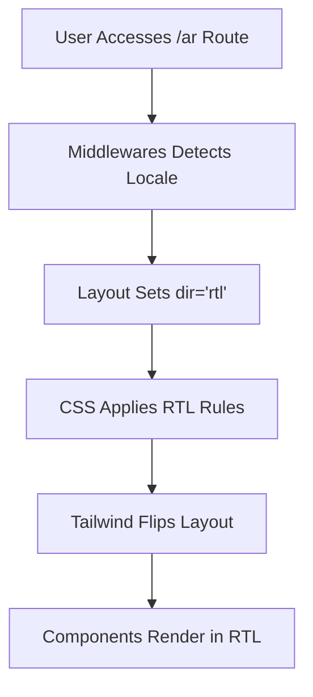

# RTL Layout and Styling

<cite>
**Referenced Files in This Document**   
- [app/globals.css](file://app/globals.css)
- [app/[locale]/layout.tsx](file://app/[locale]/layout.tsx)
- [i18n.ts](file://i18n.ts)
- [middleware.ts](file://middleware.ts)
- [tailwind.config.ts](file://tailwind.config.ts)
- [components/Navigation.tsx](file://components/Navigation.tsx)
- [components/LanguageSwitcher.tsx](file://components/LanguageSwitcher.tsx)
- [components/builds/BuildList.tsx](file://components/builds/BuildList.tsx)
- [components/database/ItemDatabase.tsx](file://components/database/ItemDatabase.tsx)
- [messages/ar.json](file://messages/ar.json)
</cite>

## Table of Contents
1. [Introduction](#introduction)
2. [Locale Detection and Direction Handling](#locale-detection-and-direction-handling)
3. [HTML Direction Attribute Implementation](#html-direction-attribute-implementation)
4. [Global RTL Styling in globals.css](#global-rtl-styling-in-globalscss)
5. [Tailwind Configuration for RTL Support](#tailwind-configuration-for-rtl-support)
6. [Component-Level RTL Adjustments](#component-level-rtl-adjustments)
7. [Common RTL Layout Challenges](#common-rtl-layout-challenges)
8. [Testing and Development Tools for RTL](#testing-and-development-tools-for-rtl)
9. [Performance Considerations](#performance-considerations)
10. [Conclusion](#conclusion)

## Introduction
This document provides a comprehensive overview of the Right-to-Left (RTL) layout implementation for Arabic language support in the Prometheus Planner application. The system leverages Next.js with next-intl for internationalization, Tailwind CSS for styling, and a structured approach to ensure proper text direction, layout flipping, and UI component alignment when displaying content in Arabic. The implementation covers locale detection, HTML direction attributes, global CSS rules, component-specific adjustments, and testing strategies to maintain visual consistency across both LTR and RTL modes.

**Section sources**
- [app/globals.css](file://app/globals.css)
- [app/[locale]/layout.tsx](file://app/[locale]/layout.tsx)
- [i18n.ts](file://i18n.ts)

## Locale Detection and Direction Handling
The application supports two locales: English (`en`) and Arabic (`ar`). Locale detection is handled through the `next-intl` library, which reads the locale from the URL path and configures the application accordingly. The supported locales are defined in the `i18n.ts` file, where the `locales` array explicitly includes both 'en' and 'ar'. When a user accesses a route under `/ar`, the system recognizes the Arabic locale and triggers RTL layout behavior.

The middleware configuration ensures that all internationalized routes are properly matched, supporting both root-level access and locale-prefixed paths. This routing strategy allows seamless switching between languages while maintaining proper context for content rendering.

**Section sources**
- [i18n.ts](file://i18n.ts#L4-L5)
- [middleware.ts](file://middleware.ts#L4-L14)

## HTML Direction Attribute Implementation
The application dynamically sets the `dir` attribute on the `<html>` element based on the detected locale. In the `[locale]/layout.tsx` file, the `dir` value is conditionally assigned: `'rtl'` for Arabic (`ar`) and `'ltr'` for all other locales (primarily English). This attribute is crucial for enabling browser-level text direction handling and serves as the foundation for CSS-based layout flipping.

The `dir` attribute is applied directly in the root HTML element:
```tsx
<html lang={locale} dir={dir}>
```
This ensures that native browser behaviors such as text alignment, cursor positioning, and form input direction are automatically adjusted for RTL languages. All child elements inherit this directionality unless explicitly overridden.

**Section sources**
- [app/[locale]/layout.tsx](file://app/[locale]/layout.tsx#L35-L39)

## Global RTL Styling in globals.css
The `globals.css` file contains foundational CSS rules for RTL support. It defines directionality at the document level using attribute selectors:
```css
[dir="rtl"] {
  direction: rtl;
}

[dir="ltr"] {
  direction: ltr;
}
```
These rules ensure that the entire document respects the directional context established by the `dir` attribute. While Tailwind CSS handles most layout utilities, these base styles provide a reliable fallback and ensure consistent behavior across all browsers.

Additionally, the global stylesheet includes RTL-aware custom scrollbar styling. Although scrollbars typically follow system settings, the application enforces consistent visual treatment regardless of text direction. The scrollbar positioning remains on the left in RTL mode due to modern browser defaults, but the styling maintains visual harmony with the dark theme.

**Section sources**
- [app/globals.css](file://app/globals.css#L11-L18)

## Tailwind Configuration for RTL Support
The Tailwind configuration in `tailwind.config.ts` currently does not explicitly enable RTL features. However, Tailwind CSS automatically supports RTL through its built-in variant system when the `dir="rtl"` attribute is present on the HTML element. The framework detects this attribute and applies directional variants like `rtl:*` and `ltr:*` when needed.

Although the configuration file doesn't include explicit RTL plugins or settings, the default behavior of Tailwind—combined with the presence of the `dir` attribute—enables logical property mapping. For example, `margin-left` and `margin-right` utilities are automatically flipped in RTL contexts when using logical properties or directional variants.

Future enhancements could include enabling the `rtl` plugin for more granular control:
```ts
plugins: [require('tailwindcss-rtl')],
```
This would allow for more sophisticated RTL-specific utility generation and better handling of complex layout scenarios.

**Section sources**
- [tailwind.config.ts](file://tailwind.config.ts#L1-L14)

## Component-Level RTL Adjustments
Several components require special consideration for RTL rendering. The `Navigation` component uses the current locale to determine text direction and adjusts layout flow accordingly. It imports localized strings via `useTranslations` from `next-intl`, ensuring that all navigation labels appear correctly in Arabic when the locale is set to `ar`.

The `LanguageSwitcher` component displays language options with appropriate flags and names, including the Arabic name "العربية" for the Arabic option. When users switch to Arabic, the locale change triggers a full re-render with updated directionality.

Data display components like `BuildList` and `ItemDatabase` use flexbox and grid layouts that automatically adapt to RTL contexts due to the inherited `dir` attribute. However, certain elements such as filter buttons and input fields may require additional attention to ensure proper alignment and spacing in RTL mode.



**Diagram sources**
- [app/[locale]/layout.tsx](file://app/[locale]/layout.tsx#L35-L39)
- [components/Navigation.tsx](file://components/Navigation.tsx#L23-L38)
- [components/LanguageSwitcher.tsx](file://components/LanguageSwitcher.tsx#L9-L23)

**Section sources**
- [components/Navigation.tsx](file://components/Navigation.tsx#L1-L99)
- [components/LanguageSwitcher.tsx](file://components/LanguageSwitcher.tsx#L1-L65)
- [components/builds/BuildList.tsx](file://components/builds/BuildList.tsx#L1-L265)
- [components/database/ItemDatabase.tsx](file://components/database/ItemDatabase.tsx#L1-L112)

## Common RTL Layout Challenges
Despite the robust foundation, several RTL-specific issues may arise:

1. **Misaligned Text and Icons**: In RTL mode, icons that are logically associated with text (e.g., search icon in input fields) should appear on the right side. The current implementation uses absolute positioning (`left-3`) which may not flip correctly in RTL contexts.

2. **Incorrect Margin/Padding Application**: Physical properties like `ml-*` (margin-left) and `pl-*` (padding-left) do not automatically flip in RTL. The application should use logical properties like `ms-*` (margin-start) and `ps-*` (padding-start) for proper directional behavior.

3. **Animation Direction Issues**: Any CSS animations involving horizontal movement (e.g., slide-in effects) will maintain their original direction unless explicitly reversed for RTL. This can create confusing user experiences in Arabic interfaces.

4. **Bidirectional Text Mixing**: When Arabic text contains embedded English terms (common in gaming contexts), proper Unicode bidirectional algorithm handling is essential to prevent text reordering issues.

5. **Form Element Alignment**: Input fields, labels, and validation messages may not align properly in RTL without explicit styling overrides.

## Testing and Development Tools for RTL
To ensure visual consistency in RTL mode, the following testing strategies are recommended:

1. **Manual Visual Inspection**: Regularly test the application in `/ar` mode to verify layout integrity, text alignment, and component behavior.

2. **RTL Simulation Tools**: Use browser developer tools to force `dir="rtl"` on any page, even in English mode, to quickly identify layout issues.

3. **Automated Screenshot Testing**: Implement visual regression tests that capture both LTR and RTL versions of key pages to detect unintended layout changes.

4. **Screen Reader Testing**: Verify that assistive technologies correctly interpret text direction and navigation order in RTL mode.

5. **Cross-Browser Testing**: Ensure consistent RTL rendering across different browsers, as implementation details for CSS directionality can vary.

During development, engineers can temporarily override the locale in `i18n.ts` to default to `'ar'` for extended RTL-focused debugging sessions.

## Performance Considerations
The current RTL implementation has minimal performance impact as it relies primarily on CSS inheritance and attribute-based styling. There is no conditional loading of separate CSS bundles for different languages, which keeps the overall bundle size efficient.

However, if the application were to adopt more complex RTL-specific components or conditional rendering logic, it could introduce additional JavaScript overhead. The use of dynamic imports for RTL-specific utilities should be carefully evaluated against the benefits of reduced initial load time.

The global application of `dir` at the HTML level ensures that directional context is available to all components without requiring individual locale checks, optimizing runtime performance.

## Conclusion
The RTL layout implementation for Arabic language support in the Prometheus Planner application is well-structured, leveraging modern Next.js internationalization patterns and CSS best practices. By setting the `dir` attribute at the root level and using semantic HTML, the application ensures proper text direction and layout flipping across all components. While the current Tailwind configuration doesn't explicitly enable RTL plugins, the framework's default behavior combined with proper HTML structure provides solid RTL support. Future improvements could include adopting logical CSS properties more extensively and implementing automated visual regression testing for RTL layouts.

**Section sources**
- [app/globals.css](file://app/globals.css)
- [app/[locale]/layout.tsx](file://app/[locale]/layout.tsx)
- [i18n.ts](file://i18n.ts)
- [middleware.ts](file://middleware.ts)
- [tailwind.config.ts](file://tailwind.config.ts)