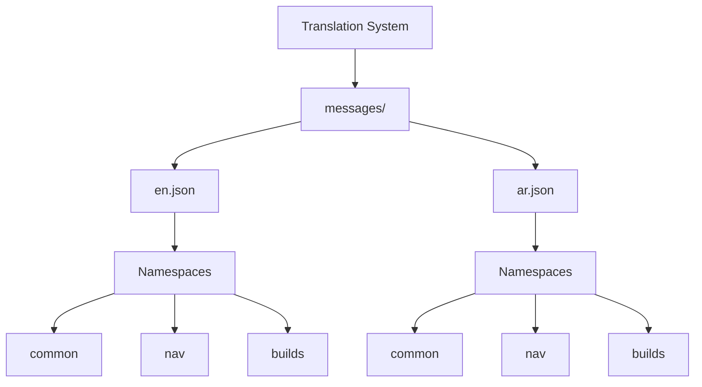
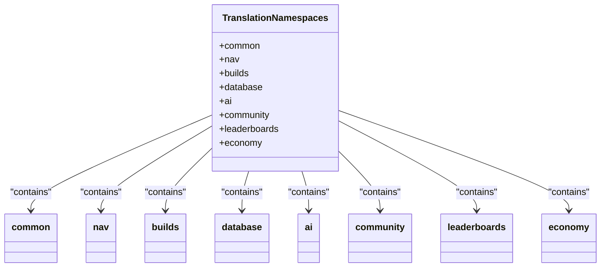
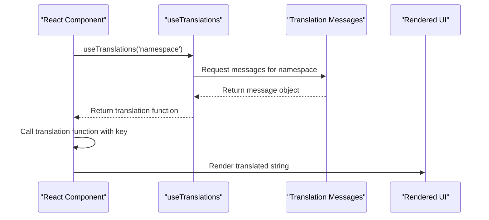

# Translation Files and Message Management

<cite>
**Referenced Files in This Document**   
- [messages/en.json](file://messages/en.json)
- [messages/ar.json](file://messages/ar.json)
- [i18n.ts](file://i18n.ts)
- [middleware.ts](file://middleware.ts)
- [app/[locale]/layout.tsx](file://app/[locale]/layout.tsx)
- [components/Navigation.tsx](file://components/Navigation.tsx)
- [components/LanguageSwitcher.tsx](file://components/LanguageSwitcher.tsx)
- [components/builds/BuildList.tsx](file://components/builds/BuildList.tsx)
- [components/community/CommunityHub.tsx](file://components/community/CommunityHub.tsx)
</cite>

## Table of Contents
1. [Translation File Structure](#translation-file-structure)
2. [Namespace Organization](#namespace-organization)
3. [Key Naming Conventions](#key-naming-conventions)
4. [Message Formatting and Placeholders](#message-formatting-and-placeholders)
5. [Component Integration with useTranslations](#component-integration-with-usetranslations)
6. [Bidirectional (RTL) Support](#bidirectional-rtl-support)
7. [Translation Workflow and Maintenance](#translation-workflow-and-maintenance)
8. [Arabic Language Challenges](#arabic-language-challenges)
9. [Tooling and Validation](#tooling-and-validation)
10. [Performance Optimization](#performance-optimization)

## Translation File Structure

The translation system is implemented using the next-intl library, with translation files stored in the messages/ directory. The application supports two locales: English (en) and Arabic (ar), with corresponding en.json and ar.json files containing all translatable strings.

The structure follows a hierarchical namespace pattern where related messages are grouped under common prefixes. Each translation file contains top-level namespaces like "common", "nav", "builds", "database", "ai", "community", "leaderboards", and "economy", which organize messages by functional area of the application.



**Diagram sources**
- [messages/en.json](file://messages/en.json)
- [messages/ar.json](file://messages/ar.json)

**Section sources**
- [messages/en.json](file://messages/en.json)
- [messages/ar.json](file://messages/ar.json)

## Namespace Organization

The translation system uses a namespace-based organization to group related messages and prevent naming conflicts. The primary namespaces include:

- **common**: Contains frequently used UI elements and actions that appear across multiple pages
- **nav**: Houses navigation menu items and labels
- **builds**: Contains strings specific to build guides and related functionality
- **database**: Includes terminology for the item database feature
- **ai**: Stores messages for the AI Guide functionality
- **community**: Contains community-related interface text
- **leaderboards**: Includes leaderboard-specific labels
- **economy**: Houses economic tracking interface strings

This namespace approach allows components to request a specific namespace when using the useTranslations hook, reducing the amount of data passed to components and improving performance. The hierarchical structure also makes it easier to locate and manage related translation keys.



**Diagram sources**
- [messages/en.json](file://messages/en.json)
- [messages/ar.json](file://messages/ar.json)

**Section sources**
- [messages/en.json](file://messages/en.json)
- [messages/ar.json](file://messages/ar.json)

## Key Naming Conventions

The translation system follows consistent key naming conventions to ensure maintainability and clarity. Keys use lowercase with words separated by underscores or camelCase within their respective namespaces. The naming convention prioritizes clarity and context, making it easy to understand the purpose of each message.

Common patterns include:
- Action verbs for buttons (e.g., "save", "export", "import")
- Descriptive labels for UI elements (e.g., "search", "filter", "sort")
- Section titles and subtitles (e.g., "title", "subtitle")
- Feature-specific terminology (e.g., "tierList", "skillTree", "gemLinks")

The system avoids generic names that could lead to ambiguity and instead uses descriptive names that indicate both the content and context of the message. This approach facilitates easier maintenance and reduces the likelihood of duplicate or conflicting keys.

**Section sources**
- [messages/en.json](file://messages/en.json)
- [messages/ar.json](file://messages/ar.json)

## Message Formatting and Placeholders

While the current implementation does not show complex message formatting with dynamic placeholders, the next-intl library supports ICU message format syntax for advanced formatting needs. This includes support for:

- Variable interpolation
- Pluralization rules
- Gender-specific translations
- Date and number formatting
- Rich text formatting within messages

The system is designed to accommodate these features as the application evolves. For example, if a message needed to include a dynamic build name or user count, it could use placeholder syntax like `{buildName}` or `{count, number}` to insert dynamic values at runtime.

The foundation is in place to support more sophisticated message formatting as required by future features, leveraging the full capabilities of the underlying formatjs/intl-messageformat library as evidenced by the dependencies in package-lock.json.

**Section sources**
- [package-lock.json](file://package-lock.json)
- [i18n.ts](file://i18n.ts)

## Component Integration with useTranslations

Components access translated messages through the useTranslations hook from next-intl. The hook can be called with or without a namespace parameter. When a namespace is provided, the returned translation function only has access to messages within that namespace.

For example, in the Navigation component, two translation instances are created:
- `t = useTranslations('nav')` for navigation-specific messages
- `tCommon = useTranslations('common')` for shared UI elements like the tagline



**Diagram sources**
- [components/Navigation.tsx](file://components/Navigation.tsx)
- [components/builds/BuildList.tsx](file://components/builds/BuildList.tsx)

**Section sources**
- [components/Navigation.tsx](file://components/Navigation.tsx)
- [components/builds/BuildList.tsx](file://components/builds/BuildList.tsx)
- [components/community/CommunityHub.tsx](file://components/community/CommunityHub.tsx)

## Bidirectional (RTL) Support

The application provides full support for right-to-left (RTL) languages like Arabic. This is implemented in the locale-specific layout component (app/[locale]/layout.tsx), which determines the text direction based on the current locale:

```typescript
const dir = locale === 'ar' ? 'rtl' : 'ltr';
```

The HTML element is then rendered with the appropriate direction attribute:

```typescript
<html lang={locale} dir={dir}>
```

This ensures proper text alignment, layout flow, and UI element positioning for Arabic users. The LanguageSwitcher component also displays Arabic text correctly, including the Arabic name for the language option and appropriate flag emoji.

The system automatically handles the visual reordering of layout elements for RTL languages, ensuring a native experience for Arabic speakers while maintaining the same functionality as the LTR English interface.

**Section sources**
- [app/[locale]/layout.tsx](file://app/[locale]/layout.tsx)
- [components/LanguageSwitcher.tsx](file://components/LanguageSwitcher.tsx)

## Translation Workflow and Maintenance

The translation workflow is centered around the messages directory, which contains the source of truth for all translatable content. When adding new translation keys, developers follow this process:

1. Add the new key to en.json with the English translation
2. Add the corresponding key to ar.json with the Arabic translation
3. Use the key in components via the useTranslations hook

The i18n.ts configuration file defines the supported locales and handles locale validation:

```typescript
export const locales = ['en', 'ar'] as const;
export type Locale = (typeof locales)[number];
export const defaultLocale: Locale = 'en';
```

The middleware.ts file configures the routing system to support locale-based URLs, matching paths like '/(ar|en)/:path*' to ensure proper locale handling across the application.

This structured approach ensures consistency across languages and prevents missing translations from reaching production.

**Section sources**
- [i18n.ts](file://i18n.ts)
- [middleware.ts](file://middleware.ts)
- [messages/en.json](file://messages/en.json)
- [messages/ar.json](file://messages/ar.json)

## Arabic Language Challenges

The Arabic translation presents several linguistic and cultural challenges that have been addressed in the implementation:

- **Cultural adaptation**: Game terminology has been localized to ensure cultural relevance while maintaining accuracy
- **Text expansion**: Arabic text typically requires more space than English, which has been accommodated in the UI design
- **Complex script rendering**: The system properly handles Arabic script rendering, including proper glyph formation and ligatures
- **Numerals**: The implementation uses standard Arabic numerals rather than Eastern Arabic numerals for consistency with gaming conventions

The translation maintains the technical accuracy of game terms while ensuring readability and cultural appropriateness for Arabic-speaking players. Special attention has been paid to gaming-specific terminology to ensure it is both accurate and familiar to the target audience.

**Section sources**
- [messages/ar.json](file://messages/ar.json)
- [components/LanguageSwitcher.tsx](file://components/LanguageSwitcher.tsx)

## Tooling and Validation

The translation system leverages next-intl, which is built on top of the robust formatjs ecosystem. The package-lock.json file reveals dependencies on @formatjs/icu-messageformat-parser and @formatjs/intl-localematcher, indicating support for advanced internationalization features.

While the current implementation doesn't show explicit tooling for translation validation or missing key detection, the next-intl framework provides several built-in safeguards:

- Locale validation through the getRequestConfig function
- Automatic 404 handling for invalid locales via the notFound() function
- Type safety through TypeScript definitions for locales

The system could be extended with additional tooling such as:
- Static analysis to detect unused translation keys
- Automated extraction of new keys from code
- Validation scripts to ensure parity between language files
- Integration with translation management platforms

**Section sources**
- [package-lock.json](file://package-lock.json)
- [i18n.ts](file://i18n.ts)

## Performance Optimization

The translation system is designed with performance considerations in mind. The current implementation loads all messages for the requested locale, which is suitable for the current application size. However, several optimization strategies are available for scaling:

- **Code splitting by locale**: Messages could be split into separate bundles to reduce initial load time
- **Lazy loading**: Less frequently used translations could be loaded on demand
- **Namespace-based loading**: Components could request only the namespaces they need

The use of static JSON files allows for efficient caching and delivery through the Next.js optimization pipeline. The generateStaticParams function in the locale layout pre-generates pages for each supported locale, enabling optimal performance through static site generation.

As the application grows, the translation system can be enhanced with more sophisticated loading strategies to maintain optimal performance while supporting an expanding set of languages and translations.

**Section sources**
- [app/[locale]/layout.tsx](file://app/[locale]/layout.tsx)
- [i18n.ts](file://i18n.ts)