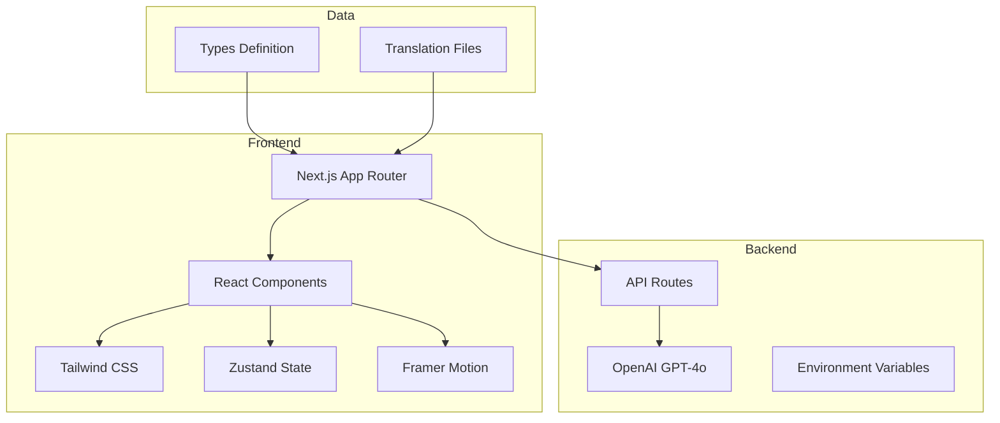
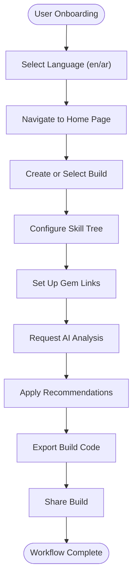

# Project Overview

<cite>
**Referenced Files in This Document**   
- [README.md](file://README.md)
- [package.json](file://package.json)
- [app/layout.tsx](file://app/layout.tsx)
- [i18n.ts](file://i18n.ts)
- [types/index.ts](file://types/index.ts)
- [app/api/ai/analyze/route.ts](file://app/api/ai/analyze/route.ts)
- [components/builds/InteractiveSkillTree.tsx](file://components/builds/InteractiveSkillTree.tsx)
- [components/builds/GemLinksViewer.tsx](file://components/builds/GemLinksViewer.tsx)
- [components/builds/BuildImportExport.tsx](file://components/builds/BuildImportExport.tsx)
- [components/Navigation.tsx](file://components/Navigation.tsx)
- [components/ai/AIGuide.tsx](file://components/ai/AIGuide.tsx)
- [components/database/ItemDatabase.tsx](file://components/database/ItemDatabase.tsx)
- [components/economy/EconomyTracker.tsx](file://components/economy/EconomyTracker.tsx)
- [components/leaderboards/Leaderboards.tsx](file://components/leaderboards/Leaderboards.tsx)
- [components/news/NewsSection.tsx](file://components/news/NewsSection.tsx)
</cite>

## Table of Contents
1. [Introduction](#introduction)
2. [Core Value Proposition](#core-value-proposition)
3. [Feature Set](#feature-set)
4. [Target User Personas](#target-user-personas)
5. [Application Architecture](#application-architecture)
6. [Performance Goals](#performance-goals)
7. [User Workflows](#user-workflows)
8. [Common Issues and Configuration](#common-issues-and-configuration)
9. [Scalability and Roadmap](#scalability-and-roadmap)

## Introduction

Prometheus-Planner V2 is a premium web application designed for players of Action Role-Playing Games (ARPGs), specifically Path of Exile 2 and Diablo IV. The platform enables users to create, optimize, and share character builds with AI-powered analysis, combining visual planning tools with real-time recommendations. Built as a full-stack Next.js App Router application, it emphasizes performance, accessibility, and multilingual support (English and Arabic RTL). The application serves as a comprehensive hub for build guides, item databases, AI assistance, leaderboards, economy tracking, and news updates.

**Section sources**
- [README.md](file://README.md#L1-L144)

## Core Value Proposition

The core value of Prometheus-Planner V2 lies in its integration of visual build planning with AI-driven optimization. Unlike traditional build planners, this platform combines interactive skill trees, gem links visualization, and gear priority charts with an AI assistant powered by OpenAI's GPT-4o model. This enables users to receive real-time, context-aware recommendations based on current meta, game mechanics, and activity-specific performance (e.g., leveling, bossing, mapping). The platform also emphasizes community-driven content, allowing users to share builds, upvote favorites, and access tier-rated guides (S+ to D) for different gameplay scenarios.

Multilingual support is a key differentiator, offering full localization for both English (LTR) and Arabic (RTL) with proper layout direction and cultural adaptation. This expands accessibility to a broader global audience, particularly in Middle Eastern markets where ARPGs have growing popularity.

**Section sources**
- [README.md](file://README.md#L3-L19)
- [i18n.ts](file://i18n.ts#L1-L17)

## Feature Set

Prometheus-Planner V2 offers a comprehensive suite of features tailored to ARPG players:

- **Build Guide System**: Detailed build pages with tier ratings (S+ to D) across multiple activities including Leveling, Bossing, Mapping, PvP, Farming, and Uber Bosses.
- **Interactive Skill Tree**: A zoomable, pannable skill tree component that allows users to explore node connections, keystone selections, and progression paths.
- **Gem Links Viewer**: Visual representation of gem link configurations, showing linked skills, levels, quality, and spirit costs.
- **Item Database**: Searchable database with filters for item type (Unique, Legendary, Rare, Currency), game (PoE 2, Diablo IV), and level requirements.
- **AI Assistant**: GPT-4o-powered chat interface that analyzes builds, suggests optimizations, identifies weaknesses, and recommends gear priorities.
- **Build Import/Export**: Support for importing and exporting build codes, compatible with external tools like Path of Building (PoB).
- **Leaderboards**: Rankings of top players and their builds based on performance metrics like DPS and survivability.
- **Economy Tracker**: Real-time price tracking for in-game currency (e.g., Chaos Orbs, Divine Orbs), with integration planned for poe.ninja.
- **News & Patch Notes**: Latest updates, expert analysis, and meta breakdowns for both Path of Exile 2 and Diablo IV.
- **Community Hub**: User profiles, build sharing, and social features for engagement and collaboration.

**Section sources**
- [README.md](file://README.md#L7-L18)
- [types/index.ts](file://types/index.ts#L1-L136)
- [components/builds/InteractiveSkillTree.tsx](file://components/builds/InteractiveSkillTree.tsx#L1-L173)
- [components/builds/GemLinksViewer.tsx](file://components/builds/GemLinksViewer.tsx#L1-L66)
- [components/database/ItemDatabase.tsx](file://components/database/ItemDatabase.tsx#L1-L112)
- [components/ai/AIGuide.tsx](file://components/ai/AIGuide.tsx#L1-L131)
- [components/leaderboards/Leaderboards.tsx](file://components/leaderboards/Leaderboards.tsx#L1-L64)
- [components/economy/EconomyTracker.tsx](file://components/economy/EconomyTracker.tsx#L1-L56)
- [components/news/NewsSection.tsx](file://components/news/NewsSection.tsx#L1-L58)

## Target User Personas

The platform caters to three primary user personas:

1. **ARPG Players**: Casual and competitive players seeking optimized builds for progression, endgame content, or specific challenges. They benefit from tier-rated guides, AI recommendations, and visual planning tools.
2. **Meta Analysts**: Community experts and content creators who analyze game balance, patch notes, and emerging strategies. They use the platform to publish guides, track economy trends, and compare builds.
3. **Content Creators**: Streamers, YouTubers, and forum contributors who create build showcases, tutorials, and reviews. The platform supports video integration, build export, and sharing features to facilitate content distribution.

These personas are supported through features like build import/export, AI analysis, and community engagement tools, enabling both consumption and contribution of build knowledge.

**Section sources**
- [README.md](file://README.md#L101-L136)

## Application Architecture

Prometheus-Planner V2 is built on Next.js 15 using the App Router architecture, enabling server-side rendering (SSR), API routes, and locale-based routing. The frontend leverages React with TypeScript, Tailwind CSS for styling, and Framer Motion for animations. State management is handled via Zustand, while internationalization is implemented using `next-intl` for seamless language switching between English and Arabic (RTL).

The backend consists of API routes within the `app/api` directory, such as the AI analysis endpoint (`/api/ai/analyze`), which integrates with OpenAI's GPT-4o model. The application follows a component-based structure, with reusable UI elements organized under the `components/` directory, grouped by feature (e.g., builds, database, ai).

Data models are defined in `types/index.ts`, including interfaces for `Build`, `Item`, `User`, and `SkillTreeData`. The project uses environment variables for configuration, particularly for the OpenAI API key, ensuring secure access to AI services.



**Diagram sources**
- [app/layout.tsx](file://app/layout.tsx#L1-L10)
- [package.json](file://package.json#L1-L35)
- [i18n.ts](file://i18n.ts#L1-L17)
- [types/index.ts](file://types/index.ts#L1-L136)
- [app/api/ai/analyze/route.ts](file://app/api/ai/analyze/route.ts#L1-L92)

**Section sources**
- [README.md](file://README.md#L21-L28)
- [package.json](file://package.json#L1-L35)
- [app/layout.tsx](file://app/layout.tsx#L1-L10)

## Performance Goals

The application targets a 90+ PageSpeed score through several optimization strategies:
- Code splitting and lazy loading of components
- Image optimization with modern formats and responsive sizing
- Efficient API calls with caching and debouncing
- Minimal third-party dependencies
- Server-side rendering for fast initial load times

Responsive design ensures usability across devices, from desktop to mobile, while accessibility features include semantic HTML, keyboard navigation, and screen reader support. The UI is designed with high contrast and clear typography to accommodate diverse user needs.

**Section sources**
- [README.md](file://README.md#L18-L19)

## User Workflows

### Onboarding
Users begin by selecting their preferred language (English or Arabic) via the navigation bar. The home page presents featured builds, recent news, and quick access to key features like the AI assistant and item database.

### Build Creation and Optimization
1. Navigate to the **Builds** section and select a template or create a new build.
2. Use the **Interactive Skill Tree** to plan node allocations and keystone choices.
3. Configure **Gem Links** with active and support gems, viewing their connections and stats.
4. Use the **AI Assistant** to analyze the build, receiving suggestions for optimization based on current meta.
5. Adjust gear priorities using the **Item Database** to find optimal equipment.

### Build Sharing
1. Export the build using the **Build Import/Export** tool, generating a shareable code.
2. Share the code on forums, social media, or with friends.
3. Import builds from others to test or modify configurations.



**Diagram sources**
- [components/Navigation.tsx](file://components/Navigation.tsx#L1-L99)
- [components/builds/InteractiveSkillTree.tsx](file://components/builds/InteractiveSkillTree.tsx#L1-L173)
- [components/builds/GemLinksViewer.tsx](file://components/builds/GemLinksViewer.tsx#L1-L66)
- [components/ai/AIGuide.tsx](file://components/ai/AIGuide.tsx#L1-L131)
- [components/builds/BuildImportExport.tsx](file://components/builds/BuildImportExport.tsx#L1-L119)

**Section sources**
- [components/builds/InteractiveSkillTree.tsx](file://components/builds/InteractiveSkillTree.tsx#L1-L173)
- [components/builds/GemLinksViewer.tsx](file://components/builds/GemLinksViewer.tsx#L1-L66)
- [components/ai/AIGuide.tsx](file://components/ai/AIGuide.tsx#L1-L131)
- [components/builds/BuildImportExport.tsx](file://components/builds/BuildImportExport.tsx#L1-L119)

## Common Issues and Configuration

### Environment Setup
Ensure Node.js 18+ is installed. Install dependencies using `npm install`. Create a `.env.local` file with the OpenAI API key:

```bash
OPENAI_API_KEY=your_openai_api_key_here
```

### API Key Configuration
The AI assistant requires a valid OpenAI API key. If not configured, the system returns a 500 error. The key is used in the `/api/ai/analyze` route to authenticate requests to the GPT-4o model.

### Language Support
The application uses `next-intl` for localization. Translation files are located in `messages/en.json` and `messages/ar.json`. The middleware handles locale detection and routing, ensuring proper RTL layout for Arabic.

**Section sources**
- [README.md](file://README.md#L29-L55)
- [app/api/ai/analyze/route.ts](file://app/api/ai/analyze/route.ts#L1-L92)
- [i18n.ts](file://i18n.ts#L1-L17)

## Scalability and Roadmap

The project follows a phased development roadmap:

- **Phase 1 (Completed)**: Internationalization, project structure, core routing, and basic UI.
- **Phase 2 (Completed)**: Interactive skill trees, item database, AI integration, tier ratings, and performance optimizations.
- **Phase 3 (Planned)**: Build comparison tool, gear check with image recognition, real-time economy API (poe.ninja), leaderboard integration, and video previews.
- **Phase 4 (Planned)**: User build creation, upvoting/commenting, streamer integration (Twitch/YouTube), and build sharing.
- **Phase 5 (Planned)**: SEO optimization, mobile app notifications, and newsletter integration.

Scalability is ensured through modular architecture, API-first design, and cloud-ready deployment (Vercel). Future enhancements will focus on community features, real-time data integration, and AI-driven personalization.

**Section sources**
- [README.md](file://README.md#L101-L136)