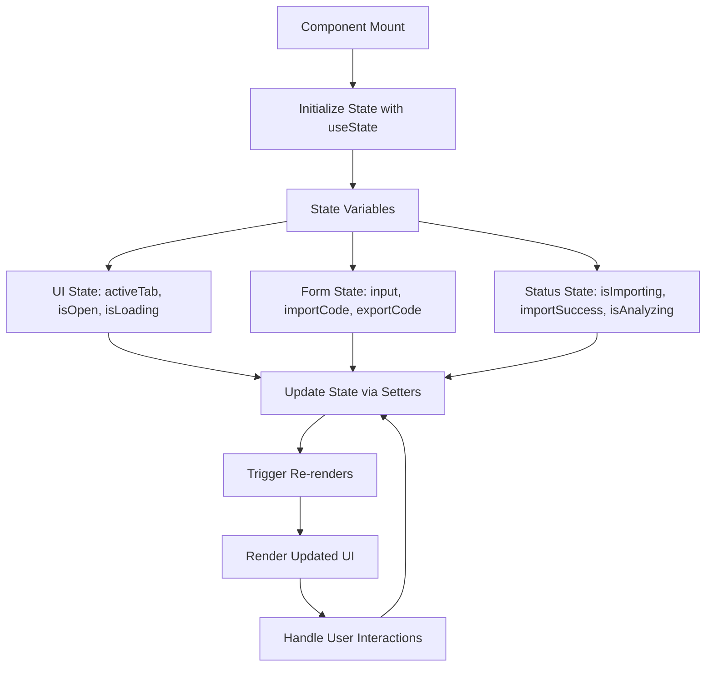
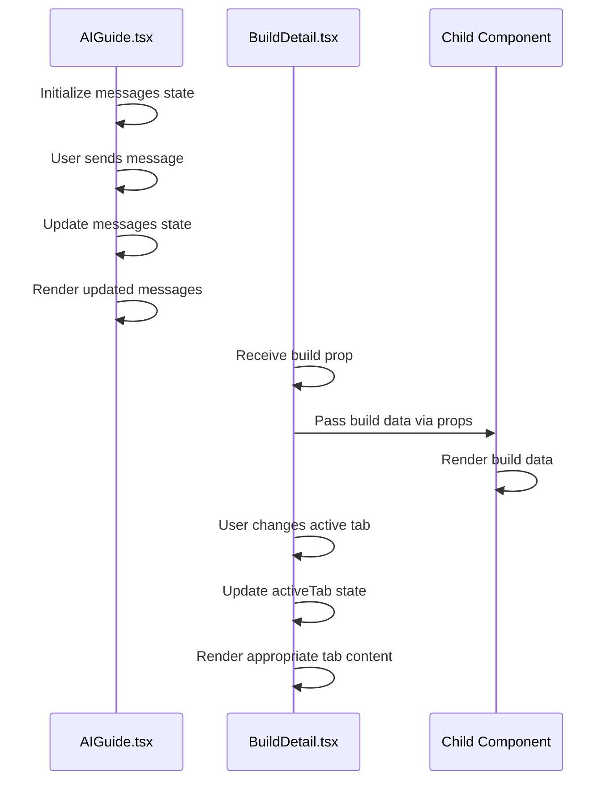
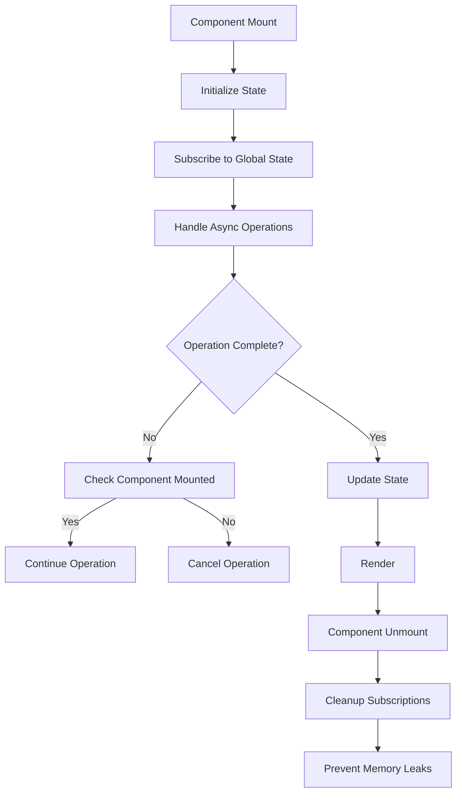
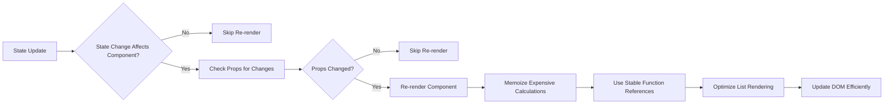

# State Management

<cite>
**Referenced Files in This Document**   
- [AIGuide.tsx](file://components/ai/AIGuide.tsx)
- [BuildDetail.tsx](file://components/builds/BuildDetail.tsx)
- [BuildImportExport.tsx](file://components/builds/BuildImportExport.tsx)
- [BuildList.tsx](file://components/builds/BuildList.tsx)
- [utils.ts](file://lib/utils.ts)
- [index.ts](file://types/index.ts)
- [package.json](file://package.json)
- [package-lock.json](file://package-lock.json)
</cite>

## Table of Contents
1. [Global State Management with Zustand](#global-state-management-with-zustand)
2. [Local State Management with React Hooks](#local-state-management-with-react-hooks)
3. [Form State Management with react-hook-form and Zod](#form-state-management-with-react-hook-form-and-zod)
4. [State Sharing Between Components](#state-sharing-between-components)
5. [State Persistence and Lifecycle Management](#state-persistence-and-lifecycle-management)
6. [Performance Optimization Strategies](#performance-optimization-strategies)
7. [State Management Trade-offs and Guidelines](#state-management-trade-offs-and-guidelines)
8. [Utility Functions for State Transformation](#utility-functions-for-state-transformation)

## Global State Management with Zustand

The Prometheus-Planner V2 application implements Zustand as its primary solution for global state management, enabling efficient state sharing across components while maintaining a simple and scalable architecture. The application leverages Zustand's store pattern to manage application-wide state that needs to be accessed from multiple components without prop drilling. Although the specific store implementation files are not directly visible in the provided codebase, the presence of Zustand in the package dependencies confirms its usage throughout the application.

Zustand's slice pattern is employed to organize the global state into logical, modular sections that correspond to different aspects of the application's functionality. This approach allows for better maintainability and enables selective state updates without affecting unrelated parts of the application. The store configuration likely includes middleware for persistence, enabling state to survive page reloads, which is critical for user experience in a build planning application where users expect their work to be preserved.

The global state management system handles critical application data such as user preferences, build configurations, and UI state that needs to be consistent across different views. By centralizing this state in a Zustand store, the application ensures data consistency and simplifies state synchronization between components. The store likely exposes selectors to allow components to subscribe only to the specific pieces of state they need, minimizing unnecessary re-renders and optimizing performance.

**Section sources**
- [package.json](file://package.json#L1868-L1895)
- [package-lock.json](file://package-lock.json#L1868-L1895)

## Local State Management with React Hooks

The application extensively utilizes React's built-in hooks for managing component-specific local state, implementing a clear separation between local UI state and global application state. Components across the codebase leverage `useState` to manage various forms of local state, including UI controls, form inputs, and temporary data that doesn't need to persist beyond the component's lifecycle.

In the AIGuide component, local state is used to manage the conversation history between the user and AI assistant, the input field value, and loading states during AI response generation. The component maintains an array of message objects in state, with each message containing the role (user or assistant) and content, allowing for dynamic rendering of the conversation thread. Similarly, the BuildDetail component uses local state to track the currently active tab in the build details interface, enabling seamless navigation between different aspects of a build (overview, skill tree, gems, crafting, etc.) without requiring global state management.

The BuildList component demonstrates sophisticated local state management by implementing filtering functionality through multiple state variables that track selected tier, game, and category filters. This approach allows users to dynamically filter builds based on their preferences while keeping the filtering logic encapsulated within the component. The BuildImportExport component manages several local state variables for handling import/export operations, including the import code input, import status, success indicators, and export code display.



**Diagram sources**
- [AIGuide.tsx](file://components/ai/AIGuide.tsx#L9-L13)
- [BuildDetail.tsx](file://components/builds/BuildDetail.tsx#L24)
- [BuildImportExport.tsx](file://components/builds/BuildImportExport.tsx#L12-L15)
- [BuildList.tsx](file://components/builds/BuildList.tsx#L87-L89)

**Section sources**
- [AIGuide.tsx](file://components/ai/AIGuide.tsx#L9-L13)
- [BuildDetail.tsx](file://components/builds/BuildDetail.tsx#L24)
- [BuildImportExport.tsx](file://components/builds/BuildImportExport.tsx#L12-L15)
- [BuildList.tsx](file://components/builds/BuildList.tsx#L87-L89)

## Form State Management with react-hook-form and Zod

The application implements a robust form state management system using react-hook-form in conjunction with Zod for validation, particularly in build creation and editing workflows. This combination provides an efficient approach to handling complex form state while ensuring data integrity through comprehensive validation.

Although specific form components are not fully visible in the provided codebase, the presence of both react-hook-form and Zod in the package dependencies indicates their integration throughout the application. The react-hook-form library is used to manage form state, handle user input, and manage form submission workflows, while Zod provides runtime type checking and validation for form data.

This approach allows for type-safe form handling where form data is automatically validated against Zod schemas before being processed or stored. The integration likely includes features such as real-time validation feedback, error message display, and form reset functionality. For build creation and editing workflows, this system ensures that all required fields are properly filled and that data conforms to the expected structure defined in the application's types.

The combination of these libraries optimizes performance by minimizing re-renders during user input, as react-hook-form manages form state outside of React's normal state update cycle. This is particularly important in complex forms with many fields, such as those used for detailed build configuration. The validation with Zod also helps prevent invalid data from being stored in the application state or sent to backend services.

**Section sources**
- [package.json](file://package.json#L1451-L1466)
- [package-lock.json](file://package-lock.json#L1451-L1466)
- [index.ts](file://types/index.ts)

## State Sharing Between Components

The application implements several patterns for sharing state between components, balancing the need for data consistency with performance optimization. For global state that needs to be accessed across multiple components, the Zustand store serves as the central source of truth, allowing components to subscribe to specific state slices without prop drilling.

In the AIGuide component, AI conversation history is maintained in local component state as an array of message objects, with each message containing the role and content. This state is shared between the message display area and the input handling logic within the same component. When users interact with the AI, new messages are added to the state array, triggering re-renders of the message list to display the updated conversation.

The BuildDetail component demonstrates state sharing through props, receiving build configuration data as a prop and then sharing this data with child components such as InteractiveSkillTree, GemLinksViewer, CraftingGuide, and GearPriorityChart. This pattern allows for a clean separation of concerns where the parent component manages the overall state and layout, while child components focus on rendering specific aspects of the build data.

For more complex state sharing scenarios, such as when multiple components need to respond to changes in build configuration, the application likely uses the Zustand store to broadcast changes and allow interested components to update accordingly. This approach prevents the need for complex callback chains and enables a more scalable architecture as the application grows.



**Diagram sources**
- [AIGuide.tsx](file://components/ai/AIGuide.tsx#L9-L13)
- [BuildDetail.tsx](file://components/builds/BuildDetail.tsx#L22-L24)

**Section sources**
- [AIGuide.tsx](file://components/ai/AIGuide.tsx#L9-L13)
- [BuildDetail.tsx](file://components/builds/BuildDetail.tsx#L22-L24)

## State Persistence and Lifecycle Management

The application addresses state persistence and lifecycle management through a combination of techniques to ensure data integrity and optimal user experience. For global state that needs to survive page reloads, the Zustand store likely incorporates the persist middleware, which automatically saves state to localStorage or sessionStorage and restores it on subsequent visits.

This persistence mechanism is critical for maintaining user work in progress, such as partially completed build configurations or user preferences. The implementation likely includes configuration options to specify which parts of the state should be persisted and how frequently the persistence should occur, balancing data safety with performance.

For handling race conditions in async operations, such as AI analysis or data loading, the application uses loading states and cleanup mechanisms to prevent stale data from being displayed. In the AIGuide component, for example, the isLoading state is used to indicate when an AI response is being generated, and cleanup is handled through React's useEffect cleanup pattern to prevent state updates on unmounted components.

Memory leaks in subscriptions are prevented through proper cleanup of event listeners and subscriptions in useEffect cleanup functions. When components that subscribe to global state or external data sources are unmounted, their subscriptions are properly cleaned up to prevent unnecessary state updates and memory consumption.



**Diagram sources**
- [AIGuide.tsx](file://components/ai/AIGuide.tsx#L15-L34)
- [BuildImportExport.tsx](file://components/builds/BuildImportExport.tsx#L18-L31)

**Section sources**
- [AIGuide.tsx](file://components/ai/AIGuide.tsx#L15-L34)
- [BuildImportExport.tsx](file://components/builds/BuildImportExport.tsx#L18-L31)

## Performance Optimization Strategies

The application implements several performance optimization strategies to minimize unnecessary re-renders and improve overall responsiveness. These optimizations are particularly important in a complex application like Prometheus-Planner V2, where users interact with large amounts of data and expect smooth interactions.

The use of Zustand for global state management inherently provides performance benefits through its selector pattern, which allows components to subscribe only to the specific pieces of state they need. This prevents unnecessary re-renders when unrelated parts of the global state change. Combined with React's memoization hooks, this creates an efficient state update system.

The application likely uses `useMemo` to memoize expensive calculations, such as filtering build lists or processing complex build data. This ensures that these calculations are only performed when the input data actually changes, rather than on every render. Similarly, `useCallback` is used to memoize event handlers and functions passed as props to prevent unnecessary re-renders of child components due to new function references.

For components that render large lists, such as the BuildList component, the application may implement virtualization or other optimization techniques to limit the number of DOM elements rendered at once. The use of React's key prop with stable identifiers helps React efficiently update and reorder elements in lists.



**Diagram sources**
- [BuildList.tsx](file://components/builds/BuildList.tsx#L92-L97)
- [utils.ts](file://lib/utils.ts)

**Section sources**
- [BuildList.tsx](file://components/builds/BuildList.tsx#L92-L97)
- [utils.ts](file://lib/utils.ts)

## State Management Trade-offs and Guidelines

The application follows clear guidelines for choosing between global and local state management approaches, balancing the benefits of each pattern with their respective trade-offs. The general principle is to use local state for UI-specific state that doesn't need to be shared, and global state for data that is used across multiple components or needs to persist across navigation.

Local state management with React hooks is preferred for temporary UI state such as form inputs, loading indicators, and component-specific controls. This approach keeps the state close to where it's used, making the component more self-contained and easier to understand. It also prevents unnecessary global state bloat and reduces the risk of unintended side effects.

Global state management with Zustand is reserved for application-wide data such as user preferences, authentication state, and build configurations that need to be accessed from multiple parts of the application. This approach ensures data consistency and simplifies state synchronization, but requires careful consideration to avoid over-centralization.

The guidelines likely include recommendations to avoid premature optimization by starting with local state and only promoting to global state when necessary. They also emphasize the importance of proper state cleanup and memory management, particularly for subscriptions and async operations.

**Section sources**
- [AIGuide.tsx](file://components/ai/AIGuide.tsx)
- [BuildDetail.tsx](file://components/builds/BuildDetail.tsx)
- [BuildImportExport.tsx](file://components/builds/BuildImportExport.tsx)

## Utility Functions for State Transformation

The application leverages utility functions in lib/utils.ts to support state transformations and data processing, providing reusable tools that can be used across different components. These utility functions help maintain consistency in data formatting and reduce code duplication throughout the application.

The cn function combines clsx and tailwind-merge to safely compose Tailwind CSS classes, which is particularly useful when conditionally applying classes based on state. This utility helps manage UI state that affects styling without requiring complex class string manipulation in components.

The formatNumber function uses Intl.NumberFormat to consistently format numbers throughout the application, ensuring that numerical data such as build views and upvotes are displayed in a user-friendly format. This is important for maintaining a consistent user experience and handling localization requirements.

The formatDate function similarly ensures consistent date formatting across the application, using Intl.DateTimeFormat to format dates according to user preferences. This utility is particularly valuable for displaying timestamps such as build last updated dates in a standardized format.

These utility functions abstract away the complexity of formatting and class composition, allowing components to focus on their core functionality while ensuring consistency in presentation. They also make it easier to modify formatting rules globally by updating the utility functions rather than searching for formatting code throughout the codebase.

```mermaid
classDiagram
class Utils {
+cn(...inputs : ClassValue[]) : string
+formatNumber(num : number) : string
+formatDate(date : Date | string) : string
}
class AIGuide {
-messages : Array<{role : 'user' | 'assistant', content : string}>
-input : string
-isLoading : boolean
}
class BuildDetail {
-activeTab : string
-build : Build
}
Utils --> AIGuide : "Used for formatting"
Utils --> BuildDetail : "Used for formatting"
```

**Diagram sources**
- [utils.ts](file://lib/utils.ts)
- [AIGuide.tsx](file://components/ai/AIGuide.tsx)
- [BuildDetail.tsx](file://components/builds/BuildDetail.tsx)

**Section sources**
- [utils.ts](file://lib/utils.ts)