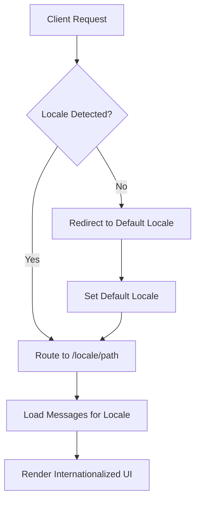

# Technology Stack & Dependencies

<cite>
**Referenced Files in This Document**   
- [package.json](file://package.json)
- [next.config.mjs](file://next.config.mjs)
- [tailwind.config.ts](file://tailwind.config.ts)
- [tsconfig.json](file://tsconfig.json)
- [postcss.config.js](file://postcss.config.js)
- [i18n.ts](file://i18n.ts)
- [middleware.ts](file://middleware.ts)
- [LanguageSwitcher.tsx](file://components/LanguageSwitcher.tsx)
- [AdminDashboard.tsx](file://components/admin/AdminDashboard.tsx)
- [AIGuide.tsx](file://components/ai/AIGuide.tsx)
- [route.ts](file://app/api/ai/analyze/route.ts)
- [Navigation.tsx](file://components/Navigation.tsx)
</cite>

## Table of Contents
1. [Core Framework Stack](#core-framework-stack)
2. [Dependency Analysis](#dependency-analysis)
3. [Configuration Files](#configuration-files)
4. [Technology Rationale](#technology-rationale)
5. [Component Interaction Patterns](#component-interaction-patterns)
6. [Configuration and Environment](#configuration-and-environment)
7. [Performance Considerations](#performance-considerations)
8. [Development Workflow Support](#development-workflow-support)

## Core Framework Stack

The Prometheus-Planner V2 application is built on a modern React-based technology stack centered around Next.js 15 with the App Router architecture. This foundation provides a robust framework for server-side rendering, static site generation, and client-side interactivity. The stack leverages React 18's concurrent rendering features, including Suspense and React Server Components, which enable efficient data fetching and progressive loading of UI elements. TypeScript provides static type checking across the entire codebase, enhancing code quality and developer experience through improved IntelliSense and compile-time error detection.

The App Router architecture organizes the application into a file-based routing system where each route corresponds to a directory in the app folder. This approach simplifies navigation and enables features like nested layouts, parallel routes, and intercepting routes. The application supports internationalization through locale-specific route groups (e.g., [locale]), allowing seamless language switching without full page reloads. The stack's component model follows React's functional component pattern with hooks, promoting reusable and testable UI elements.

**Section sources**
- [package.json](file://package.json#L11-L13)
- [app/layout.tsx](file://app/layout.tsx#L3-L9)
- [app/[locale]/layout.tsx](file://app/[locale]/layout.tsx)

## Dependency Analysis

### Internationalization with next-intl
The application implements internationalization using the next-intl library, which provides a comprehensive solution for multi-language support. The library integrates with Next.js middleware to detect and route language preferences, supporting both English (en) and Arabic (ar) locales. Configuration in i18n.ts defines the supported locales and default language, while middleware.ts handles locale detection and routing. The LanguageSwitcher component demonstrates client-side locale switching by manipulating the URL path and leveraging Next.js navigation.

### Styling with Tailwind CSS
The styling system is built on Tailwind CSS, a utility-first CSS framework that enables rapid UI development through atomic classes. The configuration in tailwind.config.ts extends the default theme with custom colors specific to the Path of Exile aesthetic, including poe-black (#050506), poe-gold (#c5a059), and poe-spirit (#7ecce0). The content configuration targets all TypeScript and TSX files in the app directory, ensuring utility classes are generated for all components. Additional utilities like clsx and tailwind-merge provide conditional class composition and className merging capabilities.

### State Management with Zustand
Zustand serves as the state management solution for client-side state that needs to persist across components and survive navigation. While not explicitly shown in the provided code, the presence of Zustand in package.json indicates its use for managing application state such as user preferences, build configurations, or AI analysis results. Zustand's lightweight API and React integration make it ideal for this application's state management needs, providing a simpler alternative to Redux with similar capabilities.

### AI Integration with OpenAI SDK
The OpenAI SDK enables integration with GPT models for AI-powered game advice and build analysis. The API route at app/api/ai/analyze/route.ts demonstrates server-side integration with the OpenAI API, using environment variables for secure API key management. The implementation includes error handling for API failures and rate limiting, with a system prompt that establishes the AI's role as an expert ARPG build advisor. Client components like AIGuide.tsx interact with this API to provide users with personalized game strategy recommendations.

### Animation and Form Management
Framer Motion provides production-ready animations and gestures for enhanced user experience. While not explicitly shown in the provided components, its presence in dependencies suggests use for page transitions, component animations, and interactive elements. For form management, react-hook-form combined with zod provides a robust solution for form validation and state management. The @hookform/resolvers package integrates zod's type-safe validation with react-hook-form, enabling compile-time type safety for form data.

**Section sources**
- [package.json](file://package.json#L17-L23)
- [i18n.ts](file://i18n.ts#L4-L17)
- [middleware.ts](file://middleware.ts#L1-L16)
- [tailwind.config.ts](file://tailwind.config.ts#L6-L8)
- [components/LanguageSwitcher.tsx](file://components/LanguageSwitcher.tsx#L1-L65)
- [app/api/ai/analyze/route.ts](file://app/api/ai/analyze/route.ts#L1-L92)
- [components/ai/AIGuide.tsx](file://components/ai/AIGuide.tsx#L1-L131)

## Configuration Files

### Next.js Configuration
The next.config.mjs file contains minimal but essential configuration for the Next.js application. The typescript and eslint configurations with ignoreBuildErrors set to true allow development to continue despite type errors or linting issues, which is particularly useful during active development phases. This configuration prioritizes developer velocity while still maintaining type safety and code quality standards.

### Tailwind CSS Configuration
The tailwind.config.ts file configures the design system with custom theme extensions. The content configuration specifies which files to scan for Tailwind class usage, ensuring all utility classes are generated. The theme extension defines custom colors that match the Path of Exile visual identity, creating a cohesive design language across the application. The configuration follows Tailwind's best practices by using a minimal plugin array and extending rather than replacing the default theme.

### TypeScript Configuration
The tsconfig.json file establishes the TypeScript compilation settings for the project. Key configurations include ES2017 as the target JavaScript version, esnext module resolution for modern import/export syntax, and strict type checking for improved code quality. The paths configuration enables absolute imports with the @/* alias, simplifying module imports across the codebase. The incremental compilation setting improves build performance during development.

### CSS Processing Configuration
The postcss.config.js file configures PostCSS processing with Tailwind CSS and Autoprefixer plugins. This configuration ensures that Tailwind's utility classes are processed correctly and vendor prefixes are automatically added to CSS properties. The minimal configuration follows Next.js conventions, allowing the framework to handle most PostCSS setup while providing explicit control over essential plugins.

**Section sources**
- [next.config.mjs](file://next.config.mjs#L1-L7)
- [tailwind.config.ts](file://tailwind.config.ts#L1-L14)
- [tsconfig.json](file://tsconfig.json#L1-L28)
- [postcss.config.js](file://postcss.config.js#L1-L2)

## Technology Rationale

The technology choices for Prometheus-Planner V2 reflect a careful balance between developer productivity, performance, and maintainability. Next.js 15 with App Router was selected as the foundation due to its excellent support for hybrid rendering strategies, built-in API routes, and seamless integration with the React ecosystem. This choice enables both static generation of content-heavy pages and dynamic rendering for personalized user experiences.

React 18 was chosen for its concurrent rendering capabilities, which improve application responsiveness and user experience through features like Suspense and selective hydration. The adoption of React Server Components allows data fetching to occur on the server, reducing client-side JavaScript bundle size and improving initial load performance.

TypeScript provides type safety across the entire stack, from API routes to UI components, reducing runtime errors and improving code maintainability. The combination of react-hook-form and zod creates a type-safe form handling solution where validation schemas and form state are strongly typed, preventing common input handling errors.

Tailwind CSS was selected over traditional CSS or CSS-in-JS solutions for its utility-first approach, which promotes consistency in design and reduces the need for custom CSS files. The framework's JIT compiler generates only the CSS classes actually used in the application, resulting in highly optimized production bundles.

Framer Motion provides a comprehensive animation solution with excellent performance characteristics, including hardware acceleration and gesture support. Its declarative API makes complex animations accessible while maintaining good runtime performance.

**Section sources**
- [package.json](file://package.json#L11-L23)
- [tsconfig.json](file://tsconfig.json#L1-L28)
- [tailwind.config.ts](file://tailwind.config.ts#L1-L14)

## Component Interaction Patterns

### Server and Client Component Integration
The application leverages Next.js App Router's ability to distinguish between server and client components. Server components, such as layout files and page components, handle data fetching and initial rendering, while client components manage interactivity and state. This separation optimizes performance by minimizing the amount of JavaScript sent to the client while still enabling rich interactive experiences.

### Internationalization Flow
The internationalization system demonstrates a clean separation of concerns between routing, configuration, and UI. The middleware handles locale detection and routing, i18n.ts manages message loading, and components like LanguageSwitcher provide the user interface for language selection. This pattern ensures that translations are loaded efficiently and locale changes are handled consistently across the application.

### AI Integration Architecture
The AI integration follows a secure server-side pattern where the OpenAI API key is protected in environment variables and API calls are made from server-side routes. Client components send requests to these API routes rather than directly to OpenAI, preventing API key exposure. The AIGuide component demonstrates a typical chat interface pattern with message state management, loading states, and form submission handling.

### Navigation and Layout Structure
The Navigation component illustrates the use of Next.js routing with internationalized paths. It dynamically constructs href attributes based on the current locale, ensuring consistent navigation across language versions. The component uses clsx for conditional class composition, applying active states based on the current pathname. This pattern creates a responsive navigation experience that adapts to both desktop and mobile viewports.

**Diagram sources**
- [middleware.ts](file://middleware.ts#L1-L16)
- [i18n.ts](file://i18n.ts#L1-L17)
- [Navigation.tsx](file://components/Navigation.tsx#L1-L99)
- [LanguageSwitcher.tsx](file://components/LanguageSwitcher.tsx#L1-L65)

**Section sources**
- [app/[locale]/page.tsx](file://app/[locale]/page.tsx#L1-L12)
- [components/Navigation.tsx](file://components/Navigation.tsx#L1-L99)
- [components/LanguageSwitcher.tsx](file://components/LanguageSwitcher.tsx#L1-L65)
- [components/ai/AIGuide.tsx](file://components/ai/AIGuide.tsx#L1-L131)

## Configuration and Environment

### Environment Variable Management
The application uses environment variables for configuration, particularly for sensitive data like the OpenAI API key. The API route demonstrates proper environment variable usage with validation and error handling. For production deployment, these variables should be configured in the hosting environment (e.g., Vercel) rather than in local files to maintain security.

### Type Resolution and Module Configuration
The TypeScript configuration includes proper module resolution settings that enable seamless imports across the codebase. The paths configuration with @/* alias simplifies imports from deeply nested directories. The moduleResolution set to "bundler" ensures compatibility with modern bundlers and supports features like optional chaining and nullish coalescing.

### Build Optimization Settings
The Next.js configuration includes settings that optimize the build process and production output. The ignoreBuildErrors option for TypeScript and ESLint allows development to continue despite non-critical issues, while still reporting them in the development console. This approach balances developer productivity with code quality maintenance.

**Section sources**
- [app/api/ai/analyze/route.ts](file://app/api/ai/analyze/route.ts#L1-L92)
- [next.config.mjs](file://next.config.mjs#L1-L7)
- [tsconfig.json](file://tsconfig.json#L1-L28)

## Performance Considerations

### Bundle Size Optimization
The dependency selection prioritizes bundle size efficiency. Libraries like zustand and clsx have minimal bundle impact while providing significant functionality. Tailwind CSS's tree-shaking capabilities ensure only used utility classes are included in the production build. The use of React Server Components reduces client-side JavaScript by moving data fetching and rendering to the server.

### Rendering Performance
React 18's concurrent rendering features enable the application to maintain responsiveness during data loading and state updates. The App Router's built-in support for Suspense allows components to declaratively specify their loading states, improving perceived performance. Server-side rendering of static content reduces time to first meaningful paint.

### API Efficiency
The AI integration demonstrates efficient API usage patterns with proper error handling and rate limiting considerations. The server-side API route acts as a proxy, preventing direct client access to the OpenAI API and enabling potential caching strategies in the future. The implementation includes appropriate timeouts and fallbacks to maintain application stability.

### Style Performance
Tailwind CSS generates highly optimized CSS with minimal duplication. The JIT compiler ensures that only necessary styles are generated, resulting in smaller CSS bundles. The utility-first approach also reduces the need for complex CSS selectors that can impact rendering performance.

**Section sources**
- [package.json](file://package.json#L14-L23)
- [app/api/ai/analyze/route.ts](file://app/api/ai/analyze/route.ts#L1-L92)
- [tailwind.config.ts](file://tailwind.config.ts#L1-L14)

## Development Workflow Support

### Type Checking and Development Dependencies
The devDependencies section of package.json includes essential tools for development: TypeScript for type checking, @types packages for type definitions, and PostCSS tools for CSS processing. These dependencies support a robust development workflow with real-time type checking, intelligent code completion, and automated CSS processing.

### Linting and Code Quality
While not explicitly shown in the configuration files, the presence of standard Next.js development dependencies suggests a typical linting setup with ESLint and Prettier. This combination ensures code consistency and quality across the development team, catching potential issues before they reach production.

### Build and Deployment
The package.json scripts define standard Next.js commands for development (dev), building (build), and starting the production server (start). This standardization simplifies the development workflow and ensures consistency between local development and production deployment environments.

**Section sources**
- [package.json](file://package.json#L25-L33)
- [tsconfig.json](file://tsconfig.json#L1-L28)
- [postcss.config.js](file://postcss.config.js#L1-L2)